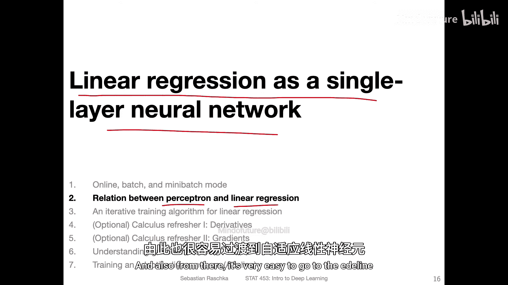
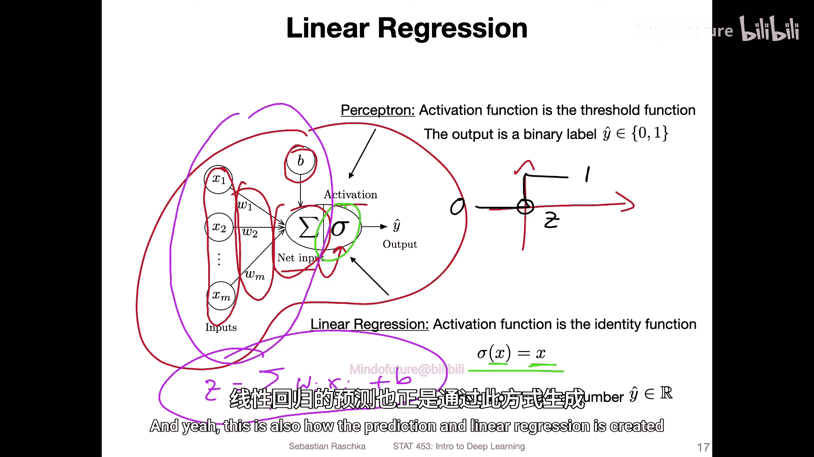
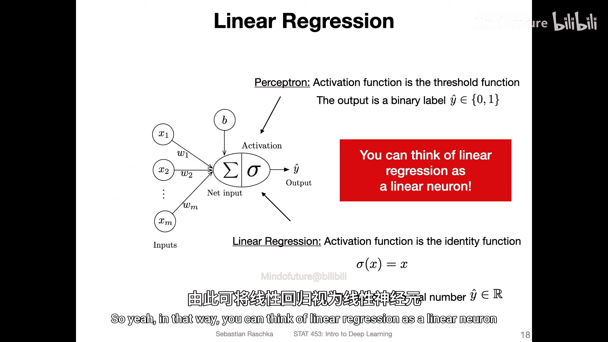
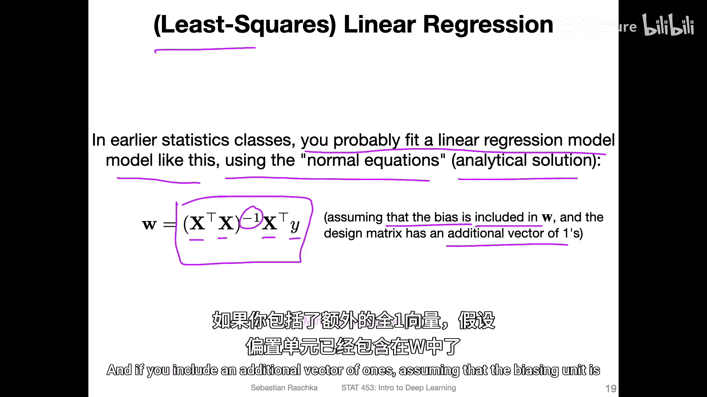
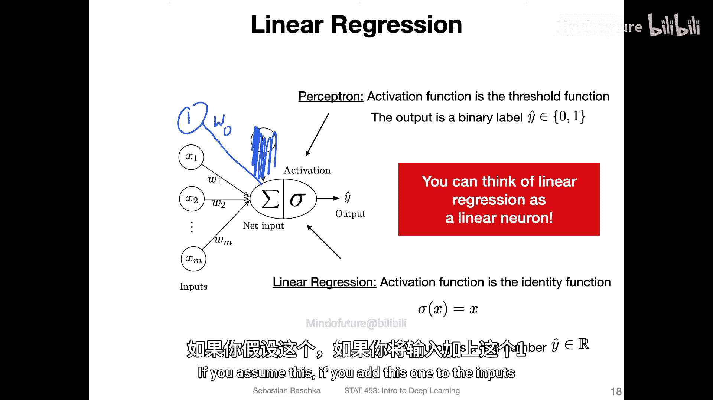
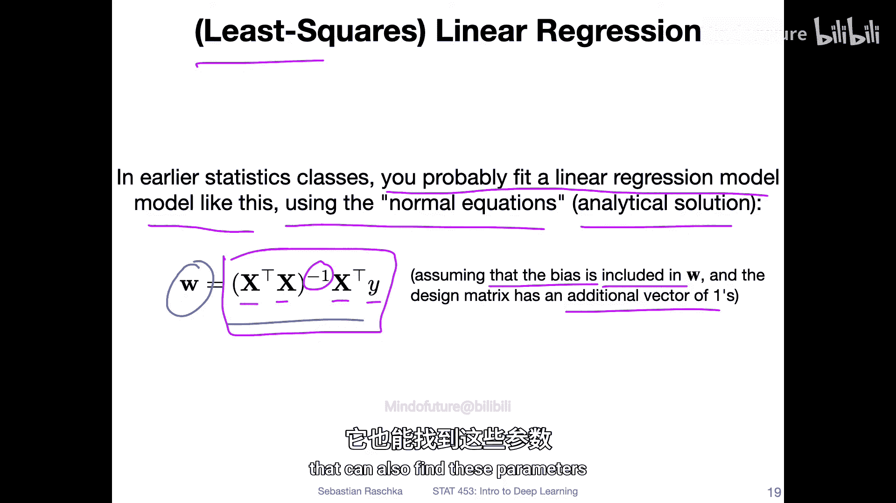
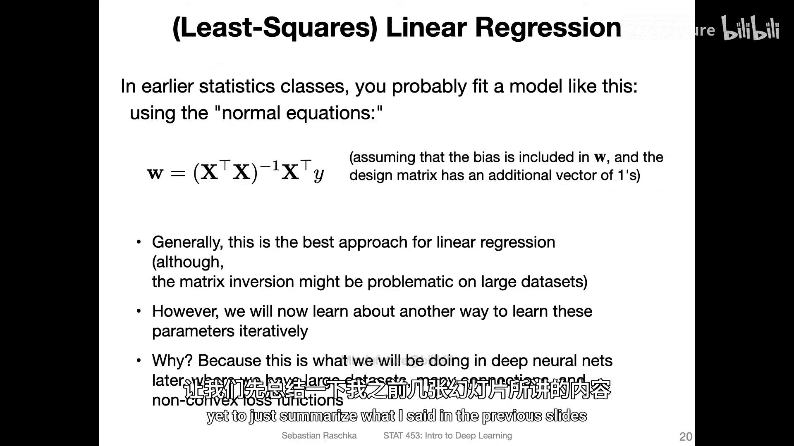
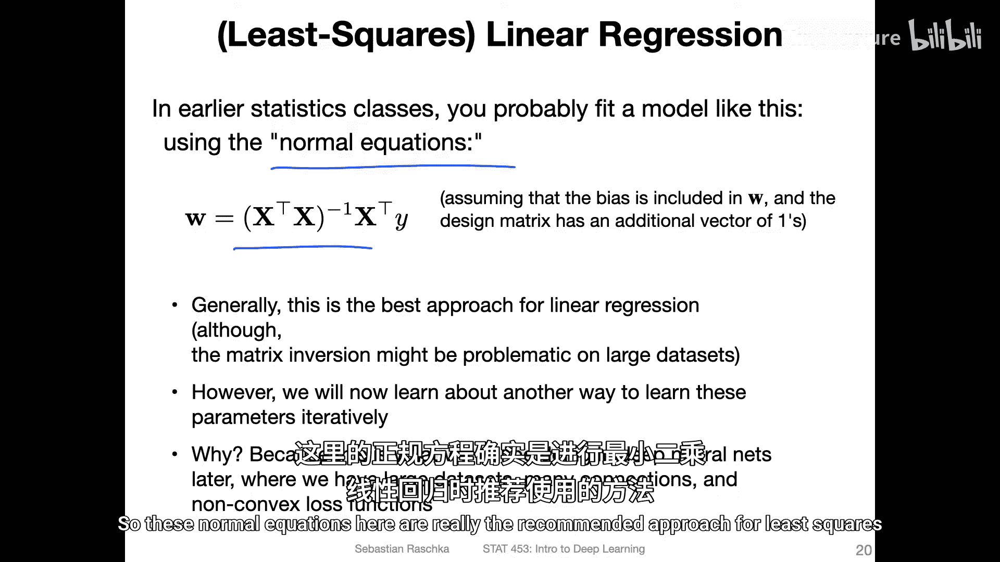
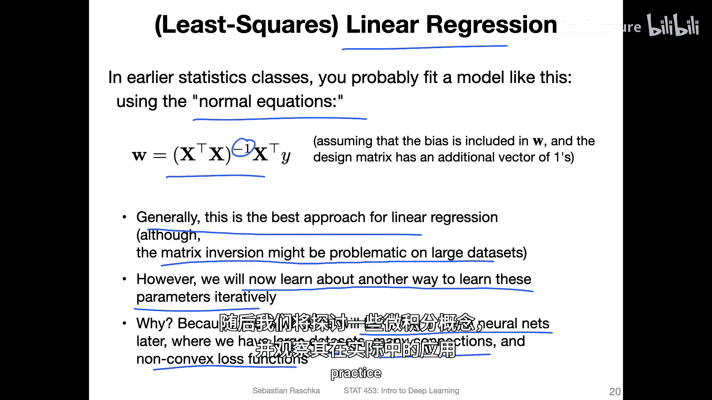

# 034：感知机与线性回归的关系 🔗

在本节课中，我们将探讨感知机与线性回归之间的紧密联系。理解这种关系，有助于我们后续学习梯度下降等优化算法，并平滑过渡到自适应线性神经元（Adaline）等概念。



## 概述

线性回归可以被视为一个单层神经网络。由于大家可能已经熟悉线性回归，通过它来引入后续概念会使学习过程更加容易。本节将简要勾勒出感知机与线性回归之间的关系。

## 感知机模型回顾

首先，我们回顾一下感知机算法的基本结构。感知机包含多个步骤：

1.  **计算净输入**：基于数据特征和权重，加上偏置单元，计算净输入值。
2.  **应用激活函数**：在感知机中，激活函数是一个阈值函数。其规则是：如果净输入 `z` 大于 0，则输出 1；否则输出 0。用公式可表示为：
    ```
    if z > 0:
        output = 1
    else:
        output = 0
    ```

## 线性回归作为“线性神经元”

线性回归与感知机的计算流程非常相似，关键区别在于激活函数。



*   在线性回归中，我们**没有**阈值判断，而是直接输出一个连续值。
*   你可以认为，线性回归中的“激活函数”是一个**恒等函数**，即它不做任何变换，直接返回其输入值。如果输入是 `x`，输出也是 `x`。



因此，线性回归的计算过程与感知机相同：先计算净输入（权重与特征的乘积之和，再加上偏置），然后直接输出这个净输入值，而不进行阈值化处理。

> 通过这种方式，你可以将线性回归理解为一个“线性神经元”，即一个单层神经网络。

## 线性回归的参数求解：解析解



在传统的统计学课程中，线性回归模型通常通过所谓的**正规方程**来拟合。这是一种解析解法，可以直接找到最小二乘线性回归问题的最优解。



其公式如下：
```
W = (X^T * X)^(-1) * X^T * y
```
其中：
*   `W` 是包含权重和偏置的参数向量。
*   `X` 是设计矩阵（包含特征数据，并通常添加一列1以包含偏置项）。
*   `y` 是目标值向量。

这种方法通过矩阵运算直接计算出最优参数 `W`。



## 为何要学习迭代算法？

虽然正规方程是解决线性回归问题的推荐方法，在大多数数据集上效果很好，但本课程将重点介绍一种不同的、**迭代式**的学习参数方法。

这样做的原因主要有两点：





1.  **为深度学习做准备**：在深度神经网络中，我们面对的是大型数据集、大量神经元连接以及非凸的损失函数。对于这些问题，通常**不存在**像正规方程这样的解析解或闭式解。
2.  **建立通用概念**：由于大家已熟悉线性回归，用它来引入这种迭代优化算法（梯度下降），会使理解后续更复杂的深度学习优化过程变得更容易。

因此，我们将在接下来的视频中介绍这种迭代算法，讨论相关的微积分概念，并观察它在实践中的工作原理。

## 总结



本节课我们一起学习了感知机与线性回归之间的核心关系。我们了解到，线性回归可以看作一个使用恒等函数作为激活函数的单层神经网络。同时，我们对比了求解线性回归参数的两种思路：直接计算的解析法（正规方程）和为后续深度学习铺垫的迭代优化法。理解这种联系，为我们接下来学习梯度下降等关键算法奠定了坚实的基础。