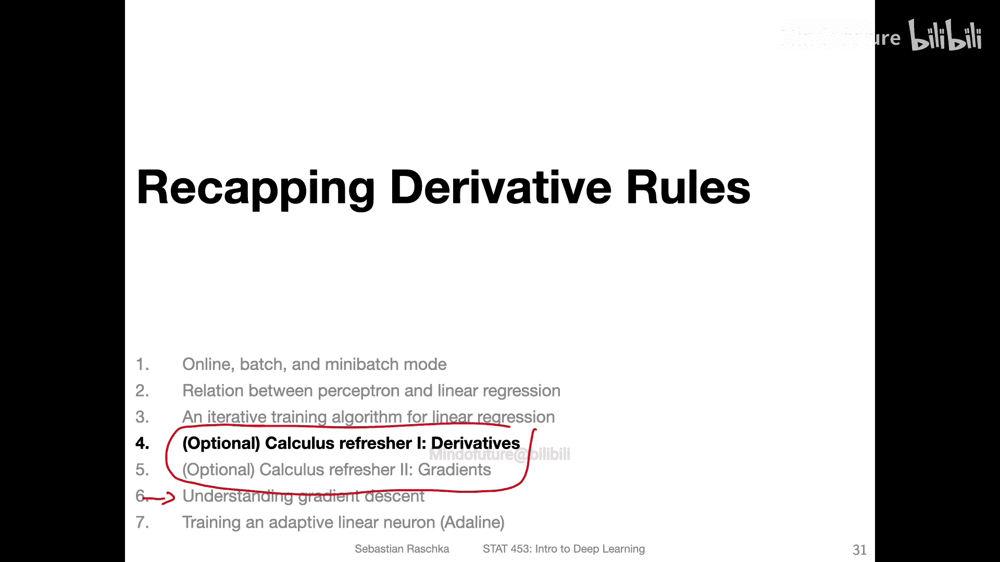

# 035：线性回归的迭代训练算法 🧠

在本节课中，我们将学习如何使用迭代算法来训练线性回归模型。我们将从一种非常朴素的方法开始，然后介绍一种更高效、基于微积分原理的优化方法——随机梯度下降。

## 概述

上一节我们介绍了线性回归模型的基本概念。本节中，我们将探讨如何通过迭代算法来“学习”或“拟合”模型的最佳参数（权重和偏置）。我们将看到，虽然存在一种理论上可行但效率极低的方法，但更实用的方法是分析参数变化对模型性能的影响，并据此进行优化。

## 迭代训练算法：朴素方法

一种拟合最小二乘线性回归模型的迭代算法是使用暴力搜索。这是一种非常朴素的方式，适用于线性回归或任何类型的神经网络模型。

以下是该方法的步骤：

1.  **初始化参数**：将所有权重和偏置初始化为零或小的随机数。
2.  **循环迭代**：进行 K 轮循环。
3.  **随机选择参数**：在每一轮中，随机选择一组新的权重。
4.  **评估模型**：使用这组新权重计算线性回归模型的预测。
5.  **比较性能**：如果新权重使模型性能（如预测误差更小）变得更好，则保留这组权重。如果性能变差，则丢弃这组权重。
6.  **重复**：重复步骤 3 至 5，直到完成 K 轮迭代。

这种方法理论上保证能找到最优解，因为只要尝试足够多次，总有机会找到一组性能优异的权重。然而，正如你所想，这是一种效率极低、速度极慢的拟合方法，因此不推荐在实践中使用。

## 更优的迭代方法：梯度分析

幸运的是，存在一种更好的迭代方法来拟合线性回归模型。其核心思想是分析参数变化对模型预测性能的影响。

具体步骤如下：

1.  **观察损失函数**：我们观察平方误差损失函数。
2.  **分析参数影响**：当我们以某种方式改变权重和偏置时，分析这种改变如何影响误差。
3.  **沿优化方向微调**：我们可以沿着能改善模型性能的方向，对权重和偏置进行微小的调整。
4.  **迭代优化**：如果我们理解了权重与损失之间的关系，我们就可以调整权重，使损失下降，从而减小误差。我们可以多次重复这个小步骤，直到损失不再进一步下降。

这种方法实际上是**在线模式**的一种表现形式，与我们之前讨论的感知机学习规则密切相关。

## 随机梯度下降

对于线性回归，我们使用一种称为**随机梯度下降**的算法。它是感知机学习规则在（非）凸损失函数上的类比。我们也可以将其用于神经网络的非凸损失函数，这将在后续课程中涉及。

以下是随机梯度下降与感知机学习规则的对比：

**相同点**：
*   **权重初始化**：两者都以相同的方式初始化权重。
*   **迭代循环**：两者都迭代训练周期（epochs）。
*   **遍历数据**：在每一个周期内，两者都遍历数据集中的训练样本。
*   **计算净输入**：两者计算净输入 `z` 的方式完全相同。公式为：
    `z = w^T * x + b`
    其中，`w` 是权重向量，`x` 是输入特征向量，`b` 是偏置。

**不同点**：
*   **激活函数**：感知机使用**阈值函数**，而线性回归使用**恒等函数**（即直接输出 `z`）。
*   **误差计算**：
    *   感知机：误差基于预测类别与实际类别的差异。
    *   线性回归：误差是预测的连续值与实际连续值之间的差异，但计算形式相似（都是做减法）。
*   **参数更新规则**：这是核心区别。
    *   感知机更新：`w := w + η * (y_i - ŷ_i) * x_i`
    *   线性回归的SGD更新：`w := w - η * ∇_w L(w, b)`
        其中，`η` 是**学习率**，`∇_w L(w, b)` 是损失函数 `L` 关于权重 `w` 的**梯度**。我们沿着梯度的**负方向**更新参数，因为这是使损失函数下降最快的方向。

符号 `∇`（nabla）代表梯度。`∇_w L` 表示损失函数 `L` 关于权重 `w` 的梯度。对于偏置 `b` 的更新也是类似的：`b := b - η * ∂L/∂b`。

## 向量化实现与循环实现

上一张幻灯片展示的是线性回归在线模式的**向量化实现**，其中 `x` 和梯度都是向量。

我们也可以将其“展开”为使用 `for` 循环的版本，这样我们就不必直接讨论梯度，而是可以讨论**偏导数**，对于初学者来说可能更易于理解。

假设我们的输入维度为 `M`，即有 `M` 个特征，那么我们也对应有 `M` 个权重。我们可以对每个权重 `w_j` 分别计算损失函数 `L` 关于该权重的偏导数 `∂L/∂w_j`，然后以类似的方式进行更新。

循环版本在概念上可能更简单，因为偏导数比梯度更容易思考。然而，正如上一讲所解释的，**向量化实现速度更快**，这就是为什么我们通常使用基于梯度的向量化实现。

## 学习规则的来源

我刚才展示了这个称为随机梯度下降的学习规则，但并未说明它是如何推导出来的。

为了理解其来源，需要一些微积分知识。本课程的先修条件要求大家已经学习过微积分。如果你感到有些生疏，我将在本视频之后录制两个额外的视频来回顾相关的微积分概念。当然，你也可以直接跳到下一个视频，在那里我将解释这个学习规则的推导过程。如果你愿意，可以观看这两个复习视频来巩固你的微积分技能。

## 总结

本节课中，我们一起学习了线性回归的迭代训练算法。我们从一种低效的暴力搜索方法入手，进而介绍了通过分析梯度来高效优化参数的**随机梯度下降**方法。我们比较了它与感知机学习规则的异同，并了解了其向量化与循环实现的区别。理解这个算法是通往更复杂神经网络训练的重要一步。在接下来的课程中，我们将深入探讨梯度下降的数学原理及其在深度学习中的应用。