# 036：（可选）微积分复习I-导数 📈

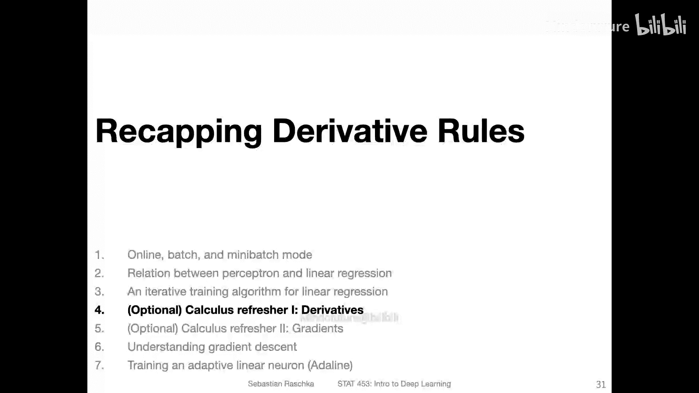

在本节中，我们将简要复习微积分中的核心概念——导数。这对于理解后续的梯度下降算法至关重要。如果你已经非常熟悉微积分，可以跳过本节。如果你需要回顾，本节将为你梳理核心要点。

## 什么是导数？📐

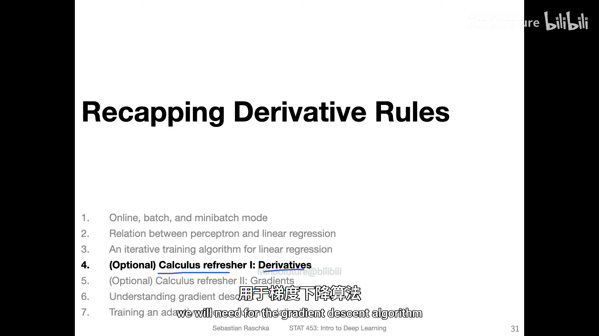

导数是函数变化率的度量，通常被称为斜率。

考虑一个简单的函数：**f(x) = 2x**。

假设我们选取输入值 **x = 3**，那么输出是 **f(3) = 2 * 3 = 6**。

现在，我们选取第二个点，将 **x** 增加 **Δx = 4** 个单位，得到 **x = 7**。对应的输出是 **f(7) = 2 * 7 = 14**。

在这两点之间，输出的变化是 **14 - 6 = 8**，输入的变化是 **7 - 3 = 4**。因此，斜率或变化率是 **8 / 4 = 2**。

更正式地，我们可以用以下公式计算两点间的平均斜率：

**斜率 = [f(x + Δx) - f(x)] / [(x + Δx) - x] = [f(x + Δx) - f(x)] / Δx**

对于函数 **f(x) = 2x**，其斜率恒为 **2**。这意味着输入每改变1个单位，输出就改变2个单位。

## 导数的正式定义与符号 📝

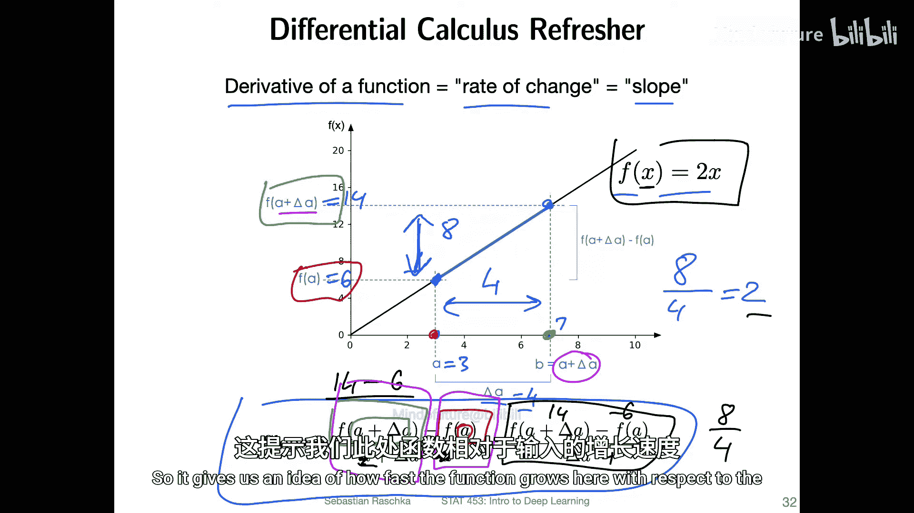

上一节我们计算了较大变化下的平均斜率。但在微积分中，我们关心的是当输入变化 **Δx** 无限趋近于0时的瞬时变化率，即导数。

导数的正式定义是：

**f'(x) = lim (Δx -> 0) [f(x + Δx) - f(x)] / Δx**

导数有两种常见的表示符号：
*   **拉格朗日表示法**：**f'(x)**
*   **莱布尼茨表示法**：**df(x)/dx**

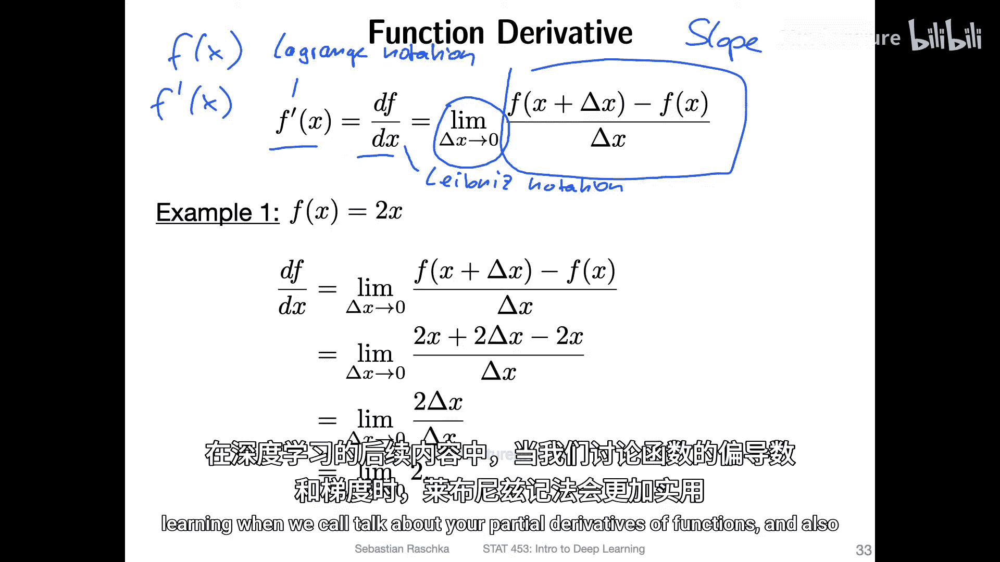

莱布尼茨表示法在深度学习中讨论偏导数和梯度时更为常用。

## 计算导数：示例 🔢

让我们用正式定义来计算函数 **f(x) = 2x** 的导数。

根据定义：
**f'(x) = lim (Δx -> 0) [f(x + Δx) - f(x)] / Δx**

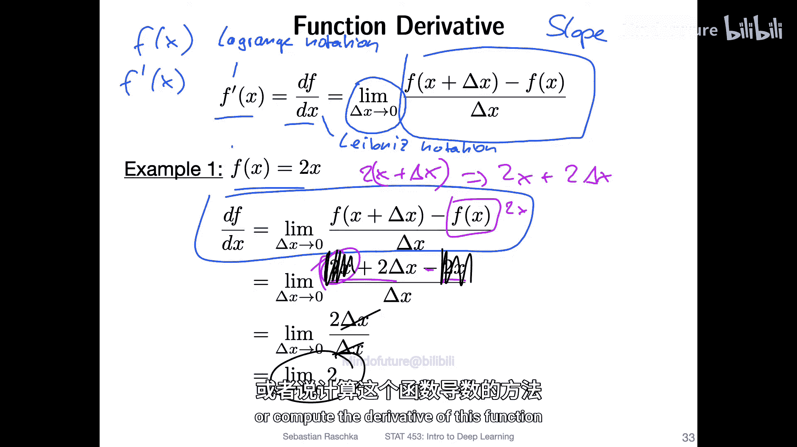

代入函数 **f(x) = 2x**：
**f'(x) = lim (Δx -> 0) [2(x + Δx) - 2x] / Δx**
**= lim (Δx -> 0) [2x + 2Δx - 2x] / Δx**
**= lim (Δx -> 0) [2Δx] / Δx**
**= lim (Δx -> 0) 2**
**= 2**

结果与之前一致，函数 **f(x) = 2x** 的导数是常数 **2**。

现在，让我们看一个稍复杂的例子：**f(x) = x²**。

**f'(x) = lim (Δx -> 0) [f(x + Δx) - f(x)] / Δx**
**= lim (Δx -> 0) [(x + Δx)² - x²] / Δx**
**= lim (Δx -> 0) [x² + 2xΔx + (Δx)² - x²] / Δx**
**= lim (Δx -> 0) [2xΔx + (Δx)²] / Δx**
**= lim (Δx -> 0) [2x + Δx]**
**= 2x**

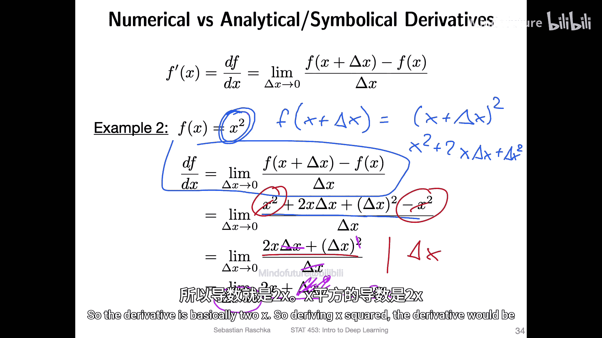

因此，函数 **f(x) = x²** 的导数是 **2x**。

## 导数的几何意义 📊

上一节计算 **x²** 导数的过程，在几何上可以理解为用**割线**的斜率来近似**切线**的斜率。

对于函数 **f(x) = x²**（一个抛物线），在点 **x** 处的切线斜率（即导数）是我们想要求的。

我们通过选取 **x** 和 **x + Δx** 两个点，连接它们得到一条割线。这条割线的斜率是 **Δy / Δx**。

当 **Δx** 较大时，割线斜率是对切线斜率的一个粗糙近似。随着 **Δx** 不断减小并趋近于0，割线会无限接近切线，其斜率也就无限接近该点的导数。这就是导数定义中取极限的直观含义。

## 常用导数公式与法则 📚

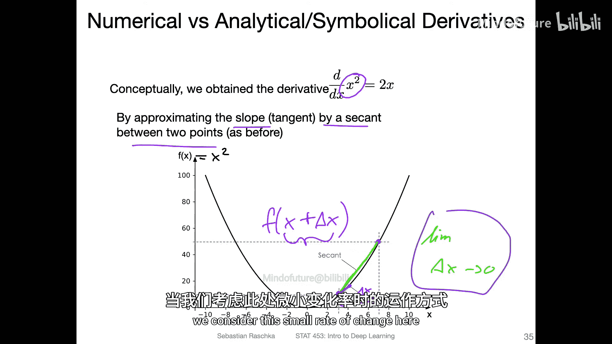

为了高效计算，记住一些常见函数的导数公式和运算法则很有帮助。

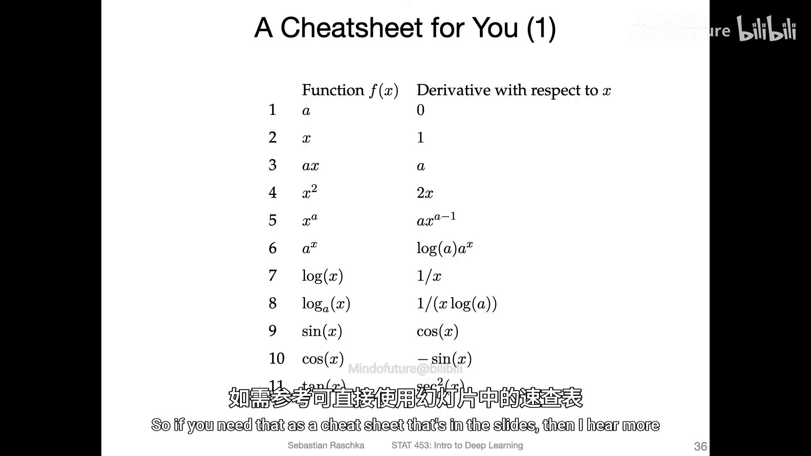

以下是部分常用导数公式：
*   **d/dx (c) = 0** （常数导数为0）
*   **d/dx (xⁿ) = n*xⁿ⁻¹** （幂法则）
*   **d/dx (eˣ) = eˣ**
*   **d/dx (ln(x)) = 1/x**
*   **d/dx (sin(x)) = cos(x)**
*   **d/dx (cos(x)) = -sin(x)**

以下是重要的导数运算法则：
*   **和/差法则**：**d/dx [f(x) ± g(x)] = f'(x) ± g'(x)**
*   **积法则**：**d/dx [f(x) * g(x)] = f'(x)*g(x) + f(x)*g'(x)**
*   **商法则**：**d/dx [f(x) / g(x)] = [f'(x)*g(x) - f(x)*g'(x)] / [g(x)]²**
*   **链式法则**：这是深度学习中最重要的法则。

## 链式法则：深度学习的核心 🔗

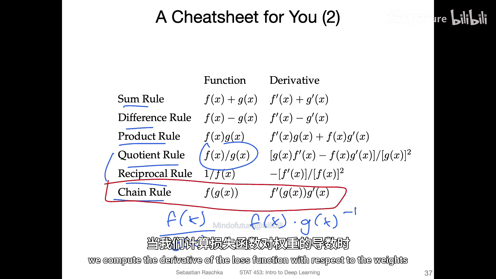

链式法则用于计算复合函数（嵌套函数）的导数。在深度学习中，神经网络的损失函数通常是多层嵌套的，链式法则使得计算梯度成为可能。

假设有一个复合函数 **F(x) = f(g(x))**。

链式法则指出：
**dF/dx = (df/dg) * (dg/dx)**

可以将其理解为：整体函数的导数 = 外层函数关于内层函数的导数 × 内层函数关于输入x的导数。

从计算图的角度看，我们首先计算内层函数 **g(x)** 的输出，然后将其作为输入传递给外层函数 **f**。求导时，我们分别计算“内层导数”和“外层导数”，再将它们相乘。

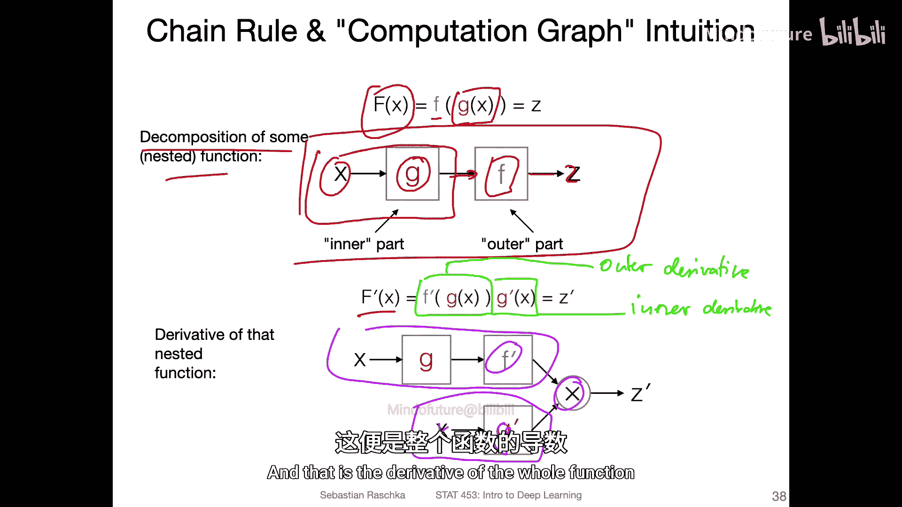

PyTorch等深度学习框架会自动构建这样的计算图，并通过`autograd`（自动梯度）模块自动计算导数。尽管如此，理解其背后的原理仍然非常重要。

使用莱布尼茨表示法，链式法则可以更清晰地写作：
**dF/dx = dF/dg * dg/dx**

## 链式法则应用示例 💡

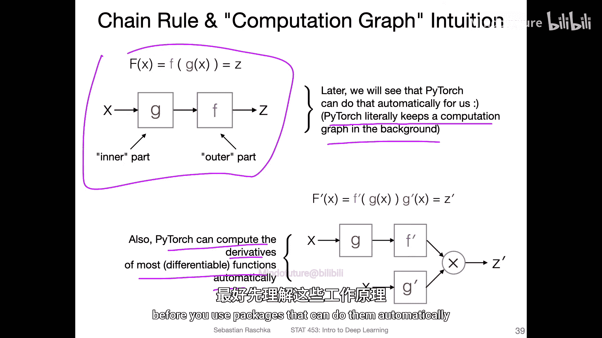

让我们应用链式法则计算一个复合函数的导数：**F(x) = ln(√x)**。

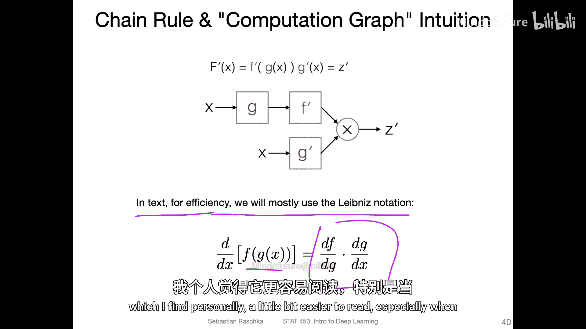

我们可以将其分解为：
*   外层函数：**f(g) = ln(g)**
*   内层函数：**g(x) = √x = x^(1/2)**

根据链式法则：
**dF/dx = (df/dg) * (dg/dx)**

1.  计算外层导数：**df/dg = d/dg [ln(g)] = 1/g**。由于 **g = √x**，所以 **df/dg = 1/√x**。
2.  计算内层导数：**dg/dx = d/dx [x^(1/2)] = (1/2) * x^(-1/2) = 1/(2√x)**。
3.  相乘得到最终结果：
    **dF/dx = (1/√x) * (1/(2√x)) = 1/(2x)**

链式法则可以推广到任意多层的嵌套函数。对于函数 **F(x) = f₅(f₄(f₃(f₂(f₁(x)))))**，其导数是所有层导数的乘积：
**dF/dx = (df₅/df₄) * (df₄/df₃) * (df₃/df₂) * (df₂/df₁) * (df₁/dx)**

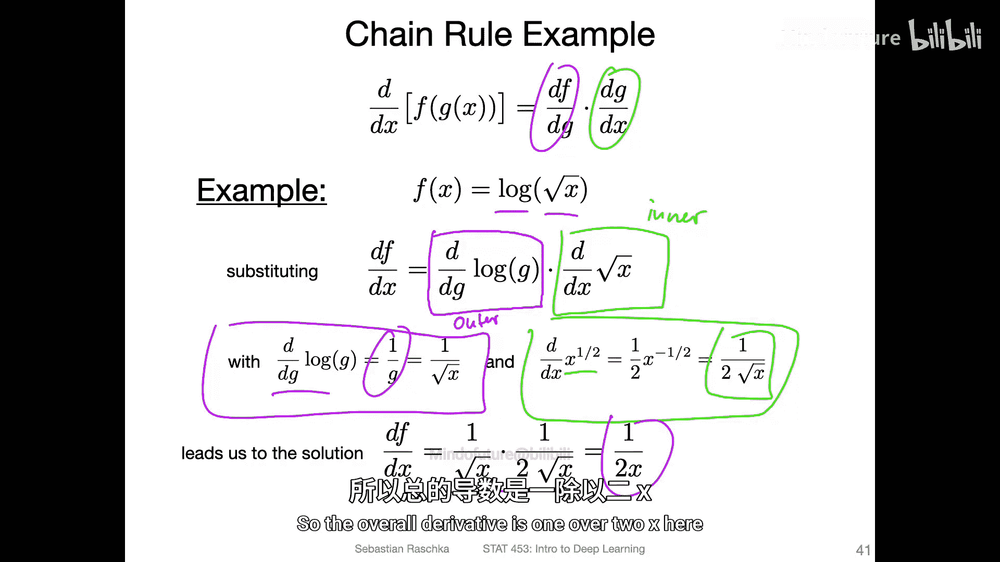

## 总结 🎯

本节课我们一起学习了导数的核心概念：
*   导数描述了函数在某一点的瞬时变化率或斜率。
*   我们通过极限定义和公式计算了简单函数（如 **2x** 和 **x²**）的导数。
*   我们探讨了导数的几何意义，即切线斜率。
*   我们回顾了常用的导数公式和运算法则，其中**链式法则**是理解深度学习梯度计算的基础。
*   我们通过例子演示了如何应用链式法则计算复合函数的导数。

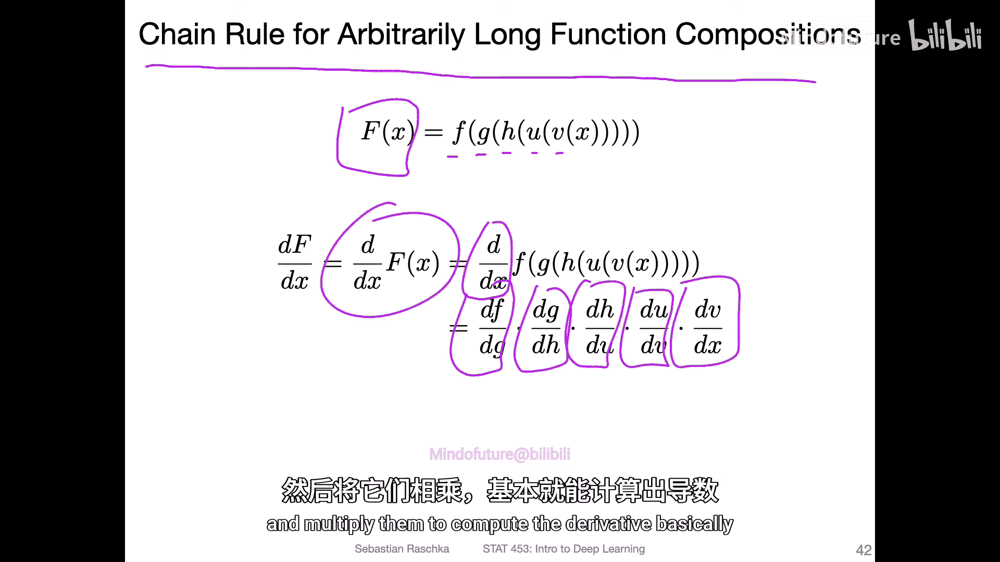

理解这些微积分基础，将为后续学习梯度下降算法和神经网络的训练过程打下坚实的基础。在下一节中，我们将把导数的概念扩展到多变量函数，介绍**梯度**。