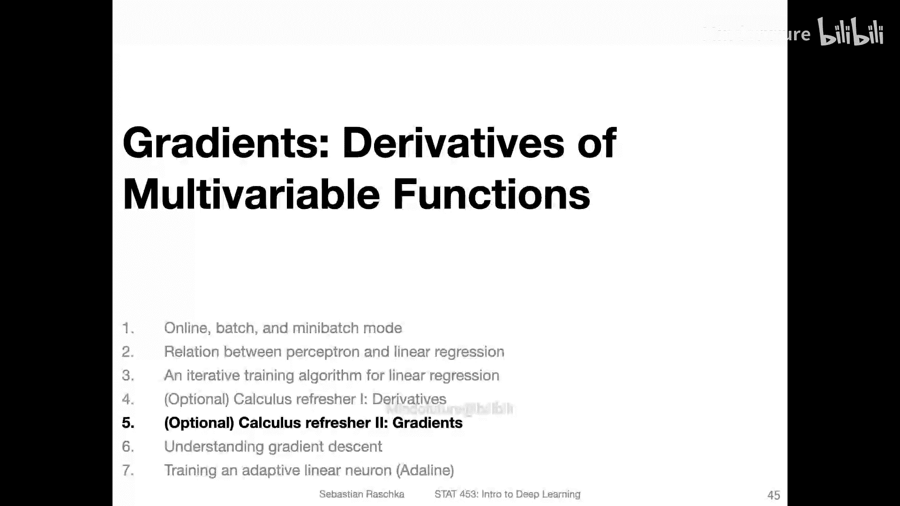
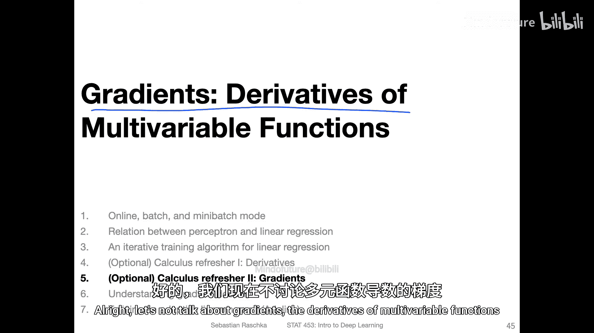
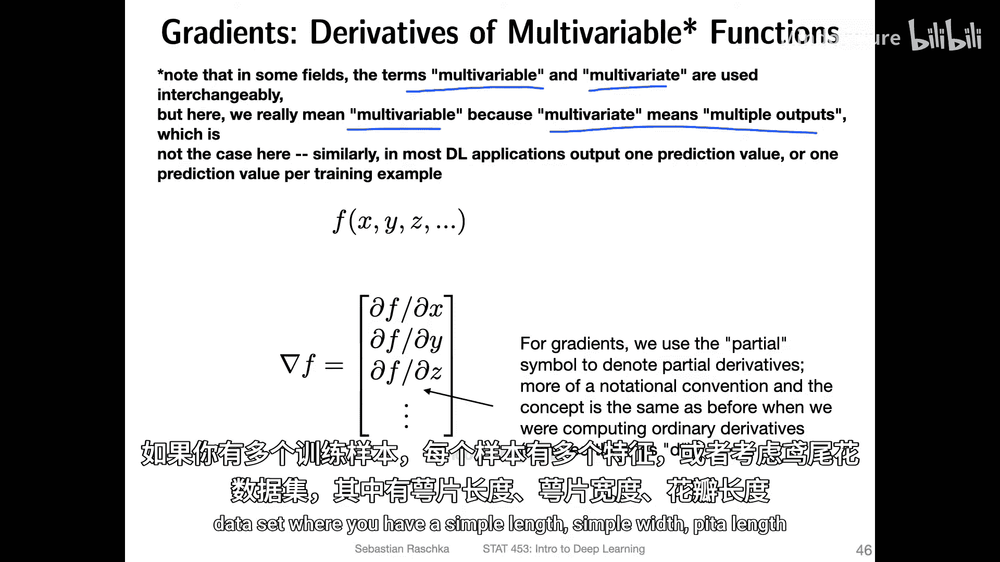
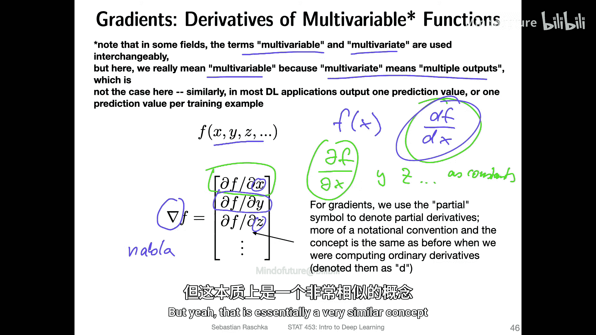
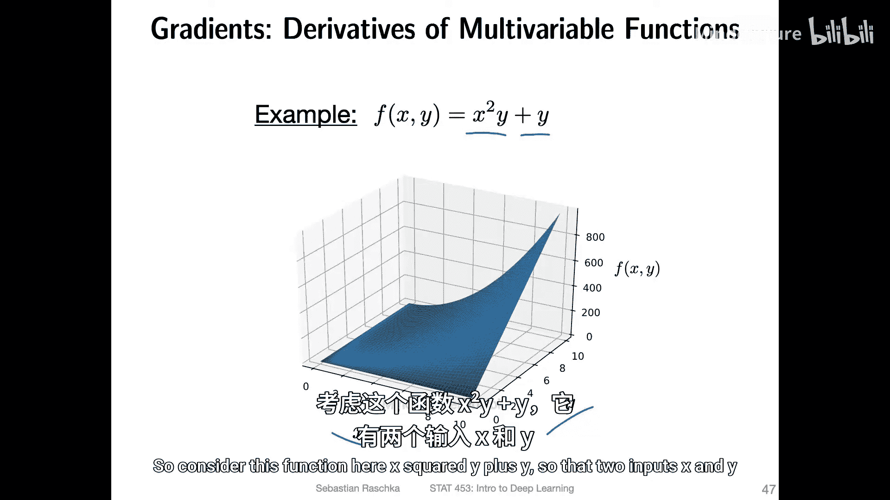
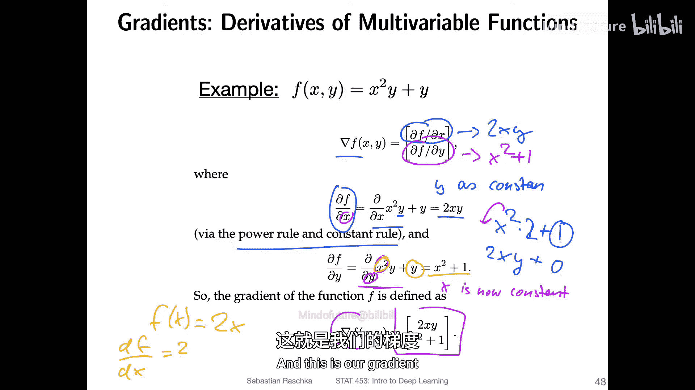
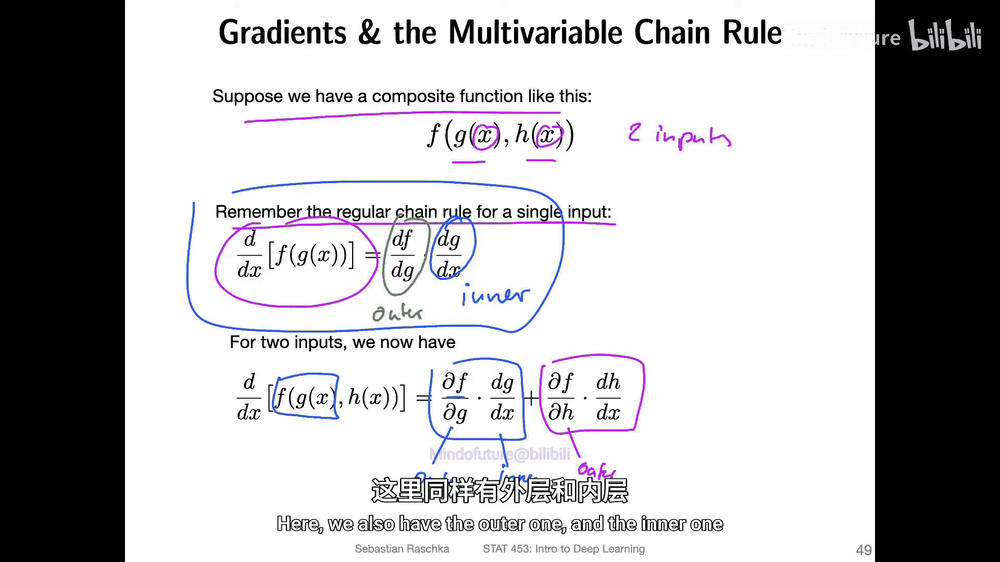
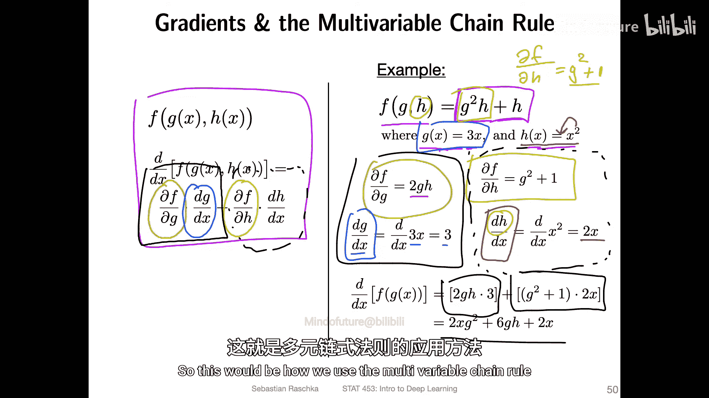
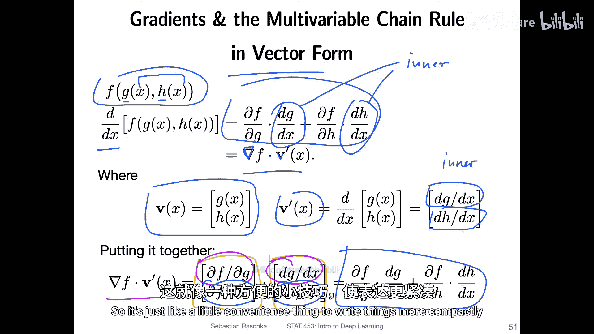
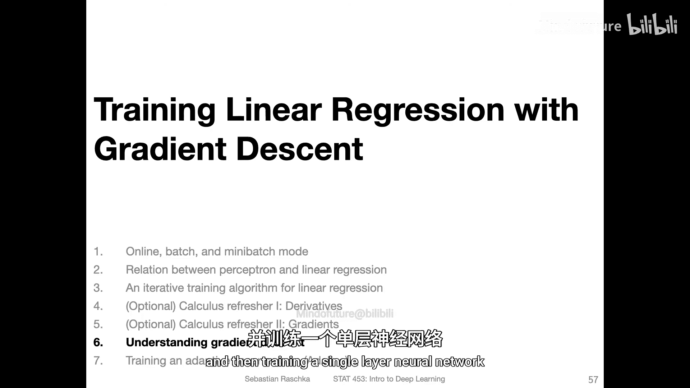

深度学习与生成式模型：5.5：（可选）微积分复习II-梯度 📈

在本节中，我们将学习多变量函数的导数，即梯度。这是理解神经网络如何通过反向传播更新参数的核心数学基础。

---

### 多变量函数与梯度

上一节我们讨论了单变量函数的导数。本节中，我们来看看当函数有多个输入变量时，如何求导。这种函数在机器学习中非常常见，例如线性回归中，每个数据样本可能有多个特征（如花瓣长度、宽度等）作为输入，但输出是单个值（如预测的类别或连续值）。

对于多输入、单输出的函数，其导数是一个向量，称为**梯度**（Gradient），用符号 **∇**（读作“Nabla”）表示。梯度向量中的每个元素是函数相对于其中一个输入变量的**偏导数**（Partial Derivative）。

**梯度公式**：
对于一个函数 \( f(x, y, z, ...) \)，其梯度为：
\[
\nabla f = \begin{bmatrix} \frac{\partial f}{\partial x} \\ \frac{\partial f}{\partial y} \\ \frac{\partial f}{\partial z} \\ \vdots \end{bmatrix}
\]

计算偏导数时，规则与普通导数相同。关键区别在于：当我们计算函数对某个变量（如 \(x\)）的偏导数时，**将所有其他变量（如 \(y, z, ...\)）视为常数**。

---

### 梯度计算示例

让我们通过一个具体例子来理解如何计算梯度。

考虑函数：
\[
f(x, y) = x^2 y + y
\]

以下是计算其梯度 \(\nabla f\) 的步骤：

1.  **计算 \(\frac{\partial f}{\partial x}\)**：
    *   将 \(y\) 视为常数。
    *   对 \(x^2 y\) 应用幂法则：\(2x \cdot y\)。
    *   \(y\) 作为常数，其导数为 0。
    *   因此，\(\frac{\partial f}{\partial x} = 2xy\)。

2.  **计算 \(\frac{\partial f}{\partial y}\)**：
    *   将 \(x\) 视为常数。
    *   \(x^2 y\) 对 \(y\) 求导：\(x^2\)。
    *   \(y\) 对 \(y\) 求导：1。
    *   因此，\(\frac{\partial f}{\partial y} = x^2 + 1\)。

3.  **组合成梯度向量**：
    \[
    \nabla f = \begin{bmatrix} 2xy \\ x^2 + 1 \end{bmatrix}
    \]

---

### 多变量链式法则

现在，我们考虑一种更复杂的情况：函数本身依赖于另一些函数，而这些函数又共享同一个输入变量。这需要用到**多变量链式法则**。

假设有一个函数 \(f(g(x), h(x))\)，其中 \(g\) 和 \(h\) 都是 \(x\) 的函数。我们想求 \(f\) 对 \(x\) 的导数。

其导数公式为：
\[
\frac{df}{dx} = \frac{\partial f}{\partial g} \cdot \frac{dg}{dx} + \frac{\partial f}{\partial h} \cdot \frac{dh}{dx}
\]

**核心思想**：因为 \(g\) 和 \(h\) 都依赖于 \(x\)，所以 \(f\) 对 \(x\) 的总变化率，等于 \(f\) 通过 \(g\) 路径的变化率与通过 \(h\) 路径的变化率之和。

---

### 多变量链式法则示例

让我们通过一个例子来应用这个法则。

已知：
\[
f(g, h) = g^2 h + h, \quad g(x) = 3x, \quad h(x) = x^2
\]
求 \(\frac{df}{dx}\)。

以下是计算步骤：

1.  **计算 \(\frac{\partial f}{\partial g}\)**：
    *   将 \(h\) 视为常数。
    *   对 \(g^2 h\) 应用幂法则：\(2g \cdot h\)。
    *   \(h\) 作为常数，导数为 0。
    *   因此，\(\frac{\partial f}{\partial g} = 2gh\)。

2.  **计算 \(\frac{dg}{dx}\)**：
    *   \(g(x) = 3x\) 的导数是 3。

3.  **计算 \(\frac{\partial f}{\partial h}\)**：
    *   将 \(g\) 视为常数。
    *   \(g^2 h\) 对 \(h\) 求导：\(g^2\)。
    *   \(h\) 对 \(h\) 求导：1。
    *   因此，\(\frac{\partial f}{\partial h} = g^2 + 1\)。

4.  **计算 \(\frac{dh}{dx}\)**：
    *   \(h(x) = x^2\) 的导数是 \(2x\)。

5.  **应用链式法则组合**：
    \[
    \frac{df}{dx} = (2gh) \cdot 3 + (g^2 + 1) \cdot (2x)
    \]

6.  **代入 \(g\) 和 \(h\)**：
    *   将 \(g = 3x\) 和 \(h = x^2\) 代入上式。
    *   得到：\(\frac{df}{dx} = 2 \cdot (3x) \cdot (x^2) \cdot 3 + ((3x)^2 + 1) \cdot (2x)\)
    *   简化后：\(\frac{df}{dx} = 18x^3 + (18x^3 + 2x) = 36x^3 + 2x\)

这个结果也可以通过向量形式更紧凑地表示，即梯度向量与内函数导数向量的点积。

---

### 雅可比矩阵简介

最后，我们简要介绍一个更高级的概念：**雅可比矩阵**（Jacobian Matrix）。当函数输出本身也是一个向量时（例如，神经网络一层有多个神经元输出），我们需要用雅可比矩阵来描述其导数。

对于一个函数向量 \(\mathbf{f} = [f_1, f_2, ..., f_m]\)，其中每个 \(f_i\) 都依赖于输入向量 \(\mathbf{x} = [x_1, x_2, ..., x_n]\)，其雅可比矩阵 \(\mathbf{J}\) 定义如下：

\[
\mathbf{J} = \begin{bmatrix}
\frac{\partial f_1}{\partial x_1} & \frac{\partial f_1}{\partial x_2} & \cdots & \frac{\partial f_1}{\partial x_n} \\
\frac{\partial f_2}{\partial x_1} & \frac{\partial f_2}{\partial x_2} & \cdots & \frac{\partial f_2}{\partial x_n} \\
\vdots & \vdots & \ddots & \vdots \\
\frac{\partial f_m}{\partial x_1} & \frac{\partial f_m}{\partial x_2} & \cdots & \frac{\partial f_m}{\partial x_n}
\end{bmatrix}
\]

雅可比矩阵的每一行，其实就是输出向量中每个函数 \(f_i\) 的梯度。在深度学习的反向传播中，我们经常需要处理这类矩阵运算。

关于二阶导数，虽然在优化理论中有研究，但在当前主流的深度学习实践中，基于一阶导数（梯度）的方法（如梯度下降）因其效率和实用性而占主导地位，因此我们暂不深入讨论。

---

### 总结

本节课中我们一起学习了：
1.  **梯度**的概念：多变量函数的导数向量，其元素是偏导数。
2.  如何计算简单多变量函数的梯度。
3.  **多变量链式法则**：用于计算复合函数（其内部函数共享输入）的导数。
4.  **雅可比矩阵**的简介：用于描述向量值函数对向量输入的导数。

掌握梯度和链式法则是理解神经网络训练算法（如反向传播和梯度下降）的基石。在接下来的课程中，我们将把这些数学工具直接应用到机器学习模型中。