# 038：理解梯度下降 📉

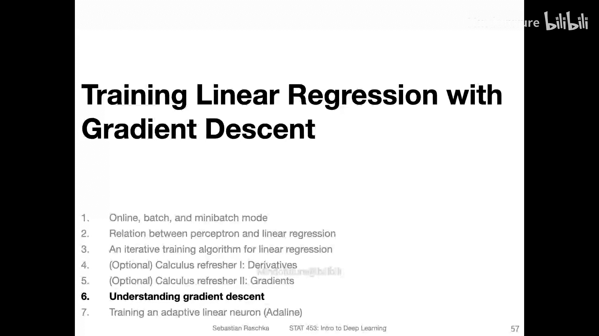

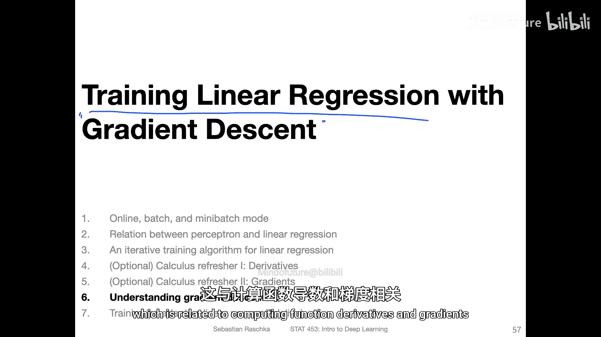

在本节课中，我们将学习如何使用梯度下降法来训练一个线性回归模型。我们将从理解损失函数和梯度的概念开始，逐步推导出权重更新的公式，并讨论学习率、批量大小以及数据归一化等关键因素对训练过程的影响。

---

## 损失函数与优化目标 🎯

上一节我们介绍了函数导数和梯度的概念。本节中，我们来看看如何将这些概念应用于训练线性回归模型。

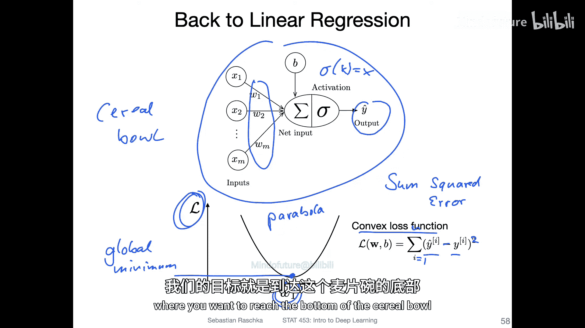

考虑一个简单的线性回归模型，其激活函数是恒等函数。模型的预测输出为：
`y_hat = w^T * x + b`

为了找到最优的权重 `w` 和偏置 `b`，我们需要最小化模型的预测误差。为此，我们定义一个凸损失函数。在线性回归中，通常使用平方误差损失：
`L = (y_hat - y)^2`
其中 `y` 是真实值。我们也可以使用均方误差（MSE），其本质相同，只是对多个样本取平均。

如果我们绘制损失函数随某一个权重 `w_j` 变化的图像，通常会看到一个碗状或抛物线形状的曲线。这个曲线存在一个全局最小值，我们的目标就是找到使损失最小的权重值。

---

## 梯度下降的基本思想 🧭

理解了损失函数的形状后，我们来看看梯度下降是如何工作的。

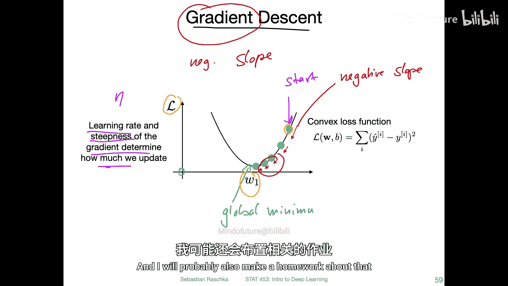

梯度下降的核心思想是：从一个初始权重（例如，随机初始化的小数值）开始，计算损失函数在该点关于权重的梯度（即导数）。梯度指示了函数在该点最陡峭的上升方向。为了最小化损失，我们需要朝梯度的反方向（即负梯度方向）移动。

更新权重的公式如下：
`w_new = w_old - η * ∇L(w_old)`
其中：
*   `η` 是**学习率**，一个控制步长大小的超参数。
*   `∇L(w_old)` 是损失函数在旧权重处的梯度。

我们通过反复应用这个更新规则，沿着损失函数的“山坡”向下走，逐步逼近最小值。

以下是梯度下降中几个关键因素的说明：

*   **学习率的作用**：学习率 `η` 至关重要。
    *   如果学习率**太大**，更新步长过大，可能会“越过”最小值，导致损失震荡甚至发散。
    *   如果学习率**太小**，更新步长过小，收敛到最小值需要非常多的迭代步骤，训练速度极慢。
*   **局部最小值问题**：对于像线性回归这样的凸损失函数，只有一个全局最小值。但在深度学习中，损失函数通常是非凸的，可能存在许多局部最小值。过小的学习率可能导致模型陷入一个较差的局部最小值而无法跳出。后续课程会介绍如“动量”等技术来缓解此问题。

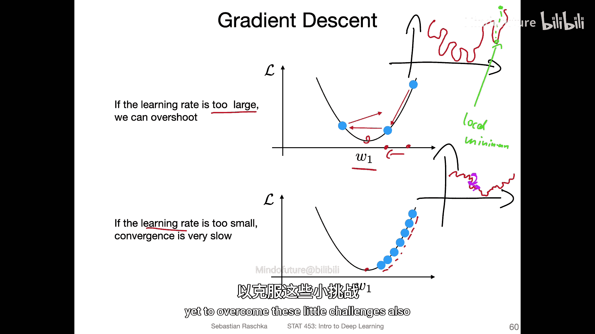

---

## 推导线性回归的梯度 📝

现在，让我们具体推导线性回归模型的梯度更新公式。我们以均方误差损失为例，并考虑对单个权重 `w_j` 的偏导数。

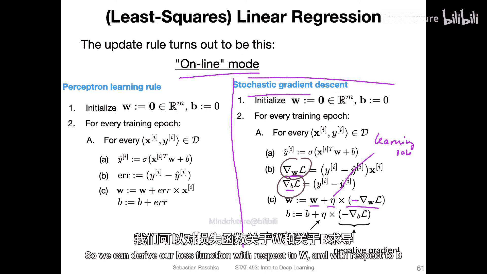

损失函数（MSE）为：
`L = (1/(2n)) * Σ (y_hat_i - y_i)^2`
其中 `n` 是样本数量，引入 `1/2` 是为了后续求导后形式更简洁。

模型的预测为：
`y_hat = σ(w^T * x)`
对于线性回归，激活函数 `σ` 是恒等函数，因此 `y_hat = w^T * x`（为简化，此处暂不考虑偏置 `b`）。

现在，计算损失 `L` 对权重 `w_j` 的偏导数 `∂L/∂w_j`。我们使用链式法则：

1.  **外层导数**：`∂L/∂(y_hat - y) = (1/n) * (y_hat - y)`
    （注意：对 `(y_hat - y)^2` 求导得到 `2*(y_hat - y)`，再乘以 `1/(2n)` 后得到 `(1/n)*(y_hat - y)`）

2.  **内层导数**：`∂(y_hat - y)/∂w_j = ∂(w^T * x)/∂w_j = x_j`
    （因为 `y` 是常数，`w^T * x` 对 `w_j` 求导结果为对应的特征值 `x_j`）

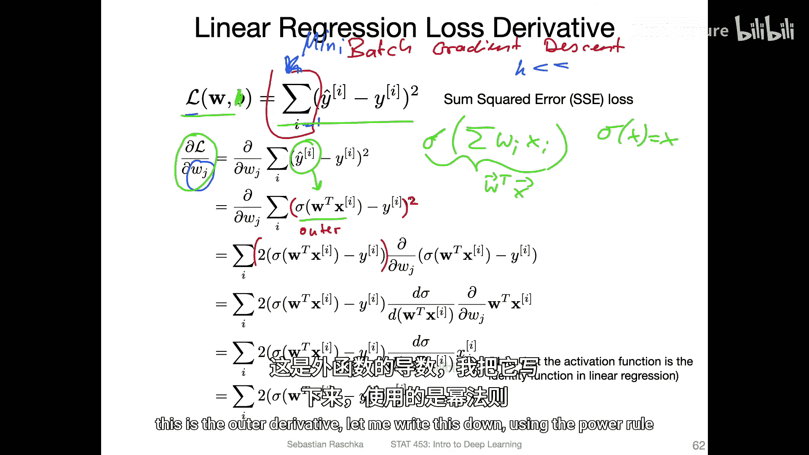

将两者相乘，得到最终的梯度：
`∂L/∂w_j = (1/n) * (y_hat - y) * x_j`

因此，权重 `w_j` 的更新公式为：
`w_j_new = w_j_old - η * [(1/n) * Σ (y_hat_i - y_i) * x_{i,j}]`
对于偏置 `b` 的更新，推导类似，结果为：
`b_new = b_old - η * [(1/n) * Σ (y_hat_i - y_i)]`

---

## 批量、在线与小批量梯度下降 🔄

根据计算梯度时使用的数据量不同，梯度下降有三种主要变体：

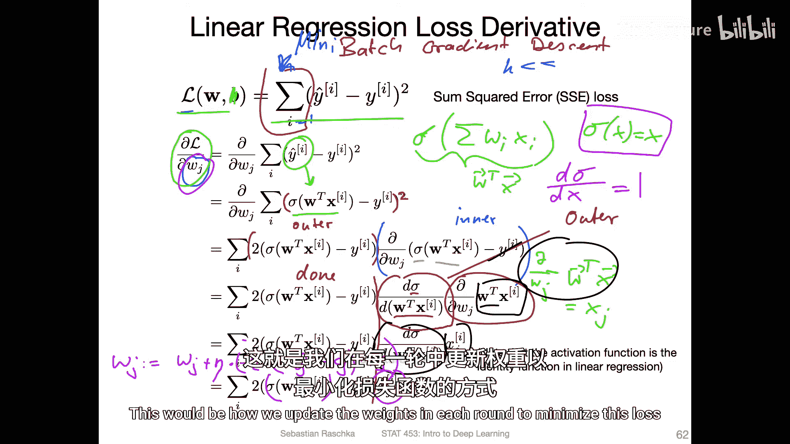

*   **批量梯度下降**：使用**整个训练集**计算梯度（即上述公式中的求和涵盖所有 `n` 个样本）。每次更新方向准确，指向最小值，但计算开销大，尤其对于大数据集。
*   **随机梯度下降**：每次更新只使用**一个训练样本**计算梯度。更新速度快，能提供一定的随机性有助于跳出局部极小值，但更新方向噪声大，收敛路径曲折。
*   **小批量梯度下降**：折中方案，每次更新使用一个**小批量**的样本（例如32、64个）计算梯度。这是深度学习中最常用的方法，在计算效率和更新稳定性之间取得了良好平衡。

对于线性回归这种凸问题，批量梯度下降是直接有效的。但对于复杂的非凸深度学习模型，小批量梯度下降的噪声有时反而有助于找到更好的解。

---

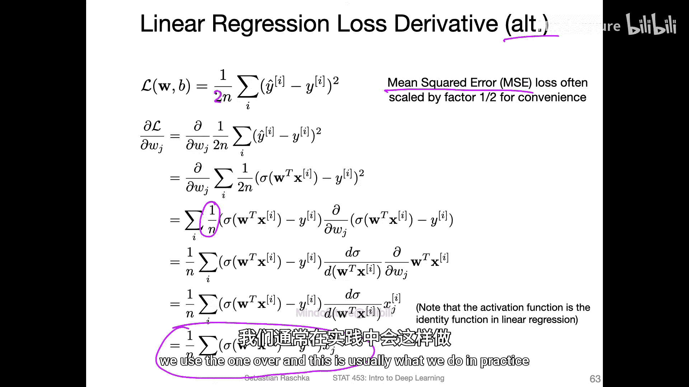

## 数据归一化的重要性 ⚖️

在应用梯度下降前，对输入特征进行归一化（或标准化）至关重要。

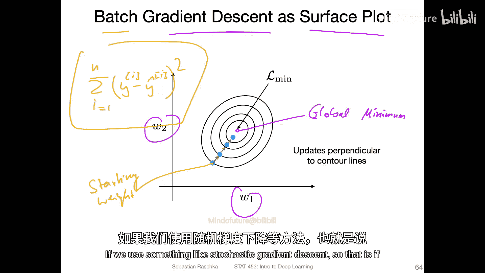

如果特征尺度差异巨大（例如，一个特征是“年龄”（0-100），另一个是“收入”（0-1000000）），损失函数的等高线会变得非常狭长（椭圆形）。这会导致梯度下降路径变得低效，需要小心翼翼地调整学习率，否则容易在某个方向上震荡。

通过归一化，使所有特征具有相似的尺度（例如，均值为0，标准差为1），损失函数的等高线会更接近圆形。这样，梯度下降的更新方向能更直接地指向最小值，从而加速收敛并降低对学习率设置的敏感性。

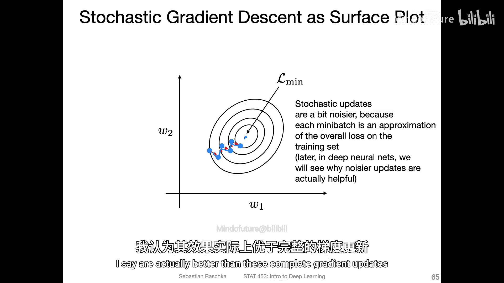

---

## 总结 📚

本节课中我们一起学习了梯度下降法的核心原理及其在线性回归中的应用。

我们首先定义了平方误差损失函数，并理解了其凸性质。接着，我们引入了梯度下降的思想：通过计算损失函数的梯度，并沿负梯度方向迭代更新模型参数，以最小化损失。我们详细推导了线性回归模型的权重更新公式 `w_new = w_old - η * ∇L`。

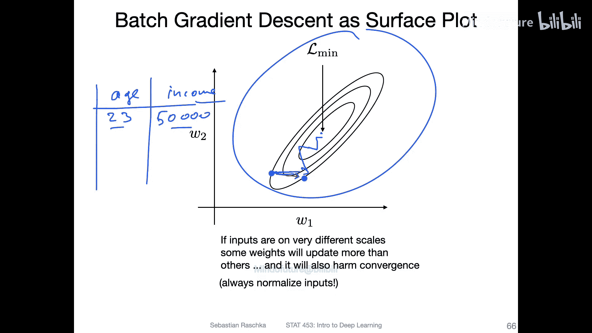

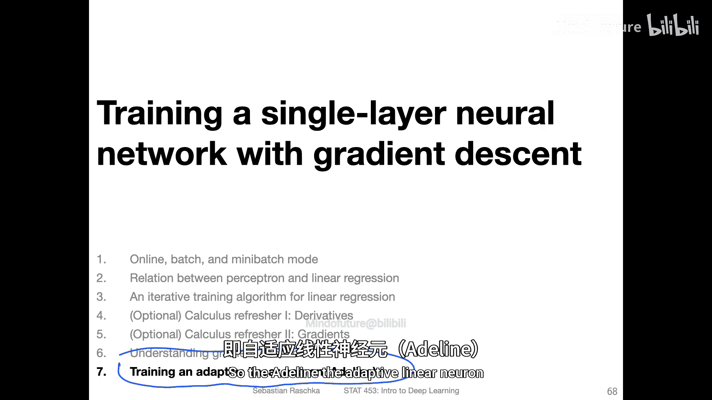

此外，我们探讨了学习率的选择策略、批量/在线/小批量三种更新模式的区别与适用场景，并强调了数据归一化对于梯度下降高效运行的重要性。这些概念不仅是线性回归的基础，更是后续理解所有深度学习模型训练过程的基石。在接下来的课程中，我们将把这些原理应用到更复杂的神经网络中。