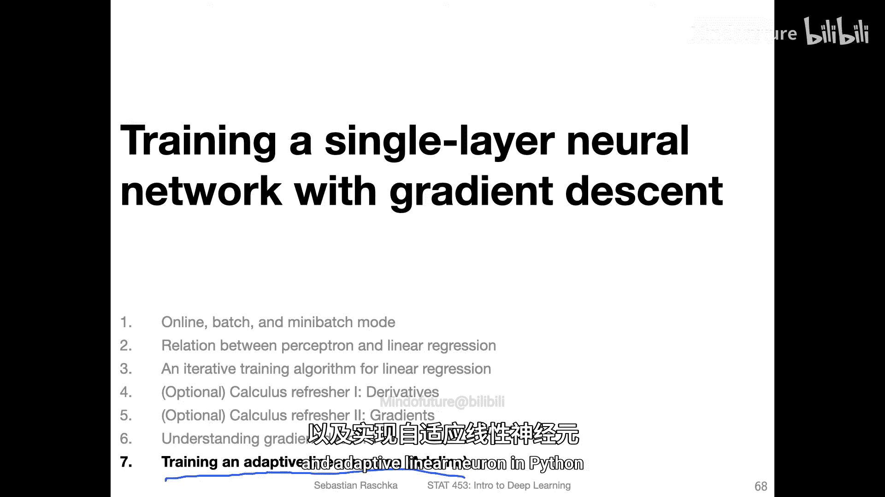
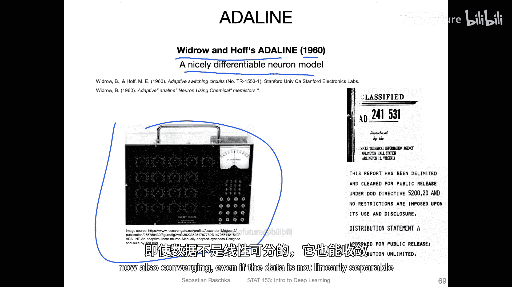
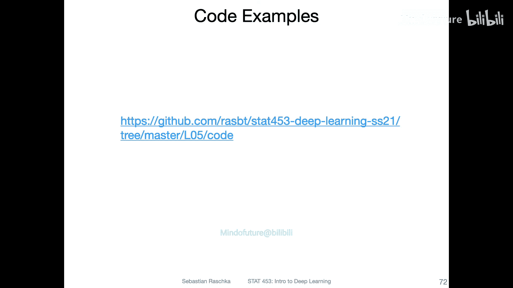

# 039：训练自适应线性神经元（Adaline）🚀

在本节课中，我们将学习如何用Python实现并训练一个自适应线性神经元模型。我们将从回顾感知机模型开始，然后介绍Adaline模型的关键改进，最后通过代码示例展示其工作原理。

## 概述

上一节我们回顾了感知机模型及其局限性。本节中，我们将看看一个更先进的模型——自适应线性神经元。Adaline模型由Widrow和Hoff在20世纪60年代提出，它通过引入可微分的激活函数，解决了感知机在数据非线性可分时无法收敛的问题。

## 感知机回顾

首先，让我们简要回顾一下感知机模型的工作流程。感知机首先计算净输入，然后通过一个阈值函数产生输出（预测的类别标签，0或1）。如果预测与真实标签不符，则计算误差并据此更新权重。

感知机的核心公式如下：
*   **净输入**：`z = w^T * x` （其中 `w` 是权重向量，`x` 是输入特征）
*   **输出**：`y_pred = 1 if z >= 0 else 0`
*   **权重更新**：`w := w + η * (y_true - y_pred) * x` （其中 `η` 是学习率）

然而，感知机使用的**阈值函数是不可微分的**，这限制了其使用基于梯度的优化方法。

## Adaline模型原理

Adaline模型对感知机进行了关键改进。它同样计算净输入，但使用一个**恒等函数**作为激活函数，这使得模型在阈值函数之前的部分变得可微分。

以下是Adaline模型的结构：
*   **净输入**：`z = w^T * x`
*   **激活函数**：`φ(z) = z` （恒等函数）
*   **阈值函数**：`y_pred = 1 if φ(z) >= 0.5 else 0`

Adaline与感知机的**核心区别在于误差计算的位置**：
*   感知机在**阈值函数之后**计算误差（`y_true - y_pred`）。
*   Adaline在**阈值函数之前**计算误差（`y_true - φ(z)`）。

由于我们在不可微分的阈值函数**之前**计算误差，因此可以使用微积分（如梯度下降）来优化权重，这使得模型训练更加高效和稳定。

## 模型对比与可视化

为了更直观地理解，我们可以将Adaline视为一个线性回归模型加上一个阈值函数。在训练时，它像线性回归一样拟合数据点，目标是使连续预测值（净输入）尽可能接近真实的类别标签（0或1）。

以下是一个概念示意图，展示了Adaline如何为一个简单的二分类问题拟合一条直线：

训练完成后，我们应用阈值函数（例如，以0.5为界）将连续的预测值转换为最终的类别标签（0或1）。

## 代码实现概述

理解了理论之后，动手实践至关重要。在接下来的视频中，我将通过具体的Python代码示例，详细演示如何实现Adaline模型。

以下是实现的关键步骤预览：
1.  **初始化**：设置权重和学习率。
2.  **前向传播**：计算净输入和激活值。
3.  **计算损失**：使用均方误差等可微损失函数。
4.  **梯度计算与权重更新**：利用梯度下降法优化权重。
5.  **预测**：应用阈值函数得到最终类别。

## 总结

本节课中，我们一起学习了自适应线性神经元模型。我们从感知机的局限性出发，引入了Adaline模型，并解释了其通过将误差计算置于阈值函数之前来实现可微分性的核心思想。我们还了解了恒等激活函数的作用，以及如何将线性回归与阈值函数结合以完成分类任务。下一节，我们将通过具体的代码实现来巩固这些概念。