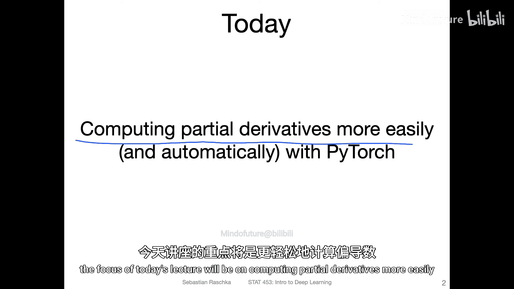
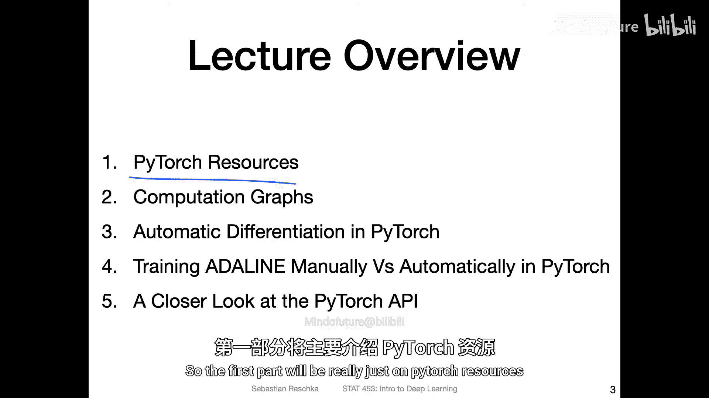
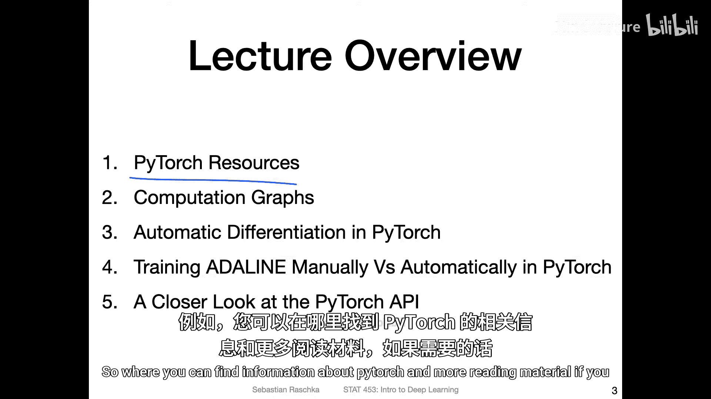
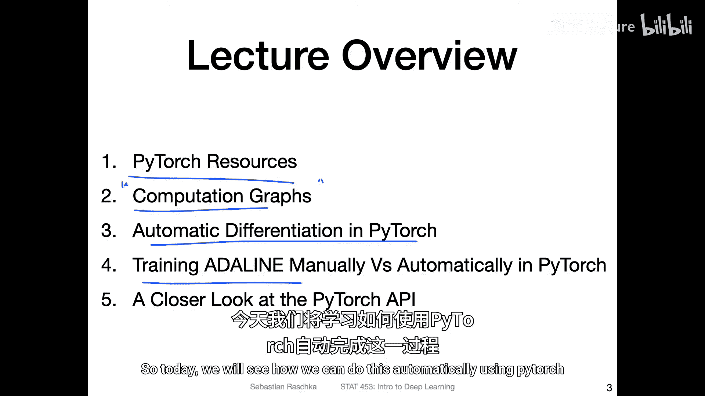
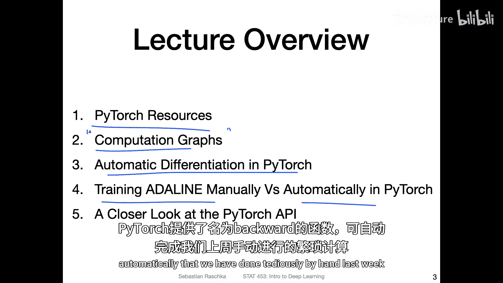
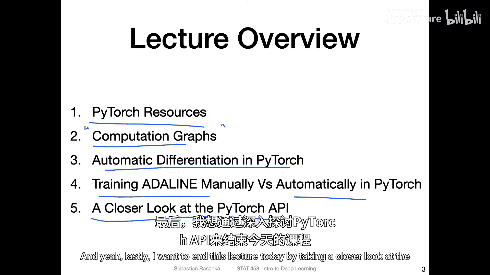
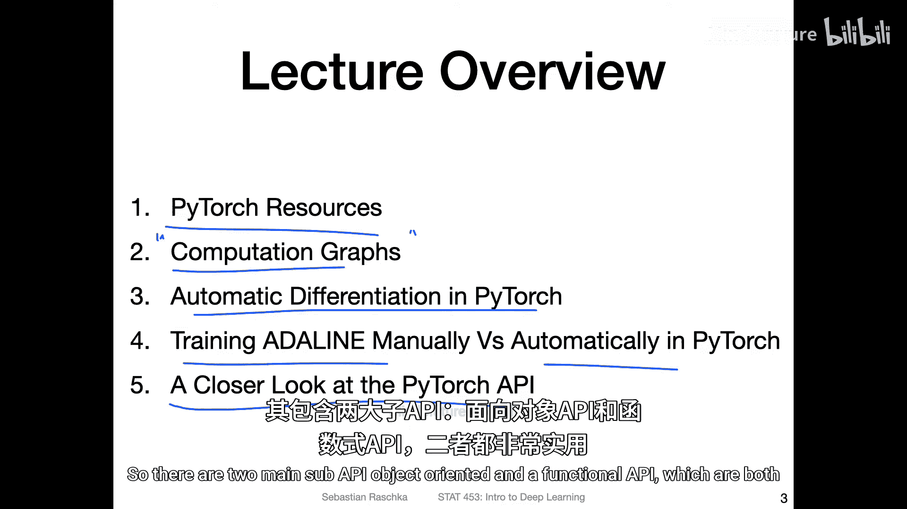
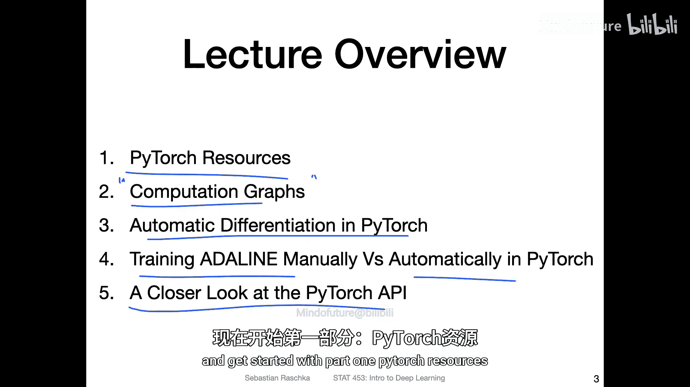

# 042：PyTorch中的自动微分 📚

## 概述

在本节课中，我们将要学习如何使用PyTorch框架中的自动微分功能。上周我们讨论了梯度下降和微积分，以理解如何手动计算损失函数相对于模型权重的偏导数。然而，在实践中，尤其是处理大型神经网络时，手动推导和编码梯度会非常繁琐。因此，我们将利用PyTorch的`autograd`模块来自动完成这一过程，从而简化我们的工作。

---

## 第一部分：PyTorch学习资源 📖

上一节我们介绍了本课程的核心目标。在深入学习自动微分之前，了解如何获取更多关于PyTorch的信息和资源是有益的。

以下是获取PyTorch信息和教程的主要途径：
*   **官方网站**：访问 [pytorch.org](https://pytorch.org) 获取官方文档、教程和最新版本信息。
*   **社区与论坛**：参与PyTorch论坛和社区讨论，可以解决具体问题并了解最佳实践。
*   **教程与课程**：除了本课程，网络上还有许多优秀的教程和在线课程可以帮助你深入学习。

熟悉这些资源将帮助你在课程之外持续学习，并跟上PyTorch的最新发展。

---

## 第二部分：计算图的概念 🧮

为了理解自动微分的工作原理，我们首先需要引入**计算图**的概念。计算图是一种用于可视化一系列计算（例如神经网络中的预测过程）的工具。

在计算图中：
*   **节点** 代表变量（如输入数据、权重、中间结果）。
*   **边** 代表操作（如加法、乘法、激活函数）。

PyTorch在底层正是构建了这样的计算图来跟踪所有操作。当我们进行前向传播（计算预测值）时，PyTorch会动态地构建一个计算图。这个图随后将用于**反向传播**，以计算梯度。



---

## 第三部分：自动微分的工作原理 ⚙️

上一节我们介绍了计算图，本节中我们来看看PyTorch如何利用它进行自动微分。

核心机制是**反向模式微分**。在前向传播构建计算图后，PyTorch可以从输出（通常是损失值）开始，沿着计算图反向传播，利用链式法则计算每一个输入变量（如模型权重）的梯度。

这个过程通过调用张量的 **`.backward()`** 方法自动触发。例如，如果 `loss` 是一个标量损失值，调用 `loss.backward()` 会计算 `loss` 相对于所有设置了 `requires_grad=True` 的张量的梯度，并将梯度累积到这些张量的 **`.grad`** 属性中。





**代码示例：基本自动微分**
```python
import torch

# 1. 创建需要计算梯度的张量
x = torch.tensor([2.0], requires_grad=True)
w = torch.tensor([3.0], requires_grad=True)
b = torch.tensor([1.0], requires_grad=True)

# 2. 前向传播（构建计算图）
y = w * x + b  # 例如，线性模型
loss = (y - 5)**2  # 假设目标值为5，计算均方误差

# 3. 自动计算梯度
loss.backward()

# 4. 查看梯度
print(f"梯度 d(loss)/dw: {w.grad}")  # 输出梯度值
print(f"梯度 d(loss)/dx: {x.grad}")
print(f"梯度 d(loss)/db: {b.grad}")
```

---

## 第四部分：应用于Adaline模型 🔄

在上一讲中，我们手动训练了Adaline模型，并亲自推导了导数公式。现在，我们将看到如何使用PyTorch自动完成这些步骤。



使用PyTorch训练Adaline的步骤可以简化为：
1.  定义模型参数（权重和偏置），并将 `requires_grad` 设置为 `True`。
2.  在前向传播中计算输出和损失。
3.  调用 `loss.backward()` 自动计算所有权重和偏置的梯度。
4.  使用优化器（如 `torch.optim.SGD`）的 `step()` 方法更新参数。优化器会自动访问存储在 `.grad` 属性中的梯度。
5.  在下次迭代前，必须调用优化器的 `zero_grad()` 方法清除旧的梯度，防止梯度累积。



这样，我们无需手动编写梯度计算公式，PyTorch的`autograd`和优化器就为我们处理了所有繁琐的微积分和更新逻辑。

---

## 第五部分：PyTorch API概览 📦

最后，我们来更仔细地看一下PyTorch的API设计。PyTorch主要提供了两种组织代码的方式，它们在本课程后续构建更复杂的网络（如卷积神经网络或循环神经网络）时都会用到。

以下是两种主要的API风格：
*   **面向对象API（`torch.nn.Module`）**：这是最常用和推荐的方式。通过继承 `nn.Module` 类来定义模型，将网络层作为类属性，并在 `forward` 方法中定义前向传播逻辑。这种方式结构清晰，便于管理参数和子模块。
*   **函数式API（`torch.nn.functional`）**：这提供了一系列无状态的函数（如 `F.relu`, `F.conv2d`）。当某些操作不需要可学习参数，或者你想要更精细地控制前向传播过程时，函数式API非常有用。它通常与面向对象API结合使用。

理解这两种API将帮助你在不同场景下更灵活、高效地构建神经网络。

---

## 总结



本节课中我们一起学习了PyTorch自动微分的核心知识。我们首先了解了PyTorch的学习资源，然后引入了**计算图**这一关键概念，并解释了PyTorch如何利用它通过 **`.backward()`** 方法实现**自动微分**。接着，我们将这一机制应用于Adaline模型，展示了如何简化训练流程。最后，我们概述了PyTorch的两种主要API设计模式：**面向对象API**和**函数式API**。





掌握自动微分是使用现代深度学习框架的基石，它将你从繁琐的梯度计算中解放出来，让你能更专注于模型结构和实验本身。