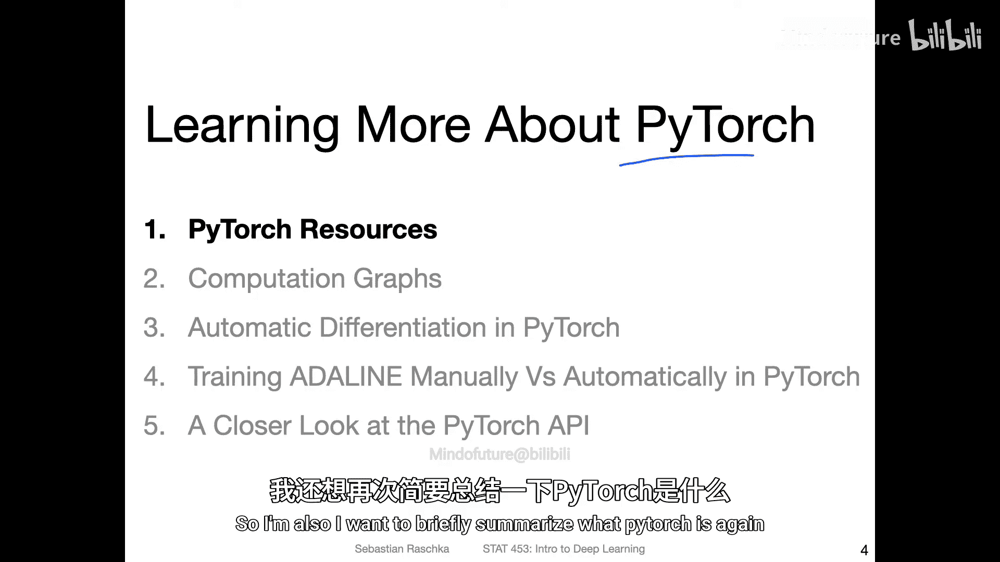
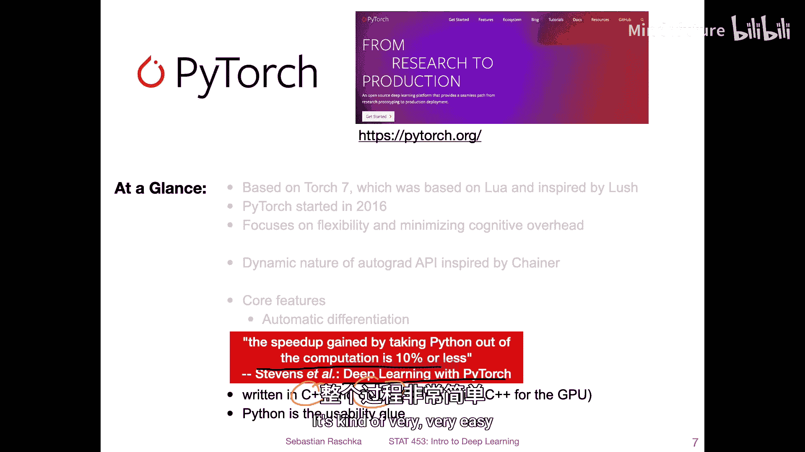
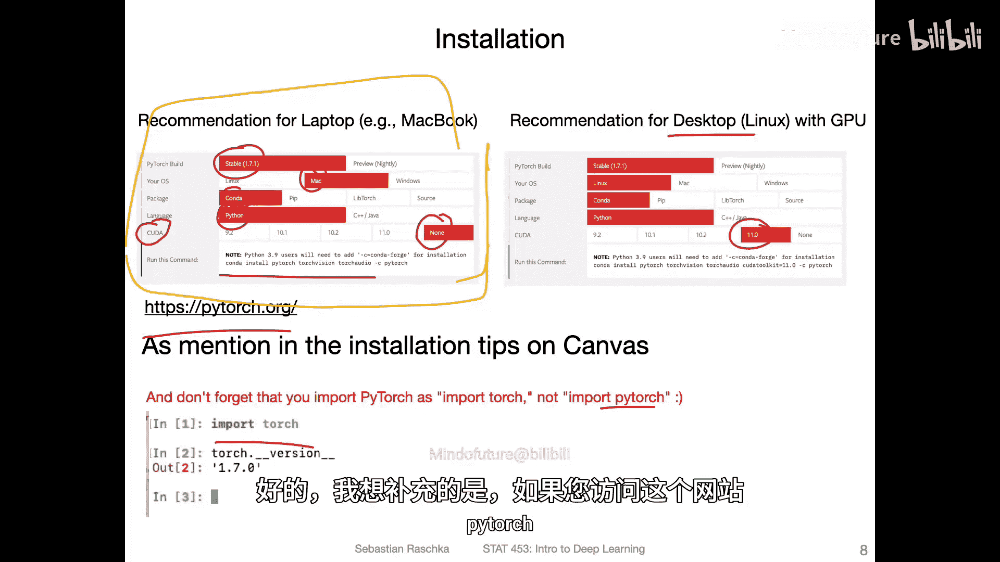
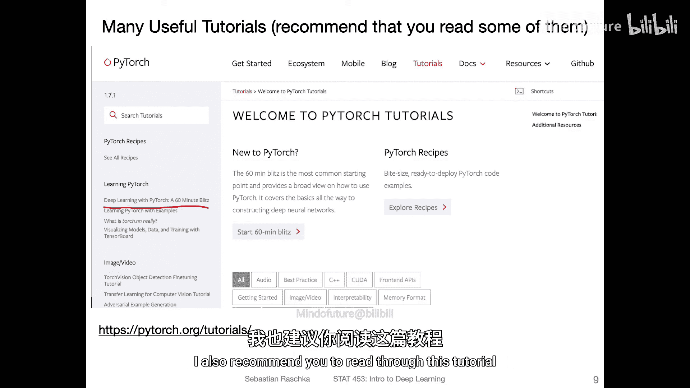
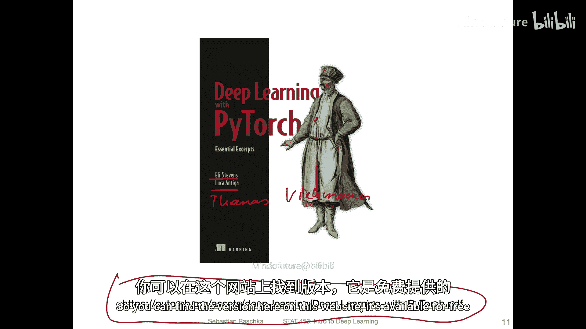
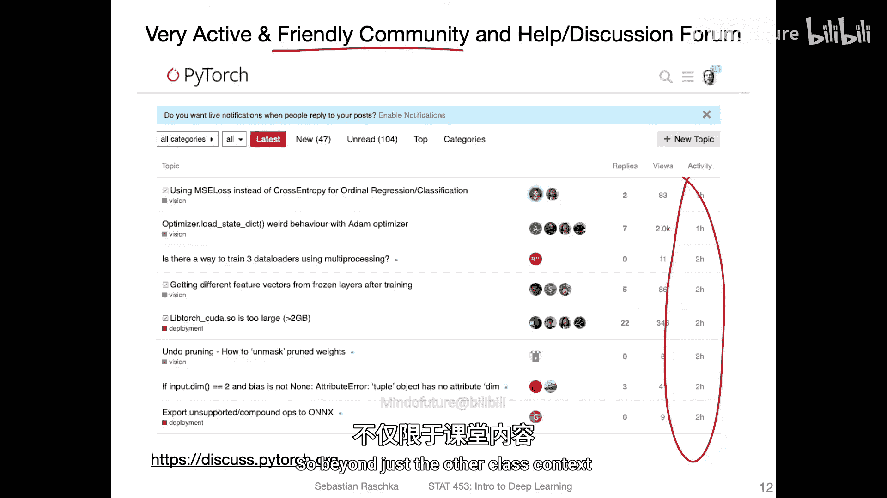
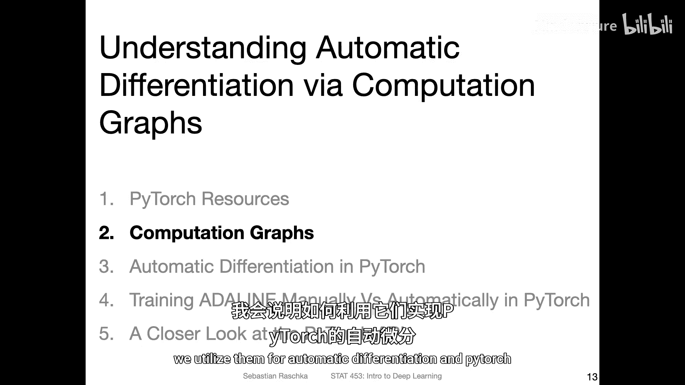

# 043：深入学习PyTorch 🚀

在本节课中，我们将深入学习PyTorch，了解其核心概念、优势以及如何获取更多学习资源。我们将探讨PyTorch的设计哲学、核心功能以及为何它在深度学习研究中如此受欢迎。

---

## 概述

PyTorch是一个基于Python的深度学习库，它结合了NumPy的易用性和深度学习所需的强大功能。本节课将介绍PyTorch的背景、核心特性、安装指南以及官方学习资源，帮助你为后续的实践项目打下坚实基础。

---

## PyTorch简介

PyTorch是一个用于Python的深度学习库。正如我们所见，它与NumPy非常相似，都使用**张量**（多维数组）作为核心数据结构。然而，PyTorch在此基础上增加了许多专为深度学习设计的便利功能。

### 历史背景

PyTorch基于**Torch 7**构建，后者是大约5到10年前非常流行的深度学习库。Torch 7的一个主要弱点是它基于**Lua**编程语言实现。虽然Lua在与C文件交互时很方便，并且语法与Python相似，但它毕竟不是Python。由于许多研究人员和开发者更倾向于使用Python，因此在2016年左右，社区开始将Torch 7移植到Python，这个项目就是**PyTorch**。

最初，PyTorch大量使用了Torch 7的代码，但后来逐渐被重写。它的设计重点在于**灵活性**和**最小化认知负担**。这意味着它在保持简单易用的同时，也为自定义研究（例如开发新的网络层）提供了足够的灵活性。

### 核心特性

PyTorch的核心特性包括：

1.  **自动微分**：在计算过程中，PyTorch可以自动计算导数，无需手动推导数学公式，这大大简化了梯度计算过程。
    *代码示例：* `loss.backward()` 可以自动计算图中所有张量的梯度。

2.  **动态计算图**：与早期TensorFlow等库使用的静态计算图不同，PyTorch采用**动态计算图**。这意味着代码是即时执行的，更类似于NumPy的工作方式，使得调试和理解程序流程变得更加容易。

3.  **与NumPy的集成**：可以轻松地将NumPy数组转换为PyTorch张量，反之亦然。不过，在PyTorch工作流中，我们通常尽量使用PyTorch张量，以避免频繁转换带来的麻烦。

### 性能与架构

PyTorch的大部分底层代码是用**C++**和**CUDA**编写的，这使得它非常高效。Python层更像是一个“粘合剂”，将底层的C++/CUDA代码包装起来，提供易用的接口。根据《Deep Learning with PyTorch》一书中的实验，即使完全脱离Python环境，使用C++ API，性能提升也仅在10%左右。这表明Python本身并不会成为性能瓶颈。

---

## 为何选择PyTorch？

既然PyTorch和NumPy如此相似，我们为什么还要使用PyTorch呢？主要原因如下：

*   **GPU支持**：PyTorch可以利用GPU进行加速，这对于训练深度神经网络至关重要，速度可能比CPU快数百甚至数千倍。
*   **分布式计算**：支持跨多个GPU甚至多台设备分发计算任务，这对于训练大型模型尤其有帮助。
*   **计算图跟踪**：PyTorch能够自动构建并跟踪计算图，这对于通过反向传播计算梯度、优化损失函数至关重要。当然，在不需要计算梯度时，也可以轻松关闭此功能以节省内存。

简而言之，PyTorch可以看作是“**带有深度学习便利功能的NumPy**”，它让深度学习研究者的工作变得更加轻松。

---

## 安装指南

安装PyTorch非常简单。对于大多数用户，建议访问[PyTorch官方网站](https://pytorch.org)，使用其提供的安装配置器。

以下是几点关键建议：

1.  **笔记本电脑用户**：建议安装**CPU版本**。除非拥有高端游戏显卡，否则在笔记本电脑GPU上运行深度学习代码可能导致过热。通常的做法是在CPU上编写和调试代码，确认无误后，再通过修改一行代码（例如`.to(‘cuda’)`）将计算转移到GPU上运行。
2.  **桌面/Linux服务器用户**：如果拥有兼容的NVIDIA显卡，可以安装**GPU版本**。需要确保显卡驱动支持所选CUDA版本。
3.  **课程需求**：本课程不需要昂贵的硬件。我们更关注理解深度学习原理。我将在后续课程中介绍如何利用免费的在线GPU资源。
4.  **安装命令**：建议使用Conda包管理器，并一次性安装`torch`、`torchvision`（用于计算机视觉）和`torchaudio`（用于音频处理）等配套库。

**一个重要提示**：导入PyTorch时，使用 `import torch`，而不是 `import pytorch`。这是因为其核心继承自Torch库。

---

## 官方资源与社区

PyTorch拥有丰富的学习资源和活跃的社区，是深入学习的宝贵财富。

### 教程与文档

*   **官方教程**：官网的“Tutorials”板块提供了大量优质教程。特别推荐 **《Deep Learning with PyTorch: A 60 Minute Blitz》**。这个简短教程能帮助你快速上手，建议在本节课后阅读。
*   **官方书籍**：**《Deep Learning with PyTorch》** 这本书由PyTorch核心贡献者编写，内容深入浅出。你可以在网上找到免费阅读的版本，也有纸质书出版。

### 社区支持

PyTorch拥有一个非常友好和活跃的社区。如果你遇到棘手的技术问题，可以访问官方的 **讨论论坛**。社区成员通常回复迅速，且能提供非常专业的解答，这是一个极佳的学习和求助平台。

---

## 总结

本节课我们一起深入了解了PyTorch。我们回顾了它的历史渊源，理解了其**动态计算图**和**自动微分**的核心优势，并明确了它因其**灵活性**和**易用性**而成为深度学习研究首选工具的原因。我们还介绍了如何根据自身情况安装PyTorch，并指明了获取官方教程、书籍以及寻求社区帮助的途径。

掌握了这些基础知识后，我们就能更自信地使用PyTorch进行后续的深度学习实践。在下一个视频中，我们将具体探讨**计算图**的概念，并学习如何在PyTorch中利用它们进行自动微分。