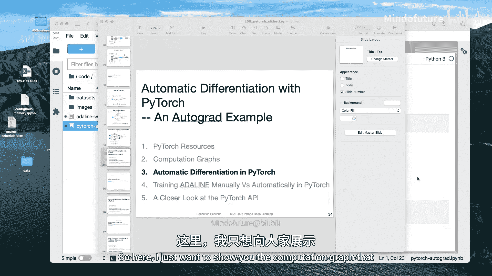
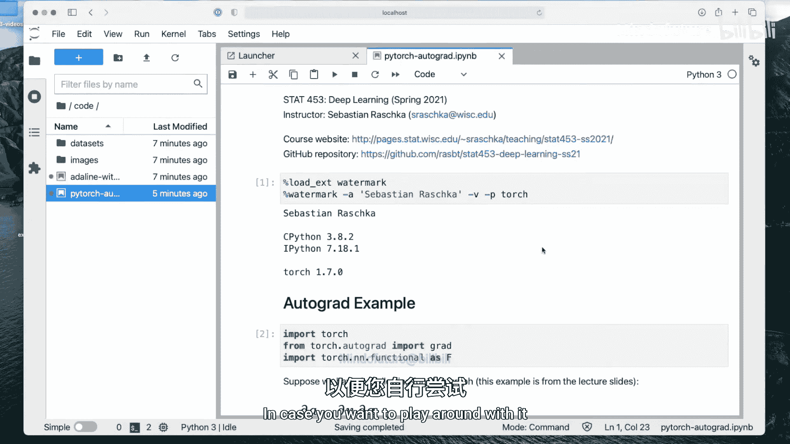
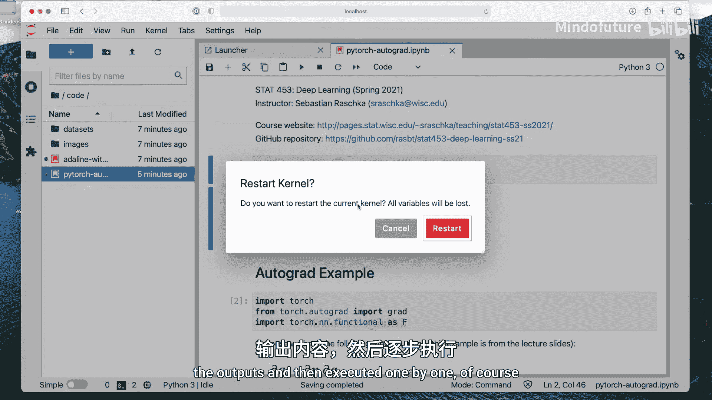
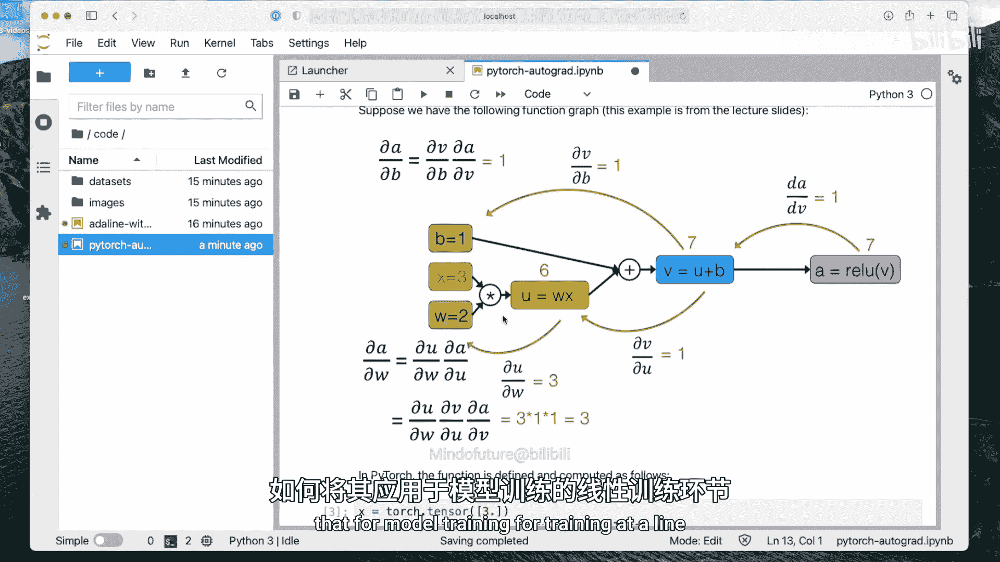

# 045：PyTorch中的自动微分——代码示例 🧠

在本节课中，我们将学习PyTorch中自动微分的基本概念。我们将通过一个简单的计算图示例，了解PyTorch如何跟踪计算并计算梯度。理解这些基础概念对于后续深入学习神经网络训练至关重要。





## 概述



自动微分是深度学习框架的核心功能，它允许我们自动计算函数的导数，而无需手动推导。PyTorch通过其`autograd`模块实现了这一功能。本节将展示如何在PyTorch中设置计算图并计算梯度。

## 计算图与梯度计算

上一节我们介绍了计算图的概念，本节中我们来看看如何在PyTorch中具体实现它。首先，我们需要导入必要的模块。

```python
import torch
from torch import autograd
import torch.nn.functional as F
```

接下来，我们定义一个简单的计算图，它包含输入、权重、偏置和一个激活函数。

```python
x = torch.tensor([1.0, 2.0])
w = torch.tensor([1.0, -1.0], requires_grad=True)
b = torch.tensor([0.5], requires_grad=True)

z = torch.dot(x, w) + b
a = F.relu(z)
```

在这里，我们将`w`和`b`的`requires_grad`属性设置为`True`。这告诉PyTorch我们需要计算这些张量的梯度，并因此在背后构建一个计算图。如果不设置此属性，PyTorch默认不会构建计算图，这有助于节省内存。

现在，我们可以计算输出`a`相对于权重`w`的梯度。

```python
grad_w = autograd.grad(a, w, retain_graph=True)
print(grad_w)  # 输出应为 tensor([3., 3.])
```

`autograd.grad`函数计算第一个参数（这里是`a`）相对于第二个参数（这里是`w`）的梯度。参数`retain_graph=True`指示PyTorch在计算后保留计算图，以便我们可以进行后续的梯度计算。如果不保留，计算图会被销毁。

同样，我们可以计算`a`相对于偏置`b`的梯度。

```python
grad_b = autograd.grad(a, b)
print(grad_b)  # 输出应为 tensor([1.])
```

请注意，这次我们没有设置`retain_graph=True`。因此，在计算完`grad_b`后，计算图被自动销毁。如果尝试再次计算梯度，将会出错。这种设计是为了防止在多次前向传播中计算图无限增长，从而节省内存。

## 自定义函数与梯度

PyTorch的自动微分系统不仅适用于内置函数，也适用于用户自定义的函数，即使函数中包含控制流语句（如`if-else`）。

以下是自定义ReLU函数的示例：

```python
def my_relu(x):
    return torch.max(torch.tensor(0.0), x)

# 使用自定义ReLU
z_custom = torch.dot(x, w) + b
a_custom = my_relu(z_custom)

grad_w_custom = autograd.grad(a_custom, w, retain_graph=True)
print(grad_w_custom)
```

即使函数在某个点不可导（如ReLU在0点），PyTorch也能进行合理的处理，通常将梯度设为0，而不会导致程序崩溃。

```python
# 测试在不可导点的情况
x_test = torch.tensor([-1.0])
w_test = torch.tensor([1.0], requires_grad=True)
b_test = torch.tensor([0.0], requires_grad=True)

z_test = x_test * w_test + b_test  # z_test = -1
a_test = F.relu(z_test)            # a_test = 0

grad_test = autograd.grad(a_test, w_test)
print(grad_test)  # 输出应为 tensor([0.])
```

## 总结



本节课中我们一起学习了PyTorch自动微分的基础。我们了解了如何通过设置`requires_grad=True`来构建计算图，以及如何使用`autograd.grad`函数计算梯度。我们还看到，PyTorch能够优雅地处理自定义函数和不可导点。在下一节中，我们将把这些概念应用于一个完整的模型训练示例——训练自适应线性神经元（Adaline）。