# 047：深入探究PyTorch API 🔍

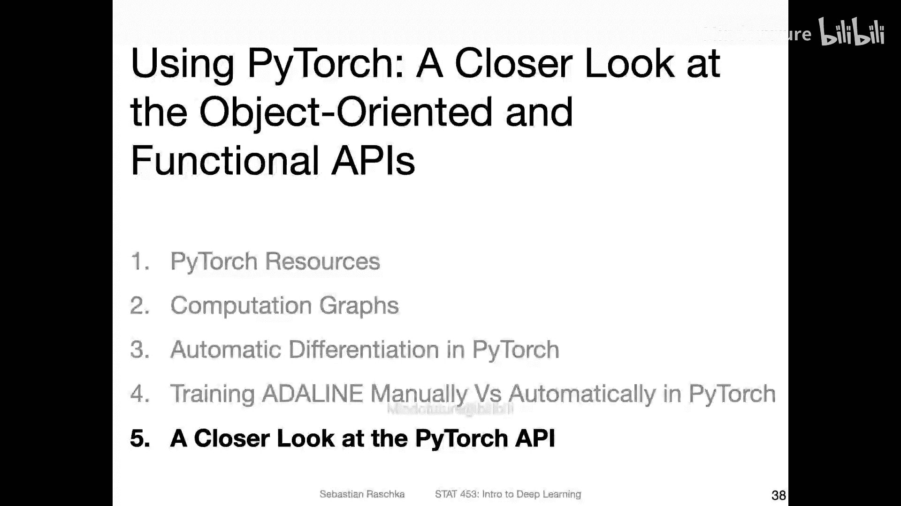

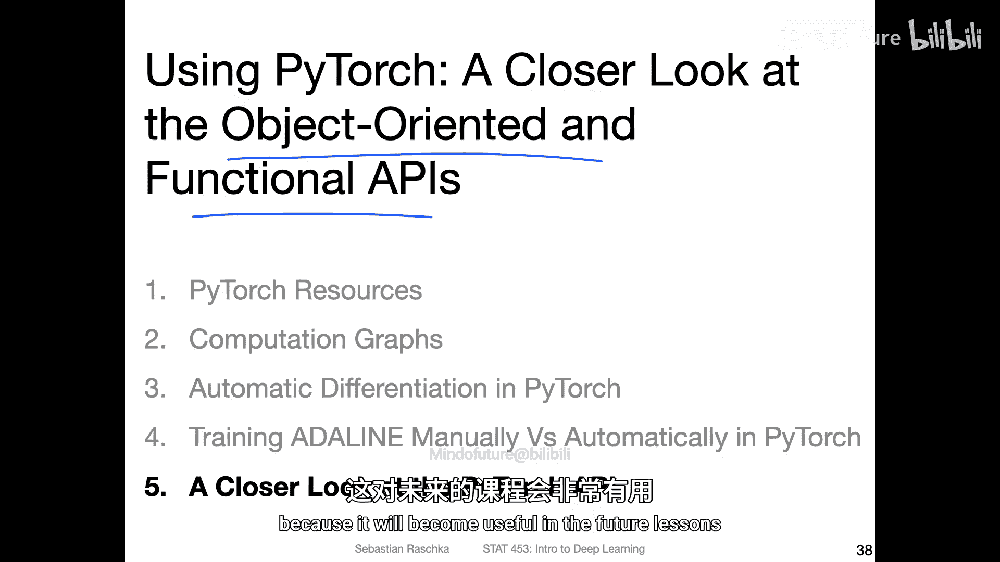

在本节课中，我们将深入探讨PyTorch的API，特别是面向对象API和函数式API之间的细微差别。理解这些差异对于后续课程的学习至关重要。

## 概述 📋

PyTorch提供了两种主要方式来构建神经网络：面向对象API和函数式API。我们将通过一个多层感知机的例子来展示这两种方法，并讨论各自的优缺点。

## 定义模型：面向对象API 🏗️

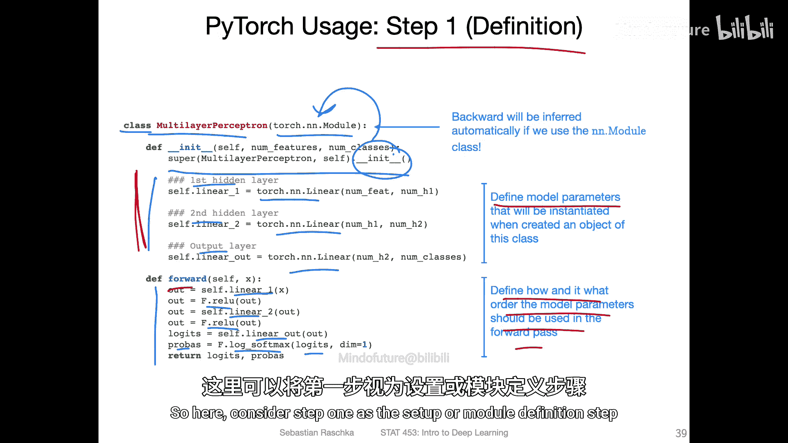

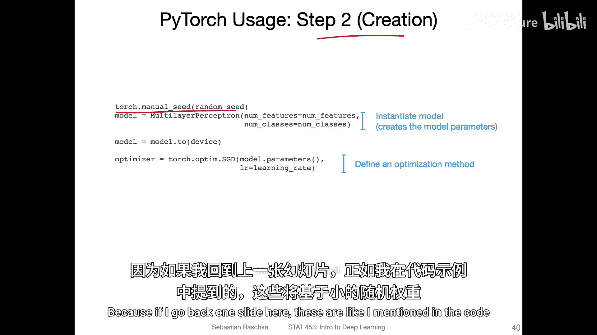

在PyTorch中，我们通常通过定义一个继承自 `torch.nn.Module` 的类来创建模型。这种方式为我们自动提供了一些便利功能。

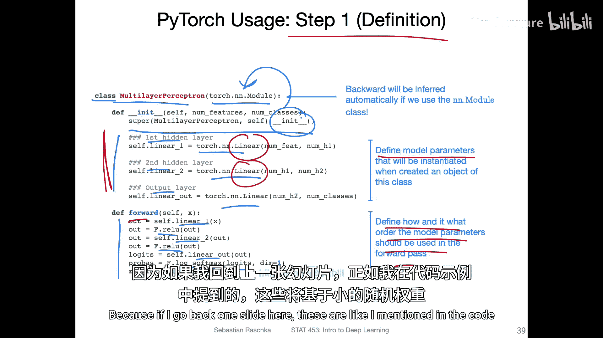

以下是一个多层感知机的定义模板：

```python
import torch.nn as nn

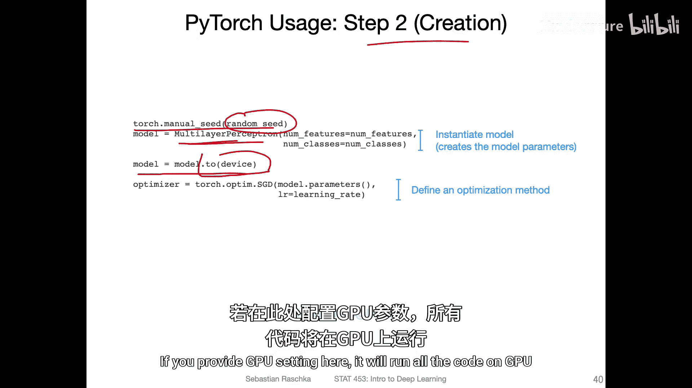

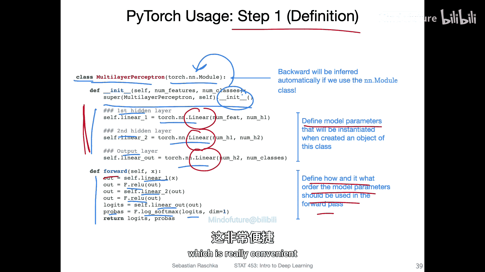

class MultilayerPerceptron(nn.Module):
    def __init__(self):
        super().__init__()
        self.linear1 = nn.Linear(784, 128)
        self.linear2 = nn.Linear(128, 64)
        self.linear3 = nn.Linear(64, 10)

    def forward(self, x):
        x = self.linear1(x)
        x = torch.relu(x)
        x = self.linear2(x)
        x = torch.relu(x)
        x = self.linear3(x)
        return torch.softmax(x, dim=1)
```

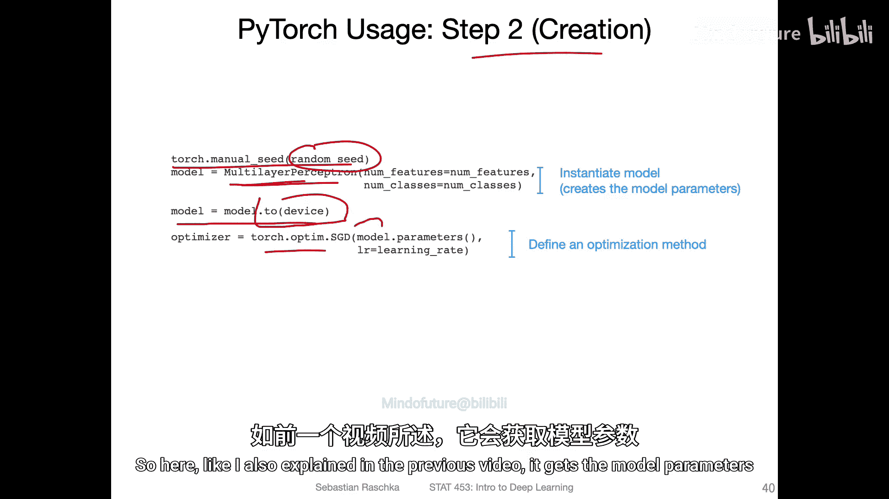

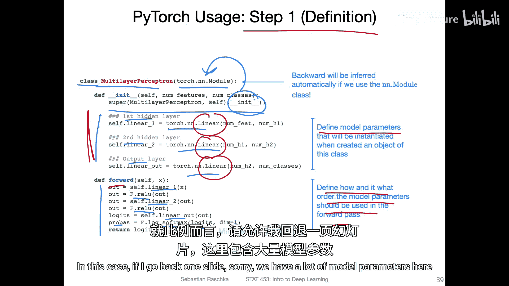

在 `__init__` 方法中，我们定义模型的参数（即可学习的权重和偏置）。在 `forward` 方法中，我们定义如何使用这些参数以及计算的顺序。这可以看作是模型的“设置”或“定义”步骤。

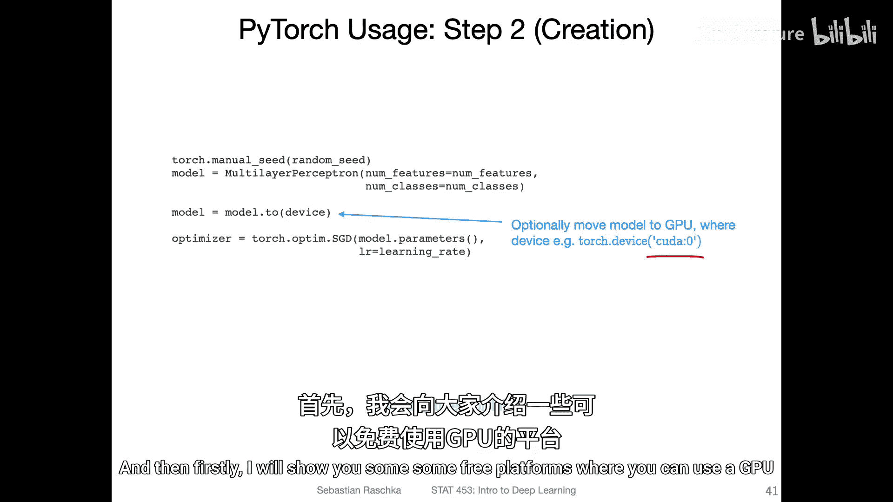

## 实例化与训练准备 ⚙️

上一节我们介绍了如何定义模型类，本节中我们来看看如何实例化模型并准备训练。

创建模型实例后，我们通常需要设置优化器，并可以选择将模型移至GPU以加速计算。

```python
import torch

# 设置随机种子以确保结果可复现
torch.manual_seed(123)

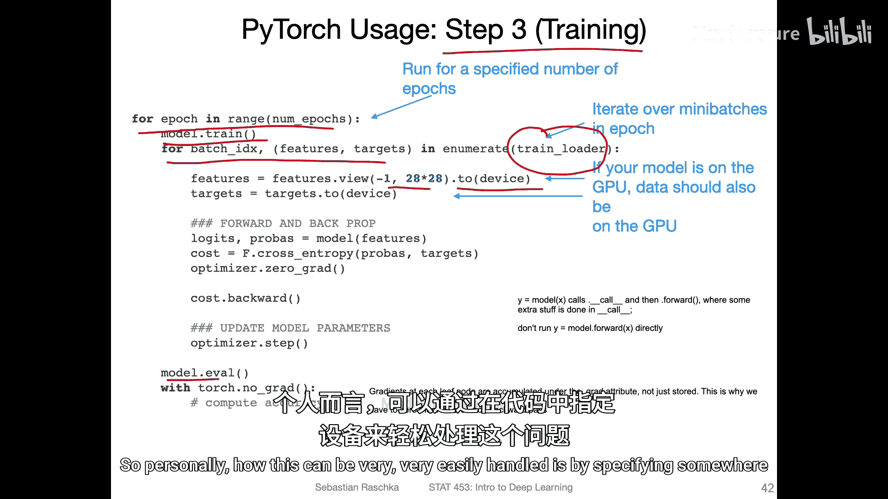

# 实例化模型
model = MultilayerPerceptron()

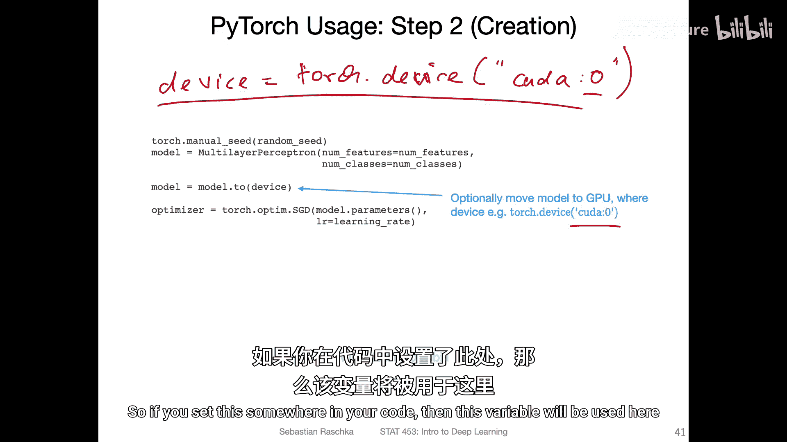

# 将模型移至GPU（如果可用）
device = torch.device('cuda:0' if torch.cuda.is_available() else 'cpu')
model = model.to(device)

# 设置优化器（例如随机梯度下降）
optimizer = torch.optim.SGD(model.parameters(), lr=0.01)
```

设置随机种子有助于实验的可复现性。`model.to(device)` 这行代码非常强大，它能自动将模型的所有参数转移到指定的设备（CPU或GPU）上。

## 训练循环 🔄

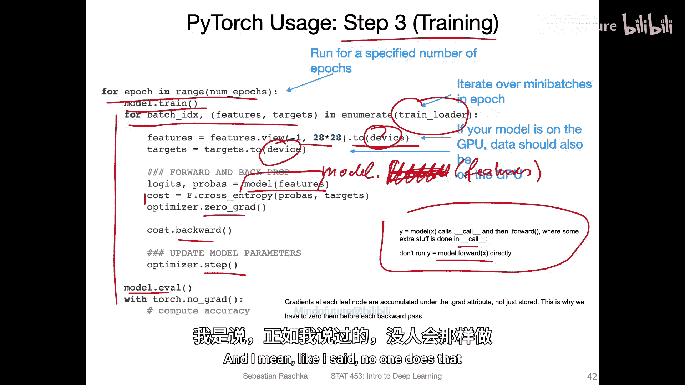

模型和优化器准备就绪后，接下来就是核心的训练循环。这个过程与我们之前讨论的Adaline模型训练概念相似。

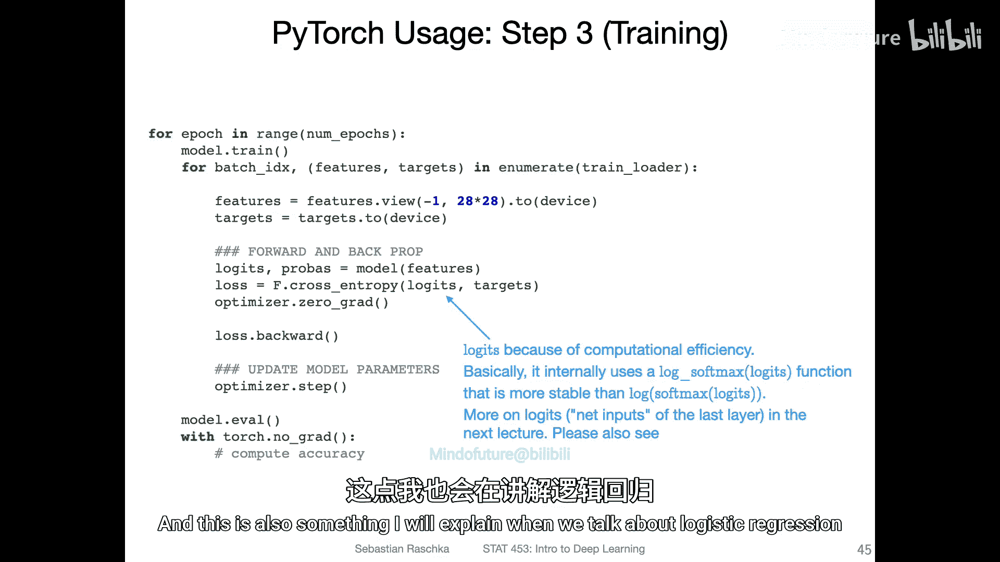

以下是训练循环的关键步骤：

```python
model.train()  # 将模型设置为训练模式
for epoch in range(num_epochs):
    for batch_idx, (features, targets) in enumerate(train_loader):
        # 将数据移至与模型相同的设备
        features = features.to(device)
        targets = targets.to(device)

        # 前向传播：计算预测值
        logits = model(features)

        # 计算损失
        loss = torch.nn.functional.cross_entropy(logits, targets)

        # 反向传播：计算梯度
        optimizer.zero_grad()  # 清除旧梯度
        loss.backward()        # 计算新梯度

        # 更新模型参数
        optimizer.step()
```

在训练循环中，我们首先调用 `model.train()`，这是一个好习惯，因为某些层（如批归一化或Dropout）在训练和评估阶段的行为不同。然后，我们迭代数据批次，执行前向传播、计算损失、反向传播和参数更新。

**重要提示**：在实践中，你不需要从头开始记忆这些代码。通常的做法是复制一个现有的训练循环模板，然后根据你的具体需求进行修改。

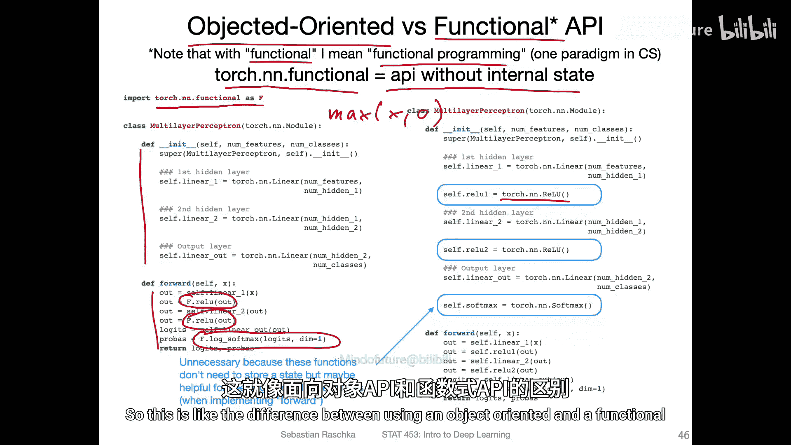

## API对比：面向对象 vs 函数式 ⚖️

PyTorch提供了两种风格的API：面向对象API和函数式API。我们可以混合使用两者。

函数式API指的是没有内部状态的函数。例如，ReLU激活函数只是一个简单的数学运算 `max(x, 0)`，它没有需要学习的参数。因此，将其实现为一个完整的类显得有些“大材小用”。

以下是两种风格的对比示例：

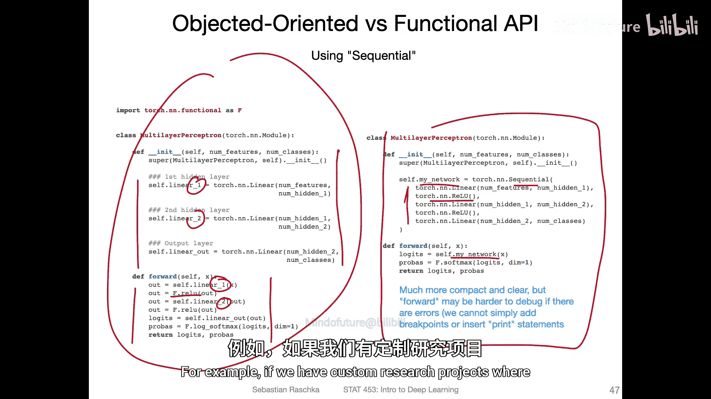

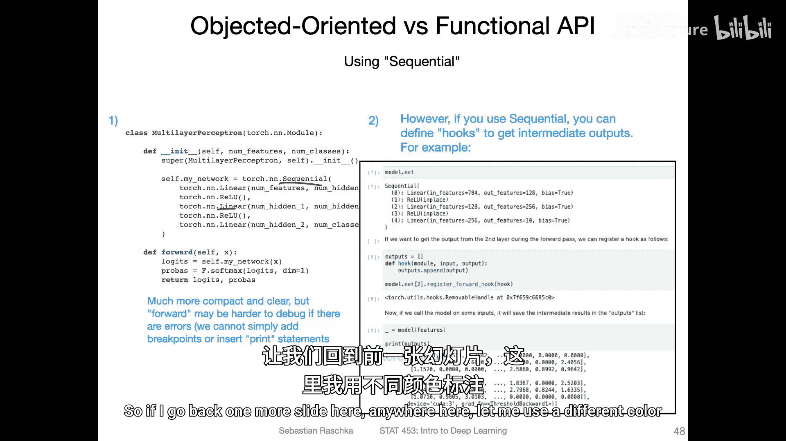

**面向对象风格（左）**：在 `__init__` 中定义层，在 `forward` 中调用。
**函数式风格（右）**：使用 `torch.nn.functional` 中的函数。

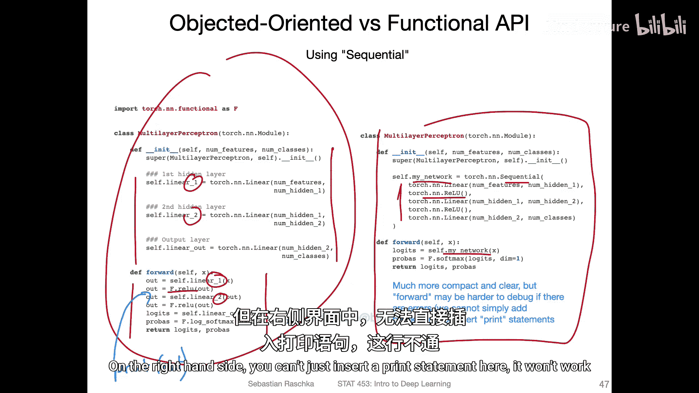

然而，PyTorch还提供了一个非常方便的 `nn.Sequential` 类，它属于面向对象API，但写法更紧凑。

```python
# 使用 nn.Sequential 的紧凑写法
model = nn.Sequential(
    nn.Linear(784, 128),
    nn.ReLU(),
    nn.Linear(128, 64),
    nn.ReLU(),
    nn.Linear(64, 10)
)
```

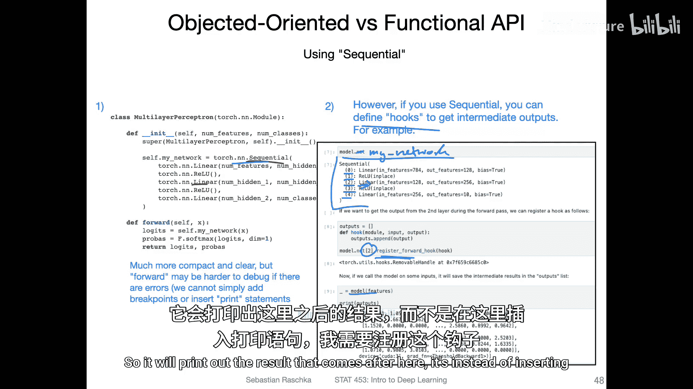

使用 `Sequential` 的好处是定义顺序即执行顺序，不易出错，尤其对于深层网络。但其缺点是，如果你想获取中间层的输出进行调试，不如在自定义的 `forward` 方法中直接插入 `print` 语句方便。在 `Sequential` 中，你需要使用“钩子”来获取中间结果。

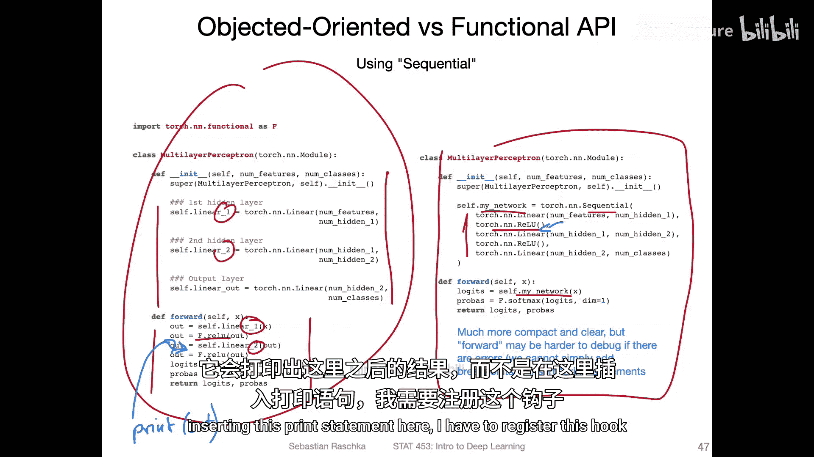

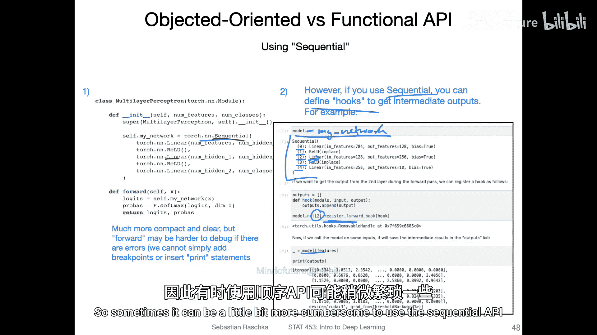

选择哪种API取决于个人偏好和项目需求，两者没有绝对的对错。

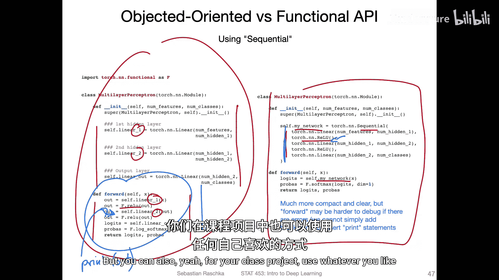

## 开发实践与工具 🛠️

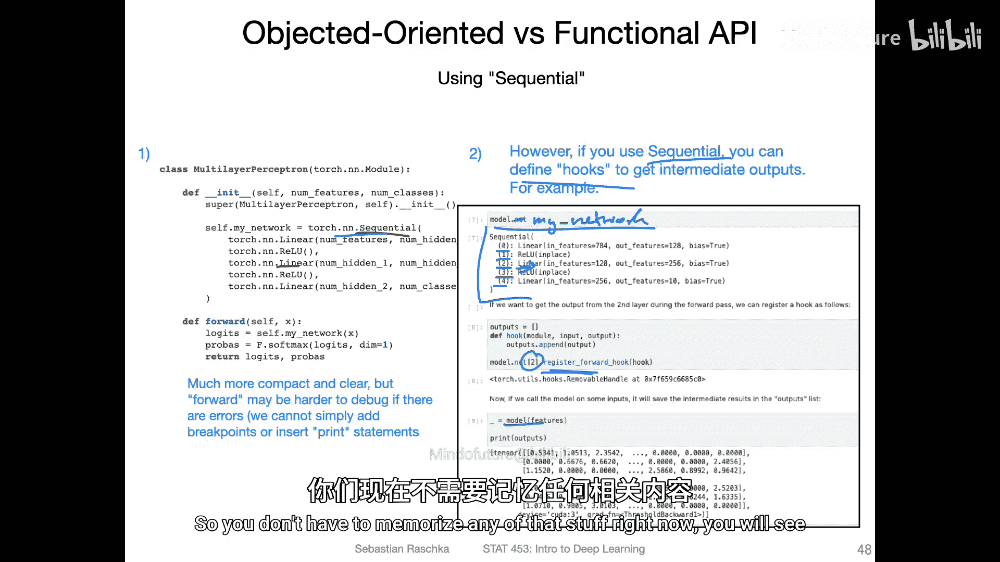

在PyTorch开发中，选择合适的工具和环境也很重要。通常，Jupyter笔记本适合快速探索和教学演示，因为它能方便地插入图表和展示中间结果。

然而，对于更复杂的项目、长时间的训练或使用版本控制，Python脚本通常更具优势。脚本在调试、运行稳定性和与Git集成方面更佳。

作为深度学习实践者，混合使用两者通常是明智的选择：用Jupyter进行初步分析和实验，用Python脚本来构建和部署最终模型。

关于代码风格，PyTorch社区有一些约定俗成的规范，例如：
*   包、模块、函数、方法、变量名使用小写字母加下划线。
*   类名使用驼峰命名法。
*   常量使用全大写字母加下划线。

遵循这些约定可以使你的代码更易于他人阅读和维护。

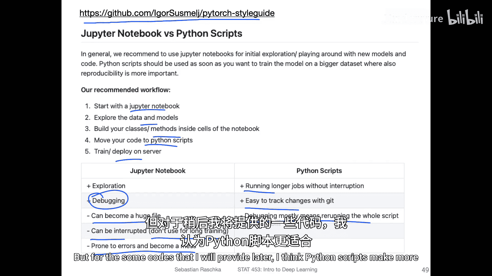

## 总结 📝

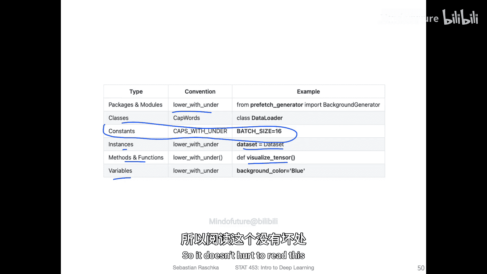

本节课我们一起深入探讨了PyTorch的核心API。我们学习了：

1.  **如何定义模型**：通过继承 `nn.Module` 类，在 `__init__` 中定义参数，在 `forward` 中定义计算图。
2.  **训练流程**：包括模型实例化、优化器设置、设备转移以及包含前向/反向传播的训练循环。
3.  **两种API风格**：面向对象API和函数式API的区别与联系，以及便捷的 `nn.Sequential` 容器。
4.  **开发实践**：Jupyter笔记本与Python脚本的适用场景，以及良好的代码风格规范。

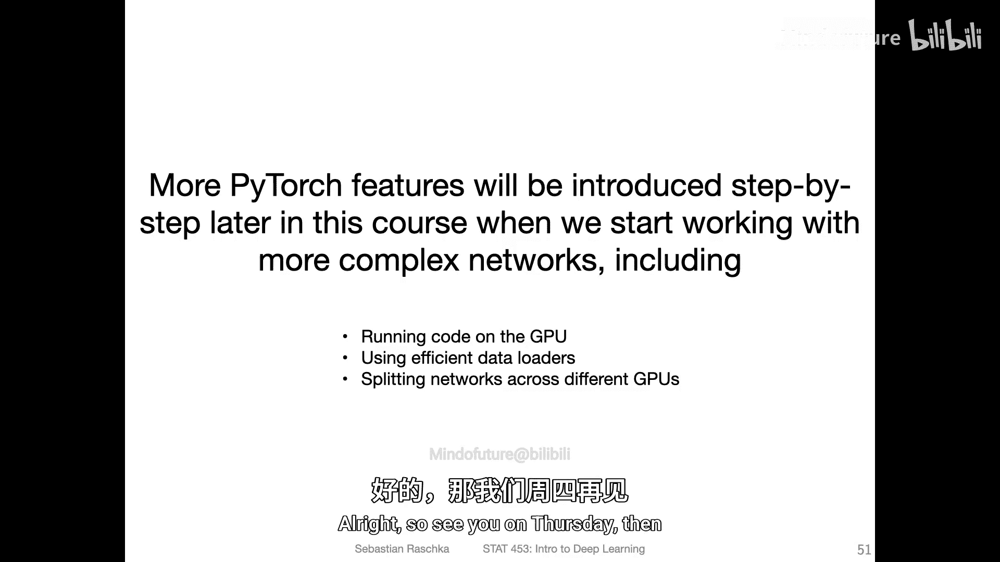

记住，你不需要死记硬背所有代码，关键是理解其背后的原理。PyTorch的这套设计模式将贯穿我们后续所有的复杂网络构建。随着课程的深入，我们会在需要时逐步引入PyTorch的更多高级特性。