# 048：GPU资源与Google Colab使用指南 🚀

在本节课中，我们将学习如何利用免费的云端GPU资源来加速深度学习模型的训练。这对于完成课后作业和课程项目非常有帮助。我们将重点介绍Google Colab这一工具，并演示如何在其环境中设置和使用GPU。

---

## 概述

在深度学习中，训练复杂的神经网络通常需要大量的计算资源，尤其是GPU。对于学生和初学者来说，获取这些资源可能是一个挑战。幸运的是，有一些免费的云端服务提供了GPU支持，其中最受欢迎的是Google Colab和Kaggle Kernels。本节我们将详细介绍如何使用Google Colab来运行深度学习代码，并利用其GPU加速功能。

---

## 云端GPU资源介绍

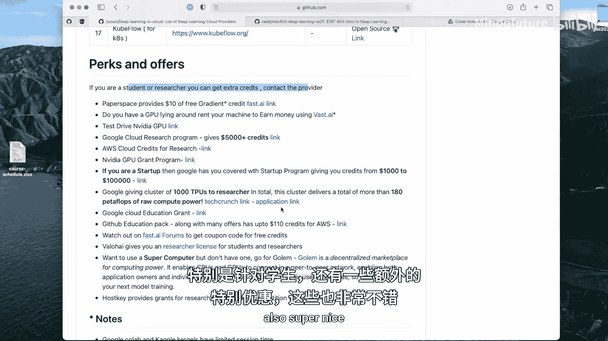

上一节我们介绍了深度学习对计算资源的需求，本节中我们来看看有哪些免费的云端GPU资源可供使用。

我发现了一个非常棒的GitHub仓库，名为“Deep learning in the cloud”。我会分享链接给你们。贡献者和维护者在这里整理了一份详尽的列表，列出了所有可用于在云端训练深度神经网络的不同工具。它们中的大多数都支持GPU，因为这是主要目的。这些工具主要提供云端GPU服务。

当然，并非所有服务都是免费的。但这里列出的是最受欢迎的选项。据我所知，大多数人在使用免费云端GPU时，会选择Google Colab或Kaggle Kernels。两者都是免费的，但在运行时间上存在一些限制。例如，你只能使用一个GPU，并且每12小时会重置一次。尽管如此，能够使用免费服务，尤其是对学生来说，仍然是一个很好的选择。

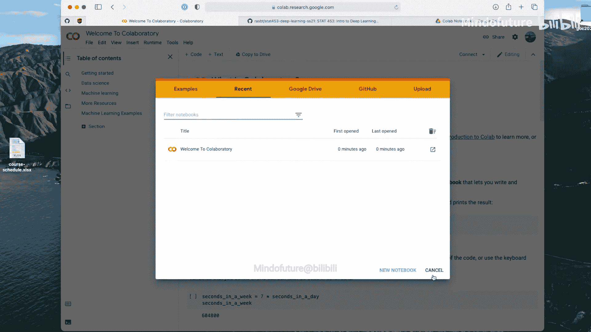

我们学校有CHTC高性能计算集群，但这需要更多的经验，可能更适合未来的研究项目。如果你还没有Linux经验，除了课程内容外，这可能是一条陡峭的学习曲线。

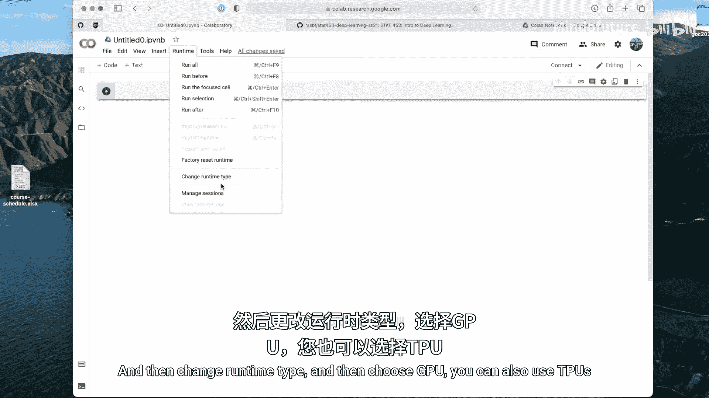

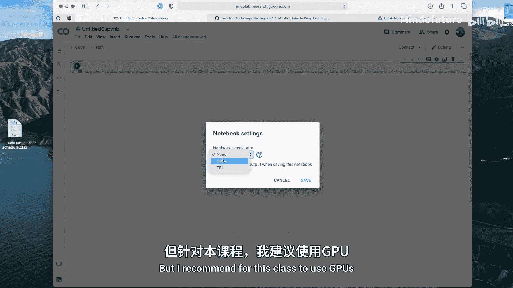

因此，对于初学者来说，这些云端服务更加友好。

以下是该仓库列出的一些选项：
*   一些服务提供固定的3小时使用时间。
*   另一些则提供启动积分，例如300美元的信用额度。
*   对于学生，还有一些额外的特别优惠，也非常不错。

---

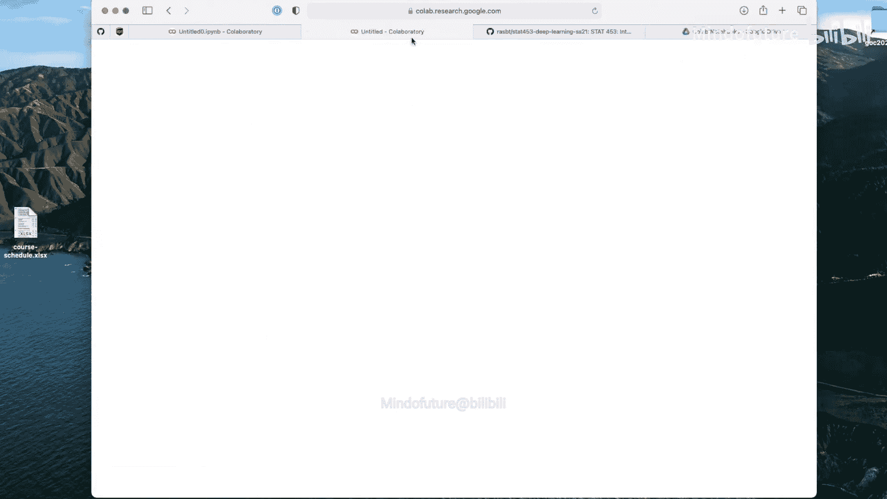

## Google Colab 入门指南

为了简化操作，我将引导你了解如何使用Google Colab进行项目。

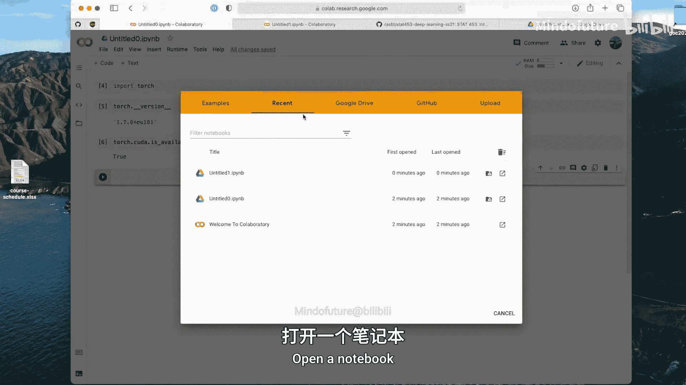

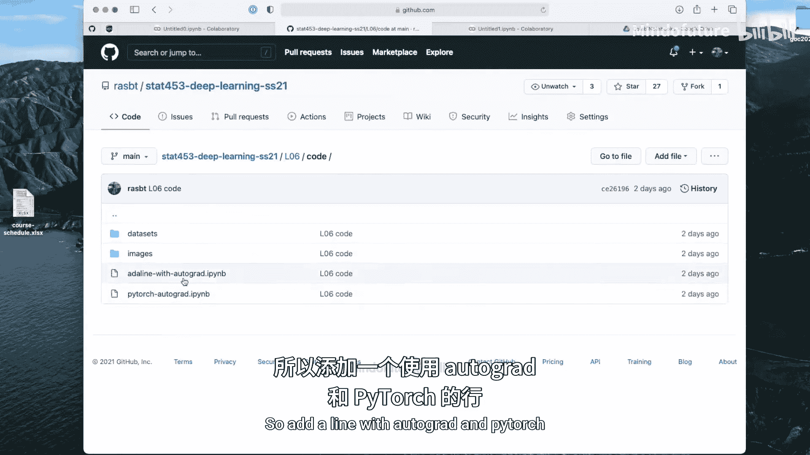

点击链接后，它会打开一个新的笔记本环境。请注意，这是一个笔记本环境，它易于使用，并且你可以在其中直接查看结果。但随着代码变得复杂，有时拥有一个可以运行Python脚本的云环境也会很方便。你可以探索列表，看看哪种环境最适合你。最终，选择哪种环境用于你的课程项目完全取决于你自己，没有强制要求。

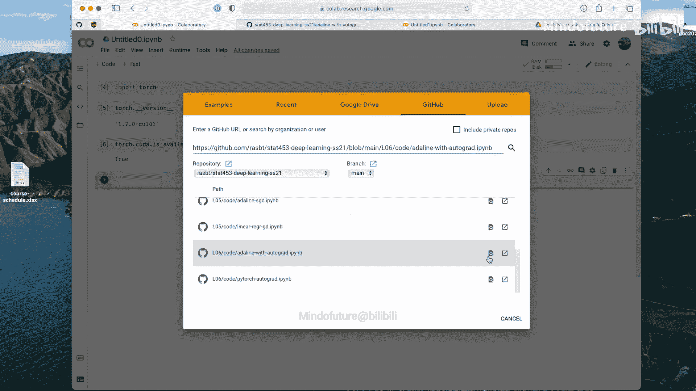

因为Google Colab相对友好，我将重点介绍它。

一个重要的步骤是，如果你想使用GPU，必须选择它。为此，你需要转到“运行时”菜单，然后选择“更改运行时类型”，接着选择“GPU”。你也可以使用TPU，但我推荐在本课程中使用GPU。

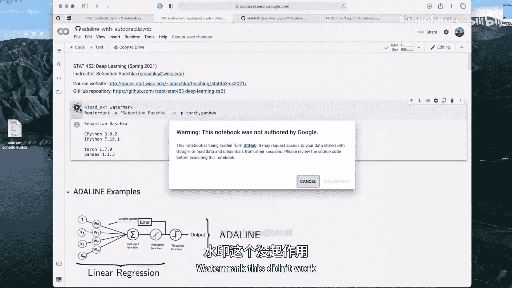

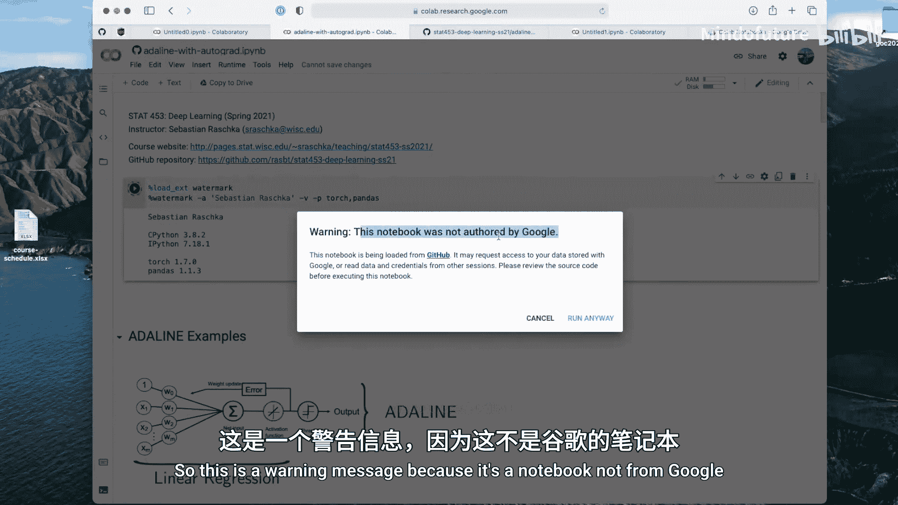

设置完成后，我们可以检查PyTorch是否可用。输入以下代码：
```python
import torch
print(torch.__version__)
```
这会显示PyTorch的版本，例如1.7，这是一个较新的版本，很好。另外，这行输出中的“cu101”表明它支持CUDA 10.1。

为了确认GPU确实被识别，我们可以运行：
```python
print(torch.cuda.is_available())
```
如果GPU可用，这将返回`True`。如果返回`False`，请确保你已按照上述步骤选中了GPU。

---

## 在Colab中打开和运行笔记本

现在，我们可以打开笔记本。你可以直接从GitHub打开笔记本。例如，你可以访问我们的课程代码仓库，选择我们上周二讲过的内容，比如关于自动求导和PyTorch的笔记本。

打开后，我可以直接在这里获得链接，这非常方便。然后，我可以选择运行时为GPU，并运行代码。

但有时会遇到问题。例如，我们可能会看到一个警告信息，提示“Module watermark has not been found”。这是因为Google Colab预装了一些Python包，但当然不会预装所有可能的包。有些包需要我们自行安装。

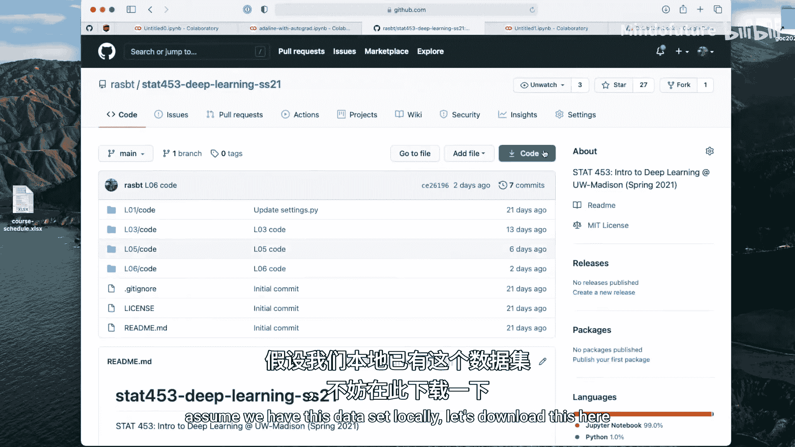

这并不复杂。我们可以使用感叹号`!`来执行终端命令。例如，运行：
```python
!pip install watermark
```
它就会安装这个包。安装成功后，之前的代码就能正常运行了。这是安装Google Colab中未预装包的一般方法。

---

## 处理数据文件

继续运行时，我们可能会遇到另一个问题：加载数据集失败。这是因为我们虽然打开了笔记本，但没有加载数据文件。

如果数据集是一个CSV文件，并且托管在GitHub上，我们可以直接使用pandas通过URL加载它。例如：
```python
import pandas as pd
url = ‘https://raw.githubusercontent.com/username/repo/main/datasets/iris.csv‘
df = pd.read_csv(url)
```
这通常有效。

但在实践中，考虑一种更普遍的情况：你的数据集不在GitHub上，而是在你的本地电脑上，并且可能不是CSV格式。你需要一个更通用的解决方案。

为此，你需要挂载你的Google Drive文件夹。这稍微复杂一些。我已经制作了一些幻灯片，会在录制完这个视频后分享给你们。

假设我们在本地有这个数据集。我下载它，然后打开我的Google Drive。我有一个名为“notebooks”的子文件夹。首先，我需要保存这个笔记本的副本到我的Google Drive，因为直接从GitHub打开的笔记本不允许覆盖。

保存副本后，我就可以在我的Colab文件列表中看到它。你也可以直接将电脑上的代码文件拖放到Google Drive中，然后右键点击，选择“使用Google Colab打开”。

现在，假设我有一个数据集文件夹在我的硬盘上。我可以把它也拖放到Google Drive中，放在我的笔记本旁边。

理论上，我们现在应该可以加载数据了，因为数据集相对于笔记本位于`../datasets/`文件夹中。但在实践中，你仍然可能会遇到“文件未找到”的错误。这是因为我们需要将Google Drive挂载到这个笔记本中。

如何挂载呢？我们可以运行以下代码：
```python
from google.colab import drive
drive.mount(‘/content/drive‘)
```
然后，它会要求你输入一个授权码。点击提供的链接，复制授权码并粘贴回来。完成授权后，Drive就被挂载了。

挂载后，你需要提供数据文件在Google Drive中的具体路径。路径通常类似于`/content/drive/MyDrive/Colab Notebooks/datasets/`。这样，代码就能找到文件了。

虽然看起来有点复杂，但技术上并不难。我展示了很多不成功的步骤是为了逐步演示。实际上，你可以把这些挂载代码留在你的笔记本里，以后的项目可以复制粘贴使用。

---

## 优化数据加载速度

这里还有一个小建议需要补充。目前有两台计算机（或服务）参与：一个是存储你数据的Google Drive，另一个是运行这个笔记本的Google计算机实例。它们之间的通信通过网络进行，可能会有点慢。

为了在处理更复杂的数据集时加快速度，最好将数据复制到运行笔记本的同一台计算机上。例如，你可以使用以下命令：
```python
!cp -r /content/drive/MyDrive/Colab\ Notebooks/datasets /content/
```
这样就把数据从Google Drive复制到了本地目录`/content/datasets`。如果你使用PyTorch的DataLoader，当数据位于本地时，训练速度会更快。

更进一步，我建议如果你有更复杂的数据集，可以制作一个ZIP文件。例如，压缩你的`datasets`文件夹，得到一个`datasets.zip`文件，然后将其拖放到Colab的文件列表中。

接着，复制这个ZIP文件到本地，并解压：
```python
!cp /content/drive/MyDrive/Colab\ Notebooks/datasets.zip /content/
!unzip /content/datasets.zip -d /content/
```
对于像Iris这样简单的数据集，这可能是杀鸡用牛刀。但以后我们会处理像MNIST这样的大型图像数据集，包含5万张图片。相比上传5万个单独的小文件，上传并解压一个单独的ZIP文件要快得多。因此，这是使用Google Colab时推荐的方法。

---

## 在代码中使用GPU

好了，这就是如何使用GPU。实际上，我们在这个笔记本中还没有使用GPU。为了快速演示，如果你想使用GPU，需要做一个额外的步骤。

你需要将模型和数据转移到GPU上。首先，定义设备：
```python
device = torch.device(‘cuda:0‘ if torch.cuda.is_available() else ‘cpu‘)
```
`cuda:0`代表第一个GPU。如果有多块GPU，`cuda:1`代表第二块，依此类推。由于Colab通常只提供一块GPU，所以我们用索引0。

然后，将模型转移到该设备：
```python
model.to(device)
```
对于数据，也需要进行同样的转移。例如，对于张量：
```python
data = data.to(device)
```
如果你的模型在GPU上，它也会期望数据在GPU上。在后续的代码示例中，我会设置一个标志，让你只需在脚本顶部指定一次设备，然后它会自动在所有需要的地方更新，以使用正确的设备。

---

## 总结

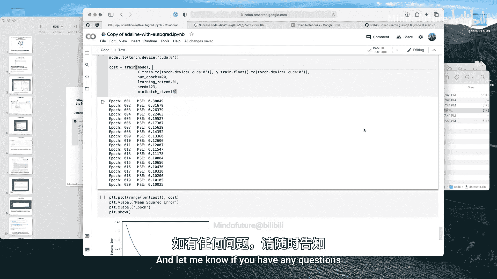

在本节课中，我们一起学习了如何利用免费的云端GPU资源，特别是Google Colab，来加速深度学习训练。我们介绍了如何设置Colab环境以使用GPU，如何安装额外的Python包，如何处理本地和云端的数据文件，以及如何在PyTorch代码中指定设备以利用GPU进行计算。这些技能将帮助你在资源有限的情况下，更高效地完成深度学习项目和作业。