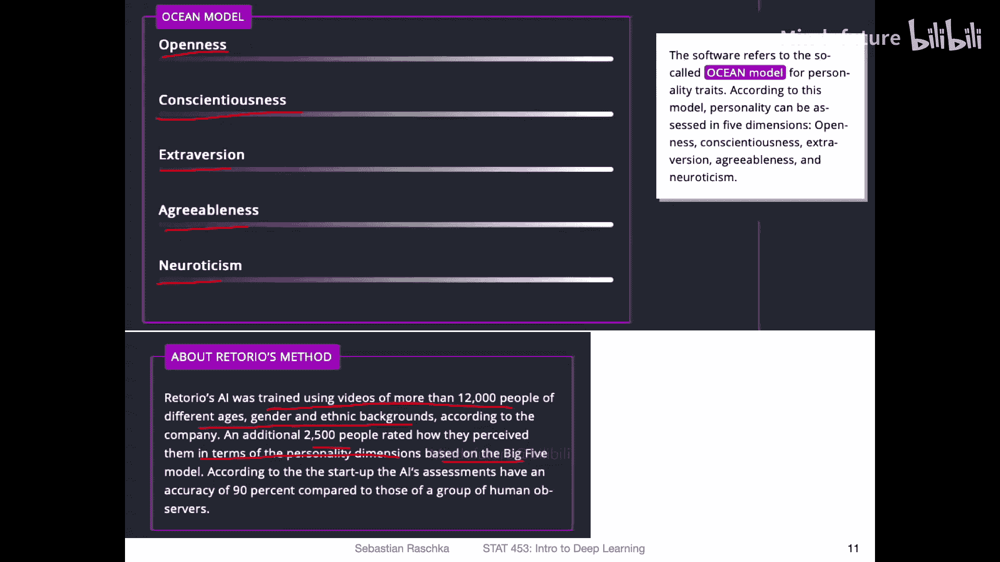
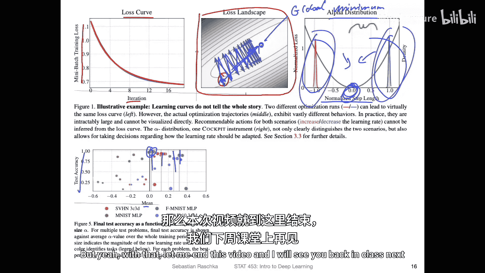

# 049：深度学习新闻（2021年2月20日）

在本节课中，我们将回顾2021年2月深度学习领域的一些重要新闻和进展。内容涵盖新的工具库、数据集、模型训练成本、环境问题、伦理挑战以及调试工具。

---

## 🧠 自由连接神经网络

上一节我们介绍了课程进度，本节中我们来看看一个有趣的新工具。本周出现了一个名为“自由连接神经网络”的PyTorch扩展库。该库用于创建可在CUDA GPU上运行的、经过优化的自由连接神经网络。

在标准的多层感知机或全连接层中，一层的每个单元都与下一层的所有单元相连。而自由连接网络允许我们任意地连接这些节点。例如，一个输入层单元可能只连接到后续隐藏层中的某一个特定单元，而不是所有单元。

**代码示例：一个简单的全连接层**
```python
import torch.nn as nn
# 标准全连接层
fc_layer = nn.Linear(in_features=10, out_features=20)
```

这种架构在卷积网络、残差连接和Transformer中也有类似思想，但自由连接网络的设计更为任意。这个工具为想要进行非常规架构实验的研究者提供了便利。

那么，这种网络有什么用呢？例如，一篇名为《探索用于图像识别的随机连接神经网络》的论文就使用了类似思想。研究人员提出了一种随机连接神经网络（可能包含卷积层）的方法，他们使用进化算法来优化这些随机连接。研究发现，这种看似任意的架构在ImageNet数据集上的表现甚至优于当时基于ResNet的架构。虽然这个想法很有前景，但由于实现复杂、计算成本高且可解释性差，此后并未广泛流行。不过，借助这个新工具，探索此类网络可能会变得更容易。

---

## 🖼️ 新的计算机视觉数据集

从新的网络架构转向新的数据，本周还发布了一个新的计算机视觉数据集。该数据集包含了来自565个类别的150万张图像。

这个数据集的独特之处在于，它专注于对人类重要的物体类别。研究人员旨在收集与人类生活密切相关的图像。该论文即将发表，并且提供了在数据上预训练的卷积网络代码示例以及数据加载方式。

以下是该数据集的一些关键特点：
*   **类别示例**：包括男人、房屋、汽车、女人、电话、床等。
*   **数据分布**：约60%的物体是人造的，40%是自然的。同时，每个类别的图像数量并不相同，因此这是一个不平衡的数据集。
*   **图像规格**：图像具有不同的宽高比和分辨率，在使用时需要统一处理。

接下来，我们看看他们是如何收集这个数据集的。方法非常系统：
1.  **筛选标签**：他们从大型文本语料库中筛选出高频出现的名词，作为“重要”类别的代理指标。
2.  **具体性评分**：他们引入了一个“具体性”评分。研究人员让人类评估者在一个1到5的尺度上，评价一个名词所代表的概念有多容易被视觉化。例如，“草莓”得分很高，而“希望”得分较低。他们以此过滤出非常具体的物体名词。
3.  **处理类别**：他们选取了基于频率和具体性排名前3500的单词，确保是基本层级类别（而非从属类别），并合并了同义词（如“汽车”和“ automobile”）。
4.  **下载图像**：从ImageNet、Flickr和Bing下载对应类别的图像。
5.  **数据清洗**：使用主成分分析（PCA）进行去重。他们还手动检查了每个类别的100张随机图像，如果错误标注超过4%（即4张），则清理整个类别。
6.  **最终整合**：合并来自不同来源的图像，再次去重，并修剪数据集，使每个类别的图像数量大致在7到5000张之间。

最终，数据集中94%的图像来自ImageNet，5%来自Bing，1%来自Flickr。这为测试模型提供了一个有趣的新基准。

---

## 💸 大规模模型的训练成本

从大规模数据集，我们自然过渡到训练这些数据的大规模模型。当前一个普遍的讨论是，AI或深度学习模型的训练成本正变得越来越高昂。

有一篇文章题为《不断扩大的十亿美元AI问题》。虽然尚未出现训练成本高达10亿美元的模型，但训练大型模型轻松耗资数百万美元已很常见。例如，英伟达的Megatron模型在一个名为“Selene”的系统上训练，该系统由280台DGX A100组成。仅硬件采购成本就可能高达7500万美元。如果在亚马逊AWS上租用等量计算资源三年，成本也接近8000万美元（不含电费）。

这个模型使用了约3000块GPU，参数量达到2000亿。随着模型规模增长，并行计算技术变得至关重要。主要有两种技术：
*   **数据并行**：将大批量数据拆分到多个GPU上，每个GPU计算梯度，然后对所有梯度进行平均来更新模型。但当GPU数量过多时，会面临收益递减的问题。
*   **张量并行**：将矩阵乘法等计算高效地分布到不同GPU上。但这更具挑战性，因为它需要GPU之间通过InfiniBand等高速连接进行通信，并非简单的堆砌硬件。

高昂的训练成本也引发了环境友好性的担忧。

---

## 🌱 联邦学习与环境影响

谈到环境问题，一项最新研究表明，联邦学习可能有助于减少碳排放。

**什么是联邦学习？** 联邦学习意味着在多个设备（如手机或不同数据中心）上进行计算，然后汇总结果。一个早期的例子是“Folding@home”项目，人们可以利用个人电脑或游戏机的闲置算力来帮助进行蛋白质折叠等科学研究。

研究发现，这种分布式计算方式可以降低碳排放。原因可能在于，分散的设备产生的热量较少，不需要像大型数据中心那样耗费巨资进行集中冷却。相比之下，数据中心每年消耗数太瓦时的能源，而一个美国家庭平均每年仅消耗1万千瓦时（1太瓦时=10亿千瓦时）。

然而，研究人员也指出了联邦学习的潜在问题：
*   **训练效率**：由于数据分布在各地，访问延迟可能导致训练时间延长。
*   **数据传输**：通过Wi-Fi等网络传输数据也会消耗能量。
*   **设备能效**：参与设备的计算效率可能不同。例如，虽然苹果M1芯片与顶级英特尔CPU性能相当，但能效更高。使用能效较低的设备进行联邦学习，整体效率可能反而下降。

尽管如此，关注深度学习的资源消耗和环境效益是一个重要的趋势。与此相关，一家名为“NeuReality”的初创公司正在开发专用于深度学习推理的芯片。据称，其芯片的“每美元性能”是竞争对手的15倍。这可能意味着芯片虽小、绝对算力未必最强，但在成本和能效方面具有优势。

---

## ⚖️ 人工智能的伦理挑战：招聘系统


接下来，我们转向一些关于AI伦理应用的新闻，这或许不是深度学习最美好的应用。本周有一则关于用AI系统在视频面试中给求职者打分的报道。

开发者的初衷可能是好的：希望减少人类面试官的主观偏见，并使评估过程更具可扩展性。然而，这类系统可能带来严重问题。


研究人员开发了一个AI，用于评估求职者。他们在来自不同年龄、性别和种族背景的12,000多人的视频上训练AI，并让另外2500人对视频中人物的性格维度（如开放性、尽责性、外向性、宜人性、神经质）进行评分。AI模型学习模仿人类的这些评分。

为了测试系统的稳定性，研究人员让演员进行模拟面试，保持语音和文本内容不变，但改变某些外在条件：
*   **实验一：是否戴眼镜**：一位女演员分别在不戴眼镜和戴眼镜的情况下进行面试。AI给出的评分显示，戴眼镜时，在开放性、尽责性、外向性、宜人性等方面的得分**更低**。
*   **实验二：背景是否有书架**：同一个人分别在有无书架背景的情况下进行面试。结果显示，有书架背景时，AI给出的各项性格得分**显著提高**。



这些结果表明，AI系统可能被一些与求职者能力无关的表面特征（如配饰或背景环境）所不当影响，这显然是不公平且有问题的。


那么，为什么会出现这种问题？一位评论者一针见血地指出：“人脸识别机器学习的根本问题在于，我们永远无法确切知道机器对图像中的哪种模式做出了反应。”深度学习模型常常像一个黑箱，我们很难确定它到底关注了图像的哪些部分。

如何缓解？也许可以通过数据增强来帮助，例如在训练时随机替换视频背景（就像Zoom的虚拟背景功能）。但这并不能解决所有问题。在开发此类影响人们生活的系统时，必须进行严格的测试，确保过滤掉这些不相关的偏见。


---

## 🔧 深度学习调试工具：Cockpit

最后，为了更深入地理解模型行为，我们介绍一个新的实用工具。本周还出现了一个名为“Cockpit”的PyTorch调试工具，它可以帮助我们观察深度神经网络的内部训练过程。

作者指出，工程师在训练深度模型时常常像是在“盲飞”。Cockpit提供了一系列“仪表盘”来洞察机器学习模型的内部状态，对于训练过程中的故障排查非常有用。

该工具的一个应用重点是学习率调优。通常，我们通过手动尝试不同的学习率来寻找最佳值。Cockpit通过可视化损失曲面和提供新的指标来辅助这个过程。

例如，他们引入了一个称为“归一化步长”的指标。理想情况下，优化步长应直接指向损失函数的最小值方向（对应指标值为0）。通过Cockpit，可以观察到：
*   如果学习率**太小**，步长指标会偏向负值区域，更新缓慢。
*   如果学习率**太大**，步长指标会偏向很大的正值，导致更新越过最优点（overshooting）。

有趣的是，他们在一些实验中发现，测试集上泛化性能最好的模型，其平均归一化步长略高于0。虽然这个工具的具体原理和论文表述可能有些复杂，但它为学习率调优提供了一个新的、可视化的视角，值得在未来尝试。

---

## 📚 总结



本节课中我们一起回顾了2021年2月深度学习领域的多项动态。我们了解了一个允许创建自由连接神经网络的新PyTorch工具，探讨了一个专注于人类相关类别的新图像数据集。我们也认识到训练超大模型的经济和环境成本正在急剧上升，并讨论了联邦学习作为一种潜在的节能途径及其挑战。通过一个AI招聘系统的案例，我们严肃地审视了深度学习应用中的伦理风险和偏见问题。最后，我们介绍了一个新的调试工具Cockpit，它有望帮助开发者更好地理解和优化训练过程。这些新闻涵盖了技术、数据、成本、环境和伦理等多个维度，展现了深度学习领域快速发展和面临的复杂挑战。