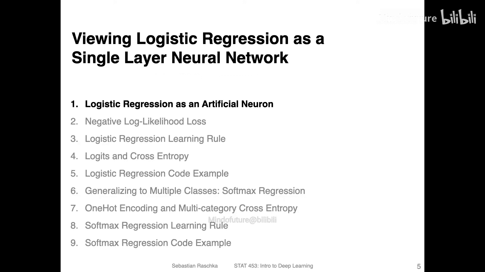
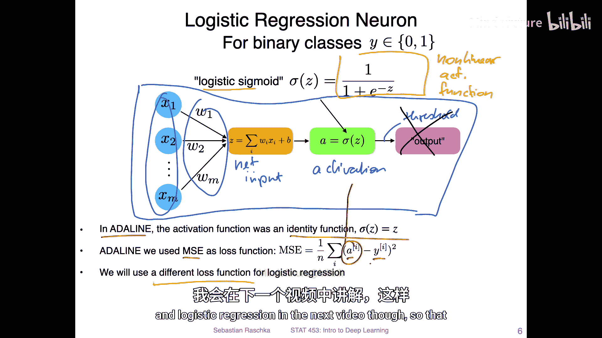
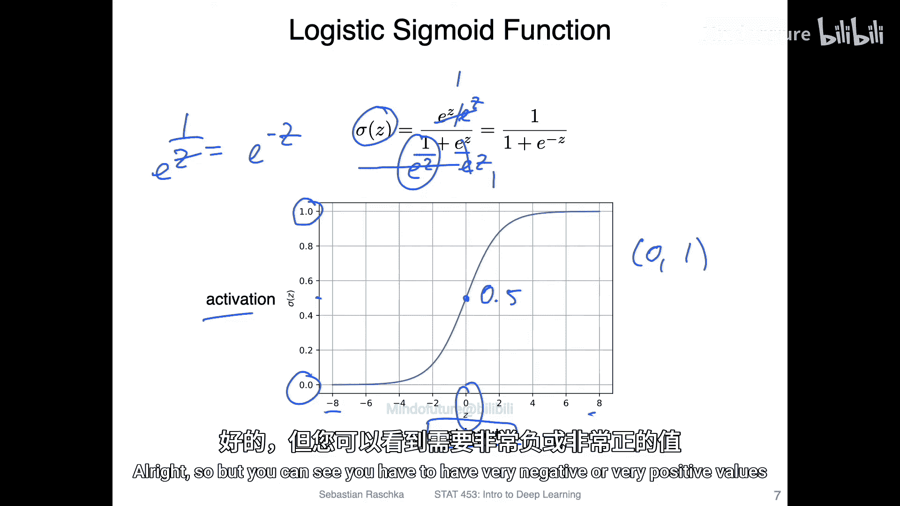
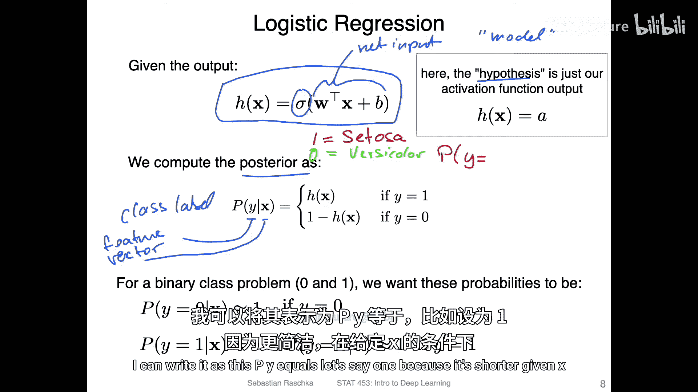
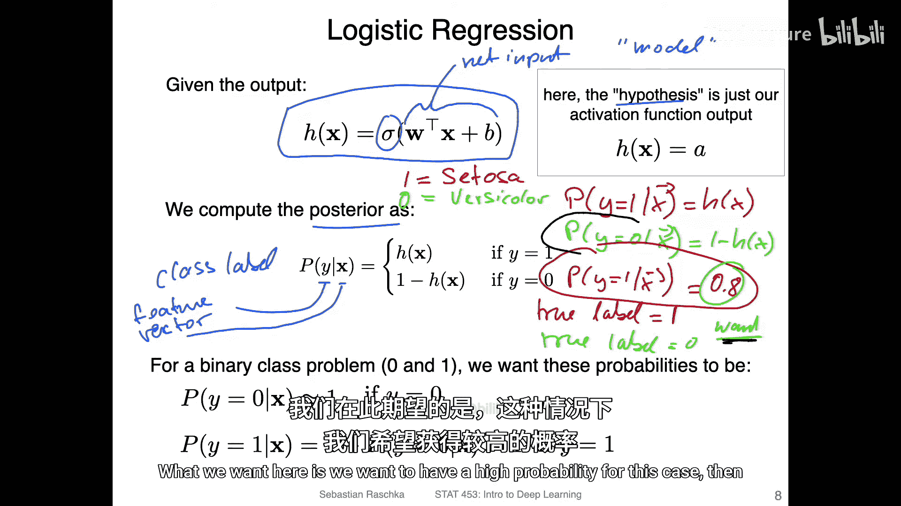
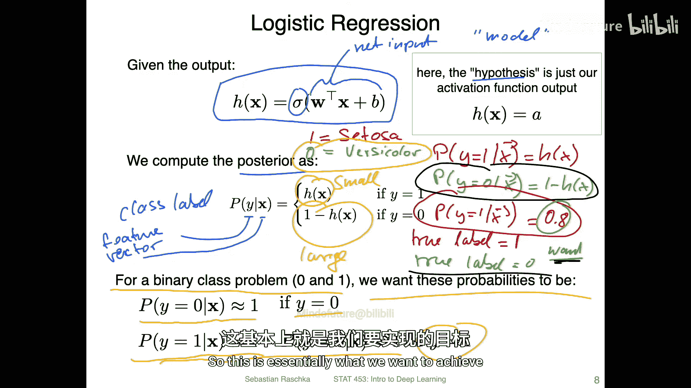

# 051：作为单层神经网络的逻辑回归 🧠

在本节课中，我们将学习逻辑回归，并将其视为一种单层神经网络。我们将探讨其与Adaline模型的区别，并介绍其核心的激活函数——逻辑S型函数。

---

让我们深入探讨逻辑回归，将其视为一个单层神经网络。

这就是为什么我之前在Adaline模型中如此强调恒等函数的原因。

观察上图，这是一个单层神经网络。我们有输入 **x**、权重 **W**，然后计算净输入。接着，净输入会通过一个激活函数，产生一个输出。在训练时，我们通常会忽略阈值函数，直接使用激活函数的输出。

在Adaline模型中，激活函数是恒等函数，即 `a = z`。我们使用均方误差作为损失函数，计算激活值 **a** 与真实类别标签 **y** 之间的差异。

逻辑回归与Adaline的主要区别在于两点：
1.  激活函数不同：逻辑回归使用逻辑S型函数，而非恒等函数。这是一个非线性激活函数。
2.  损失函数不同：逻辑回归使用不同的损失函数（将在下一节视频中介绍）。

---

上一节我们提到了逻辑回归使用逻辑S型函数，本节我们来看看这个函数的具体形式。

上图展示了逻辑S型函数。在深度学习中，通常使用右侧的形式。从左侧形式转换到右侧形式，只需分子分母同时除以 `e^z`。

观察函数图像，Y轴是激活值，X轴是输入到激活函数的净输入值 `z`。该函数以0为中心，当输入为0时，输出为0.5。函数值在0和1之间饱和，即当 `z` 趋近于正无穷时，输出趋近于1；当 `z` 趋近于负无穷时，输出趋近于0。

---

了解了激活函数后，我们来看看逻辑回归模型的整体表示。虽然损失函数将在下一节详细讲解，但理解模型输出至关重要。

逻辑回归模型可以总结为以下公式：
`h(x) = σ(z) = 1 / (1 + e^{-z})`
其中，`z = w^T x`（净输入）。

我们可以将整个模型 `h(x)` 视为计算后验概率 `P(y | x)` 的模型，即给定特征向量 **x** 时，类别标签 **y** 的概率。

让我们以鸢尾花数据集的二分类问题为例（例如，山鸢尾=1，杂色鸢尾=0）：
*   模型预测类别为1（山鸢尾）的概率为：`P(y=1 | x) = h(x)`
*   相应地，预测类别为0（杂色鸢尾）的概率为：`P(y=0 | x) = 1 - h(x)`

例如，如果模型对某个样本输出 `h(x) = 0.8`，则表示模型认为该样本有80%的概率属于山鸢尾，20%的概率属于杂色鸢尾。

---

上一节我们定义了模型的概率输出，本节我们明确模型训练的目标。

对于一个二分类问题（类别标签0和1），我们的目标是：**对于给定的真实标签，使其对应的预测概率尽可能接近1**。

以下是具体目标：
*   如果真实标签 `y = 1`，我们希望 `P(y=1 | x) = h(x)` 尽可能大（接近1）。
*   如果真实标签 `y = 0`，我们希望 `P(y=0 | x) = 1 - h(x)` 尽可能大（接近1）。

换句话说，我们希望模型对其预测正确的类别赋予高置信度（高概率）。下一节，我们将介绍如何通过设计损失函数来在训练中实现这一目标。

---

本节课中我们一起学习了：
1.  逻辑回归可以视为一个单层神经网络。
2.  它与Adaline模型的主要区别在于使用了**逻辑S型激活函数** `σ(z) = 1 / (1 + e^{-z})`。
3.  该函数的输出在0到1之间，可以被解释为属于某个类别的**概率**。
4.  模型的目标是，根据样本的真实标签，最大化其对应的正确类别的预测概率。

在下一节中，我们将学习逻辑回归的损失函数——对数损失（Log Loss），看看它是如何引导模型实现上述优化目标的。