# 052：逻辑回归损失函数 📉

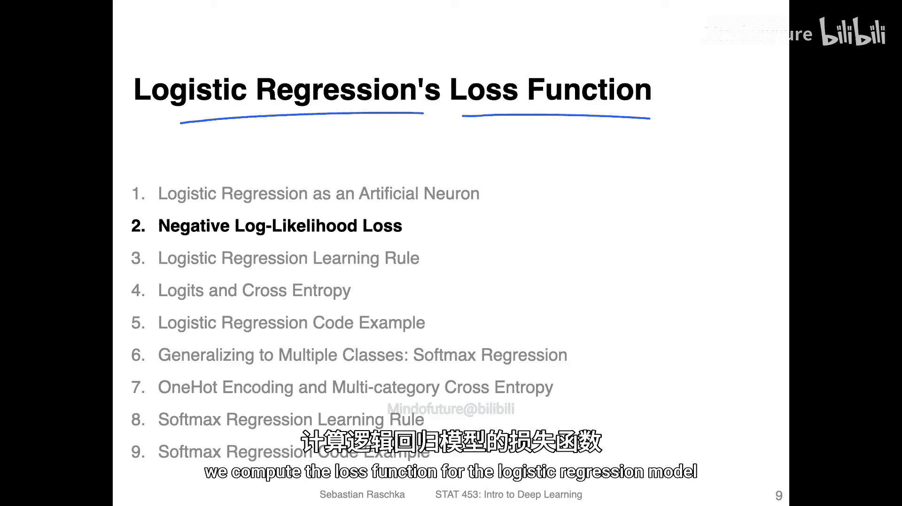

在本节课中，我们将学习如何计算逻辑回归模型的损失函数，即所谓的**负对数似然**。我们将从回顾上一节的核心概念开始，逐步理解损失函数的构成、计算方式及其在训练过程中的作用。

## 损失函数概述

上一节我们介绍了逻辑回归模型如何通过激活函数计算类别成员概率。本节中，我们来看看如何基于这些概率定义一个损失函数，以衡量模型预测的“好坏”，并指导模型参数的优化。

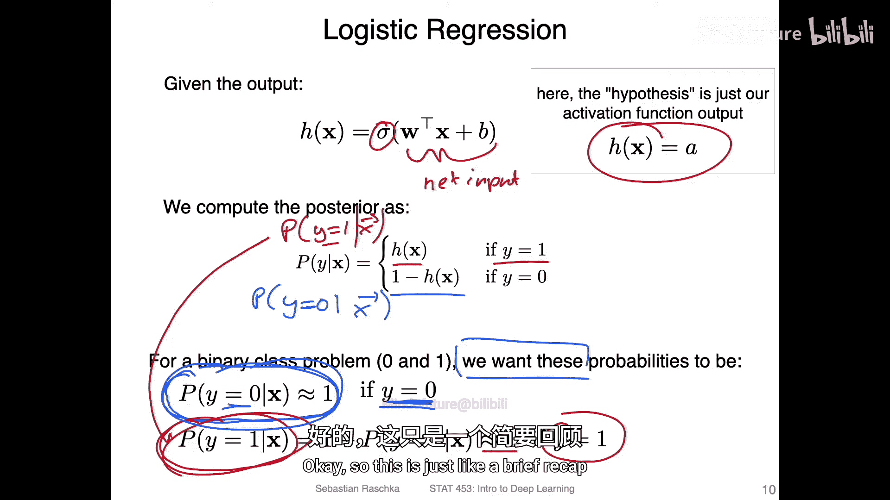

## 类别成员概率的计算与目标

逻辑回归模型的目标是最大化数据点被正确分类的概率。具体而言，对于给定的特征向量 **x**，我们希望：

*   如果真实标签 **y = 0**，则类别成员概率 **P(y=0 | x)** 应尽可能高（接近1）。
*   如果真实标签 **y = 1**，则类别成员概率 **P(y=1 | x)** 应尽可能高（接近1）。

类别成员概率通过逻辑Sigmoid激活函数计算得出：
*   **P(y=1 | x) = σ(z)**，其中 **z** 是净输入。
*   **P(y=0 | x) = 1 - σ(z)**。

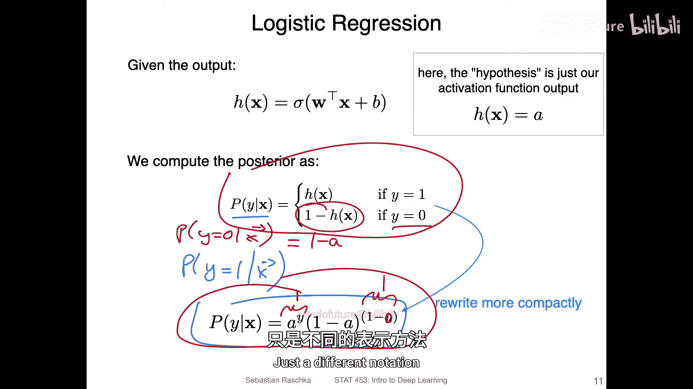

我们可以用一个更紧凑的公式来统一表示上述分段函数：

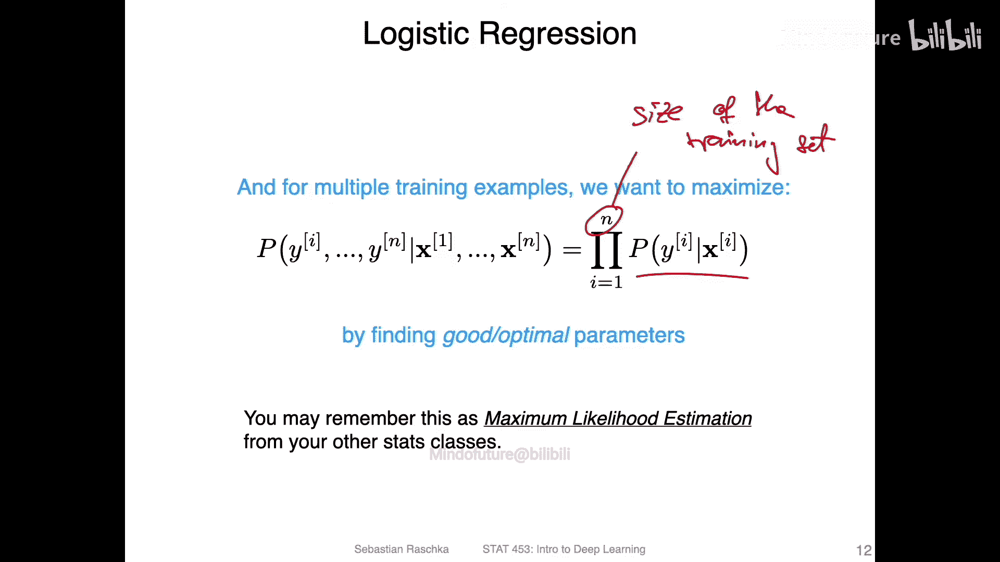

**P(y | x) = (σ(z))^y * (1 - σ(z))^(1-y)**

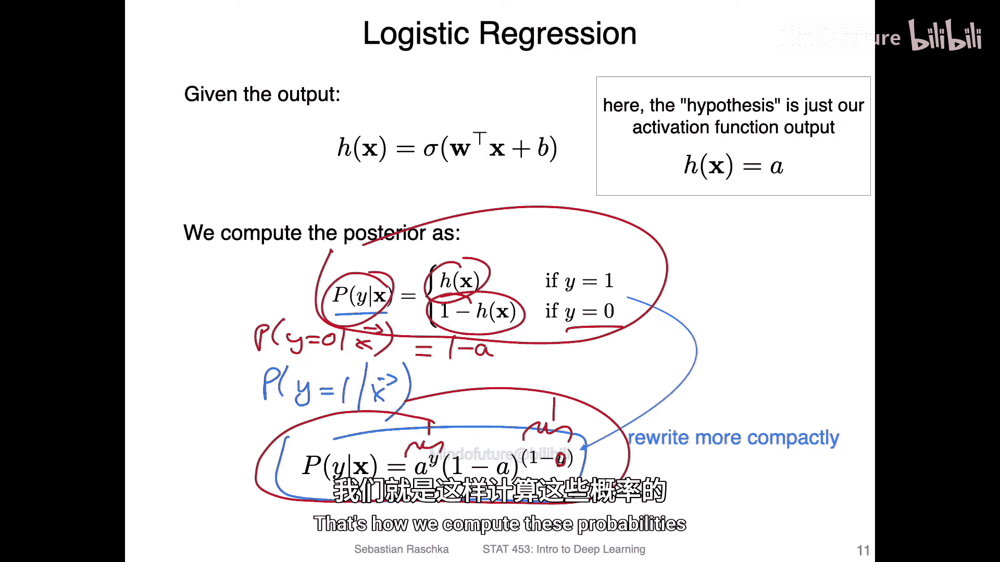

这里，**σ(z)** 是激活值，**y** 是真实标签（0或1）。通过代入验证可以发现，当 **y=1** 时，公式简化为 **σ(z)**；当 **y=0** 时，公式简化为 **1 - σ(z)**。这完美地概括了我们想要计算的概率。

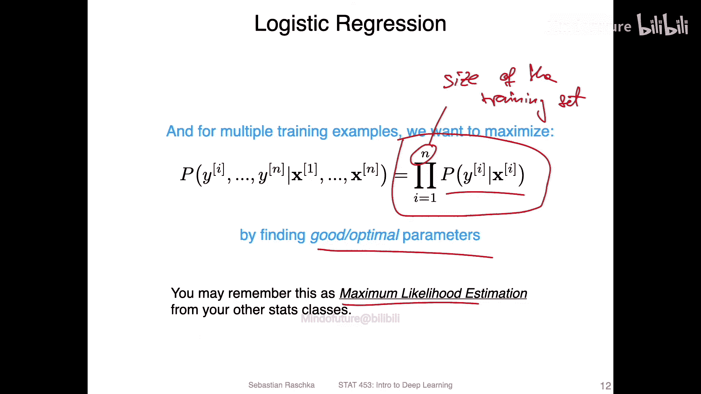

## 从最大化似然到最小化损失

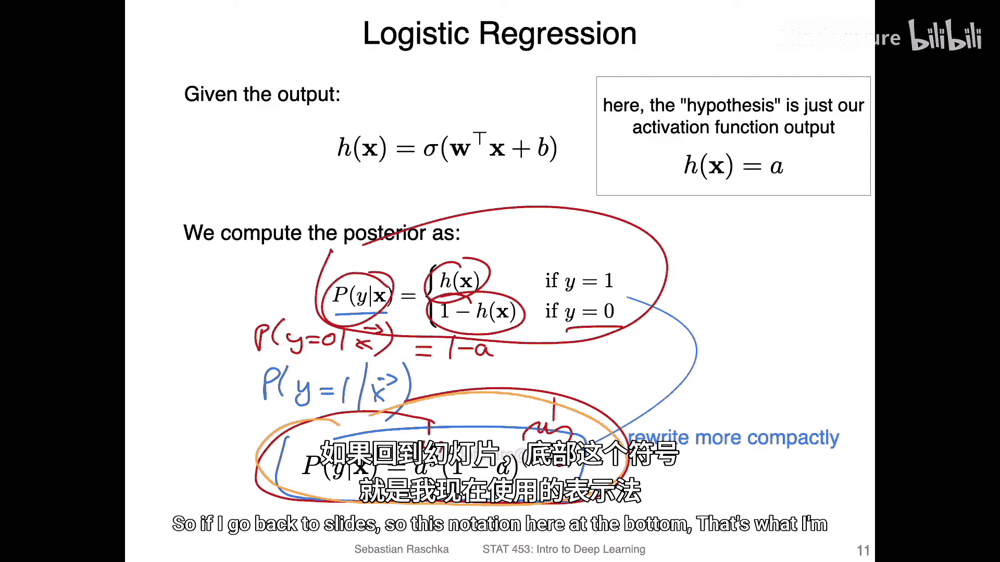

在拥有 **n** 个样本的训练集中，我们希望找到一组模型参数，使得所有样本的**联合条件概率**（即似然）最大。这被称为**最大似然估计**。

**L(θ) = ∏_{i=1}^{n} P(y^{(i)} | x^{(i)})**

然而，直接最大化这个连乘的似然函数在数值计算上并不稳定。通常，我们转而最大化其自然对数，即**对数似然**，它将连乘转换为求和，计算更稳定。

**log L(θ) = ∑_{i=1}^{n} [ y^{(i)} * log(σ(z^{(i)})) + (1 - y^{(i)}) * log(1 - σ(z^{(i)})) ]**

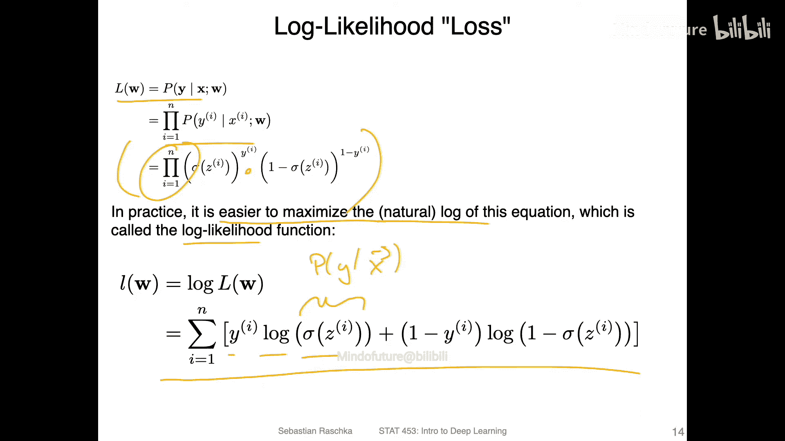

在深度学习的实践中，优化算法（如随机梯度下降）通常被设计为**最小化**一个损失函数。为了能够使用这些现成的工具，我们将最大化问题转化为最小化问题，即最小化**负对数似然**。

**J(θ) = - (1/n) * ∑_{i=1}^{n} [ y^{(i)} * log(σ(z^{(i)})) + (1 - y^{(i)}) * log(1 - σ(z^{(i)})) ]**

这里添加的 **1/n** 项是对整个训练集或小批量样本求平均，使得损失值对批量大小不敏感，训练过程更稳定。

## 与Adaline模型的对比

以下是逻辑回归与之前学习的Adaline模型在损失函数上的关键对比：

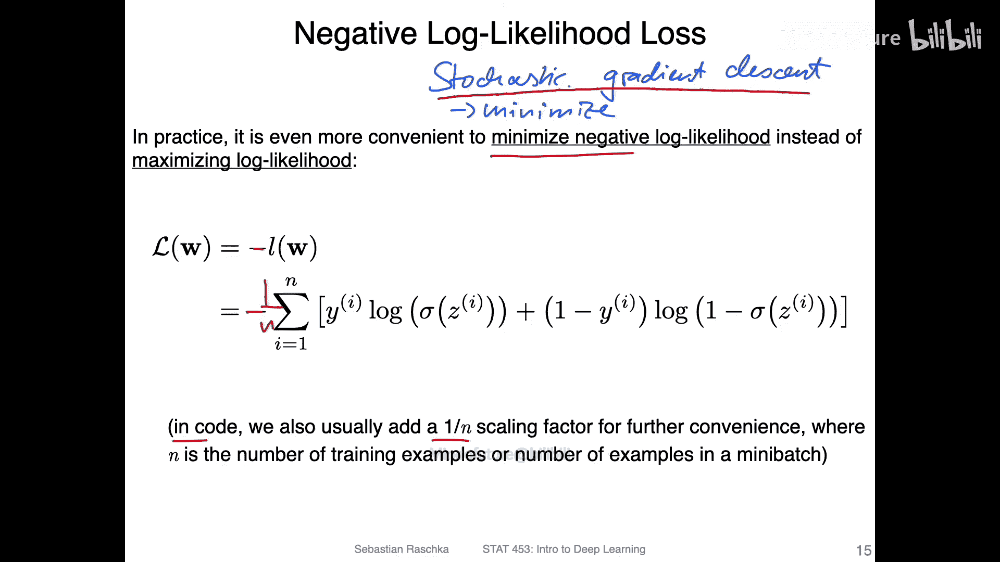

*   **Adaline**： 最小化**均方误差**。
*   **逻辑回归**： 最大化**似然**（实践中通过最小化**负对数似然**实现）。

两者的核心区别在于损失函数的选择。逻辑回归使用基于概率的负对数似然损失，这更适用于分类任务。

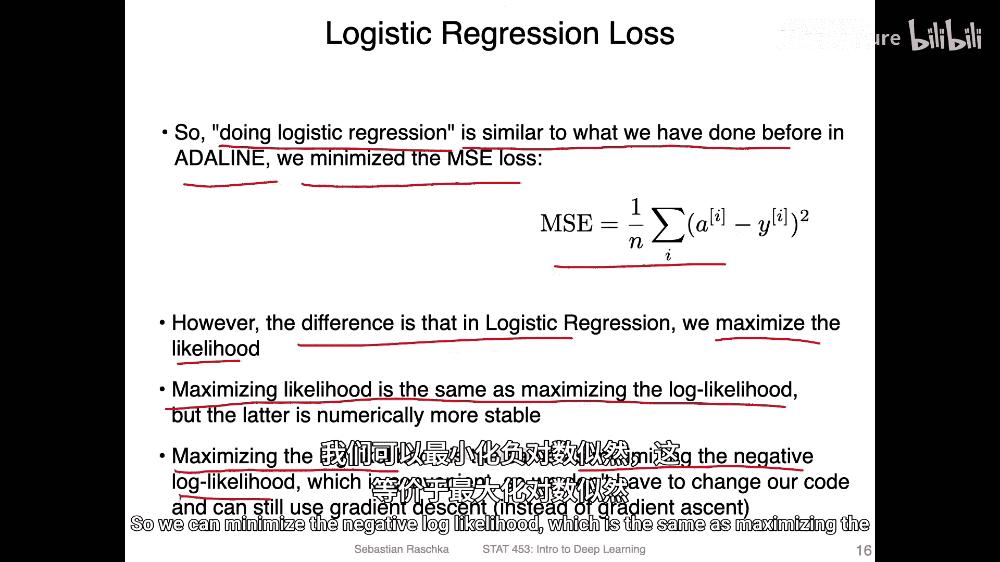

## 总结

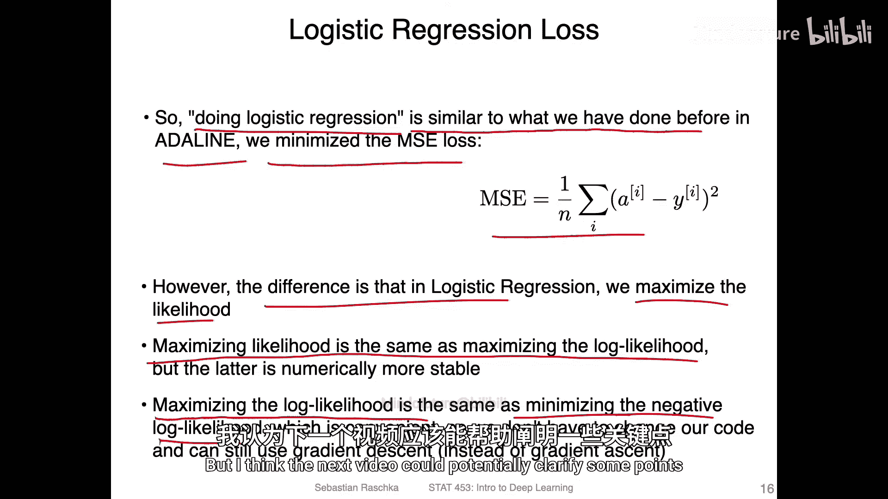

本节课中我们一起学习了逻辑回归的损失函数。我们首先明确了模型的目标是最大化正确分类的概率，然后推导出用于统一表示类别概率的紧凑公式。接着，我们解释了如何通过最大似然估计来优化模型参数，并出于数值稳定性和算法兼容性的考虑，最终将问题转化为最小化**负对数似然**函数。下一节，我们将更深入地探讨这个损失函数的形态及其训练过程，以帮助大家巩固理解。