# 053：逻辑回归损失导数与训练 🧠

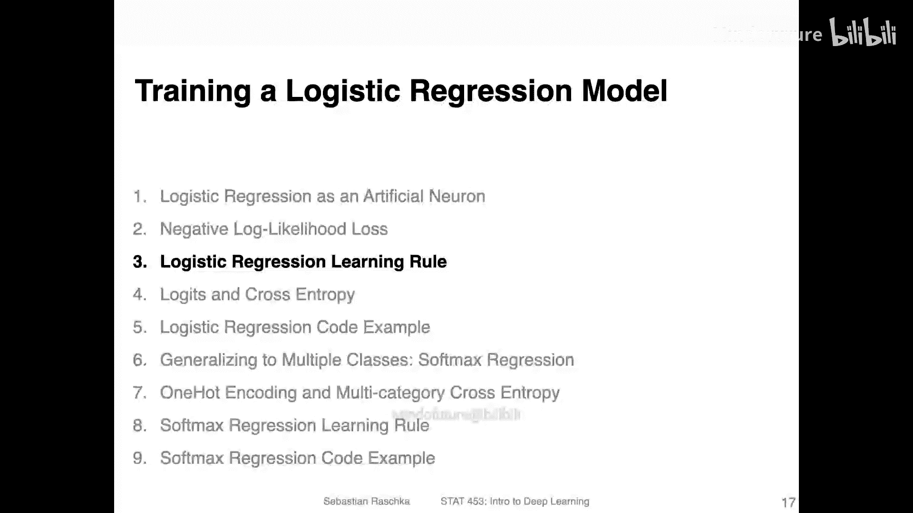

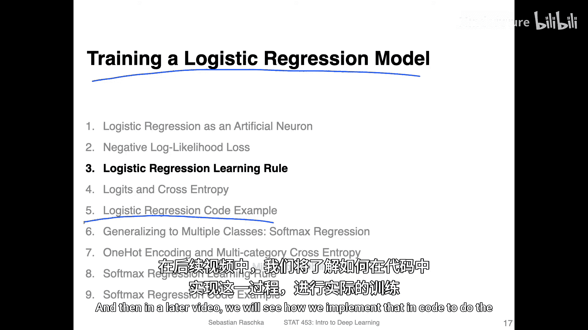

在本节课中，我们将学习如何训练逻辑回归模型。具体来说，我们将计算损失函数相对于模型权重和偏置参数的梯度，以便后续使用梯度下降法来更新模型。在后续的视频中，我们将看到如何在代码中实际实现这一训练过程。

## 逻辑Sigmoid函数及其导数 📈

上一节我们介绍了逻辑回归模型，本节中我们来看看其核心激活函数——逻辑Sigmoid函数的导数。

逻辑Sigmoid函数具有S形曲线。观察其形状可以发现，在两端区域函数相对平坦，因此梯度（即导数）应接近零；而在中间区域最陡峭，梯度应最大。

其导数计算相对简单，结果如下：

**公式：** `σ'(z) = σ(z) * (1 - σ(z))`

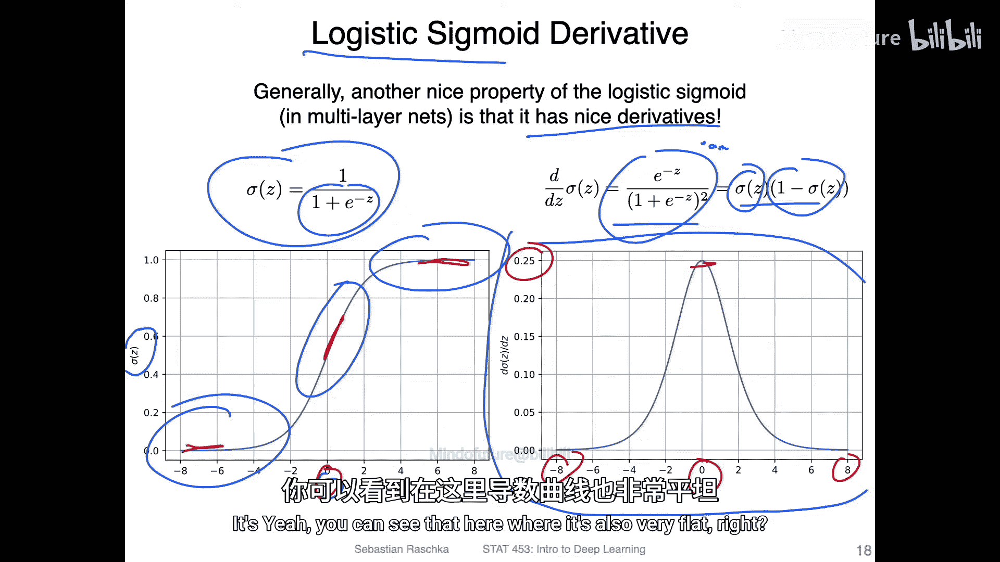

其中，`σ(z)` 是Sigmoid函数。这个导数形式简洁，是Sigmoid函数的一个优良特性。然而，当输入值非常大或非常小时，导数会趋近于零，这在多层神经网络中可能导致梯度消失问题，我们将在后续课程中讨论。

下图展示了Sigmoid函数（左）及其导数（右）的形状，直观地印证了上述分析。

## 负对数似然损失函数 📉

理解了激活函数的导数后，我们来看逻辑回归使用的损失函数——负对数似然损失。

该损失函数根据真实标签 `y` 的不同取值（0或1），有两种形式：

*   当真实标签 `y = 1` 时，损失为：`L = -log(a)`
*   当真实标签 `y = 0` 时，损失为：`-log(1 - a)`

这里，`a` 是模型预测样本属于类别1的概率，即 `a = σ(z)`。

损失函数的设计意图是：
*   如果真实标签是1，我们希望预测概率 `a` 尽可能高。此时，`a` 越高，损失 `-log(a)` 越低；`a` 越低，损失趋近于无穷大。
*   如果真实标签是0，我们希望预测概率 `a` 尽可能低（即 `1-a` 高）。此时，`a` 越低，损失 `-log(1-a)` 越低；`a` 越高，损失趋近于无穷大。

因此，该损失函数会对错误的预测施加巨大的惩罚，从而驱动模型学习正确的分类。

## 梯度计算与学习规则 🔄

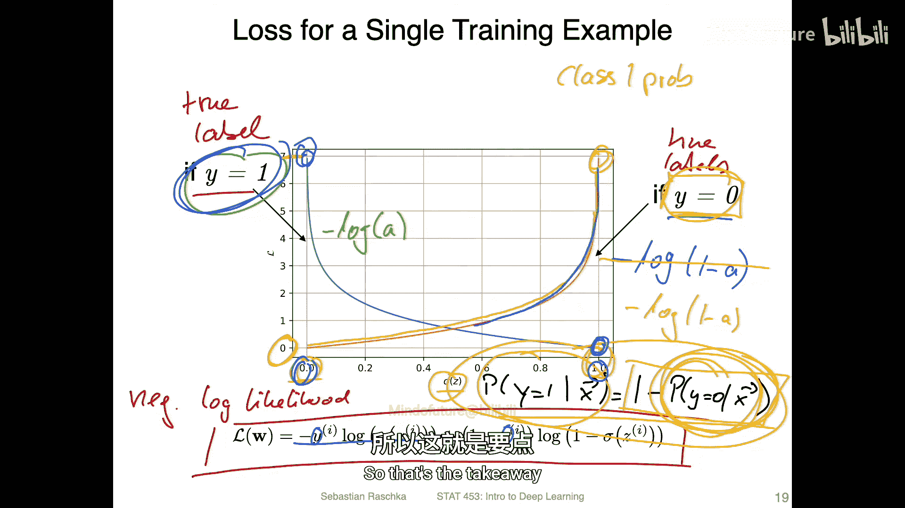

现在，我们来看如何通过梯度下降来更新逻辑回归模型的参数。其学习规则与之前介绍的Adaline（自适应线性神经元）和线性回归非常相似。

我们需要计算损失函数 `L` 对权重 `w_j` 的偏导数。根据链式法则，这可以分解为三项：
1.  损失 `L` 对激活输出 `a` 的导数。
2.  激活输出 `a` 对净输入 `z` 的导数（即Sigmoid函数的导数）。
3.  净输入 `z` 对权重 `w_j` 的导数（这就是输入特征 `x_j`）。

以下是具体的计算过程：

**公式：**
`∂L/∂w_j = (∂L/∂a) * (∂a/∂z) * (∂z/∂w_j) = (a - y) * x_j`

一个巧妙之处在于，经过数学推导，前两项 `(∂L/∂a) * (∂a/∂z)` 简化后恰好等于 `(a - y)`。因此，最终的梯度形式变得非常简单：

**核心梯度公式：** `∂L/∂w_j = (a - y) * x_j`

这与Adaline和线性回归的梯度形式完全一致！唯一的区别在于，这里的 `a` 是通过Sigmoid函数计算得到的概率值，而非净输入 `z` 本身。

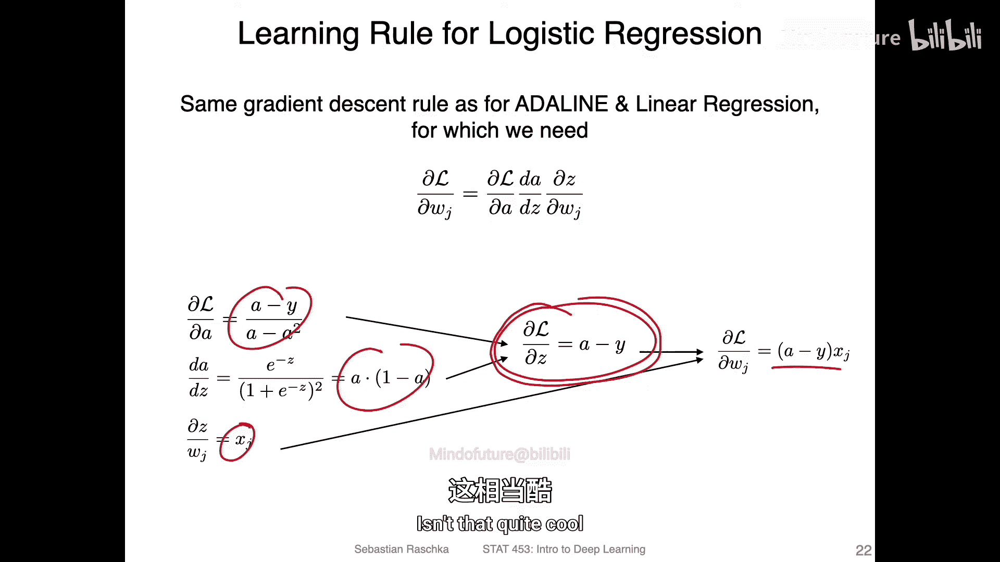

因此，我们可以直接套用之前学过的随机梯度下降学习规则：

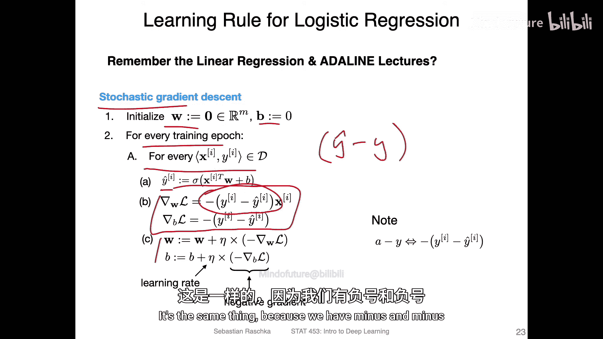

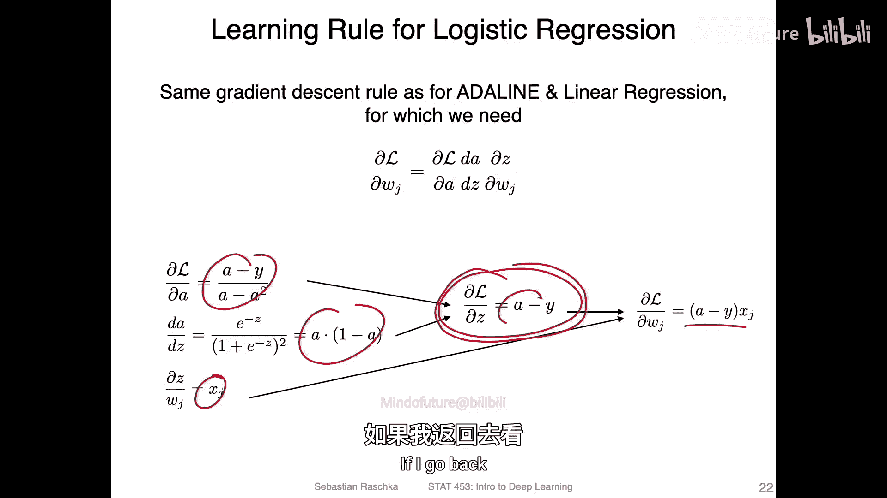

**代码：**
```python
# 随机梯度下降更新规则 (逻辑回归)
for epoch in range(n_epochs):
    for idx in training_set:
        # 计算净输入z和激活输出a (概率)
        z = np.dot(w, x[idx]) + b
        a = sigmoid(z)

        # 计算梯度
        gradient_w = (a - y[idx]) * x[idx]
        gradient_b = (a - y[idx])

        # 更新参数
        w = w - learning_rate * gradient_w
        b = b - learning_rate * gradient_b
```

## 模型预测与决策边界 ⚖️

训练完成后，我们如何使用模型进行预测？

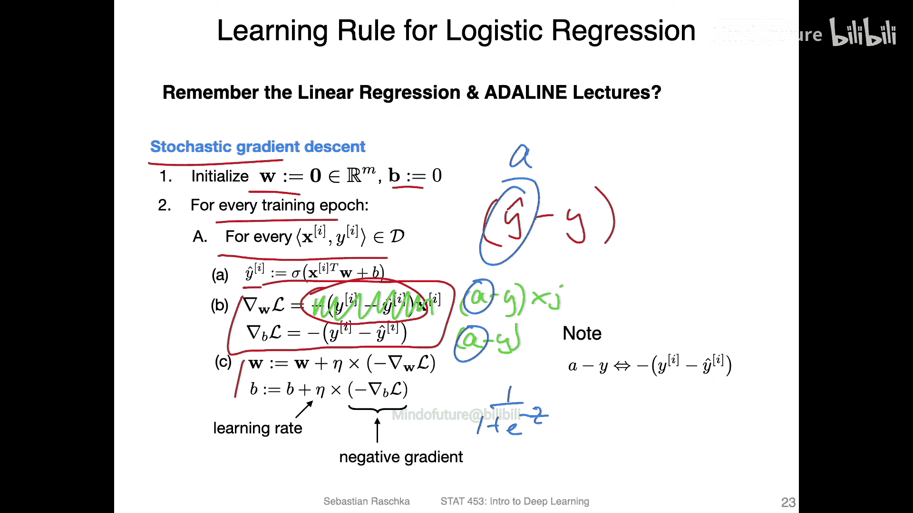

模型输出 `a` 是一个介于0和1之间的概率值。我们需要一个阈值函数将其转换为具体的类别标签（0或1）。通常，我们设定阈值为0.5：

**决策规则：**
*   如果 `a >= 0.5`，则预测为类别1 (`ŷ = 1`)。
*   如果 `a < 0.5`，则预测为类别0 (`ŷ = 0`)。

观察Sigmoid函数曲线可知，当净输入 `z = 0` 时，输出概率 `a = 0.5`。因此，上述决策规则等价于：
*   如果 `z >= 0`，则预测为类别1。
*   如果 `z < 0`，则预测为类别0。

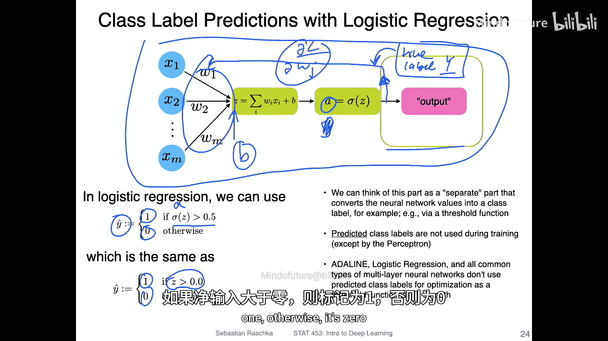

在代码实现中，后一种方式计算效率更高，因为我们有时可以跳过Sigmoid函数的计算。

## 总结与预告 📚

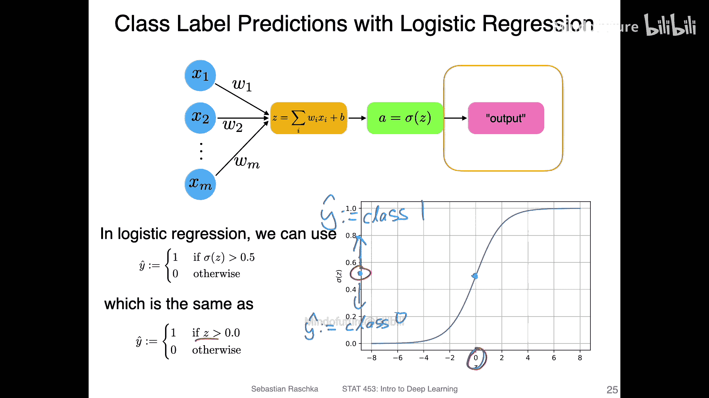

本节课中我们一起学习了：
1.  **逻辑Sigmoid函数的导数**：形式为 `σ'(z) = σ(z)(1-σ(z))`，并理解了其图像含义。
2.  **负对数似然损失函数**：了解了其针对不同真实标签的两种形式，以及它如何对错误预测施加严重惩罚。
3.  **逻辑回归的梯度计算**：通过链式法则推导出权重的梯度为 `(a - y) * x_j`，这与线性模型的形式一致，简化了实现。
4.  **模型预测**：学习了如何将模型输出的概率通过阈值（通常为0.5）转换为最终的类别预测。

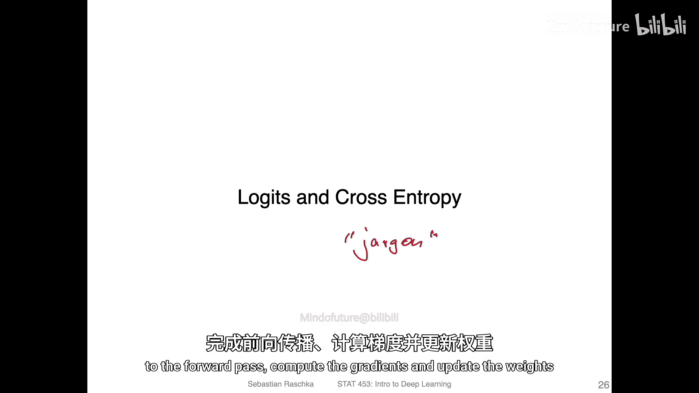

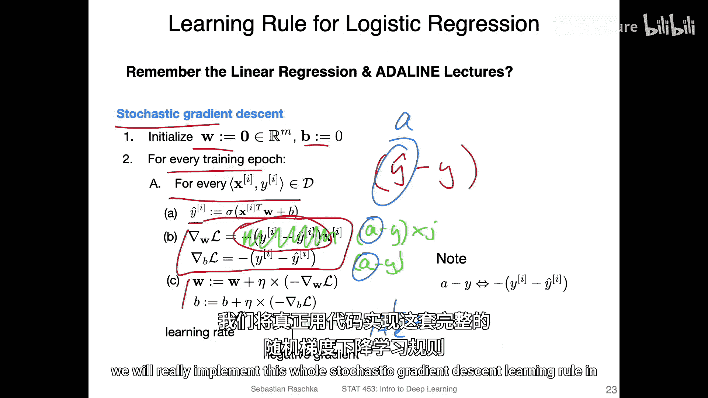

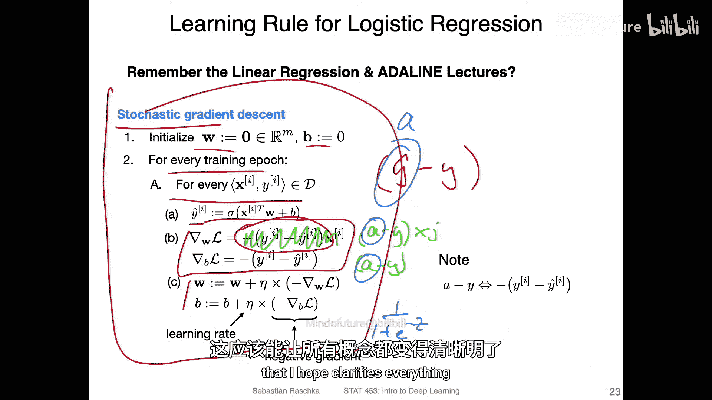

在接下来的课程中，我们将简要介绍“对数几率”和“交叉熵”这两个与逻辑回归相关的概念，并通过一个完整的代码示例，将前向传播、梯度计算和权重更新整合起来，实现逻辑回归模型的训练。这将帮助大家巩固对本节课所有概念的理解。