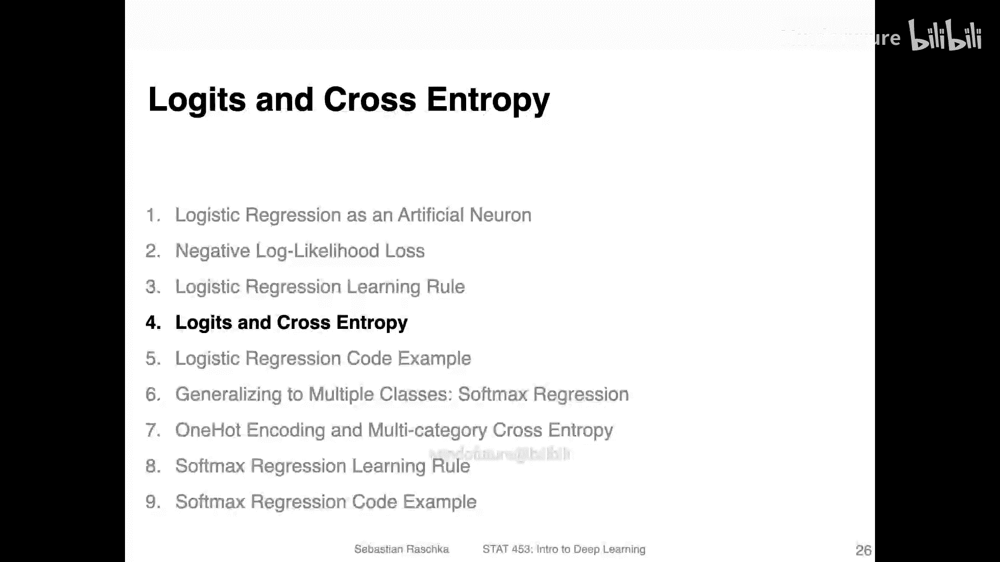
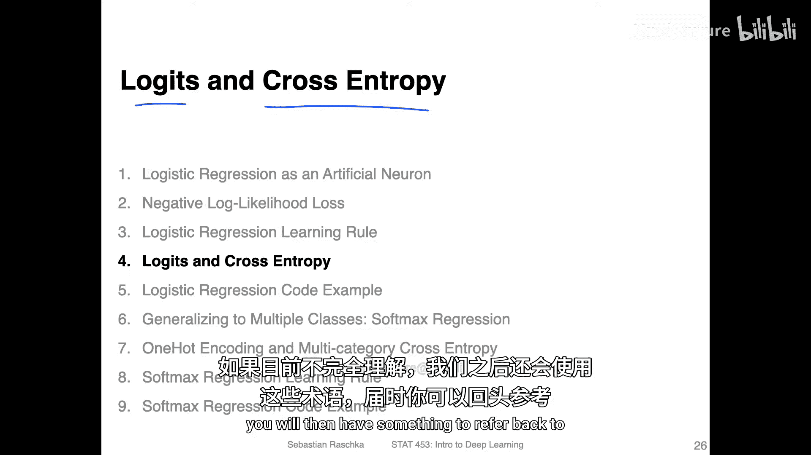
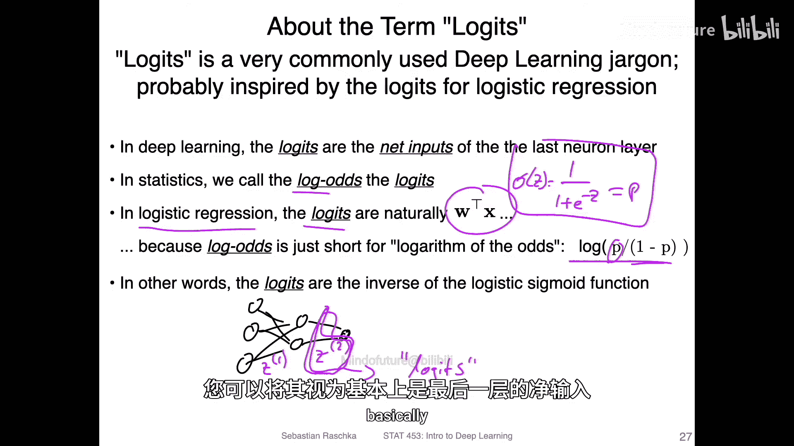
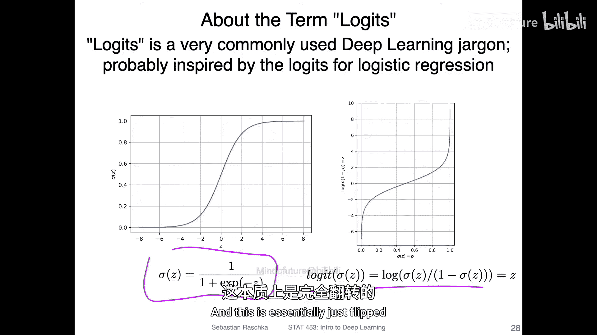
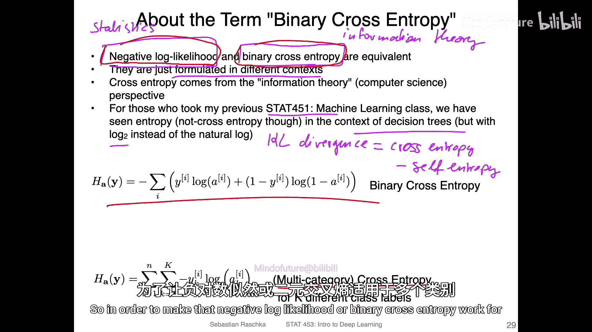
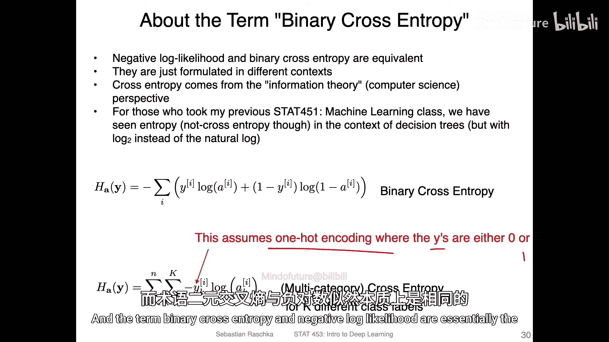
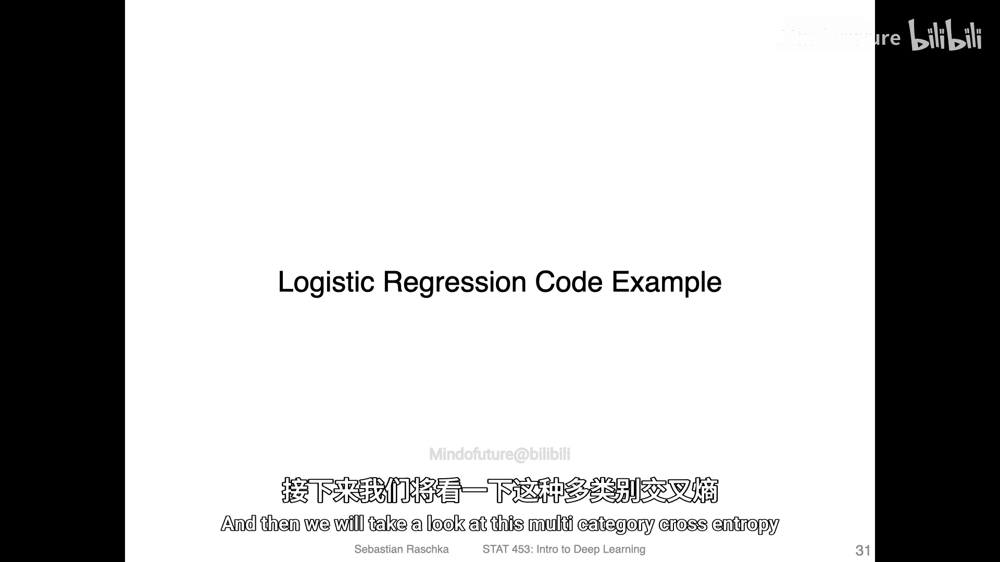

# 054：Logits与交叉熵

在本节课中，我们将学习深度学习中的两个核心术语：**Logits** 和 **交叉熵**。理解这两个概念对于后续学习神经网络至关重要。

---

上一节我们深入探讨了逻辑回归。本节中，我们来看看在深度学习文献中经常出现的两个术语：Logits和交叉熵。它们在统计学和深度学习中的用法有时略有不同，因此明确其含义以及与已学概念的关系非常重要。

## 🧠 Logits：网络输出的“原始分数”

在深度学习中，当我们构建一个多层神经网络时，例如一个简单的全连接网络，每一层都会计算**净输入**。

在输出层之前，这些净输入值通常被称为 **Logits**。在统计学中，Logits特指**几率**的对数，其公式为：
`logit(p) = log(p / (1 - p))`
这正是逻辑回归中Sigmoid函数的反函数。

然而在深度学习中，这个术语被泛化了。无论最后一层是否使用Sigmoid激活函数，其输入值都常被称为Logits。你可以简单地将其理解为**最后一层在激活函数作用前的原始输出值**。

## ⚖️ 交叉熵：衡量预测与真实的差距

接下来，我们讨论另一个核心概念：**交叉熵**。这可能会让人有些困惑，但它实际上就是我们之前学过的内容。

在深度学习中，**二元交叉熵** 与我们在逻辑回归中使用的 **负对数似然** 损失函数是**完全等价**的。它们只是源自不同的学科背景：
*   **负对数似然** 通常出现在统计学文献中。
*   **交叉熵** 则源于信息论和计算机科学领域。

你只需要记住这个关键点：**在二分类问题中，负对数似然损失就是二元交叉熵损失**。这是一个非常有用的等价关系。

为了处理多分类问题，二元交叉熵可以推广为 **多类别交叉熵**。这需要用到 **独热编码**，即将类别标签表示为仅一个位置为1、其余全为0的向量。

关于多类别逻辑回归和Softmax函数，我们将在后续的代码示例后详细讨论。

---

## 📝 本节总结

本节课中我们一起学习了：
1.  **Logits**：在深度学习中，通常指代神经网络输出层激活函数前的**净输入值**。
2.  **交叉熵**：一种常用的损失函数。其**二元形式**与逻辑回归的**负对数似然损失**等价；**多类别形式**可用于多分类任务。

理解这两个术语将帮助我们更流畅地阅读深度学习资料并进行实践。下一节，我们将通过一个逻辑回归的代码示例来巩固这些概念。