# 056：多项逻辑回归（Softmax回归）📊

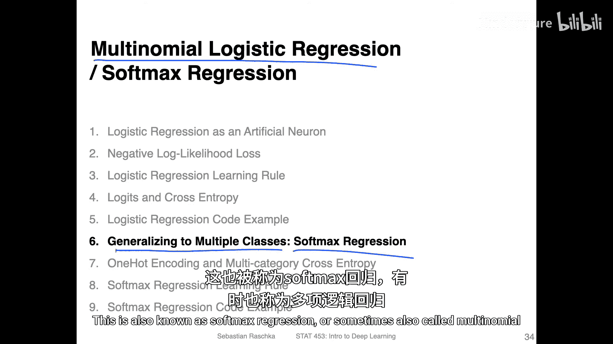

在本节课中，我们将学习如何将二分类的逻辑回归模型推广到多分类问题，这种方法被称为**Softmax回归**或**多项逻辑回归**。我们将以经典的MNIST手写数字数据集为例，理解其工作原理。

## 数据集介绍：MNIST

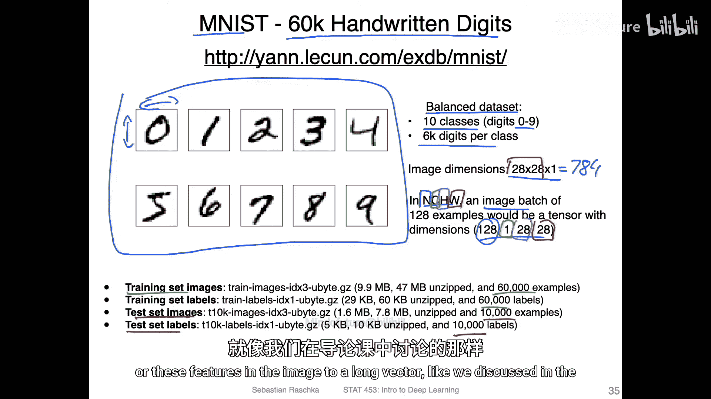

我们将使用一个相对简单的数据集——MNIST数据集。这是一个包含手写数字的平衡数据集，常用于机器学习入门。

*   **训练集**：包含60,000个手写数字样本。
*   **测试集**：包含10,000个手写数字样本。
*   **类别**：共10类，对应数字0到9。
*   **数据平衡**：每个类别（数字）的样本数量相同，均为6,000个。


每个训练样本是一张28像素高、28像素宽的灰度图像。因此，每个样本可以展开为一个包含 `28 * 28 = 784` 个特征（像素值）的长向量。

在PyTorch中，我们通常使用 `NCHW` 格式来表示一个图像批次（mini-batch）：
*   **N**：批次中的样本数量（例如128）。
*   **C**：颜色通道数。对于MNIST灰度图，此值为1。
*   **H**：图像高度（28像素）。
*   **W**：图像宽度（28像素）。

因此，一个批次的张量维度为 `[128, 1, 28, 28]`。

## 数据预处理

在输入模型之前，我们需要对图像数据进行预处理。常见的做法包括：

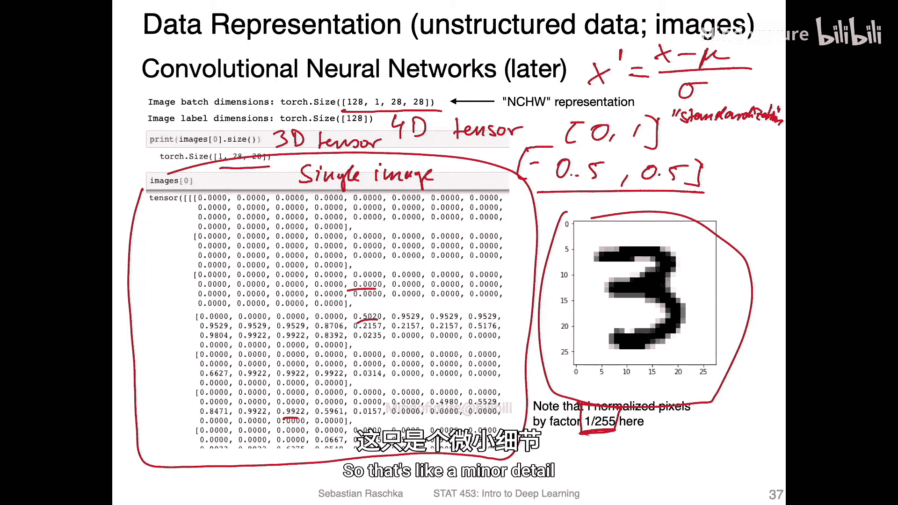

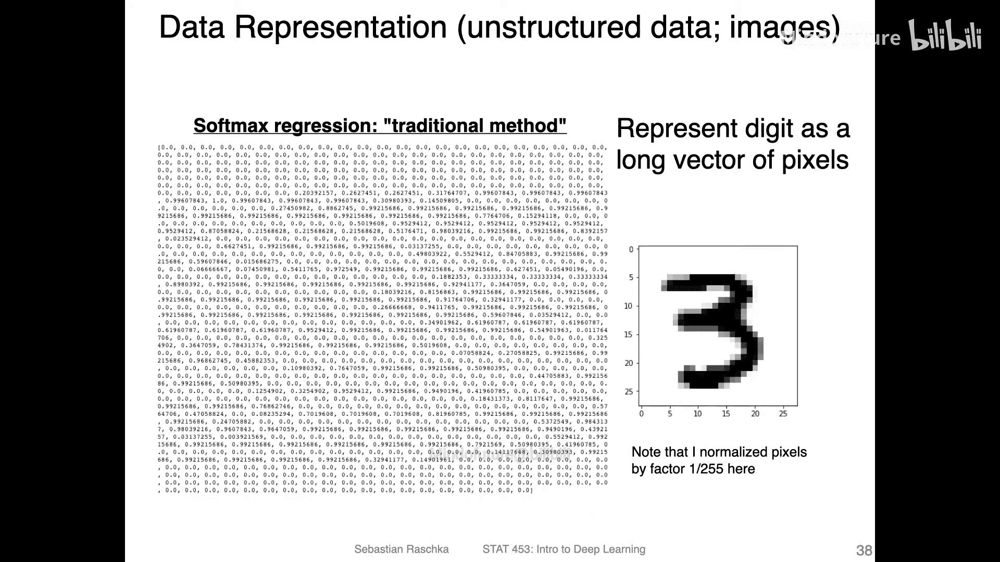

1.  **归一化（Normalization）**：将像素值从原始的0-255范围缩放到0-1之间。这有助于梯度下降算法更稳定地工作。
    ```python
    # 将像素值除以255
    image_normalized = image / 255.0
    ```
2.  **中心化（Centering）**：进一步将数据调整到以0为中心，例如将范围从[0, 1]调整到[-0.5, 0.5]。这通常能带来更好的训练效果。
    ```python
    image_centered = image_normalized - 0.5
    ```
3.  **标准化（Standardization / Z-score Normalization）**：对每个特征（像素）减去其均值并除以其标准差，使其近似服从标准正态分布。
    ```python
    # 假设 mean 和 std 是预先计算好的均值和标准差
    image_standardized = (image - mean) / std
    ```

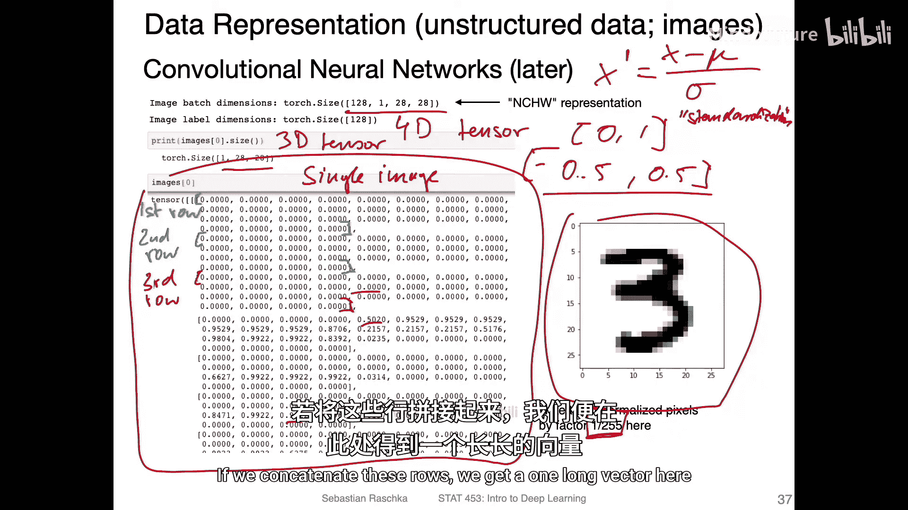

对于MNIST这类简单数据集，仅进行简单的归一化通常已足够。

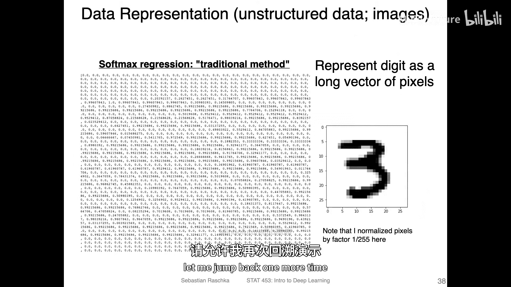

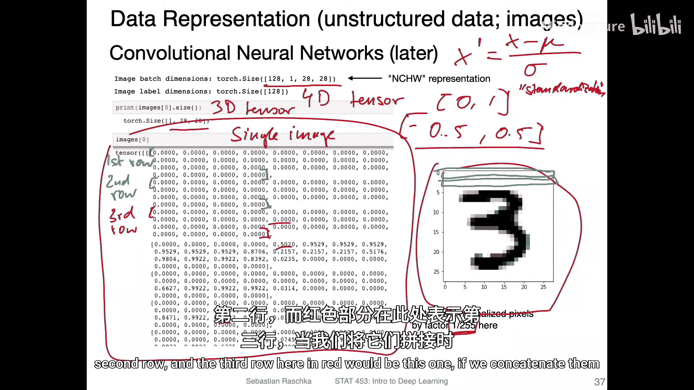

## 从二分类到多分类

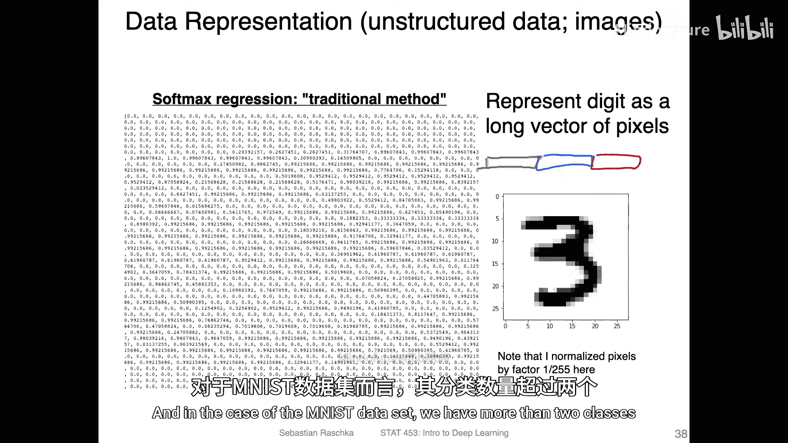

上一节我们回顾了二分类逻辑回归模型。它接收一个特征向量，通过权重向量的点积和偏置项计算净输入，再经过Sigmoid激活函数输出一个概率值，表示样本属于类别1的可能性。

现在，我们将其推广到多分类场景。一种直观的想法是为每个类别都训练一个独立的二分类逻辑回归模型（即“一对多”策略）。以下是这种方法的示意图和问题：

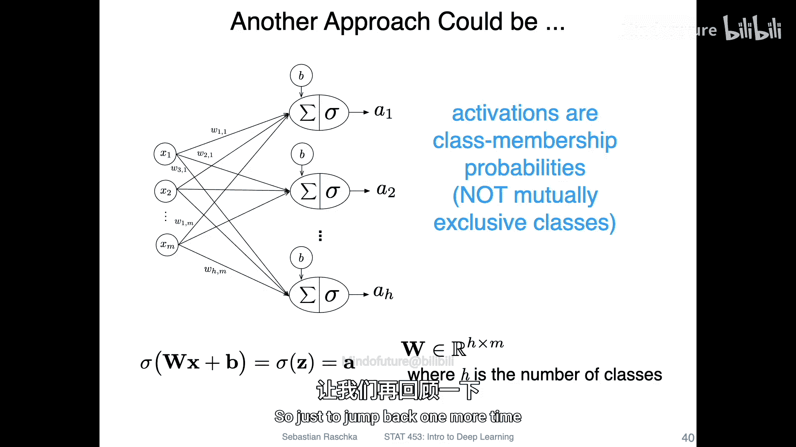


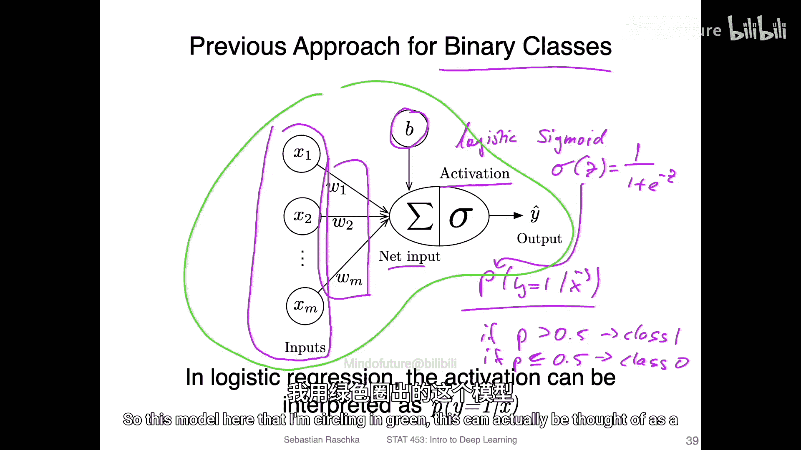

假设我们有3个类别（C=3）和M个特征。我们会构建3个独立的逻辑回归单元：
*   每个单元都有自己的权重向量（例如 `w1`, `w2`, `w3`），维度均为M。
*   每个单元对输入特征向量计算点积并加上偏置，然后通过自己的Sigmoid函数。
*   每个单元输出一个概率，表示样本属于其对应类别的可能性。

然而，这种方法存在一个问题：**各个单元输出的概率之和不一定等于1**。例如，对于一个数字“3”的图片，三个输出可能是：`P(class1)=0.33`, `P(class2)=0.40`, `P(class3)=0.70`。这在类别互斥（一个数字只能是0-9中的一个）的情况下不够直观。

## Softmax回归模型

为了解决上述问题，我们引入**Softmax回归**模型。它与“一对多”策略的关键区别在于**共享一个Softmax激活函数**，而非每个单元使用独立的Sigmoid函数。

以下是Softmax回归模型的示意图：

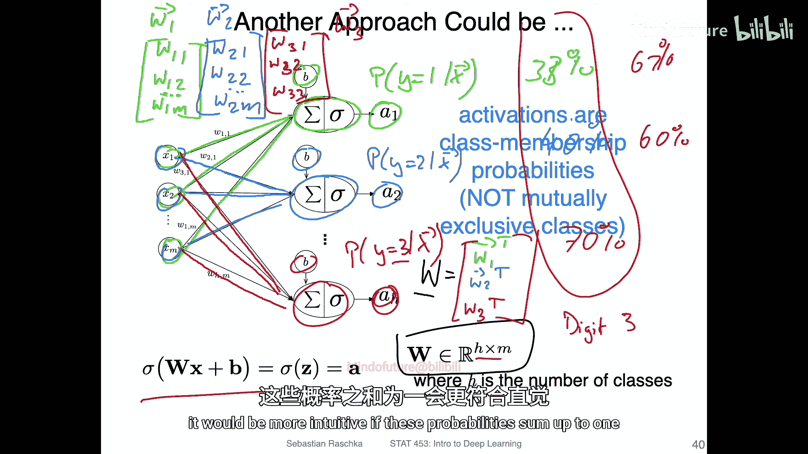

模型工作流程如下：
1.  **线性变换**：对于C个类别，我们仍然有C组权重和偏置。输入特征向量与每组权重进行点积并加上偏置，得到C个“净输入”值（也称为“logits”）。
2.  **Softmax激活**：将这C个logits值输入到**同一个Softmax函数**中。Softmax函数的核心作用是进行归一化，确保所有输出值的总和为1，从而每个输出都可以解释为样本属于对应类别的**概率**。
    Softmax函数的公式如下，其中 `z_i` 是第i个类别的logit值：
    **`P(class=i) = exp(z_i) / (exp(z_1) + exp(z_2) + ... + exp(z_C))`**
3.  **输出与预测**：Softmax层输出一个长度为C的概率向量，例如 `[0.1, 0.2, 0.7]`。要得到最终的类别标签，我们取概率最大的那个类别索引，这个操作称为 **`argmax`**。
    ```python
    predicted_class = torch.argmax(probabilities, dim=1)
    ```


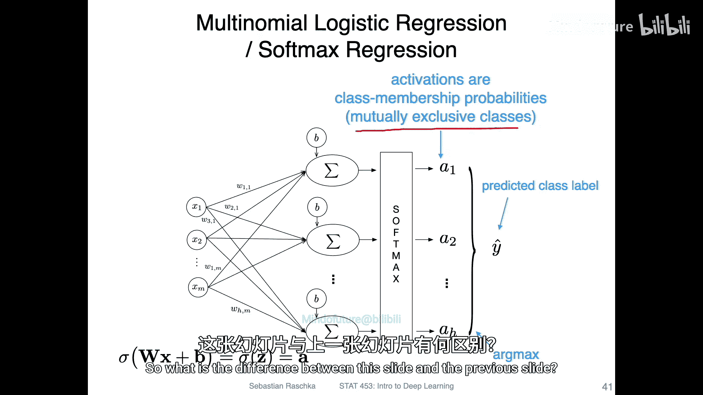

## 核心要点总结

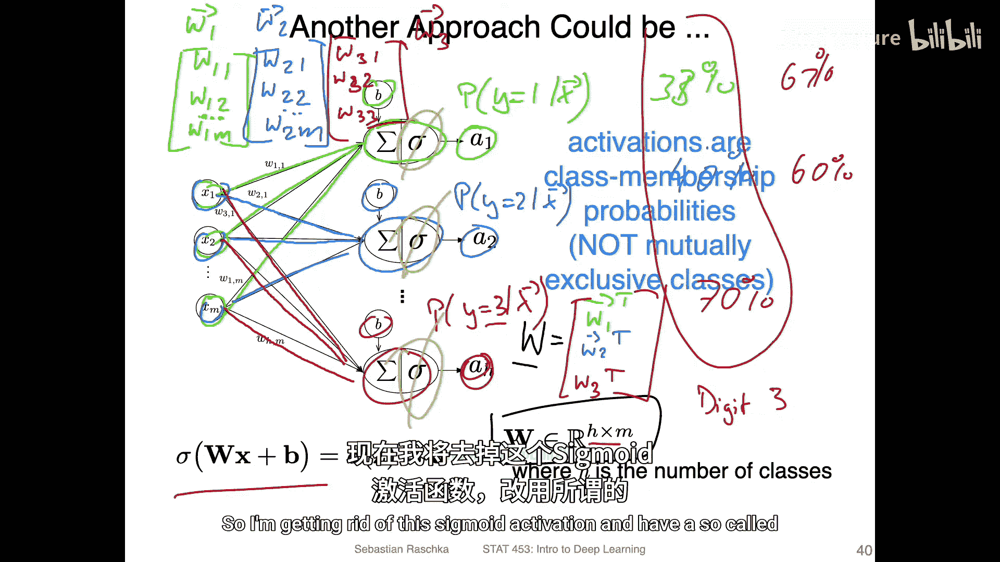

本节课我们一起学习了多项逻辑回归（Softmax回归）的核心概念：

*   **目标**：将逻辑回归从二分类推广到多分类问题。
*   **关键改进**：使用**Softmax激活函数**替代多个独立的Sigmoid函数。
*   **Softmax的作用**：对多个线性输出进行归一化，生成一个概率分布，所有类别概率之和为1。
*   **预测方法**：通过 **`argmax`** 操作选择概率最高的类别作为预测结果。
*   **与“一对多”策略的区别**：Softmax回归假设类别是互斥的，并直接输出归一化的类别概率，更适用于像MNIST这样的互斥分类任务。

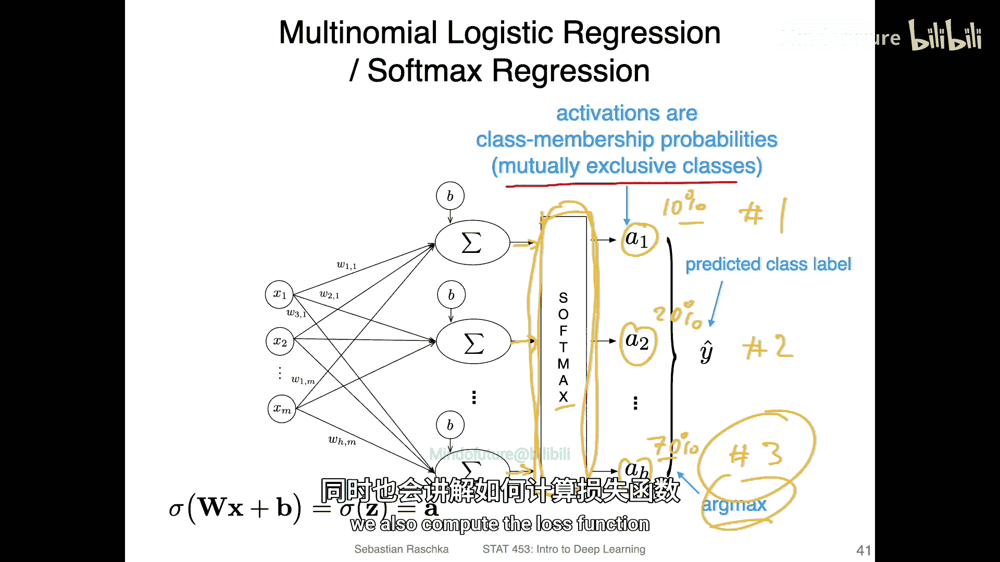

在接下来的课程中，我们将深入探讨Softmax函数的具体计算细节，以及如何为Softmax回归定义损失函数（交叉熵损失）并进行训练。