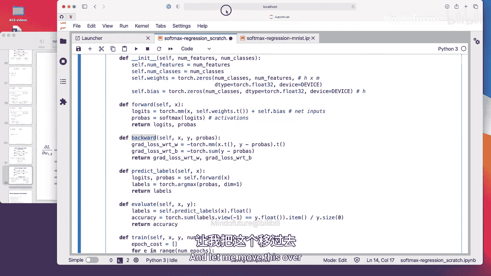
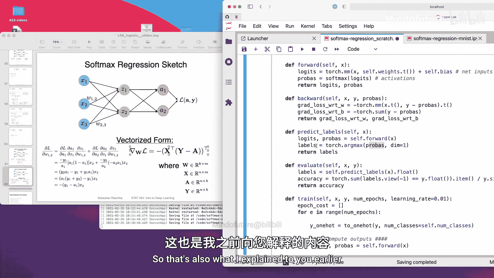
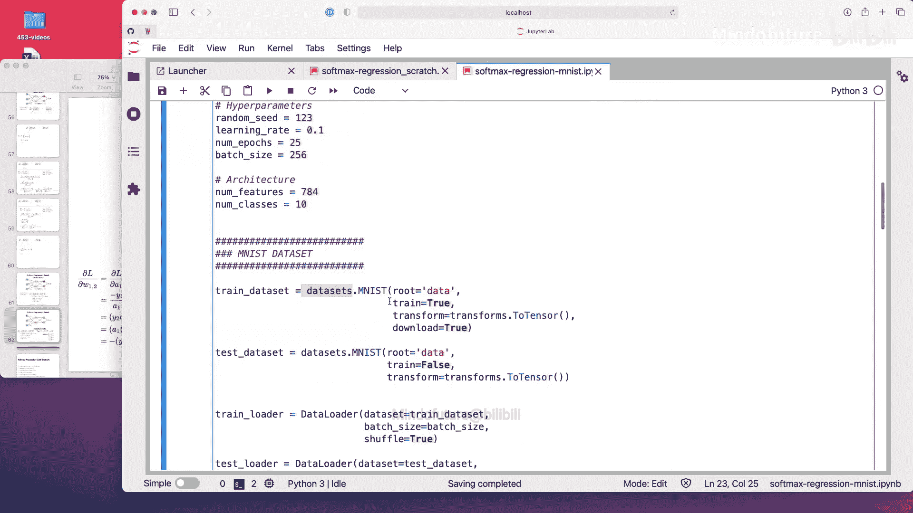
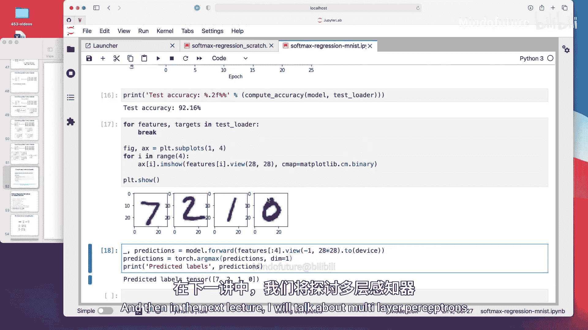

# 060：Softmax回归——使用PyTorch的代码示例 📚

在本节课中，我们将学习如何用代码实现Softmax回归模型。我们将从零开始实现一个向量化版本，并验证其有效性。接着，我们会使用PyTorch的高级API来实现相同的模型，并比较两者的结果。最后，我们会将模型应用于更复杂的MNIST数据集。

## 概述

本节是本次讲座的最后一个视频，我们将通过代码示例来展示如何实现Softmax回归模型。我们将使用之前提到的向量化形式，并证明其确实有效。实际上，我们有两个代码笔记本：一个使用简单的鸢尾花数据集进行从零开始的实现；另一个则使用MNIST数据集，因为我在讲座中提到过它，我相信大家一直在等待这个例子。

首先，我们执行一些样板代码。

## 数据加载

数据加载部分没有太多新内容。它与我之前用于玩具数据集和简单鸢尾花数据的代码相同，因此我不想花太多时间再次讨论。本质上是一样的，只是这次我们使用了三个类别，而不是两个。

现在我们有了这些圆圈、倒三角形和正方形。左侧是训练集，右侧是测试集。

在另一个笔记本中，我还会展示PyTorch的`DataLoader`。在深度学习中，我们通常不使用scikit-learn的数据集，而是使用`DataLoader`，我将在下一个笔记本中展示它的样子。

## 从零开始的底层实现

我们从低层次的从零实现开始，手动计算梯度。这里我定义了一些辅助函数：一个将类别标签转换为独热编码格式的函数、一个softmax函数以及作为损失函数的交叉熵。请注意，当你常规使用PyTorch时，不需要实现任何这些，因为PyTorch会在计算损失时内部隐式地进行独热编码，并且已经实现了softmax和交叉熵函数。但我在这里这样做，是为了真正展示讲座中的数学概念可以一对一地转化为代码，并且确实有效。

与逻辑回归类似，我们首先定义一个类。在`__init__`构造函数方法中，我们构造权重和偏置，并将它们初始化为零。注意，在Softmax回归的上下文中，权重现在是一个矩阵。它是一个 `num_classes × num_features` 的矩阵。因为我们有两个净输入对应两个输出，所以偏置现在也是一个向量，一个H维的向量，其中H是类别数。

前向传播方法计算净输入，我称之为`logits`。你可以将它们视为净输入。这只是输入和权重的矩阵乘法加上偏置向量。这会得到一个H维的净输入。然后我应用softmax来获得概率。这里的概率，即激活值`a1`和`a2`，就是我们的激活值。这些就是我们的净输入。

我在这里返回两者。有趣的部分是`backward`方法，这是我们计算梯度的地方。我们不是对每个权重使用for循环，而是可以使用我展示过的向量化实现。我在这里逐字逐句地实现它，没有任何改变。我们使用 `X^T * (y - probability)`。这里的`probability`实际上就是激活值。这部分本质上是括号内的部分，然后再进行转置，这与我幻灯片上展示的完全相同。

对于偏置单元，它更简单一些，因为导数不包含X项。所以我们可以直接计算这个和。

在`predict_labels`函数中，我应用`argmax`来获取激活值中最高概率的索引，这也是我之前解释过的。

其余部分与逻辑回归相同。`evaluate`函数与逻辑回归相同，训练过程也相同。`train`方法的唯一区别是我在这里添加了独热编码来获取独热编码的类别标签。

再次，我们调用`forward`和`backward`来获取梯度，然后通过应用负梯度乘以学习率来更新权重。我还通过小批量的大小进行归一化，因为这样更容易找到一个好的学习率。

这里只是为了记录，在训练过程中显示我们的准确率和损失。但再次强调，这实际上并不太复杂。如果我们看`backward`方法，如果我们使用线性代数的紧凑向量化形式，实际上只有两行代码。

我应该提一下，这并不简单。它看起来很简单，但你可能需要花费数小时来思考这里应该放什么。就我个人而言，在第一次实现时，我会先用Python的for循环实现，然后再转向线性代数实现。我认为这样对我来说更容易。其他人可能觉得用矩阵乘法的术语来思考更容易。我个人更喜欢更简单的东西，即使它们可能更冗长。但我当然使用这个，因为它更紧凑，信息密度更高，计算效率也更高。但再次强调，在实践中，没有人再自己实现这个了，因为我们可以使用PyTorch的自动梯度，它有计算设施来自动完成这个。

现在让我们训练这个模型。

我们可以看到，在第一个周期之后，我们已经得到了相当好的训练准确率。它实际上下降了，这很有趣。但更有趣的是，成本或损失也下降了。我认为训练准确率下降确实是由于噪声造成的，可能在这里过拟合了。但我们看到损失下降了。

这是我们的结果。让我们看看它是什么样子。

这里我们可以看到损失下降了，也许训练更久会更好。然后我们计算测试准确率，是80%。

让我们看看它是什么样子。我使用了`decision_regions`函数。我们在统计451中简要见过这个，但你不必知道或记住它，因为在实践中我们实际上永远不会处理二维数据集。所以我们从来没有绘制它的奢侈。我只是使用了一个非常简单的数据，所以在这里是可能的。

这是决策区域的样子。你可以看到，Softmax回归分类器能够通过相对较好地分类来处理三个类别。在这个区域不是很好，如果线更像这样，也许可以改进，但很难说。对于线性分类器来说，这实际上不是一个简单的问题。非线性分类器可能在这个区域更容易处理。

## 使用PyTorch的Module API实现

现在，让我们看看如何使用PyTorch的Module API来实现它。Module API使许多事情变得更容易，就像我之前说的，我们可以使用这个线性层，这就是我们的净输入计算。实际上，在实际应用中，我们不需要所有这些部分。我这样做只是为了可以将这个实现与我们从零开始的实现进行比较，因为上面我也使用了零初始化。否则，如果我不这样做，它会使用小的随机数。小的随机数对于多层网络是好的，但当然，如果我们有不同的起始权重，就很难比较这个实现和我们上面的实现。所以，我们只是添加这个。但在实际情况下，你只需像这样运行它。

我们将在后面的讲座中更多地讨论权重初始化，我想大概两周后，我会有一场关于如何初始化权重以及这些随机权重的讲座。还有一些计算技巧来选择好的权重。

前向传播方法现在非常简单。我们可以通过这里定义的线性层来进行净输入计算。然后，softmax是我们的softmax激活函数。我们现在从PyTorch使用它。`F`来自PyTorch，我想我在最顶部导入了它。`torch.nn.functional`是神经网络的功能API。人们通常实现功能API为`F`，只是为了更短。所以你只需要输入`F.softmax`。这只是使用PyTorch代码时的约定。

我们在这里使用随机梯度下降优化器来优化该模型的参数。这就是全部了。

当你使用PyTorch时。

现在训练它，你可以看到测试准确率也是80%。实际上，如果你向上滚动，看这个决策区域图和这个，它们看起来几乎相同。有一些细微的数值差异。我想如果你看这些值，0.558和-0.12，让我复制它们，也许。有一些细微差别，但只是小数点后三位的差异。我认为这只是数值舍入误差，因为我们从零开始实现了很多东西，比如softmax和交叉熵函数等。我们使用的是普通实现。softmax也有更数值稳定的实现，通过在指数中添加或乘以常数C，这会使它更稳定，但会稍微改变数字。我认为这些差异是因为那个。当然，在实践中，你不想自己实现softmax和交叉熵，因为它在数值上不如已经提供的实现稳定或快速。但总的来说，我们得到了完全相同的结果，只是有小的舍入差异。

## 在MNIST数据集上应用

现在，这是我们在PyTorch中做Softmax回归的方式。现在让我们看看MNIST数据集的相同内容，因为我已经在讲座中向你展示了MNIST数据集。为了完整起见，我们将在下一讲讨论多层感知机时更多地使用这个。

现在的新内容是，我使用了一个`DataLoader`，这通常是我们如何在PyTorch中加载图像或其他类型数据的方式。这里只是我模型的一些设置，MNIST数据已经在一个名为`torchvision`的库中提供。如果你安装PyTorch，它也会自动安装`torchvision`，所以你不需要单独安装它，它通常包含在你安装PyTorch时执行的命令中。

我们使用来自`torchvision`的`datasets`子模块中的这个MNIST数据集。这只是指定存储数据的位置。所以它会在我的笔记本旁边创建一个文件夹，因为我叫它`data`。但你可以把它改成任何你想要的，比如桌面/数据之类的，真的没关系，只是它暂时保存数据的地方。

然后它有一个测试集和训练集。`train=True`用于训练，`train=False`用于测试。实际上，MNIST没有验证分割有点不幸，但我会在多层感知机讲座中展示如何也为它创建验证分割。

这个是必需的，因为MNIST是图像，它们以PIL格式出现，你想将它们转换为PyTorch张量表示。这个将Python中的图像表示转换为PyTorch张量表示。但我们后面也会看到，我们可以在这里使用其他数据增强，比如随机翻转或裁剪图像，当我们讨论卷积网络时，我们也会更多地讨论这个。

我还应该说，`ToTensor`会归一化像素到0-1范围。所以它将它们除以255。我应该提一下。所以我们不必自己做数据归一化。当然，我们实际上可以做得更好。对于彩色图像，有时人们使用ImageNet的均值和标准差进行标准化。对于MNIST这样的东西，老实说，这完全无关紧要，因为对于随机梯度下降来说，这是一个非常简单的优化任务。

这是定义训练数据集。这是定义测试数据集。区别真的只是我们在这里设置`train=True`和`train=False`。我们只需要下载一次，所以我这里没有下载。

然后，我们使用数据定义数据加载器。这里我为训练集定义了一个`DataLoader`。我可以设置我的批次大小，我在上面设置了。那是我的小批次大小，我设置为256。

然后我们是否要打乱。这是在每个周期之前打乱数据集。注意，这里我没有打乱测试集，因为它真的不重要。我分批加载测试集。这也不是真正必要的，因为我们不在测试集上进行任何训练和随机梯度下降。但如果说我们处理像ImageNet这样的真实图像数据集，测试集可能相当大，可能无法放入内存，所以我们也可以逐个加载，基本上这就是我在这里做的。

这里，只是为了完整，这更像是为了验证一切看起来都很好。所以我只是对训练加载器中的图像和标签进行for循环，以确保一切正常。

你可以看到它以`N, C, H, W`格式加载图像，即批次大小、颜色通道数。我们只有一个颜色通道，因为MNIST是黑白的。然后我们有高度和宽度。当然，标签是一个向量，因为这只是数字。

我还应该告诉你，这些标签不是独热编码的。你可以看到它们只是数字，类别标签。没有必要对它们进行独热编码，因为当我们在PyTorch中调用交叉熵损失时，它会自动完成。

现在这是我的实现。这与这里的从零开始相同。所以没有什么真正的不同。同样的事情。

所以还要注意。准确率，我使用for循环在数据加载器上计算它。我不必详细讲解这个，我认为如果你需要，你可以复制粘贴这个。

我想向你展示的有趣部分是因为我不想让这个视频太长。我的意思是，我可以讨论一切，但如果你有问题，也许可以在Piazza上提问，我们可以更多地讨论这个。我不想在现在不那么重要的事情上花太多时间。

重要的部分在这里，我们进行展平操作。这回到了我展示的内容。一张图像看起来是一个3D张量，28x28，然后是颜色维度。如果你不考虑颜色维度，它将是一个矩阵，一个28x28的矩阵，但我们需要一个特征向量作为输入，所以我们会将它展平为一个很长的向量，28乘以28，即784维的向量。这就是我在这里做的。所以我将它展平为一个向量。我可以展示一下对于一个给定的图像，它会是什么样子。比如说，我们取一张图像。这将是一个颜色通道和28x28。实际上，你也可以。`view(-1, 28*28)`，所以现在你可以看到它基本上是一个长向量。在这种情况下，我认为它是一个矩阵，因为我们有第一个维度。所以大约相同的事情适用。这里，我们对批次维度再做一次。`images`应该是256乘以784维的矩阵。所以这就像我们的设计矩阵的样子，然后是一个`n × m`维的矩阵，其中`m`是特征数，`n`是批次大小。注意，它去掉了这里的颜色通道。没有颜色通道，因为我们只需要二维。如果我们这样做，它会有一个颜色通道，但我们这里不想要颜色通道。

然后我们调用我们的模型。当我们使用PyTorch时，我们不使用`.forward`，因为实际上最好直接像这样调用它，它会在内部调用`forward`，但会在调用`forward`之前做一些额外的检查，正如我在之前的讲座中解释的。

现在有趣的部分是我们如何计算交叉熵成本或损失。这里。注意，重要的是它使用`logits`作为输入。所以它不使用概率。它使用`logits`。这是我在前一个视频中解释的。这是稍微令人困惑的部分，我在另一个之前的视频中解释过。所以我们必须注意，我们在这里提供的是`logits`而不是概率。

然后我们通过`backward`将梯度归零。我们只是在这里平均成本。不知道为什么我这样做。不需要那个。哦，我明白了。我计算每个周期的平均成本。我可以通过在整个数据集上调用前向传播来计算成本，但这需要更多工作。所以你必须加载整个数据集。所以我只是计算平均值。它可能需要一段时间。不过不算太糟，大约0.4分钟每个周期。我不知道这些数字是否有意义。一个可能有意义的。

现在，这就是损失的样子。你可以看到它如预期般下降。让我们快速看一下测试准确率。92.16实际上相当不错，考虑到这是一个图像数据集，而我们只有一个线性分类器，我们甚至没有使用多层神经网络，我们已经得到了相当好的性能。就个人而言，我也建议你在处理分类任务时，总是运行逻辑回归分类器或Softmax回归分类器作为基线，以了解分类问题的难度。所以如果你训练一个卷积网络，只得到94%，而使用逻辑回归已经得到92%，你可能会说，好吧，这是一个如此复杂的卷积网络模型，为什么它只得到94%，而使用逻辑回归已经得到92%？也许我94%的模型毕竟没有那么好。

所以总是运行逻辑回归作为基线是件好事。

这里只是一个例子。从数据中学习三个随机图像，7，2，1和0。然后我在这里进行预测。所以在这个特征向量上调用这个，然后使用`argmax`来获取类别标签，因为这会给我们概率。你可以看到，所以我们取`argmax`。对于第一个，让我们看看，应该是这个最高的0,1,2,3,4,5,6,7。这是最高的，它实际上应该是最高的一。通过这种方式，我们在这里计算类别标签，只是为了表明这些确实是正确的。

## 总结

本节课中，我们一起学习了Softmax回归模型的代码实现。我们从零开始实现了向量化版本，并验证了其有效性。接着，我们使用PyTorch的Module API简化了实现过程，并比较了两者的结果。最后，我们将模型应用于MNIST数据集，展示了线性分类器在图像分类任务上的基线性能。通过本节的学习，你应该能够理解Softmax回归的核心概念，并掌握使用PyTorch实现分类模型的基本方法。