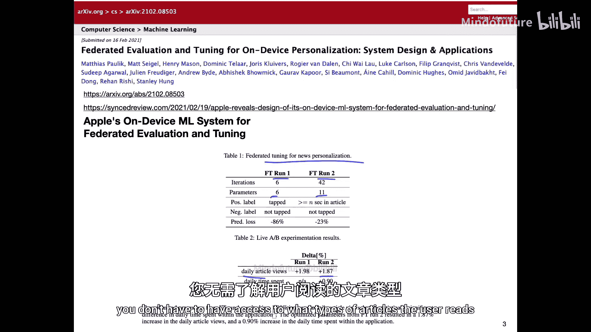
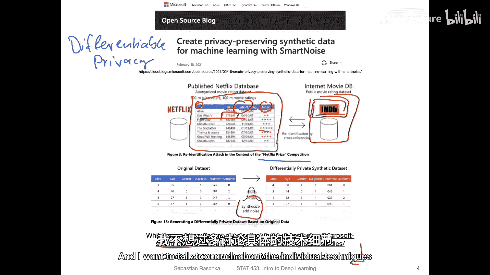
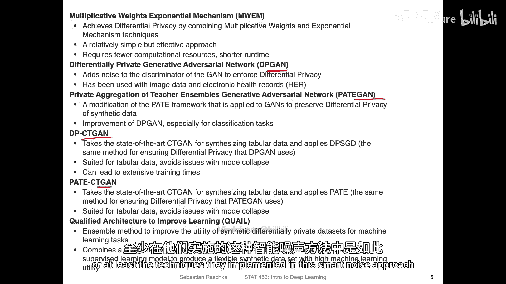
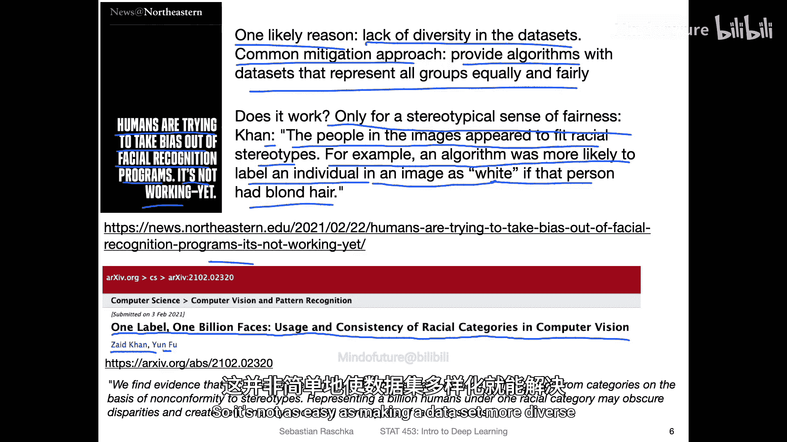
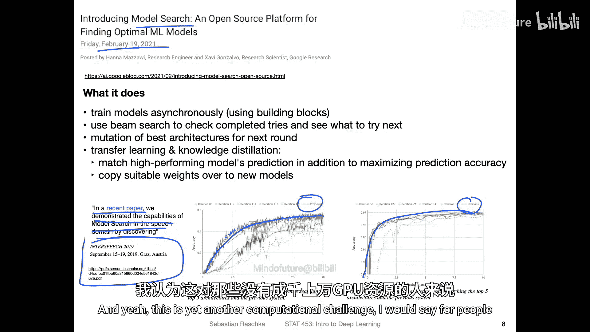
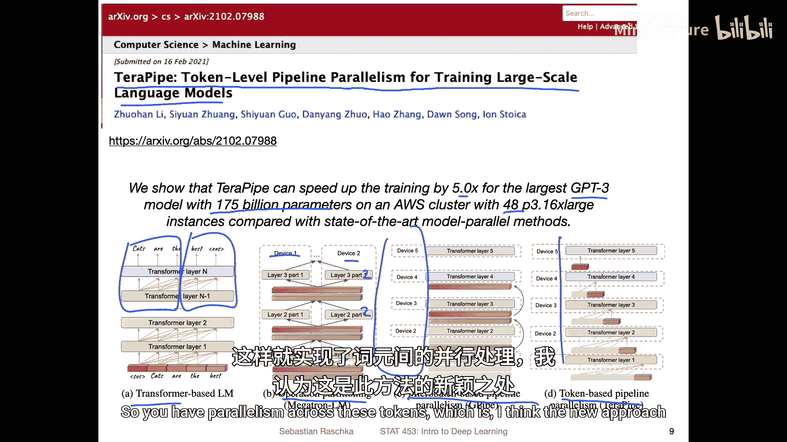
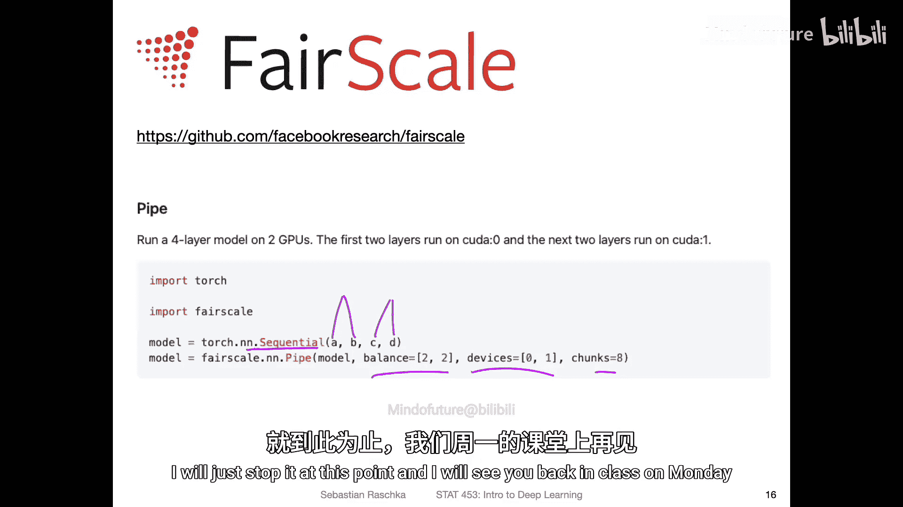

# 061：深度学习新闻与高效训练技术

在本节课中，我们将回顾2021年2月27日发布的一期深度学习新闻，重点探讨如何更高效地训练深度学习模型。我们将涵盖联邦学习、隐私保护、数据偏见、自动化机器学习以及在大规模或单GPU环境下训练模型的核心技术。

## 联邦学习与隐私保护

上一节我们讨论了深度学习面临的计算挑战。本节中，我们来看看一种旨在解决这些挑战的分布式学习方法——联邦学习。

联邦学习是一种将计算任务分散到多个设备上进行的学习过程。本周，来自苹果公司的研究人员发表了一篇题为《Federated evaluation and Tuning for on-device personalization: system design and Application》的论文，介绍了一种新颖的联邦学习系统。

传统的联邦学习方法通常是在服务器上维护一个**全局模型**，用户设备将数据发送到服务器来训练这个模型。然而，这种方法存在隐私风险。

苹果提出的系统采用了不同的方法。在该系统中，模型训练完全在本地设备上进行，用户数据永远不会离开设备。服务器只负责分发任务配置和接收聚合后的任务结果，从而在实现个性化模型的同时，保护了用户隐私。



以下是该系统的信息流示意图：
*   **红色箭头**：代表任务配置和附件信息，从开发者服务器流向用户设备。
*   **绿色箭头**：代表任务结果和遥测数据，从用户设备流回开发者服务器。
*   **蓝色箭头**：代表设备上的用户记录（数据），这些数据始终保留在设备本地，不会发送到服务器。


## 差分隐私：保护数据中的个体

上一节我们介绍了两种联邦学习模式。虽然第一种将数据发送到中央服务器的方式看似有隐私风险，但通过“差分隐私”技术，可以对其进行有效保护。

差分隐私是一个研究领域，旨在通过向数据中添加特定噪声，使得在保留数据集整体统计效用（如平均评分）的同时，无法从中识别出任何特定个体。这解决了即使匿名化数据也可能被重新识别的风险。

一个著名的案例是Netflix百万美元竞赛。Netflix发布了一个包含用户ID、电影、评分日期和评分的匿名数据集。研究人员通过将其与公开的IMDb评论数据库（包含用户名、评论日期和评分）进行交叉比对，成功识别出了部分Netflix用户的身份。

微软近期发布了一个名为 **SmartNoise** 的工具包，它提供Python API等工具，使差分隐私技术的实践应用变得更加便捷。



有趣的是，SmartNoise工具包中实现的许多技术都涉及**生成对抗网络**。GANs能够学习训练数据的分布并生成新的样本，这在创建合成数据以保护隐私方面非常有用。我们将在后续课程中详细讲解GANs。




## 数据偏见与公平性



接下来，我们转向一个与数据相关的重要议题：算法偏见与公平性。

人们通常认为，通过使用更多样化、更均衡的数据集可以减轻人脸识别等系统中的偏见。然而，一篇题为《1 Label, 1 Billion Faces: Usage and Consistency of Racial Categories in Computer Vision》的论文指出，这种方法可能只在非常刻板的“公平”定义下有效。

研究发现，算法仍然会依赖种族刻板印象进行判断。例如，算法更可能将拥有金发的人像标注为白人。这表明，仅仅增加数据的多样性并不足以解决根深蒂固的偏见问题，需要开发更先进的、从根本上保证公平性的系统。


## 自动化机器学习与神经架构搜索



现在，让我们探讨一个旨在减轻人类工作负担的领域：自动化机器学习。

**自动化机器学习** 旨在为给定问题自动寻找合适的机器学习算法、超参数设置乃至数据预处理步骤，从而减少人工试错。

**神经架构搜索** 是AutoML的一个子领域，专门针对神经网络结构进行自动化搜索。一篇题为《Introducing Model Search: An Open Source Platform for Finding Optimal Machine Learning Models》的文章介绍了一个新的开源平台。



该平台的方法结合了多种思想：异步训练多个模型，使用波束搜索筛选结果，并对表现最佳的模型进行“突变”（类似于进化算法），同时还采用了知识蒸馏和权重迁移技术（将训练良好的模型权重用于初始化新模型）。虽然其构建模块并非全新，但整合后的系统性能优异，如下图所示，其性能超越了之前的多种方法。


不过，需要注意的是，神经架构搜索计算成本极高，因为它需要训练大量神经网络，对于没有数百上千个GPU的研究者来说是一个挑战。

## 大规模模型的高效并行训练

讨论完自动化，我们回到核心的计算效率问题。对于训练像拥有1750亿参数的GPT-3这样的大规模模型，并行技术至关重要。

一篇题为《Terapipe: Token-Level Pipeline Parallelism for Training Large-Scale Language Models》的论文提出了一种新的并行方法，能在48个GPU上将训练效率提升5倍。传统的并行方式包括：
1.  **张量并行**：将单个层的计算操作拆分到多个设备上。
2.  **流水线并行（微批次）**：将小批次数据进一步拆分为微批次，在多个设备间形成流水线。

该论文的 novelty 在于提出了 **令牌级流水线并行**，即将输入序列的令牌（token）分布到不同的设备上进行处理，实现了令牌级别的并行计算。


## 在单GPU上训练大型模型

最后，我们进入最实用的部分：如何在仅有一块GPU的情况下训练大型模型。Fast.ai的Sylvain Gugger总结了几种关键技术：

以下是核心方法概览：
1.  **减小批次大小**：这是最直接的方法，能减少矩阵乘法的内存占用。
2.  **梯度累积**：在多次前向/反向传播后，再一次性更新权重。公式上，这相当于使用了一个更大的有效批次大小，但内存占用与小批次相同。
    ```python
    # 伪代码示例
    for i, (data, target) in enumerate(dataloader):
        output = model(data)
        loss = criterion(output, target)
        loss.backward() # 梯度累积在参数中
        if (i+1) % accumulation_steps == 0: # 每累积N步
            optimizer.step() # 更新权重
            optimizer.zero_grad() # 清空梯度
    ```
3.  **梯度检查点**：这是一种用计算时间换取内存空间的技术。在前向传播时不保存所有中间激活值（用于反向传播的梯度计算），而是在反向传播需要时重新计算它们。如下图所示，常规方法（左）保存所有中间值（橙色），而梯度检查点（右）只保存部分，需要时重新计算（蓝色）。


4.  **Zero Redundancy Optimizer**：由微软DeepSpeed库提出，通过将优化器状态、梯度和参数分区到多个GPU乃至CPU上，并利用16位浮点数训练，大幅减少内存消耗。
5.  **模型并行与流水线并行**：将模型的不同部分放置在不同的GPU上。Facebook AI Research的`fairscale`库提供了易于使用的流水线并行实现，例如，可以使用PyTorch的`Sequential`模块来定义模型，并自动将其层分配到不同设备。
    ```python
    # 概念性示例：将模型的不同部分分配到不同GPU
    model = nn.Sequential(
        nn.Linear(10, 20).to('cuda:0'), # 第一部分在GPU0
        nn.ReLU(),
        nn.Linear(20, 30).to('cuda:1'), # 第二部分在GPU1
        nn.ReLU()
    )
    # fairscale 提供了更高级的封装来处理设备间通信
    ```

对于单GPU用户，最实用的策略是结合**减小批次大小**、**梯度累积**和**梯度检查点**。如果拥有多块GPU，则可以进一步探索**ZeRO优化器**和**模型/流水线并行**技术。



## 总结


本节课中我们一起学习了多种旨在提升深度学习训练效率的前沿技术与思想。我们从保护隐私的**联邦学习**和**差分隐私**出发，探讨了数据**偏见问题**的复杂性，了解了**自动化机器学习**如何尝试减轻人工负担。最后，我们深入研究了应对计算资源限制的核心方案：包括用于多GPU环境的**各种并行策略**，以及特别适合资源有限研究者的**单GPU训练技巧**，如梯度累积和检查点。这些技术使得在有限硬件上探索更大、更复杂的模型成为可能。