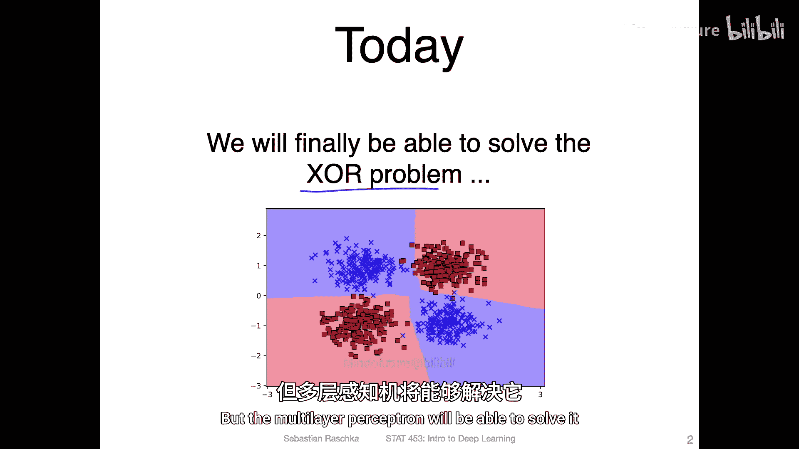
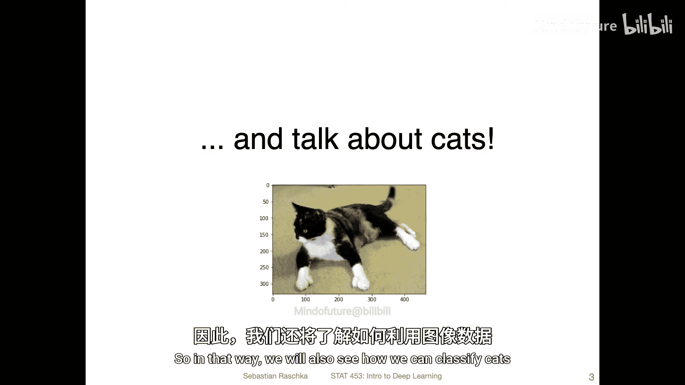
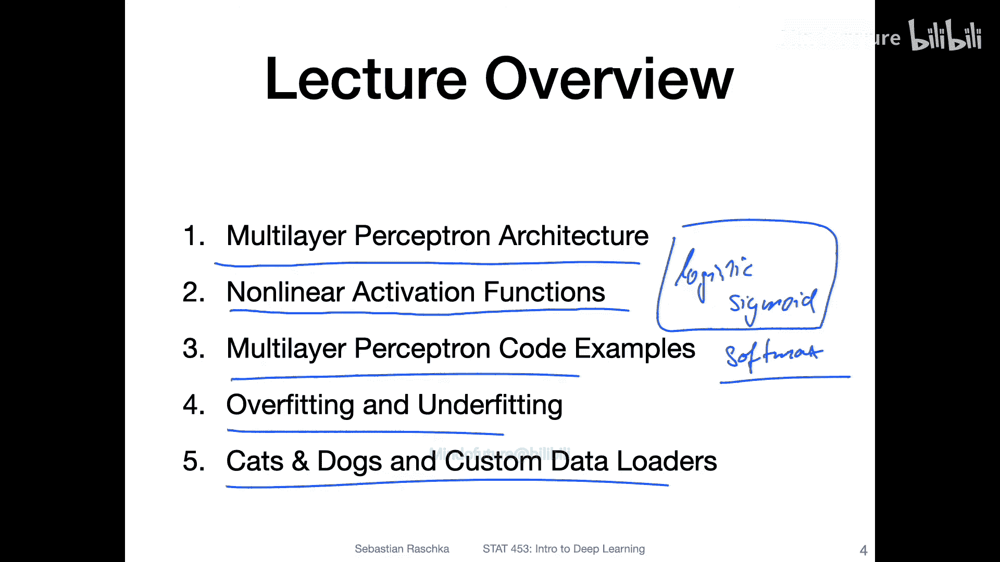

# 062：多层感知机（MLP）概述

在本节课中，我们将开始学习多层感知机，这是构建深度神经网络的基础。我们将了解其架构、激活函数，并学习如何用代码实现它来解决实际问题。

---

上一节我们回顾了课程安排，本节中我们来看看本节课的具体内容概述。

本节课主要涵盖两个核心目标。首先，我们将最终能够解决异或问题。异或问题在之前讲解感知机时介绍过，它是一个看似简单但线性模型无法解决的数据集。多层感知机将能够解决它。

然而，异或问题本身在实际应用中并不常见。因此，我们还将学习如何使用多层感知机对猫和狗的图片数据进行分类。

以下是本节课的详细主题列表：
*   **多层感知机架构**：介绍其基本结构和工作原理。
*   **非线性激活函数**：深入探讨几种常用的激活函数，如Sigmoid、Tanh和ReLU。
*   **代码实现**：展示如何在PyTorch中实现一个多层感知机。
*   **过拟合与欠拟合**：讨论模型训练中这两个关键问题及其重要性。
*   **实战应用：猫狗分类**：将多层感知机应用于图像分类任务，并介绍如何使用自定义数据加载器。

当然，对于图像数据，卷积神经网络通常是更好的选择。但我们会循序渐进，先使用多层感知机解决猫狗分类问题，后续再使用更先进的网络来优化效果。

---

本节课中我们一起学习了多层感知机的课程概述，明确了我们将要解决异或问题、学习关键概念，并将理论应用于实际的图像分类任务。在接下来的视频中，我们将正式开始讲解多层感知机的具体架构。