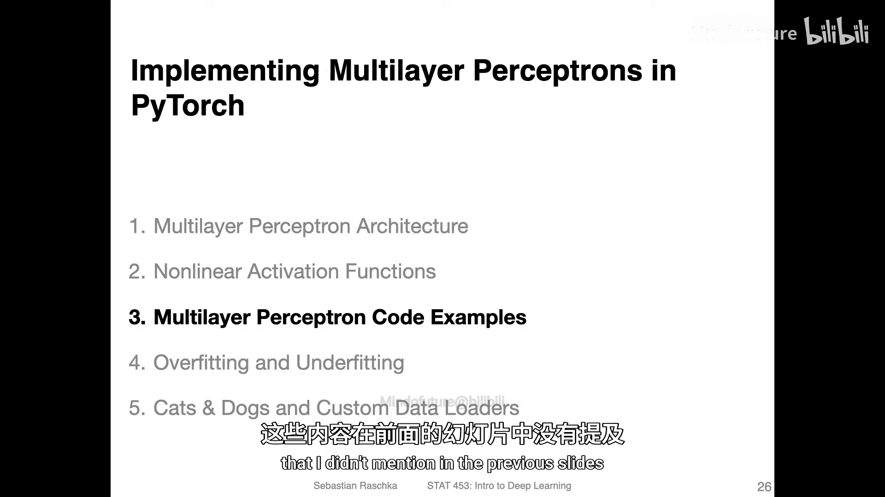
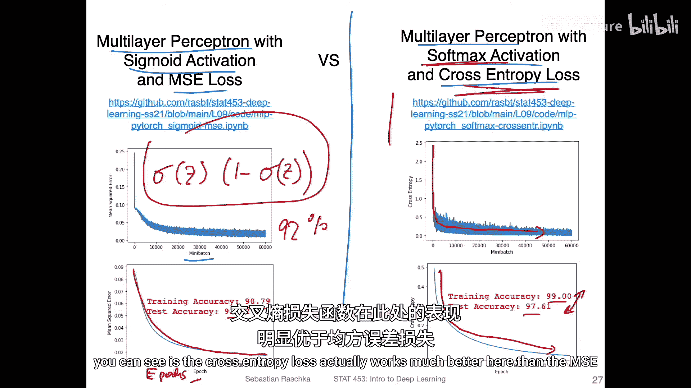
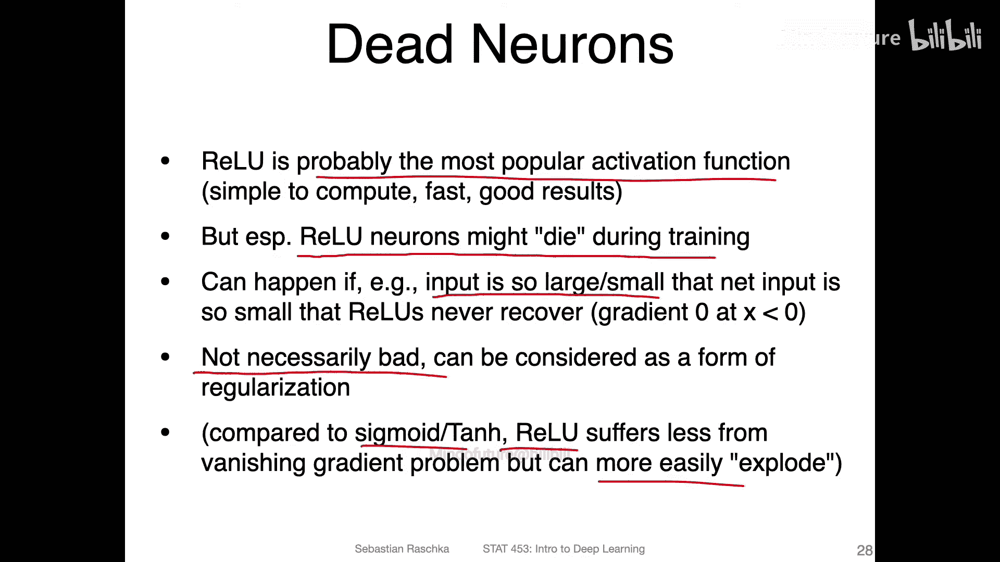
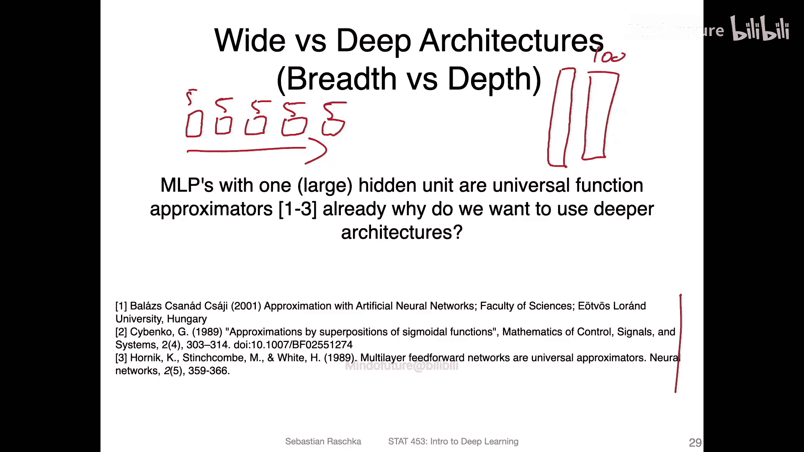
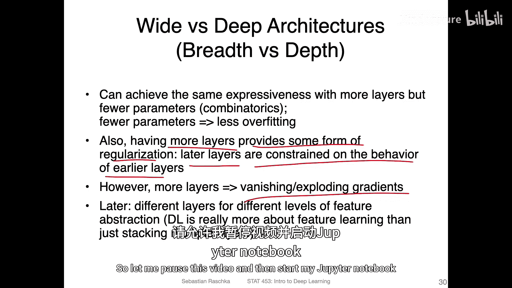

# 065：多层感知机——代码示例第1部分（共3部分）📊

在本节中，我们将通过代码示例来学习多层感知机的实现。在此之前，我们先通过几张幻灯片来总结代码中将要涉及的内容，并补充一些之前未提及的关于多层感知机的重要概念。

我准备了两份代码笔记本，并会展示一些替代的Python脚本。在这些笔记本中，我实现了一个使用Sigmoid激活函数和均方误差损失的多层感知机，以及另一个结构相同但使用Softmax激活函数和交叉熵损失的多层感知机。

我们先看左侧的图表。这里有两张图。第一张图展示了每个小批量的损失变化。你可以看到损失在下降，这是我们训练时期望看到的趋势。由于我们使用的是随机梯度下降，更新过程带有噪声，因此曲线有些波动，这是正常的。

在底部，我绘制了在整个训练集上计算的损失。在每个训练周期后，我都会计算整个训练集的损失，因此这里的曲线更加平滑。图中显示我训练了100个周期，X轴代表周期数。可以看到训练过程良好，但准确率相对较低，仅达到90%的训练准确率和91%的测试准确率。一个优点是模型没有过拟合。但回想一下Softmax回归的课程，我们仅使用Softmax回归就达到了约92%的准确率。

我认为这个多层感知机表现不佳的原因，可能在于Sigmoid激活函数和均方误差损失的组合不够理想。正如之前概述的，与Softmax和交叉熵（甚至Sigmoid和交叉熵）相比，它们的导数项不能很好地抵消。在链式法则中，Sigmoid函数的导数是一个小于1的数，这可能导致梯度变得非常小，从而引发梯度消失问题，使得权重更新困难。

相比之下，交叉熵损失通常与Sigmoid激活函数配合得更好。或者，我推荐使用Softmax激活函数，因为我们处理的是互斥的类别。实际上，你可以尝试修改代码示例，将Softmax改为Sigmoid，但效果差异不大。

现在看右侧的图表。主要结论同样是损失在下降。此外，训练准确率达到了99%，测试准确率接近98%。这里出现了一点过拟合，我们将在下一个关于Jupyter笔记本的视频中讨论过拟合问题。

总之，你可以看到交叉熵损失在这里的表现远优于均方误差损失。

关于激活函数，我已经提到了“死亡神经元”的问题。我们也可以使用ReLU激活函数，它非常流行。你可以在代码笔记本中尝试它。正如我所说，ReLU可能是我最常使用的激活函数，因为它通常效果很好。

然而，理论上ReLU可能存在“死亡神经元”问题。如果输入值过大或过小，导致净输入为负数，那么神经元可能“死亡”。例如，如果输入很大但权重为负，或者权重为正但输入非常负，净输入都可能为负。如果负得过于极端，神经元可能永远无法逃离这种状态，因为即使通过多变量链式法则组合更新，也可能无法达到使其输出为正数的阈值，导致某些权重永远无法更新，从而形成“死亡神经元”。

不过，这未必完全是坏事。如果你的网络神经元过多，容易导致过拟合，那么“死亡”一些神经元相当于减少了参数，可能通过简化网络（类似于剪枝）来帮助提升性能。

此外，与Sigmoid或Tanh函数相比，ReLU的一个优势是它更少受到梯度消失问题的影响，因为它的梯度要么是0，要么是1。在最坏的情况下，你可能会遇到“死亡神经元”或没有梯度的情况；但在其他情况下，如果净输入为正，你总能得到强度为1的梯度。

理论上，如果网络其他部分产生的值大于1，ReLU也可能导致梯度爆炸问题。关于梯度的消失和爆炸，我们将在后续讨论循环神经网络时更详细地探讨。这里只是先总结这几点。

另一个需要考虑的问题是：我们应该使用“深”的网络还是“宽”的网络？

假设我们可以构建一个多层感知机，每层只有少量单元（例如每层5个），但有很多层。或者，我们可以构建一个非常“宽”的网络，只有一个隐藏层，但该层有大量单元（例如100个）。

那么，哪种更可取呢？理论上，已有一些关于“通用近似定理”的研究。该定理表明，仅含一个任意大的隐藏层的多层感知机，就足以近似任意函数。既然如此，为什么我们还要关心使用多层网络呢？

原因在于，能够近似任意函数并不意味着训练这样的网络是实用的。首先，训练本身存在挑战，大规模矩阵乘法计算量大。其次，要达到与使用更多层（但每层参数更少）的网络相同的表达能力，你可能需要更多的参数。

使用更少的参数但更多的层，可以在组合上提供更多的可能性，从而获得与仅含少数宽隐藏层的网络相同的表达能力。然而，如果你有很多层，就可能遇到前面提到的梯度消失或爆炸问题。

因此，在实践中通常需要权衡。对于多层感知机，你通常不会使用超过一两层的深度，否则就会遇到梯度传播问题。但后续我们将讨论卷积神经网络等其他类型的网络，它们可以通过一些技巧设计得更深，而不会遇到严重的梯度问题。这本质上就是深度学习的一部分：巧妙地设计网络结构，以便能够构建更深的模型。

对于多层感知机这种并非真正的“深度”学习架构，一到两个隐藏层通常就足够了。如果你尝试实现一个三到四层的多层感知机，通常会注意到它训练得不太好，因为误差无法有效地反向传播那么远。

一个实际的考虑是，在多层感知机中通常使用一到两个隐藏层。而对于卷积层，我们可以构建深达50、100、150甚至200层的网络，这在当今非常普遍。

但卷积网络是另一个讲座的主题。总之，再次总结：与使用一个参数众多的大层相比，使用更多层（但每层参数更少）可以实现相同的表达能力。

此外，拥有更多层（相比单层）的一个好处是它提供了一种正则化形式，因为后面层的行为受到前面层的约束。因此，至少在理论上，更多的层有时是有帮助的。

但是，正如所说，我们也面临着梯度消失和爆炸的问题，后续我们会更详细地讨论。

现在，是时候向你展示代码示例了。让我暂停这个视频，然后打开我的Jupyter笔记本。

