# 067：PyTorch中的多层感知机——代码示例第3部分（脚本设置）📁

在本节课中，我们将学习如何将多层感知机的训练代码组织成更专业、可维护的项目结构。我们将看到如何将代码拆分为多个文件，使用配置文件管理超参数，以及如何记录训练结果。

---

## 概述

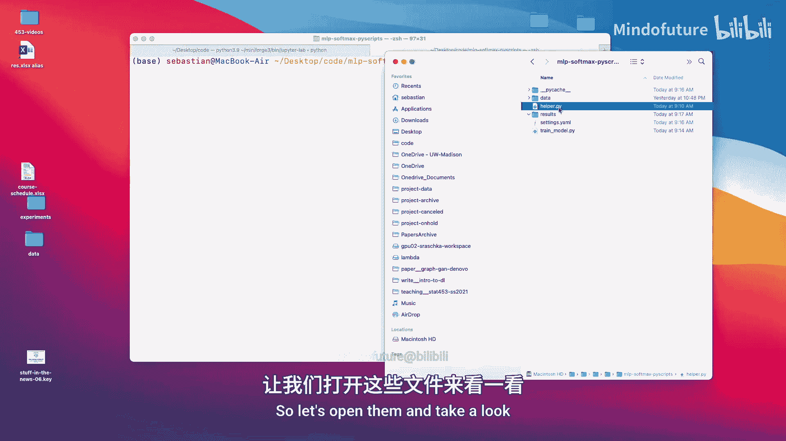

上一节我们完成了多层感知机的训练循环。本节中，我们将探讨如何将代码重构为模块化的脚本，以便于在更大的项目中管理和复用代码。我们将介绍使用独立的设置文件、辅助函数库以及命令行参数来运行训练脚本。

## 项目结构组织

对于大型项目，将代码组织到多个文件中是一种良好的实践。以下是一个常见的项目结构示例：

*   **`train_model.py`**：主训练脚本。
*   **`helper.py`**：存放可复用的通用函数（如数据加载、设置随机种子、计算准确率等）。
*   **`settings.yaml`**：使用YAML格式存储模型超参数和设置。

这种结构的好处是代码清晰，易于维护和复用。例如，你可以创建多个不同的`settings.yaml`文件来尝试不同的超参数组合，而无需修改主训练代码。

## 代码文件详解

以下是各核心文件的功能说明。

### 1. 主训练脚本 (`train_model.py`)

这是项目的入口点。它负责导入辅助函数、读取配置、执行训练流程并保存结果。

```python
import yaml
import sys
from helper import data_loader, set_deterministic, compute_accuracy, plot_training

def main(settings_path, results_path):
    # 1. 加载设置
    with open(settings_path, ‘r’) as f:
        settings = yaml.safe_load(f)

    # 2. 设置随机种子以保证结果可复现
    set_deterministic(settings[‘random_seed’])

    # 3. 加载数据
    train_loader, valid_loader, test_loader = data_loader(settings[‘batch_size’])

    # 4. 初始化模型、损失函数和优化器（参数来自settings）
    model = MLP(...)
    criterion = nn.CrossEntropyLoss()
    optimizer = torch.optim.Adam(model.parameters(), lr=settings[‘learning_rate’])

    # 5. 训练循环
    for epoch in range(settings[‘num_epochs’]):
        # ... 训练代码 ...
        pass

    # 6. 评估并保存结果
    results = {
        ‘test_accuracy’: final_accuracy,
        ‘settings’: settings
    }
    with open(f‘{results_path}/results.yaml’, ‘w’) as f:
        yaml.dump(results, f)

if __name__ == ‘__main__’:
    main(sys.argv[1], sys.argv[2])
```

**关键点**：脚本通过命令行参数接收`settings.yaml`文件路径和结果保存路径。所有超参数（如`batch_size`、`learning_rate`）都从`settings`字典中读取，而不是硬编码在脚本里。

### 2. 辅助函数文件 (`helper.py`)

此文件包含多个项目中都会用到的通用函数。

```python
import torch
from torchvision import datasets, transforms

def data_loader(batch_size):
    """加载MNIST数据集"""
    transform = transforms.ToTensor()
    train_dataset = datasets.MNIST(root=‘./data’, train=True, download=True, transform=transform)
    train_loader = torch.utils.data.DataLoader(dataset=train_dataset, batch_size=batch_size, shuffle=True)
    # ... 创建验证集和测试集DataLoader ...
    return train_loader, valid_loader, test_loader

def set_deterministic(seed):
    """设置随机种子以确保结果可复现"""
    torch.manual_seed(seed)
    torch.cuda.manual_seed_all(seed)
    # 其他相关设置...

def compute_accuracy(model, data_loader):
    """计算模型在给定数据加载器上的准确率"""
    correct = 0
    total = 0
    with torch.no_grad():
        for data in data_loader:
            # ... 计算逻辑 ...
            pass
    return correct / total
```

**关键点**：将通用功能模块化，避免了代码重复，使主训练脚本更加简洁。

### 3. 配置文件 (`settings.yaml`)

使用YAML这种人类可读的格式来管理配置。

```yaml
random_seed: 123
batch_size: 64
num_epochs: 10
learning_rate: 0.001
hidden_units: [128, 256]
```

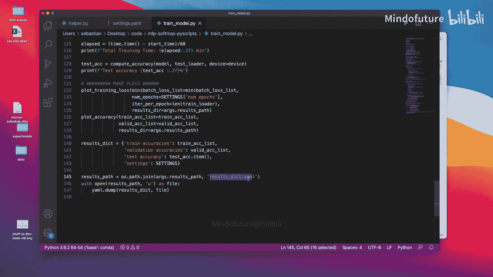

**关键点**：只需修改这个文件即可调整超参数，无需触碰Python代码。使用`pyyaml`库可以轻松将其加载为Python字典。

## 运行训练脚本

在终端中，使用以下命令运行脚本：

```bash
python train_model.py settings.yaml ./results
```

*   **`settings.yaml`**：配置文件的路径。
*   **`./results`**：用于保存日志、图表和结果文件的目录。

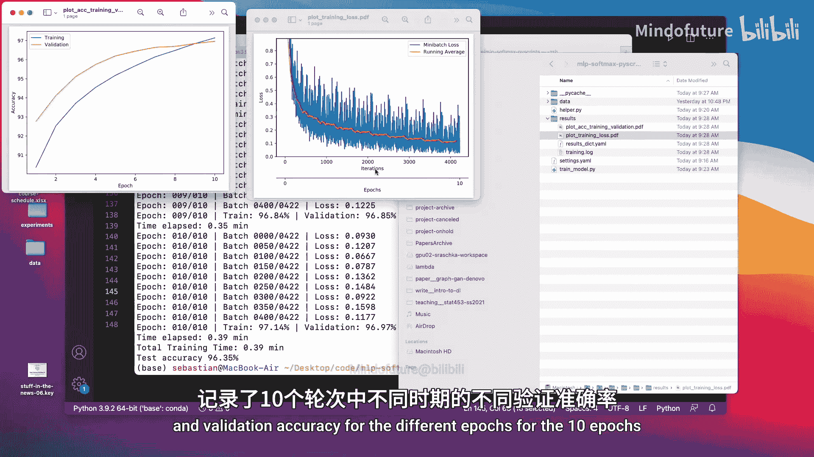

脚本运行后，会在`./results`目录下生成：
*   **`training.log`**：包含所有打印输出的日志文件。
*   **`loss_accuracy_plot.png`**：训练过程中的损失和准确率曲线图。
*   **`results.yaml`**：包含最终测试准确率和所有使用的设置的YAML文件。

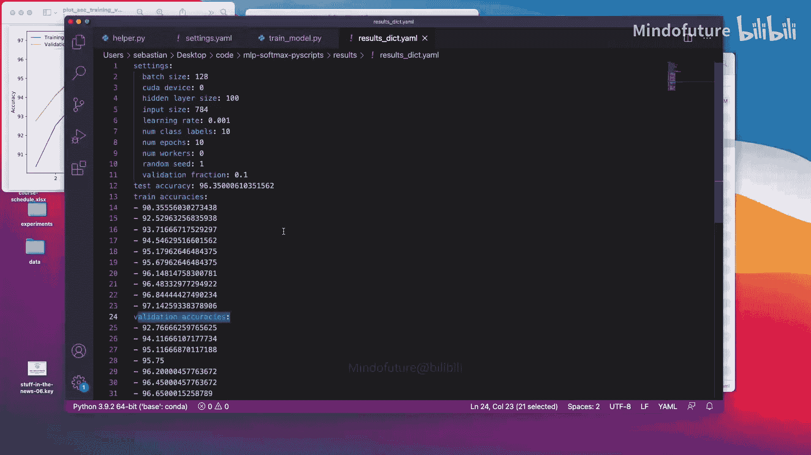

## 在Jupyter Notebook中复用模块化代码

即使在交互式环境中，也可以利用这种模块化结构来保持笔记本的简洁。

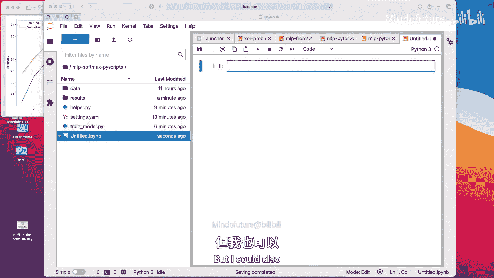

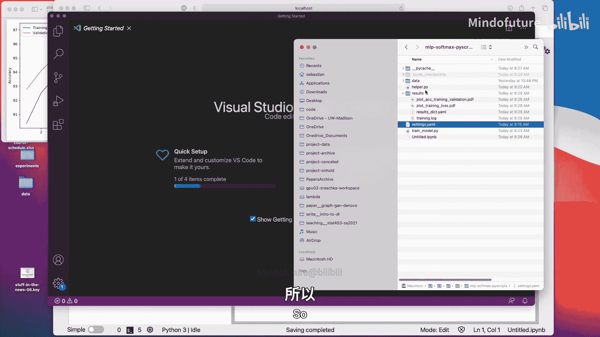

```python
# 在Jupyter Notebook的一个单元格中
import sys
sys.path.append(‘.’) # 确保可以导入当前目录下的模块

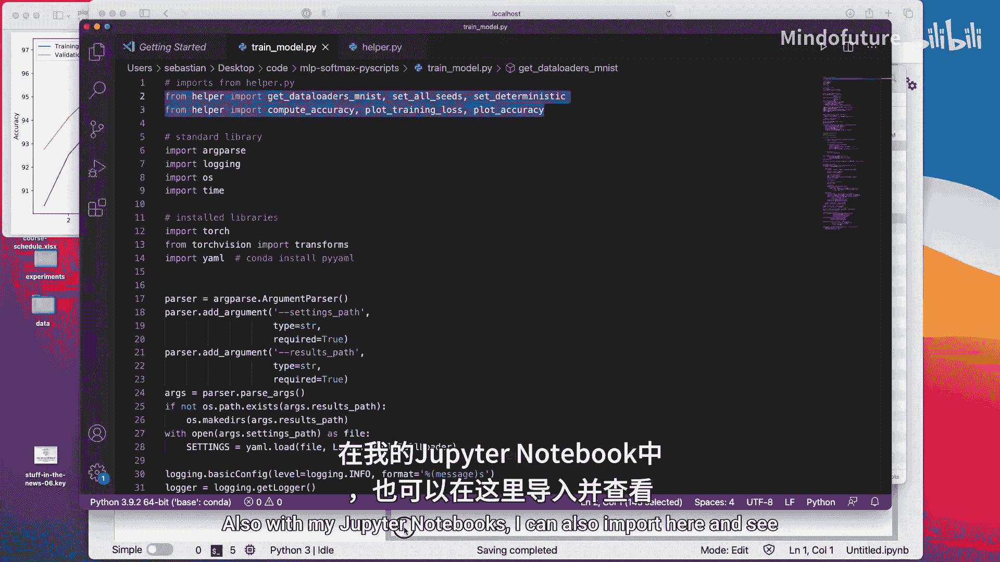

from helper import data_loader, set_deterministic, compute_accuracy
import yaml

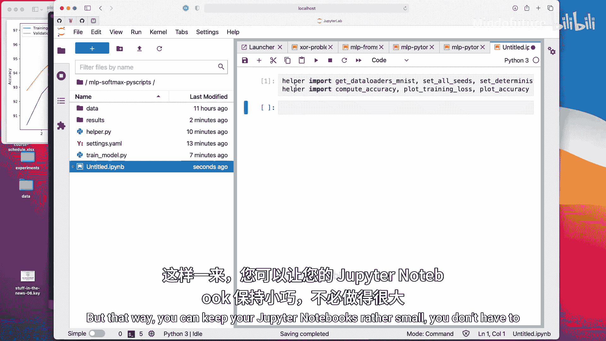

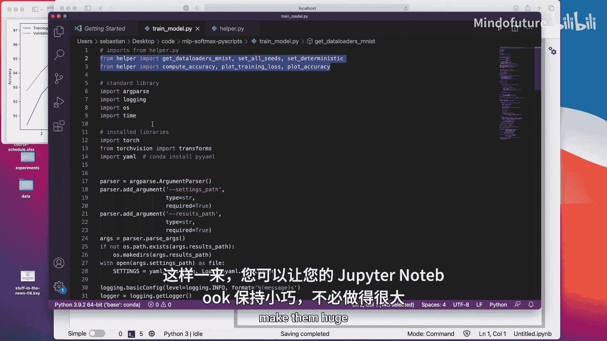

# 加载设置（替代从命令行读取）
with open(‘settings.yaml’, ‘r’) as f:
    settings = yaml.safe_load(f)

# 之后的使用方式与脚本中完全相同
set_deterministic(settings[‘random_seed’])
train_loader, valid_loader, test_loader = data_loader(settings[‘batch_size’])
# ... 继续你的训练代码 ...
```

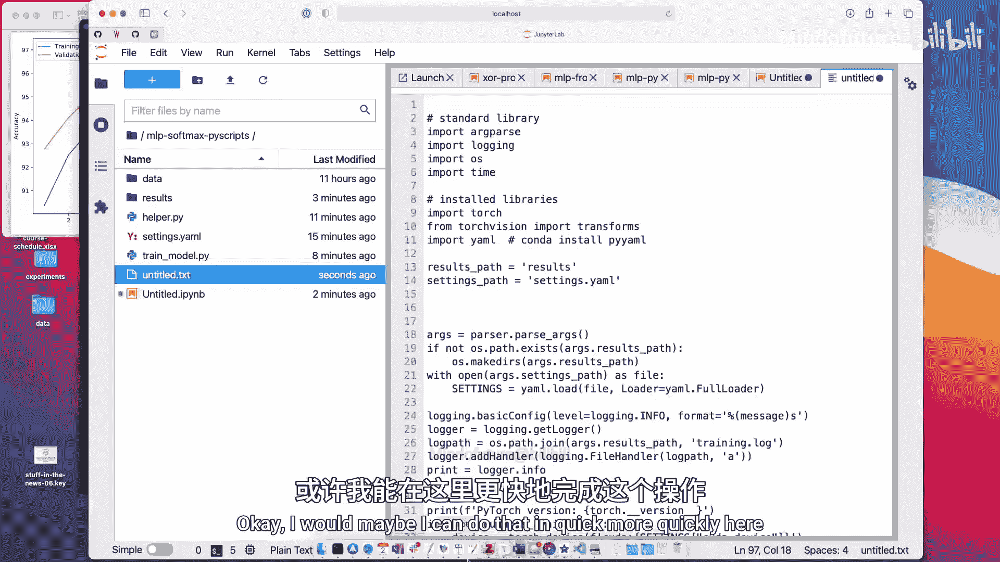

**关键点**：通过导入`helper.py`中的函数，可以避免在Notebook中粘贴大量重复的辅助代码，使Notebook专注于实验逻辑和结果展示。

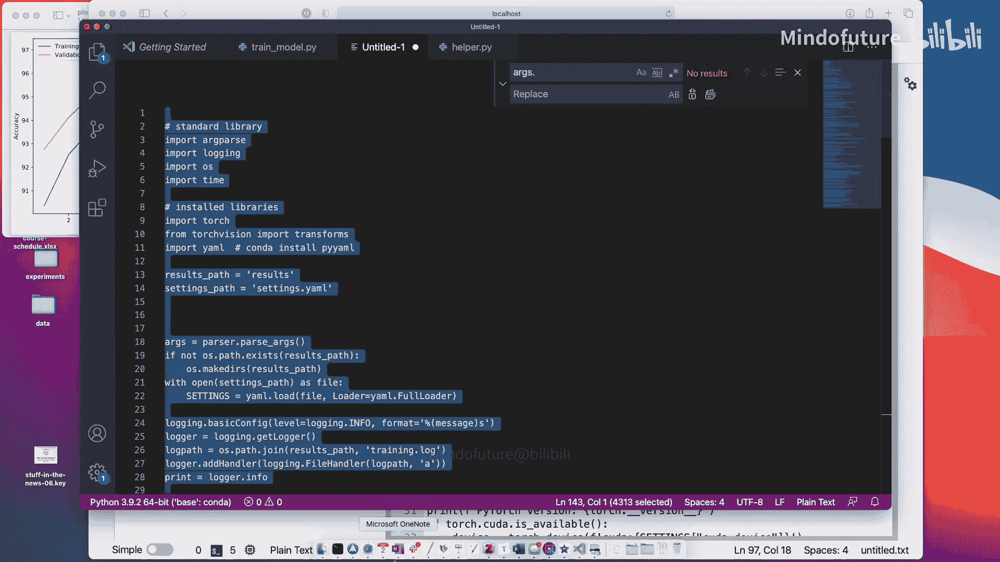

---

## 总结

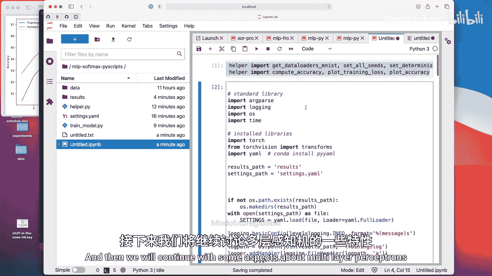

本节课中我们一起学习了如何将PyTorch训练代码组织成专业的项目结构。我们介绍了将代码拆分为主脚本、辅助模块和配置文件的方法，并演示了如何通过命令行运行脚本以及如何在Jupyter Notebook中复用模块化代码。这种结构化的方法有助于管理复杂的项目，保持代码的整洁、可维护和可复现性。