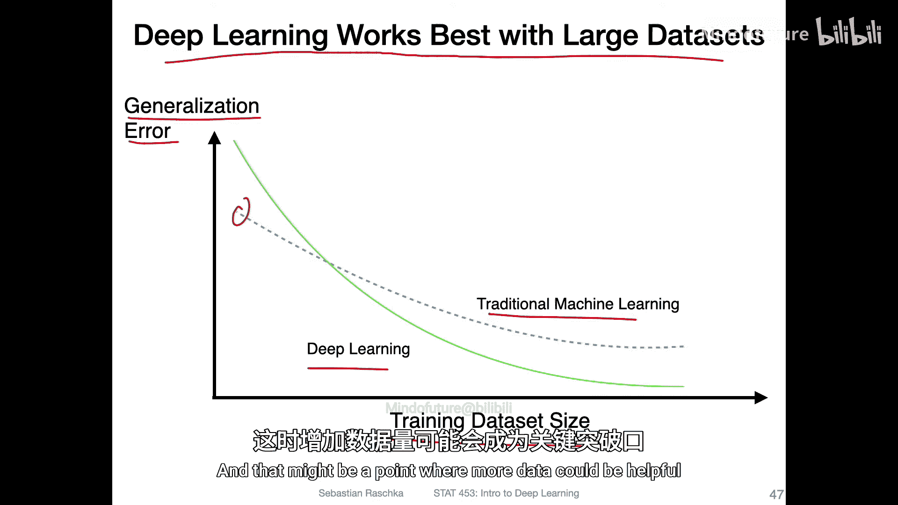
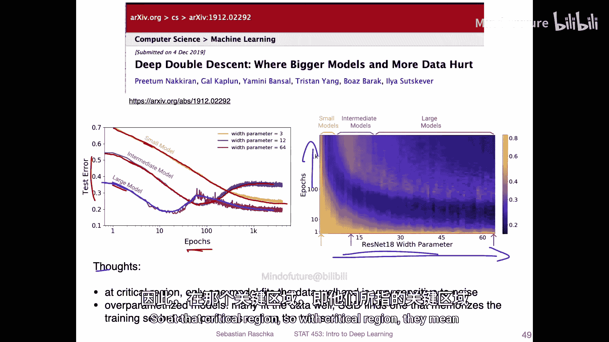
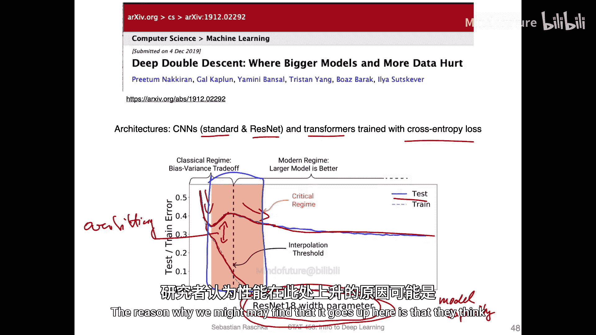
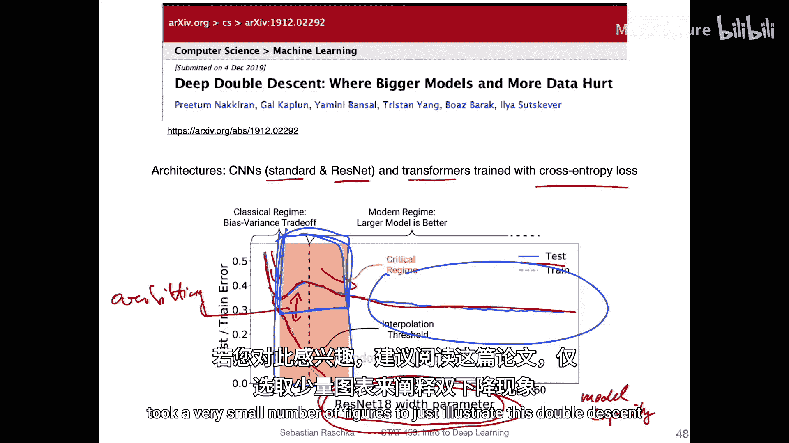
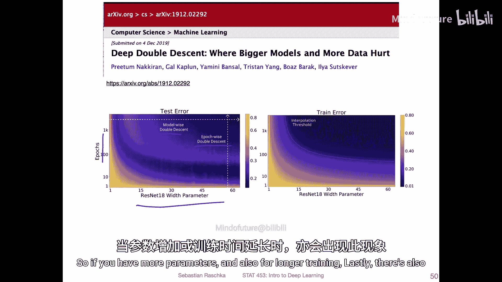
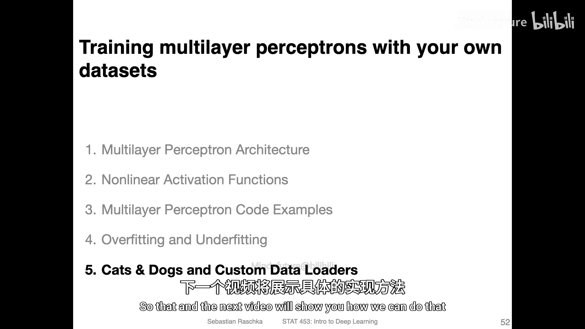

# 068：过拟合与欠拟合 🎯

在本节课中，我们将要学习机器学习中的两个核心概念：**过拟合**与**欠拟合**。我们将探讨模型过于简单或过于复杂时会出现的问题，并了解如何通过偏差-方差分解来理解这些现象。最后，我们还将介绍一种在深度学习中常见的“双下降”现象。

---

## 模型复杂度与性能

上一节我们介绍了逻辑回归和多层感知机等模型。本节中，我们来看看模型复杂度如何影响其性能。

模型过于简单（如逻辑回归）的主要问题是性能不佳。例如，在MNIST数据集上使用逻辑回归，我们得到了93%的准确率，而更复杂的模型可能表现更好。

模型过于复杂（如具有过多特征的多层感知机）则可能“过度拟合”数据，即过分关注训练集中的特定细节，导致在未见过的测试数据上表现变差。

---

## 理解模型错误

在深入理论之前，先查看模型在MNIST数据集上的错误预测案例是有益的。这有助于我们理解数据的模糊性以及模型可能遇到的困难。

以下是几个MNIST数据集中容易混淆的数字示例：

*   **图像1**：真实标签是8，但模型预测为4。图像看起来确实有点像4。
*   **图像2**：真实标签是2，但模型预测为7。手写的2有时与7相似。
*   **图像3**：真实标签是5，但看起来也像3。
*   **图像4**：真实标签是6，但可能被误认为是0。

这些例子表明，即使是人类，有时也难以准确识别某些手写数字，因此模型要达到100%的准确率几乎是不可能的。可视化错误预测有助于发现数据标签问题或理解模型的困惑点。

---

## 过拟合与欠拟合的定义

现在，我们来正式定义过拟合与欠拟合。

*   **过拟合**：指模型过度记忆了训练集中特有的细节和噪声，导致其在训练集上表现优异，但在新的、未见过的数据（如测试集）上泛化能力差。
*   **欠拟合**：指模型过于简单，无法捕捉数据中的基本趋势和模式，导致其在训练集和测试集上的表现都不佳。

我们可以通过绘制误差随模型容量变化的曲线来直观理解这两个概念。

**模型容量**通常指模型的参数数量或拟合复杂数据集的能力。例如，拥有更多隐藏层或更宽隐藏层的模型具有更高的容量。

在误差-容量曲线中：
*   **训练误差**（橙色线）通常随着模型容量增加而下降。
*   **泛化误差**（蓝色线，通常用测试集误差估计）则呈现先下降后上升的“U”形趋势。
    *   在容量较低的区域，模型过于简单，训练和测试误差都较高，属于**欠拟合**。
    *   在容量过高的区域，训练误差很低，但测试误差很高，两者差距大，属于**过拟合**。

---

## 偏差与方差分解

在实践中，人们也常用**偏差**和**方差**来讨论过拟合与欠拟合。这源于对回归模型平方误差的分解。

假设我们有一个回归模型，其预测值为 `\hat{\theta}`，真实值为 `\theta`。我们想象拥有大量不同的训练集，并在每个训练集上训练一个模型。

*   **偏差**：衡量模型预测值的**期望**（即所有模型预测的平均值）与真实值之间的差距。它反映了模型的系统性误差。
    *   `Bias = E[\hat{\theta}] - \theta`
*   **方差**：衡量单个模型的预测值围绕其期望值的离散程度。它反映了模型对训练数据扰动的敏感性。
    *   `Variance = E[(\hat{\theta} - E[\hat{\theta}])^2]`

一个形象的比喻是射箭：
*   **高偏差**：所有箭都射偏了（但可能扎堆），意味着瞄准有问题（模型本身不对）。
*   **高方差**：箭落点非常分散，意味着每次射击稳定性差（模型对数据变化过于敏感）。

**偏差和方差与过拟合/欠拟合的关系如下：**
*   **高偏差，低方差**：通常对应**欠拟合**。模型过于简单，预测不准确但稳定。
*   **低偏差，高方差**：通常对应**过拟合**。模型过于复杂，对训练数据拟合很好（偏差低），但对微小变化敏感，导致预测不稳定（方差高）。

在误差-容量曲线中：
*   随着容量增加，**偏差**下降。
*   随着容量增加，**方差**上升。

---

## 深度学习的实践与数据需求

在深度学习中，由于数据集通常很大，我们最常用的模型评估方法是**保留法**，即将数据分为三部分：
1.  **训练集**：用于训练模型。
2.  **验证集**：用于在训练过程中调整超参数和监控模型性能，防止过拟合。
3.  **测试集**：仅在最终评估时使用一次，以得到模型泛化能力的无偏估计。

深度学习模型通常参数量巨大，因此需要大量数据才能良好工作。与传统机器学习方法相比：
*   在**小数据集**上，传统方法（如决策树、SVM）往往表现更好。
*   在**大数据集**上，深度学习的性能提升更为显著，其误差随数据量增加而下降的曲线更陡峭。

---

## 有趣的现象：双下降

近年来，研究者们在训练大型神经网络时观察到了一个有趣的现象，称为“**双下降**”。

传统的认知是，随着模型容量增加，测试误差会先下降（欠拟合区域），后上升（过拟合区域）。但“双下降”现象显示，当模型容量**极大**时，测试误差会再次下降。

同样，在训练周期（epoch数）方面也存在“epoch-wise双下降”：对于某些规模的模型，延长训练时间会先使测试误差下降，然后上升，最后可能再次下降。

**一种理论解释是**：
*   在模型容量“临界区域”，可能只有一种特定的权重配置能完美拟合数据，但这个解对噪声非常敏感，不易找到且泛化差。
*   在“过参数化”区域（模型极大），存在**许多**能很好拟合训练数据且泛化性能佳的权重配置。随机梯度下降算法更可能找到其中一个，从而同时实现低训练误差和低测试误差。

虽然其根本原因尚未完全明晰，但这一现象挑战了“模型越大越容易过拟合”的简单观念，并表明在足够大的模型和充足的数据下，持续增加容量可能是有益的。

---

## 总结

本节课中我们一起学习了：
1.  **过拟合**与**欠拟合**的核心概念及其在误差-容量曲线上的表现。
2.  通过**偏差-方差分解**来理解模型误差的构成，以及它们与过拟合/欠拟合的关联。
3.  深度学习实践中常用的**训练集-验证集-测试集**评估方法。
4.  深度学习模型对**大数据集**的依赖。
5.  介绍了前沿研究中观察到的“**双下降**”现象，它揭示了超大型神经网络可能具有意想不到的良好泛化特性。

理解这些概念是构建有效机器学习模型的基础。在接下来的课程中，我们将学习如何将这些理论应用于实践，例如使用自定义数据集训练多层感知机。