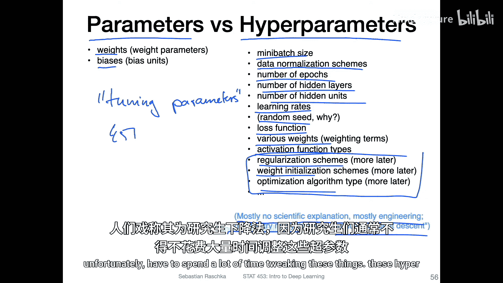
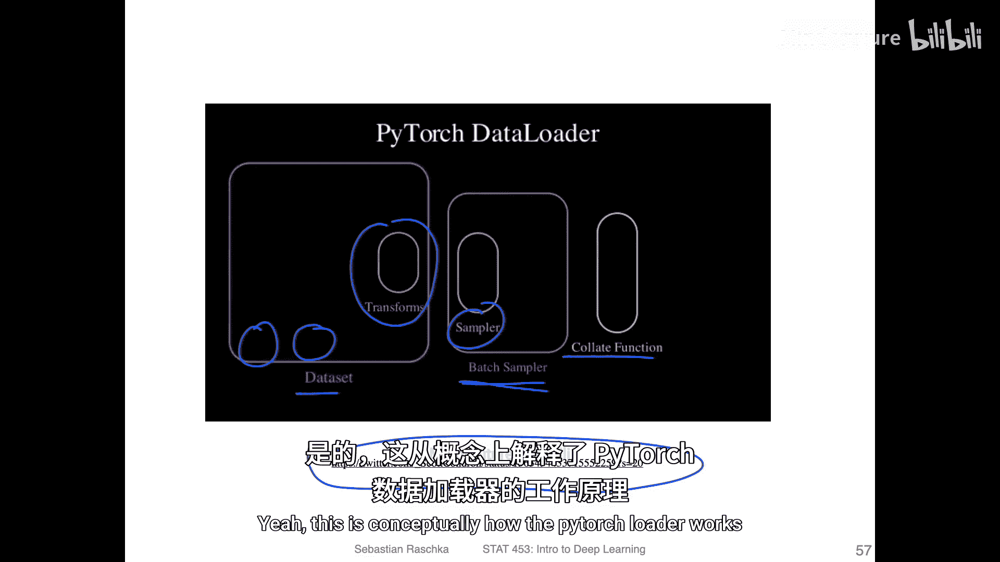
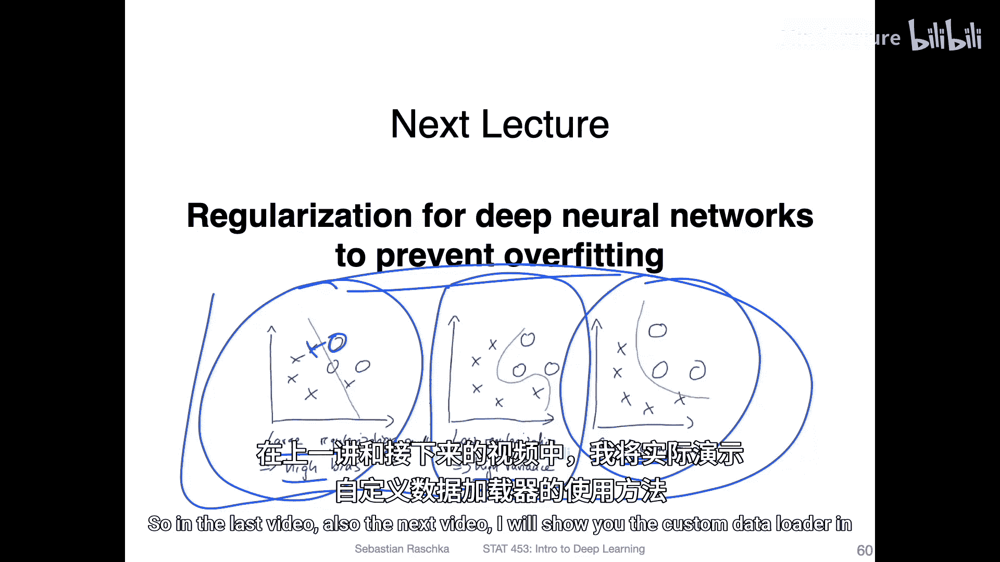

# 069：猫狗分类与自定义数据加载器 🐱🐶

在本节课中，我们将学习如何为猫狗图像分类任务创建自定义数据加载器。我们将探讨数据加载器的工作原理、训练/验证/测试集的划分，以及如何监控模型训练过程。此外，我们还会简要介绍超参数的概念，并预览下一讲将讨论的正则化技术。

---

## 数据加载器与数据集划分 📊

上一节我们介绍了多层神经网络的基础。本节中，我们来看看如何为实际任务（如猫狗分类）准备数据。首先，我们需要理解数据加载器的作用。

数据加载器负责从数据集中抽取样本，进行必要的转换（如缩放、归一化），并将它们组织成小批量，以供模型训练使用。在PyTorch中，数据加载器的工作流程可以概念化如下：

1.  **数据集**：包含输入（如图像）和标签（如“猫”或“狗”）。
2.  **转换**：对输入数据应用预处理步骤。
3.  **采样器**：从数据集中抽取单个样本对。
4.  **批量采样器**：将多个样本对组合成一个批次。
5.  **整理函数**：将批次内的样本整理成模型可接受的张量格式。

这个过程确保每个epoch中，每个样本都被使用一次，并且顺序通常是随机的（如果启用了`shuffle`参数）。

---

## 训练、验证与测试集 🎯

在训练模型时，将数据划分为三个独立的部分至关重要：训练集、验证集和测试集。

*   **训练集**：用于训练模型参数（如权重和偏置）。我们通过反向传播算法在此数据上学习。
*   **验证集**：用于在训练过程中评估模型性能，调整超参数，并检测过拟合。它提供了模型泛化能力的粗略估计。
*   **测试集**：仅在最终评估时使用一次，以获得模型在未见数据上性能的无偏估计。

以下是划分数据的一个常见比例示例：

```python
# 示例比例：80% 训练，5% 验证，15% 测试
train_ratio = 0.80
val_ratio = 0.05
test_ratio = 0.15
```

实际比例可以根据数据集大小和需求调整，但核心原则是保持测试集的独立性。

---

## 监控训练与过拟合 📉

在训练过程中，同时绘制训练集和验证集上的损失与准确率曲线非常有用。

*   理想情况下，训练损失应持续下降，训练准确率应持续上升。
*   如果验证损失在初期下降后停滞甚至上升，而训练损失持续下降，则表明模型正在**过拟合**。这意味着模型过于复杂，记住了训练数据的噪声，而非学习通用模式。

例如，在猫狗分类任务中，训练准确率可能达到97%，而验证准确率停滞在88%左右。这明确指示了过拟合现象。验证集的作用正是在此：它让我们无需动用测试集就能及早发现问题。

---

## 参数与超参数 ⚙️

理解以下两个概念的区别非常重要：

*   **参数**：模型从训练数据中学习到的值，例如神经网络中的**权重（W）**和**偏置（b）**。更新公式通常为：`W_new = W_old - learning_rate * gradient`。
*   **超参数**：在训练开始前由人工设定的配置选项。它们控制着训练过程本身。无法通过训练数据直接学习。



常见的超参数包括：
*   学习率
*   批量大小
*   训练周期数
*   网络层数及各层神经元数量
*   激活函数类型（如ReLU, Sigmoid）
*   优化算法选择
*   数据归一化方法

选择好的超参数通常需要经验和实验，有时被称为“研究生下降法”，因为需要大量尝试。

---

## 工具与正则化预览 🛠️

为了更便捷地监控训练过程，可以使用一些工具，例如：
*   **TensorBoard**：原为TensorFlow设计，现已兼容PyTorch。
*   **MLflow**：用于管理机器学习生命周期。



最后，由于深度神经网络参数众多，容易过拟合，我们将在下一讲重点讨论**正则化技术**。正则化通过有意简化模型来防止过拟合，帮助我们在模型复杂度和泛化能力之间找到平衡。

---



本节课中，我们一起学习了如何为自定义数据集创建数据加载器，理解了训练集、验证集和测试集的划分及其重要性，学会了通过损失/准确率曲线识别过拟合，并区分了模型参数与超参数。这些是构建和评估稳健深度学习模型的基础步骤。在接下来的课程中，我们将深入探讨如何通过正则化等技术来应对过拟合的挑战。