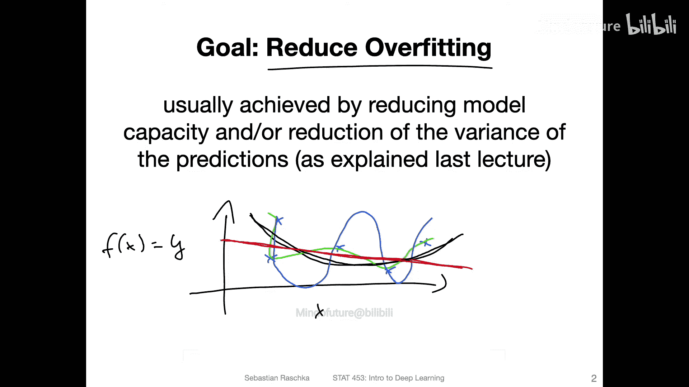
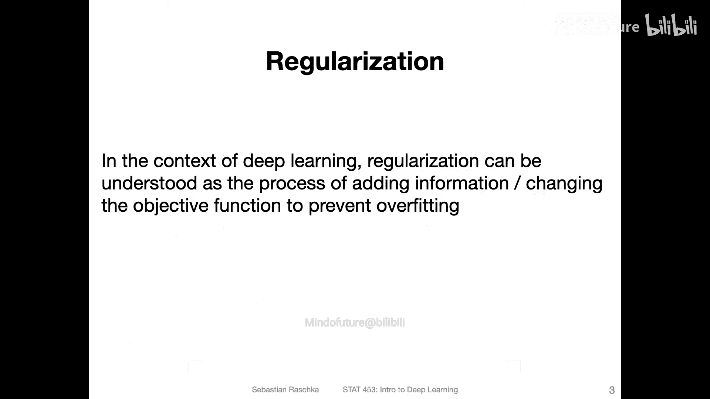
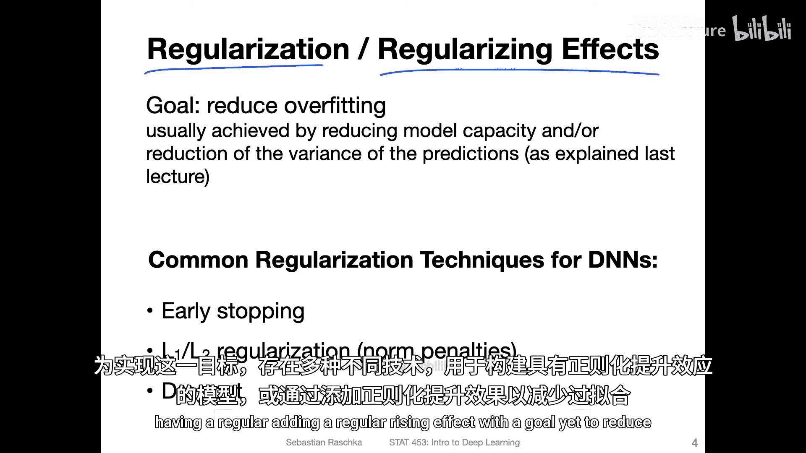
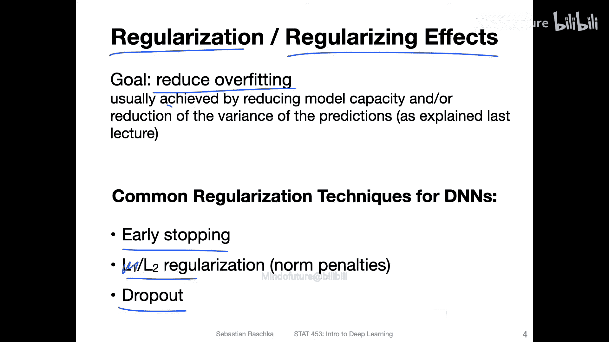
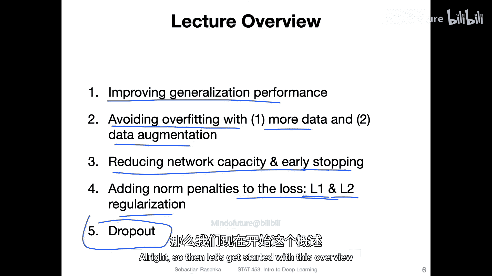

# 072：神经网络的正则化方法 🧠

在本节课中，我们将学习如何通过正则化技术来改善神经网络的训练效果，核心目标是减少过拟合。我们将从数据增强开始，然后探讨一系列正则化方法，包括早期停止、L2正则化以及最常用的Dropout技术。这些技术通过修改模型结构或训练过程，旨在提升模型的泛化能力。

---

## 概述：改善泛化性能的技术 📋

上一节我们介绍了多层感知机，现在我们来探讨如何让神经网络训练得更好。本节将概述一系列可用于提升模型泛化性能的技术。虽然本课程无法涵盖所有方法，但了解这些方向对您的项目实践会很有帮助。

以下是部分常见技术：
*   **数据相关方法**：获取更多数据、数据增强。
*   **模型相关方法**：降低模型复杂度（减少网络容量）、早期停止。
*   **损失函数修改**：添加惩罚项，如L1、L2正则化。
*   **训练过程修改**：如Dropout、不同的权重初始化方案、批量归一化、选择不同的优化器等。

---

## 避免过拟合：添加与修改数据 📈

在上一节概述之后，我们首先来看两种直接且有效的方法：获取更多数据和修改现有数据。

### 1. 添加更多数据
获取更多训练数据是缓解过拟合最直接的方法之一。更多的数据可以帮助模型学习到更一般化的模式，而不是记住训练集中的噪声。

### 2. 修改现有数据（数据增强）
当无法获取新数据时，我们可以通过对现有训练数据进行合理的变换来“创造”新样本。这能以极低的成本增加数据多样性，使模型对数据中的微小扰动更加鲁棒。

例如，在图像数据集中，我们可以进行以下变换：
*   随机将图像向左或向右旋转一个小角度。
*   水平或垂直翻转图像。
*   调整图像的亮度、对比度。
*   进行随机裁剪。

---

## 避免过拟合：降低模型复杂度与早期停止 ⏹️

除了处理数据，我们还可以从模型本身入手。本节介绍两种通过控制模型复杂度来防止过拟合的方法。

### 1. 降低模型复杂度（网络容量）
减少神经网络中隐藏层的数量或每层神经元的数量，可以直接降低模型的表示能力。一个更简单的模型更不容易拟合训练数据中的噪声，但需要注意避免模型过于简单而导致欠拟合。

### 2. 早期停止
这种方法在训练过程中监控模型在验证集上的性能。当验证集性能不再提升甚至开始下降时，即使训练损失仍在降低，我们也停止训练。这可以防止模型过度学习训练集中的特定模式。

然而，考虑到上一节课提到的“双重下降”现象，在实践中可能不再强烈推荐严格依赖早期停止。

---

## L1与L2正则化 ⚖️

上一节我们提到了通过修改损失函数来正则化模型，其中最经典的技术就是L1和L2正则化。本节我们来详细看看它们。

L1和L2正则化通过在损失函数中添加一个与模型权重相关的惩罚项来实现。这个惩罚项会鼓励模型保持较小的权重，从而限制模型的复杂度，起到平滑预测函数、减少方差的作用。

### L2正则化（权重衰减）
L2正则化在原始损失函数上添加了所有权重平方和（L2范数）的惩罚项。这会使权重趋向于变小且分布更均匀。

**公式**：`总损失 = 原始损失 + λ * Σ(权重²)`
其中，`λ` 是控制正则化强度的超参数。



### L1正则化
L1正则化添加的是所有权重绝对值之和（L1范数）的惩罚项。这倾向于产生稀疏的权重矩阵，即许多权重会变为零，从而可能实现特征选择。

**公式**：`总损失 = 原始损失 + λ * Σ|权重|`



在深度学习领域，L2正则化比L1更常见，但两者都不如接下来要介绍的Dropout方法使用广泛。



---



## Dropout：随机丢弃神经元 🎲

最后，我们介绍当前深度学习中最常用的一种正则化技术——Dropout。它通过在训练过程中随机“关闭”网络中的一部分神经元来工作。

Dropout的核心思想是：在每次训练迭代中，以前向传播和反向传播时，网络中的每个神经元都有一定概率被临时丢弃（将其输出置零）。这意味着：
1.  网络不能过于依赖任何一个特定的神经元或特征，因为它在任何时候都可能失效。
2.  每一次迭代都在训练一个略有不同的“子网络”，最终效果相当于对多个不同网络结构的预测进行了平均集成。

这种方法强制网络学习到更鲁棒的特征，因为特征必须分布在多个神经元上，从而有效减少过拟合。


**代码概念**：
```python
# 在训练阶段，对某一层的输出应用Dropout
# p 是神经元被保留的概率，例如 0.8
layer_output = torch.nn.functional.dropout(layer_output, p=0.8, training=True)

# 在测试或推理阶段，不使用Dropout，但通常会将权重乘以保留概率p以进行缩放
# （某些框架的Dropout层会自动处理此缩放）
```

---

## 总结 🎯

本节课我们一起学习了多种用于神经网络的正则化方法，旨在减少过拟合、提升模型的泛化能力。

我们首先了解了通过**添加数据**和**数据增强**来从数据层面增加多样性。然后，探讨了通过**降低模型复杂度**和**早期停止**来控制模型本身。接着，回顾了经典的**L1和L2正则化**方法，它们通过向损失函数添加惩罚项来约束权重。最后，重点介绍了目前最流行的**Dropout**技术，它通过在训练中随机丢弃神经元来防止网络对特定路径产生依赖。



记住，正则化是一个广泛的术语，在机器学习中常指任何旨在降低泛化误差而非训练误差的算法修改。在实践中，这些技术常常组合使用，以训练出更强大、更稳健的深度学习模型。