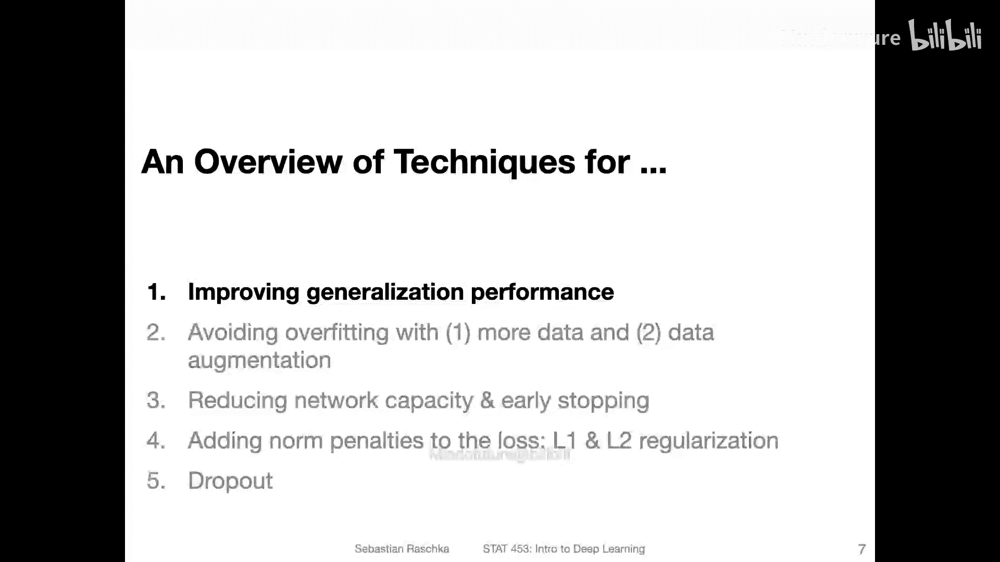
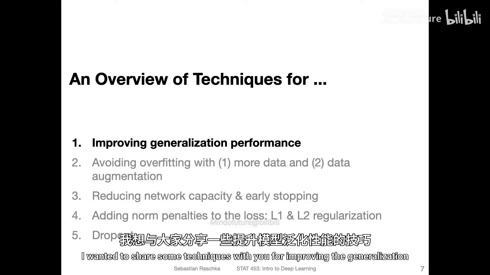
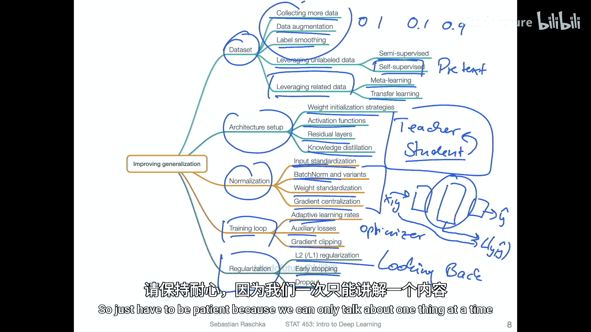
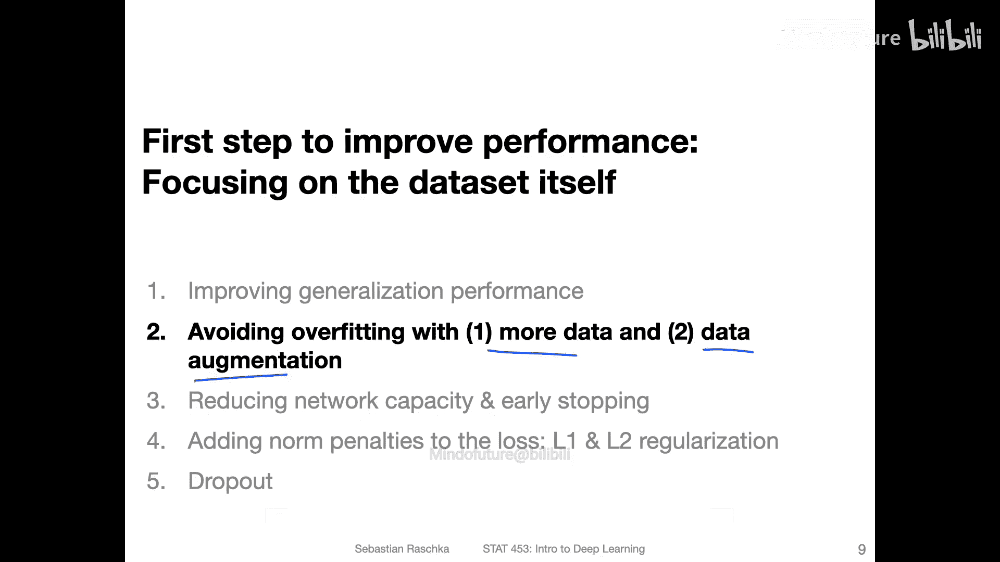

# 073：减少过拟合的技术 🛡️

在本节课中，我们将要学习一系列用于提升模型泛化性能、减少过拟合的技术。我们将从宏观角度对这些技术进行分类和概述，帮助你建立一个全面的认识。

上一节我们讨论了过拟合问题，本节中我们来看看有哪些具体的技术可以帮助我们解决这个问题。

## 数据相关技术

首先，我们来看与数据本身相关的技术。这些技术通过修改数据集的特征、标签，或利用新数据来提升模型性能。

以下是数据相关技术的列表：

*   **收集更多数据**：如果条件允许，收集更多数据通常是提升模型性能最有效的方法之一。在下一个视频中，我将展示一个图表，帮助你判断获取更多数据是否有用。
*   **数据增强**：通过修改输入特征来扩充数据集，例如旋转图像。这将在下一个视频中详细讨论。
*   **标签平滑**：防止分类器变得过于自信。具体做法是，不使用硬标签（如0和1），而使用更软的版本（如0.1和0.9）。这在生成对抗网络的背景下被证明是有效的，在某些分类场景中也可能有积极作用。
*   **利用未标注数据**：
    *   **半监督学习**：首先在已标注数据子集上训练分类器，然后将其应用于未标注数据。如果分类器对某些未标注数据的预测非常自信，则可以考虑将这些预测标签视为真实标签，从而扩大训练集。
    *   **自监督学习**：通过创建一个“前置任务”来利用未标注数据，例如将图像分割成小块并训练网络预测其正确顺序。这超出了本课程的范围，可能是未来高级课程的主题。
*   **利用相关数据**：
    *   **元学习**：从多个不同的小数据集中学习如何学习，这在少样本学习中很常见。另一种定义是从元数据中学习。
    *   **迁移学习**：在一个大型相关数据集上训练模型，然后将该模型微调到目标任务的小型数据集上。我们将在本课程后面简要讨论。

## 架构相关技术

接下来，我们看看与神经网络架构设计相关的技术。这些技术关注如何构建和初始化网络。

以下是架构相关技术的列表：

*   **权重初始化策略**：我们将在本课程中讨论。
*   **选择激活函数**：例如ReLU激活函数，我们上周已经讨论过。
*   **残差层**：有时被称为跳跃连接，通过跳过某些层来添加连接，有助于避免梯度消失和爆炸问题。我们将在后续课程中讨论。
*   **知识蒸馏**：训练一个大型的“教师”网络，然后让一个较小的“学生”网络学习预测教师网络的输出。这超出了本课程的范围。

## 归一化技术

归一化技术对于稳定和加速训练过程至关重要。

以下是归一化技术的列表：

*   **输入标准化**：我们已讨论过，下一个视频在展示数据增强时会再次提及。
*   **批量归一化**：不仅标准化网络输入，还标准化隐藏层的激活输入。本课程未来讲座将讨论其变体，如组归一化、实例归一化和层归一化。
*   **权重标准化**：与权重初始化相关，但也有专门的技术。
*   **梯度中心化**：类似于输入标准化，但对梯度进行归一化，使其均值为零、方差为一。

## 训练过程技术

现在，我们转向修改训练过程本身的技术，包括优化器和损失函数的设计。

以下是训练过程技术的列表：

*   **优化器**：除了自适应学习率优化器，还有其他类型。我们将在后续讲座中详细讨论。
*   **辅助损失**：在网络的中间层添加额外的损失函数。例如，Inception网络在卷积网络部分会讨论，它结合了网络中不同位置的多重损失函数，有助于更好地训练网络。
*   **梯度裁剪**：为避免梯度爆炸，当梯度值过大时，可以将其裁剪到某个最大值。

## 本节重点技术

最后，以下是我们将在本节课程中重点介绍的几种技术：

*   **L2正则化与L1正则化**：通过惩罚大的权重来帮助获得更小的权重，使网络对输入的敏感性降低，从而减少预测的方差。
*   **早停**：通过观察验证集性能来提前停止训练。
*   **丢弃法**：随机丢弃网络中的单元，这是一种为网络添加噪声的方式，也有助于防止过拟合。

本节课中我们一起学习了改善模型泛化性能的多种技术概览。我们将其分为数据、架构、归一化和训练过程等类别，并简要介绍了每种技术的核心思想。虽然我们无法在本课程中涵盖所有细节，但这为你提供了一个宏观的视角。请保持耐心，我们将逐一深入讨论其中的许多技术。

在下一个视频中，我们将通过考虑扩大数据集和增强现有数据来具体讨论如何应对过拟合。