# 074：PyTorch中的数据增强 📈

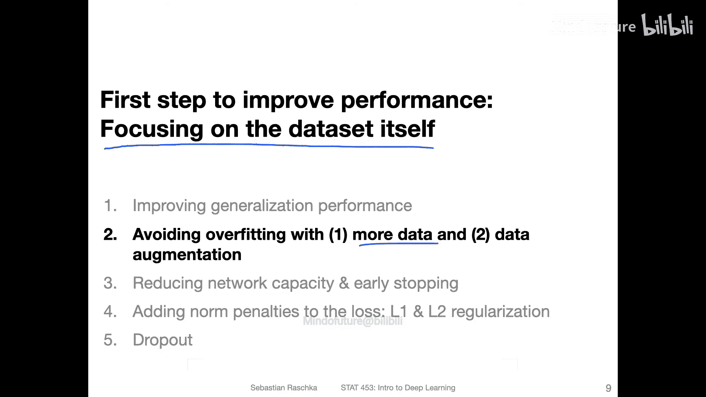

在本节课中，我们将学习两种通过优化数据集来提升模型性能的方法：绘制学习曲线以判断是否需要更多数据，以及使用数据增强技术来扩充现有数据。

---

## 概述：提升模型性能的数据策略

在尝试更复杂的模型架构之前，专注于优化数据集通常是提升模型性能最有效的方法之一。本节将介绍两种核心策略：通过分析学习曲线判断收集更多数据是否有益，以及通过数据增强技术来扩充现有数据。

---

## 方法一：通过学习曲线判断是否需要更多数据

上一节我们讨论了模型评估，本节中我们来看看如何诊断数据量是否足够。一种有效的方法是绘制**学习曲线**。学习曲线可以帮助我们判断，为模型提供更多训练数据是否能进一步提升其性能。

以下是一个使用Softmax分类器在MNIST数据集子集上绘制的学习曲线示例。选择Softmax分类器是因为其训练速度较快，便于快速实验，但此方法同样适用于任何类型的神经网络。


在图中：
*   **X轴**代表不同的训练集大小（从约100个样本到3500个样本）。
*   **Y轴**代表准确率。
*   **测试集**在整个实验过程中保持固定不变。

**观察结果：**
1.  **训练准确率**：随着训练数据量的增加，训练准确率有所下降。这在小数据集上很常见，因为简单模型容易过拟合少量数据，导致初始准确率虚高。
2.  **测试准确率**：随着训练数据量的增加，测试准确率持续上升，这是我们希望看到的结果。同时，训练集与测试集性能之间的差距（即过拟合程度）在缩小。

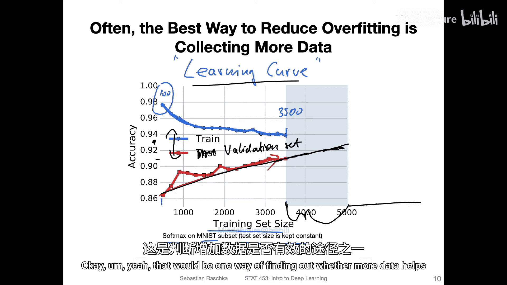

**关键结论：**
观察测试准确率曲线的**斜率**。如果曲线在现有数据量下仍在明显上升（如图中所示），则表明**收集更多数据很可能进一步提升模型性能**。例如，图中趋势暗示，再增加一千个训练样本，可能将准确率从91%提升至93%。

**重要提示：**
在实际操作中，应使用**验证集**而非测试集来绘制学习曲线。测试集应仅在最终模型评估时使用一次，以避免信息泄露。

---

## 方法二：通过数据增强扩充现有数据

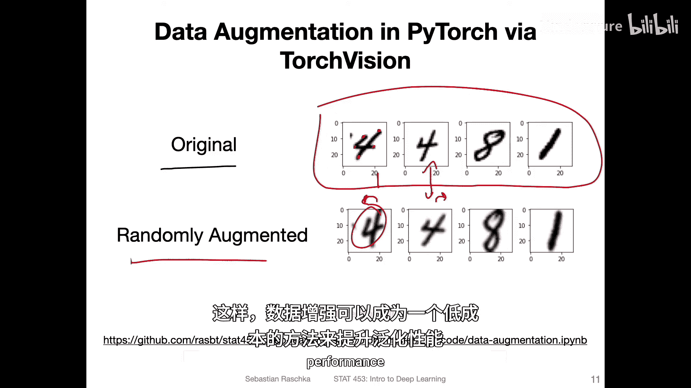

如果收集更多数据成本高昂或不可行，数据增强是一种经济有效的替代方案。数据增强通过对现有训练样本应用一系列随机但合理的变换（如旋转、缩放、平移），来人工创建“新”的训练数据。


上图展示了MNIST原始图像（上方）及其经过随机增强后的版本（下方）。可以看到，增强后的图像在缩放和旋转程度上略有不同。

**数据增强为何有效？**
它迫使模型学习更鲁棒的特征，而不是记忆训练样本中特定的像素位置。例如，一个数字“7”无论轻微向左或向右旋转，都应该被识别为“7”。这有助于模型学习物体的**形状和结构**，而非死记硬背，从而提升其泛化能力。

---

## 在PyTorch中实现数据增强

在PyTorch中，我们可以方便地使用 `torchvision.transforms` 模块来构建数据增强流程。以下是构建训练和测试数据转换管道的步骤。

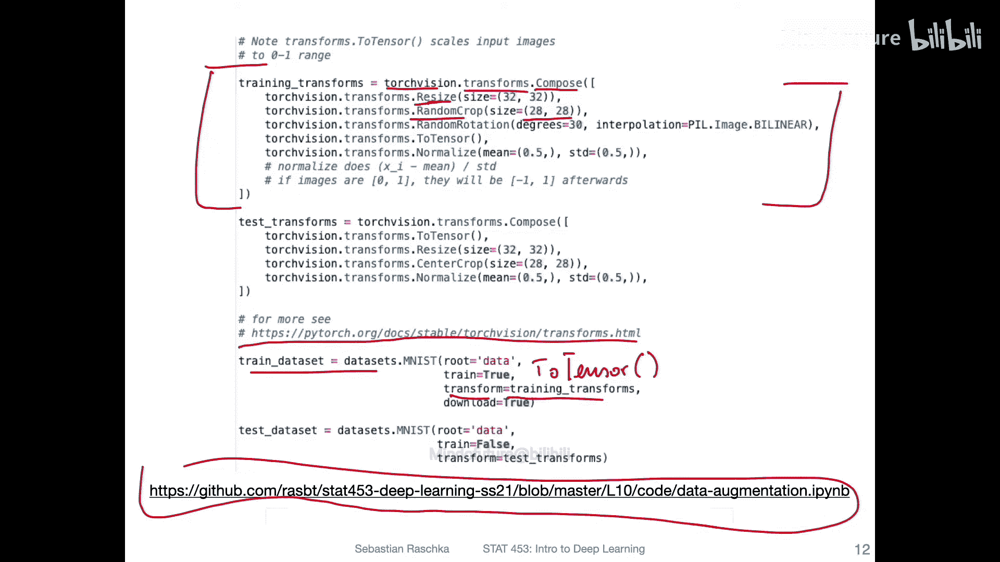

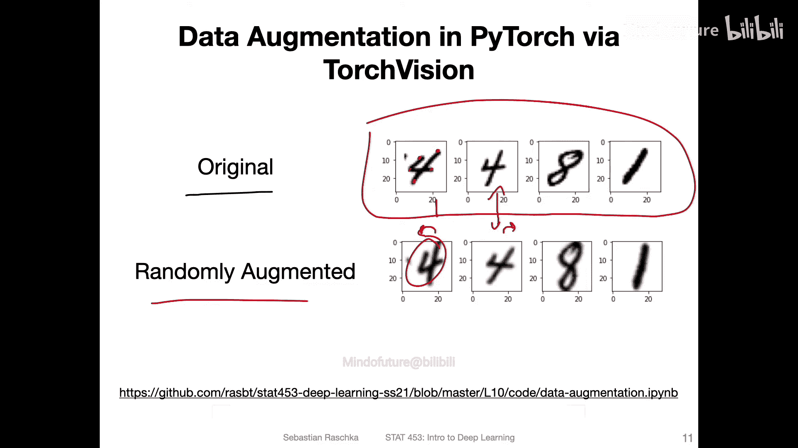

### 1. 训练数据转换管道

训练转换包含随机性，以创造多样化的增强数据。我们使用 `Compose` 来串联多个变换。

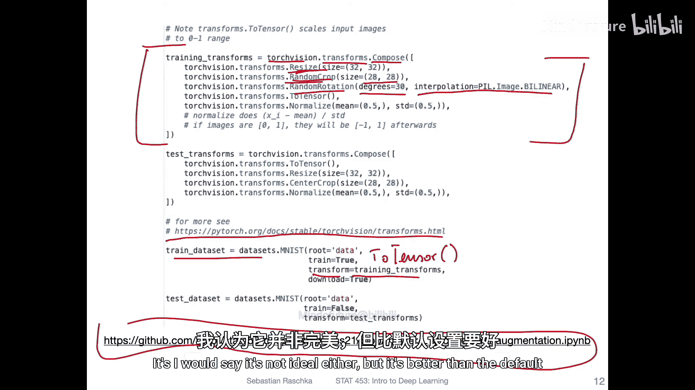

```python
import torchvision.transforms as transforms

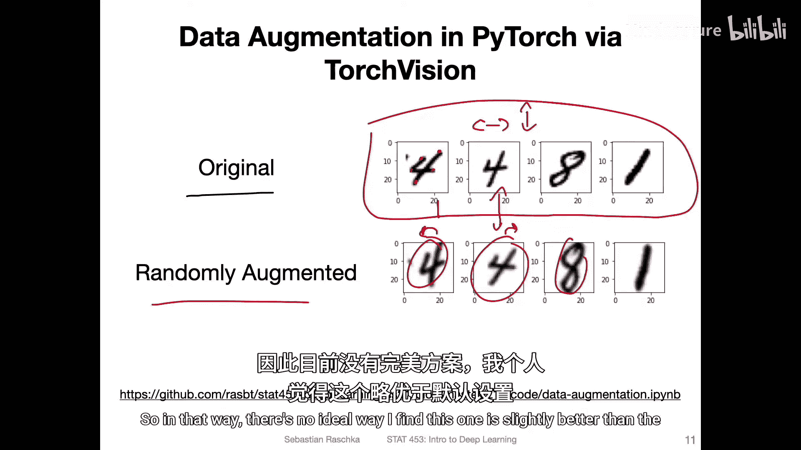

training_transforms = transforms.Compose([
    transforms.Resize((32, 32)),          # 1. 调整大小
    transforms.RandomCrop((28, 28)),      # 2. 随机裁剪
    transforms.RandomRotation(degrees=30, interpolation=transforms.InterpolationMode.BILINEAR), # 3. 随机旋转
    transforms.ToTensor(),                # 4. 转换为张量
    transforms.Normalize(mean=(0.5,), std=(0.5,)) # 5. 标准化
])
```

**各步骤详解：**
1.  **`Resize((32, 32))`**：先将28x28的图像放大到32x32。
2.  **`RandomCrop((28, 28))`**：再从32x32的图像中随机裁剪回28x28的区域。这等效于对图像进行了**随机平移**（上下左右移动）。
3.  **`RandomRotation(degrees=30)`**：对图像进行随机旋转（-30度到+30度之间）。`interpolation=transforms.InterpolationMode.BILINEAR` 参数使用双线性插值，使旋转后的图像边缘更平滑，减少锯齿感。
4.  **`ToTensor()`**：将PIL图像或NumPy数组转换为PyTorch张量，并将像素值从[0, 255]范围缩放到[0.0, 1.0]。
5.  **`Normalize(mean=(0.5,), std=(0.5,))`**：对张量进行标准化，使其具有零均值和单位方差。计算公式为：`normalized_pixel = (pixel - mean) / std`。
    *   对于范围在[0, 1]的像素：`(1 - 0.5) / 0.5 = 1`， `(0 - 0.5) / 0.5 = -1`。
    *   因此，标准化后像素值范围变为**[-1, 1]**，这通常有利于梯度下降算法的稳定性和收敛速度。

### 2. 测试数据转换管道

测试转换**不应包含任何随机性**，以确保评估结果的可重复性和公平性。但为了与训练时的图像处理流程保持一致（例如尺寸），我们仍需要进行一些确定性处理。

```python
test_transforms = transforms.Compose([
    transforms.Resize((32, 32)),
    transforms.CenterCrop((28, 28)), # 使用中心裁剪，而非随机裁剪
    transforms.ToTensor(),
    transforms.Normalize(mean=(0.5,), std=(0.5,))
])
```
注意，这里用 `CenterCrop` 替代了 `RandomCrop`，并且移除了 `RandomRotation`。

### 3. 将转换应用于数据集

创建数据集时，将对应的转换管道传入即可。

```python
from torchvision import datasets


train_dataset = datasets.MNIST(root='./data', train=True, download=True, transform=training_transforms)
test_dataset = datasets.MNIST(root='./data', train=False, download=True, transform=test_transforms)
# 验证集也应使用 test_transforms
```

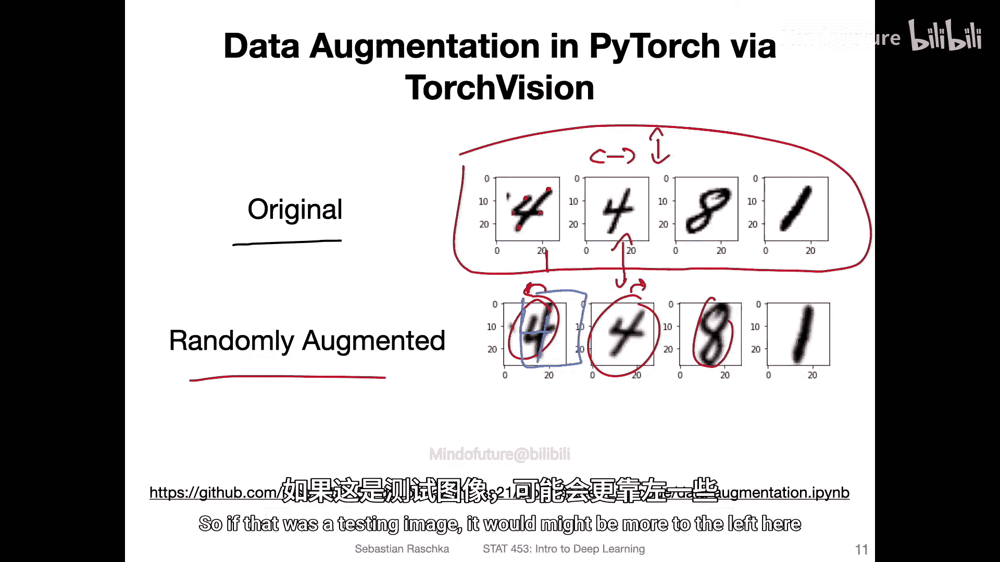

**对于RGB图像的补充说明：**
处理彩色图像（如CIFAR-10, ImageNet）时，标准化需要为每个颜色通道（R, G, B）指定均值和标准差。通常使用一个包含三个数值的元组：
```python
transforms.Normalize(mean=[0.485, 0.456, 0.406], std=[0.229, 0.224, 0.225]) # ImageNet的常用统计值
```
在实践中，可以使用预计算的数据集统计值（如ImageNet的），也可以自行计算训练集的均值和标准差。两者差异通常不大。

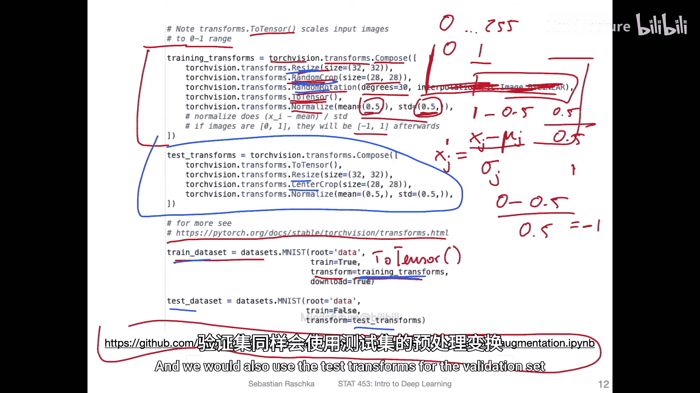

---

## 总结

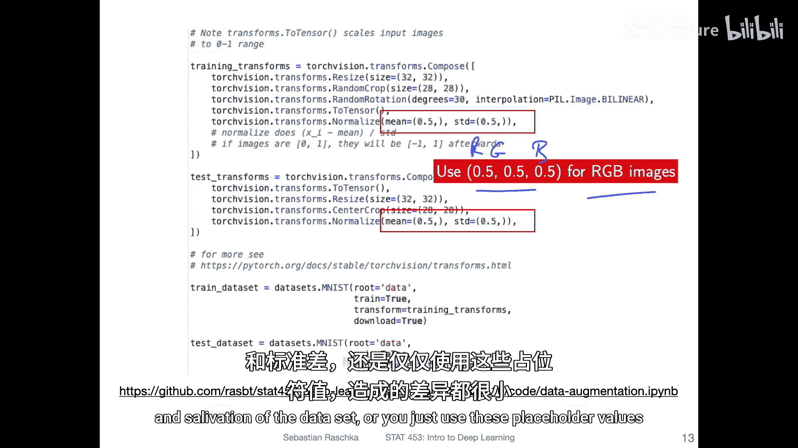

本节课中我们一起学习了两种通过优化数据来提升深度学习模型性能的实用方法：
1.  **绘制学习曲线**：通过分析模型在不同规模训练集上的测试性能变化趋势，科学地判断**收集更多数据**是否必要且有效。
2.  **实施数据增强**：在PyTorch中利用 `torchvision.transforms` 模块，对训练数据应用随机但合理的变换（如缩放、裁剪、旋转），并配合标准化处理。这能有效扩充数据集，提升模型的**泛化能力和鲁棒性**，且成本低廉。切记，测试集的数据转换应保持确定性。

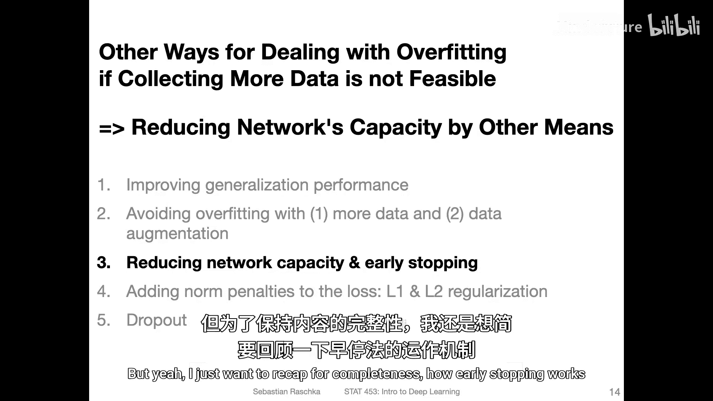

通过将注意力集中在数据本身，我们往往能以更小的代价获得显著的模型性能提升。在接下来的课程中，我们将探讨另一种防止过拟合的重要技术——早停法。