# 076：神经网络的L2正则化 🧠

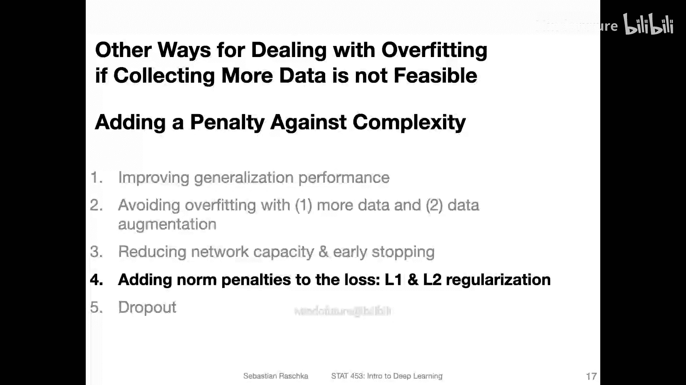

在本节课中，我们将要学习一种防止神经网络过拟合的重要技术——L2正则化。我们将了解它的原理、数学形式、几何意义以及在PyTorch中的实现方法。

---

## 概述：为何需要正则化？🤔

在训练神经网络时，如果模型权重过大，模型可能会对训练数据中的噪声过于敏感，导致过拟合。这意味着模型在训练集上表现很好，但在未见过的测试数据上表现不佳。

考虑一个多层感知机，假设其中某个连接权重 `W1` 非常大。那么，即使其他输入特征权重很小，`W1` 对应的特征也会对网络输出产生巨大影响。这会使模型变得不稳定，对输入数据的微小变化反应过度。

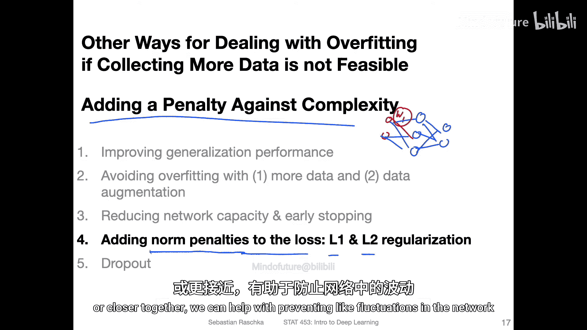

通过向损失函数中添加一个“惩罚项”，我们可以约束权重的大小，使其保持较小且均匀，从而帮助网络减少波动，提高泛化能力。

---

## L1与L2正则化 📏

你可能在统计学课程中听说过L1和L2正则化。它们是在损失函数基础上添加惩罚项的两种常见方法。
*   **L1正则化**： 在Lasso回归中使用，惩罚项是权重的绝对值之和。
*   **L2正则化**： 在岭回归中使用，惩罚项是权重的平方和。它也被称为**权重衰减**，因为大的权重会受到惩罚，从而在训练过程中“衰减”。

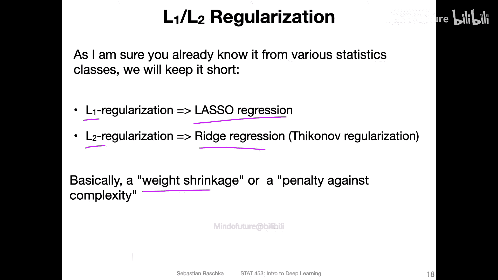

在深度学习中，虽然正则化很重要，但L2正则化并非最核心的技术。不过，理解其原理对掌握模型优化很有帮助。

---

## L2正则化的数学形式 ➗

为了便于理解，我们先以逻辑回归模型为例。其原始的损失函数（如二元交叉熵）为：

`损失 = -log(似然函数)`

L2正则化是在这个原始损失上添加一个额外的惩罚项。新的正则化损失函数如下：

`正则化损失 = 原始损失 + (λ / n) * Σ(权重²)`

让我们分解这个公式：
*   **Σ(权重²)**： 这是所有权重值的平方和。权重越大（无论正负），这项的值就越大，从而增加总损失。
*   **λ (lambda)**： 这是一个**超参数**，称为**正则化强度**。你需要手动选择它的值。λ越大，对权重的惩罚力度就越强。通常使用较小的值，如0.01或0.1。
*   **n**： 训练样本的数量，用于归一化。

这个惩罚项的效果是：在最小化原始损失的同时，也迫使模型保持较小的权重。

---

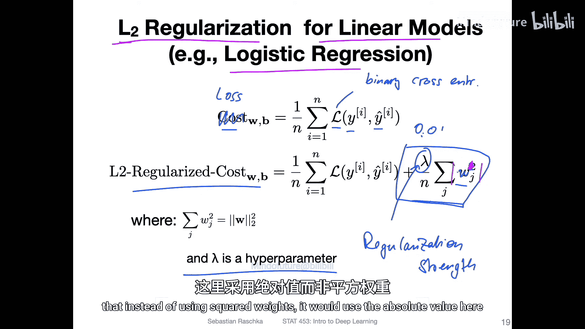

## L2正则化的几何解释 📐

我们可以从几何角度直观理解L2正则化。想象一个只有两个权重的简单模型（忽略偏置项）。

*   **原始损失面**： 我们可以绘制损失函数（如均方误差）关于这两个权值的曲面图。曲面的最低点（谷底）对应使损失最小的最优权重。
*   **L2惩罚项**： L2惩罚项 `Σ(权重²)` 在几何上表现为一个以原点为中心的圆形等高线。权重离原点越远，惩罚越大。
*   **约束优化**： 引入L2正则化后，我们的目标变成了一个带约束的优化问题：既要找到使原始损失小的点，又要让权重尽可能靠近原点（即圆圈内）。
*   **折中解**： 梯度下降等优化算法会找到一个折中点。这个点不会完全在原始损失的最低点，也不会完全在原点，而是位于两者之间的某个位置，在保证模型性能的同时限制了权重的大小。

---

## L2正则化的实际效果 🎯

在实践中，L2正则化能简化模型的决策边界。
*   一个复杂的模型可能具有非常曲折的决策边界。
*   应用L2正则化后，决策边界会变得更加平滑、简单。
*   如果正则化强度λ设置得过大，模型甚至可能被过度简化，退化为接近线性的决策边界。

因此，选择合适的λ值至关重要，需要在模型复杂度和泛化能力之间取得良好平衡。

---

## 扩展到神经网络 🧠➡️🧠

上一节我们以逻辑回归为例介绍了L2正则化。本节中我们来看看如何将其推广到具有多层权重的神经网络。

在神经网络中，每一层都有一个权重矩阵，而不仅仅是一个权重向量。扩展方法很简单：我们使用**Frobenius范数**来代替L2范数。

对于一个层的权重矩阵 **W^(L)**，其Frobenius范数的平方定义为：

`||W^(L)||_F² = Σ_i Σ_j (w_ij²)`

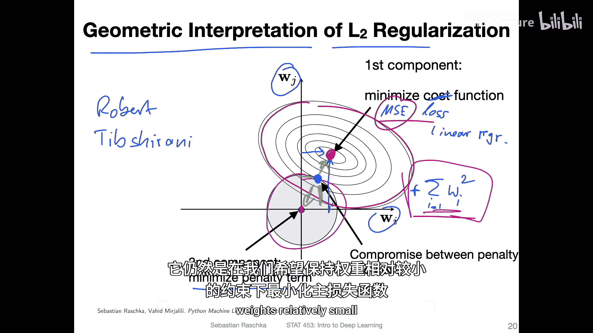

这本质上就是对权重矩阵中所有元素的平方求和。整个神经网络的L2正则化项则是所有层权重矩阵的Frobenius范数平方之和：

`正则化项 = (λ / n) * Σ_L ||W^(L)||_F²`

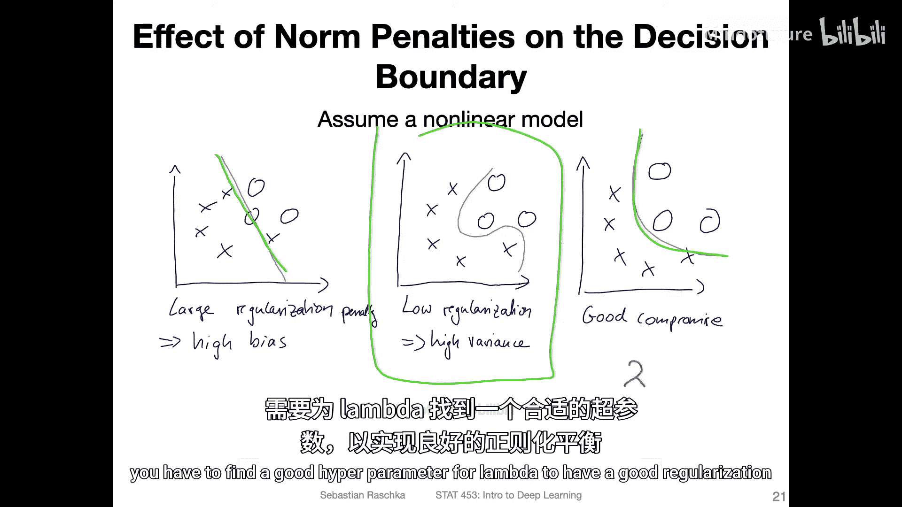

你可以为每一层设置不同的λ，但通常对所有层使用相同的λ值。同样，我们通常只对权重进行正则化，而不对偏置项进行正则化。

---

## 训练与梯度更新 🔄

既然我们修改了损失函数，那么在使用梯度下降法训练时该如何更新权重呢？这其实非常直接。

回想一下，梯度下降需要计算损失函数关于权重的导数。由于新的损失函数是原始损失和正则化项的和，我们可以利用求导的加法法则分别计算。

`总损失 = 原始损失 + 正则化项`

`∂(总损失) / ∂w_ij = ∂(原始损失) / ∂w_ij + ∂(正则化项) / ∂w_ij`

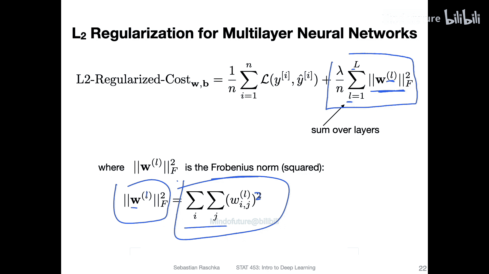

对于正则化项 `(λ/n) * w_ij²`，其导数很简单：

`∂(正则化项) / ∂w_ij = (2λ / n) * w_ij`

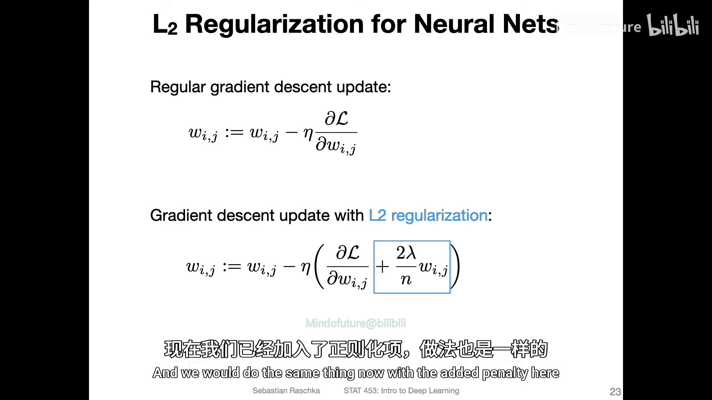

因此，在权重更新时，我们不仅会按照原始损失的梯度方向更新，还会额外减去一个与当前权重值成正比的项 `(2λ / n) * w_ij`，这直观地体现了“权重衰减”的过程。

---

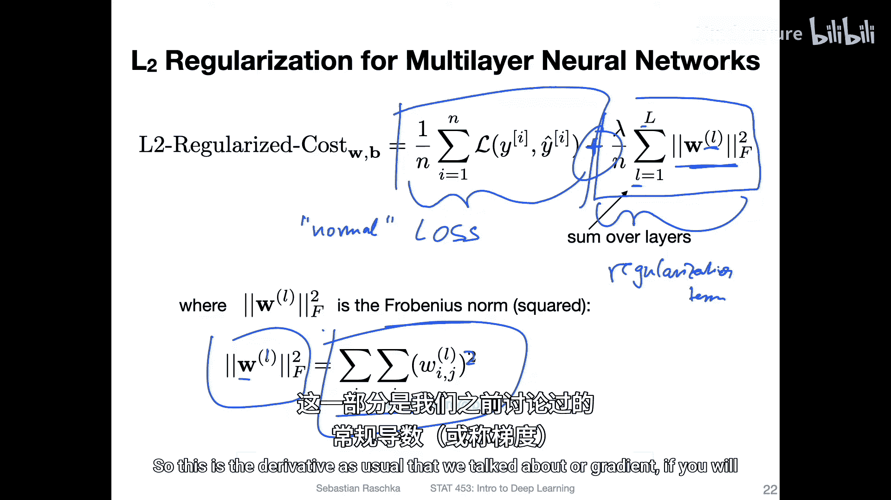

## 在PyTorch中实现L2正则化 💻

在PyTorch中，实现L2正则化有手动和自动两种简单方法。

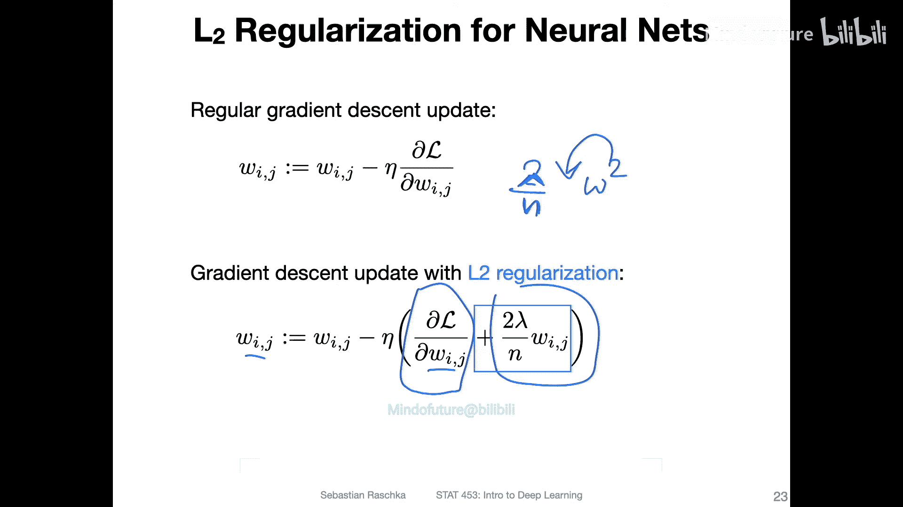

**方法一：手动添加到损失函数**
在训练循环中，你可以遍历模型的所有参数，筛选出权重（排除偏置），计算其平方和，然后加到损失上。

```python
# 假设 model 是你的神经网络，criterion 是原始损失函数（如交叉熵）
lambda_reg = 0.01  # 正则化强度

# 计算原始损失
outputs = model(inputs)
loss = criterion(outputs, labels)

# 计算L2正则化项
l2_reg = torch.tensor(0.)
for name, param in model.named_parameters():
    if ‘weight’ in name:  # 只对权重进行正则化
        l2_reg += torch.norm(param, p=2) ** 2  # 计算Frobenius范数的平方

# 总损失
total_loss = loss + (lambda_reg / 2) * l2_reg  # 注意，有时公式中的因子2会被吸收到lambda中

# 反向传播和优化
total_loss.backward()
optimizer.step()
```

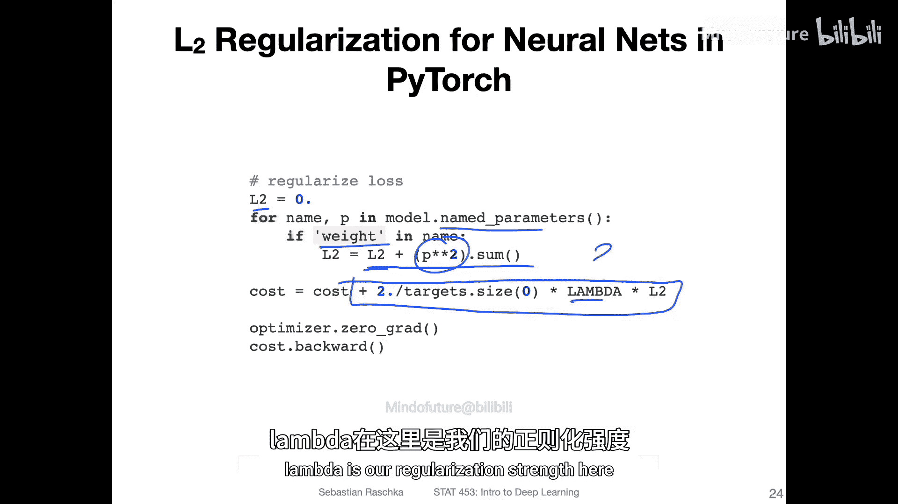

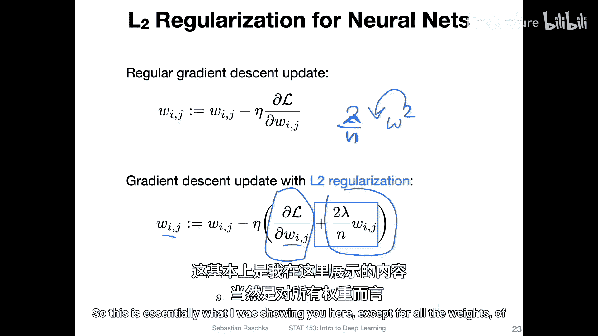

**方法二：使用优化器的 `weight_decay` 参数（推荐）**
这是更简洁的方法。大多数PyTorch优化器（如SGD、Adam）都内置了L2正则化功能，通过 `weight_decay` 参数实现。

```python
import torch.optim as optim

# 在定义优化器时指定 weight_decay，其值就是 lambda
optimizer = optim.SGD(model.parameters(), lr=0.01, weight_decay=0.01)
# 然后，在训练循环中像往常一样计算原始损失并反向传播即可
# 优化器会自动在更新权重时应用L2惩罚
```

`weight_decay` 参数会自动为你处理正则化项的梯度和权重更新，无需手动修改损失函数。

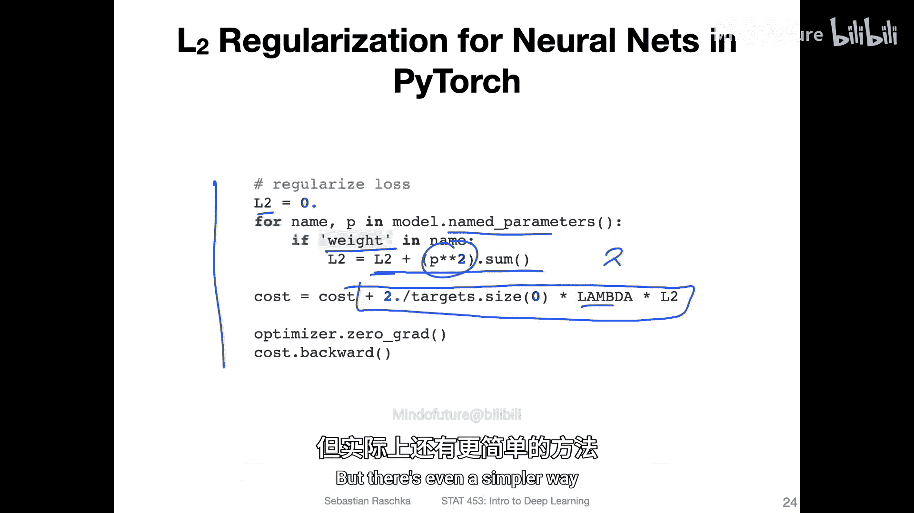

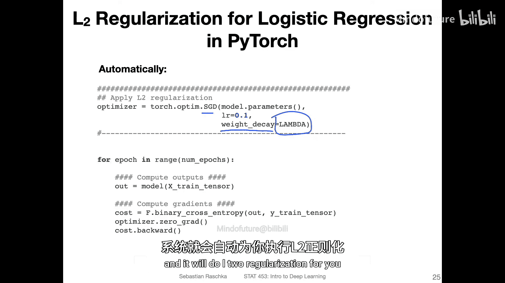

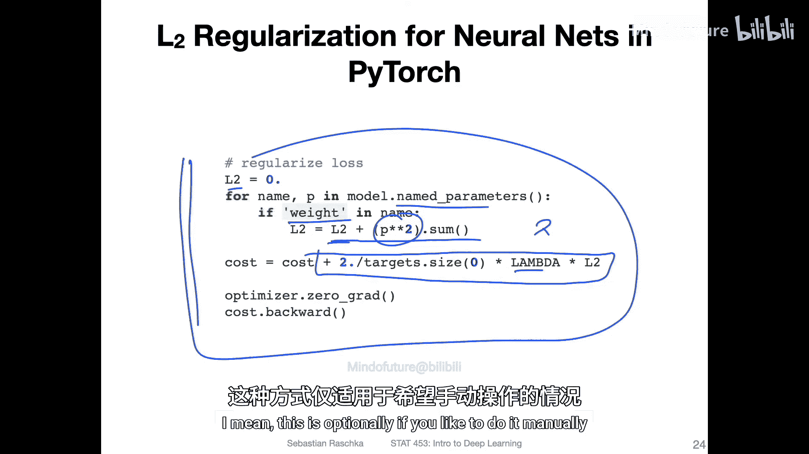

---


## 总结与预告 🎬

本节课中我们一起学习了L2正则化。我们了解到：
1.  **目的**： 通过惩罚大的权重，防止神经网络过拟合，提高模型泛化能力。
2.  **原理**： 在原始损失函数上添加权重的平方和作为惩罚项。
3.  **数学**： 正则化损失 = 原始损失 + (λ / n) * Σ(权重²)。
4.  **几何意义**： 在最小化损失和保持权重较小之间寻找折中点。
5.  **实现**： 在PyTorch中，可以手动计算添加到损失中，或更简便地使用优化器的 `weight_decay` 参数。

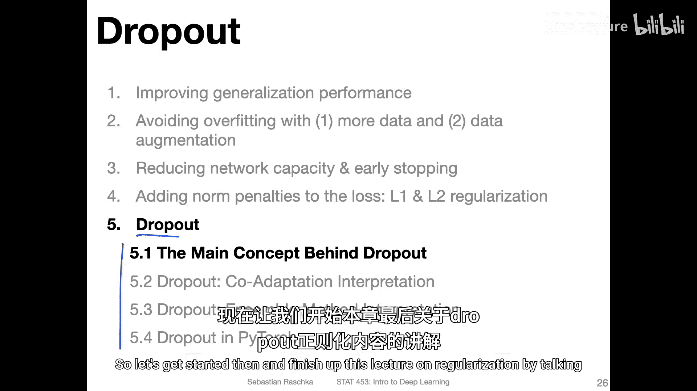

值得注意的是，在现代深度学习中，虽然L2正则化仍有应用，但像**Dropout**这样的技术更为常见。Dropout通过在训练过程中随机“丢弃”一部分神经元来防止过拟合，我们将在接下来的课程中详细讨论它。