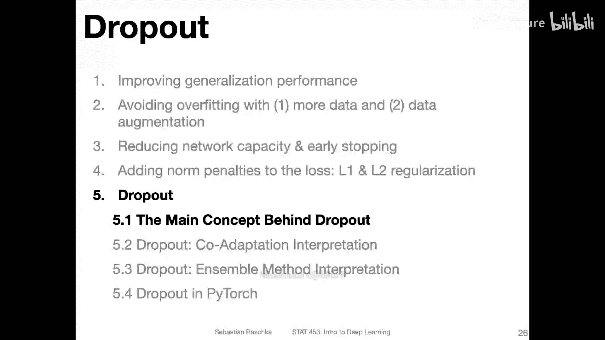
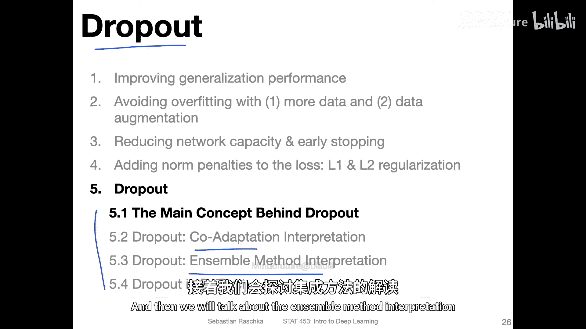
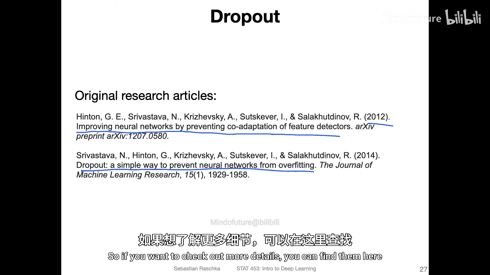
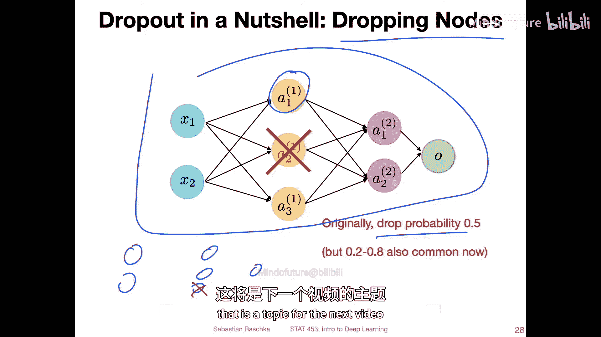
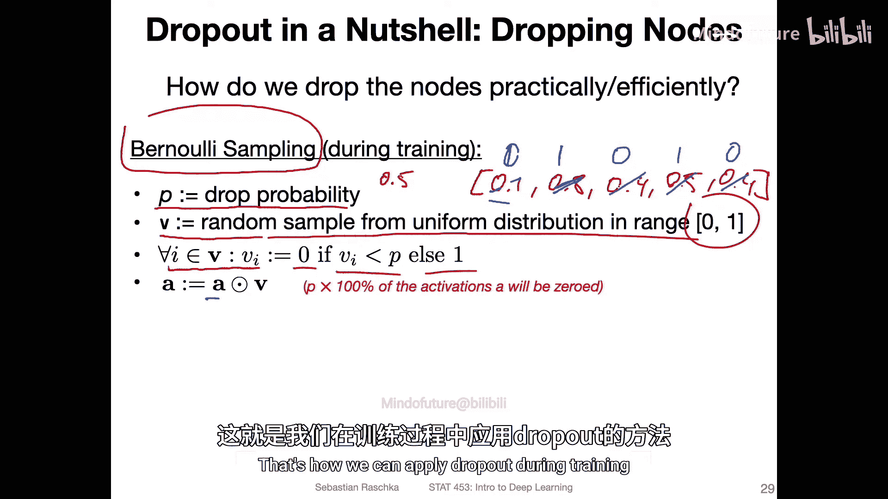
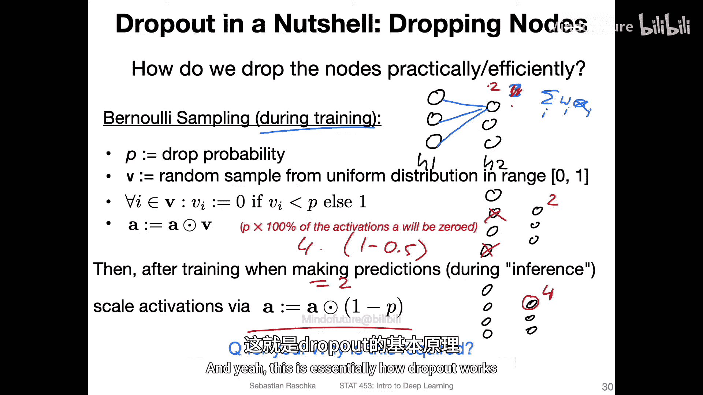
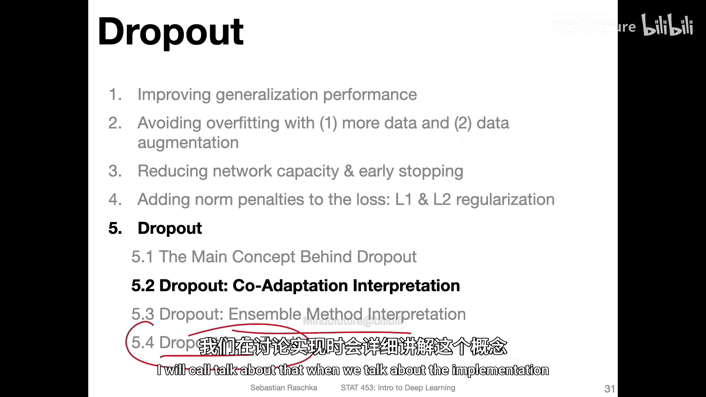

# 077：Dropout背后的主要概念 🧠



在本节中，我们将探讨一种专门为神经网络设计的、用于防止过拟合的技术——Dropout。我们将了解其核心概念、工作原理以及如何在训练和测试阶段应用它。



---

上一节我们介绍了神经网络中的正则化方法。本节中，我们来看看一种独特且强大的技术：Dropout。



Dropout的核心思想是在训练神经网络时，随机地“丢弃”（即临时移除）网络中的一部分神经元。这种方法迫使网络不过度依赖任何单个神经元或特征，从而提升模型的泛化能力。

以下是Dropout工作流程的简要概述：
1.  在每次训练迭代（前向传播）中，对网络的每个隐藏层，以预设的概率 `p`（例如0.5）随机选择一部分神经元。
2.  被选中的神经元在本次前向传播和反向传播中被临时“关闭”，其输出被置为零。
3.  在测试或推理阶段，不使用Dropout，但需要对神经元的输出进行缩放以补偿训练时被丢弃的激活值。

---

## Dropout的高效实现



如何在不实际删除网络节点的情况下高效实现Dropout呢？一个常见的方法是使用伯努利采样。

我们定义一个丢弃概率 `p`（例如 `p = 0.5`）。对于隐藏层中的每个神经元，我们生成一个在[0, 1]区间均匀分布的随机数。如果这个随机数小于 `p`，则在本次前向传播中“丢弃”该神经元。

这个过程可以通过一个二进制掩码向量来实现。假设隐藏层的激活向量为 `A`，我们生成一个相同长度的随机向量 `r`，其中每个元素 `r_i` 服从均匀分布 `U(0,1)`。然后，我们创建一个掩码向量 `m`：

```python
# 伪代码示例
p = 0.5  # 丢弃概率
r = np.random.rand(len(A))  # 生成随机向量
m = (r > p).astype(int)     # 创建二进制掩码，大于p的为1（保留），否则为0（丢弃）
A_dropped = A * m           # 应用Dropout，丢弃的神经元输出为0
```



这样，`A_dropped` 就是应用了Dropout后的激活值。

---

## 测试阶段的调整

在模型部署或评估（测试阶段）时，我们不希望预测结果带有随机性。因此，Dropout在测试时是关闭的。

然而，这带来了一个问题：在训练时，由于部分神经元被丢弃，网络接收到的激活信号总和平均会变小。在测试时，所有神经元都参与工作，激活信号的总和会变大。如果不对此进行调整，测试时的信号强度与训练时不匹配，可能导致预测偏差。

为了解决这个问题，一个简单的技巧是在测试时对激活值进行缩放。缩放因子是 `1 - p`（保留概率）。这样，测试时每个神经元的期望输出就与训练时保持一致了。

**公式描述**：
在训练时，一个神经元的输出期望值为 `E_train = a * (1 - p)`，其中 `a` 是该神经元未应用Dropout时的原始输出。
在测试时，我们使用所有神经元，因此输出为 `a`。为了匹配训练时的期望，我们将其缩放为 `a_test = a * (1 - p)`。

在PyTorch等框架中，这种在训练时进行丢弃、在测试时进行缩放的方法有一个更优雅的实现变体，称为“反向Dropout”（Inverted Dropout），我们将在后续实现部分详细讨论。

---

## 总结



本节课中我们一起学习了Dropout的基本概念。我们了解到，Dropout通过在训练时随机丢弃神经元来防止神经网络过拟合。其实现核心是使用伯努利采样生成二进制掩码。同时，为了确保训练和测试阶段信号强度一致，需要在测试时对神经元的输出进行缩放。



在接下来的视频中，我们将深入探讨Dropout为何有效的两种理论解释：“共适应”防止理论和“集成学习”理论，并学习如何在PyTorch中具体实现它。