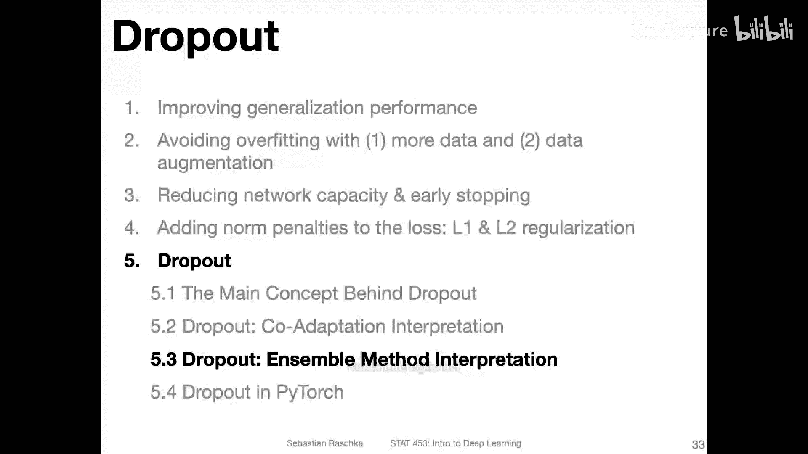
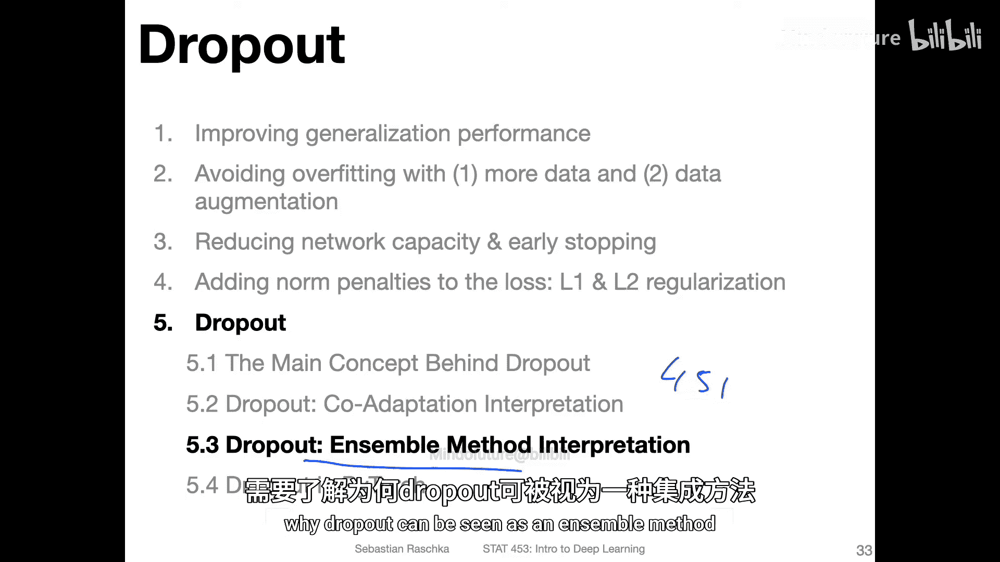
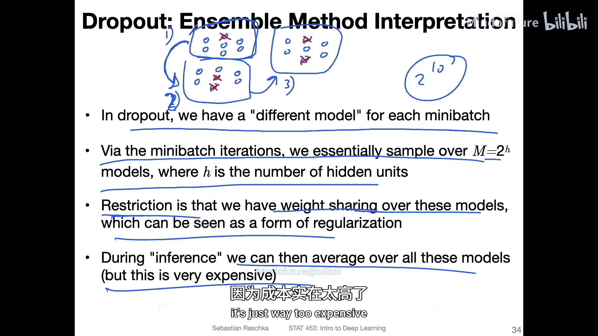
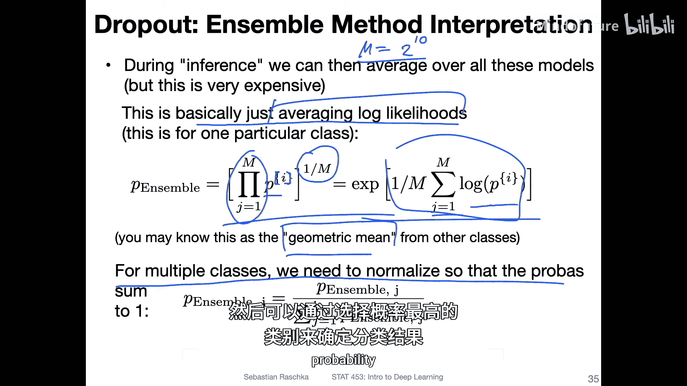
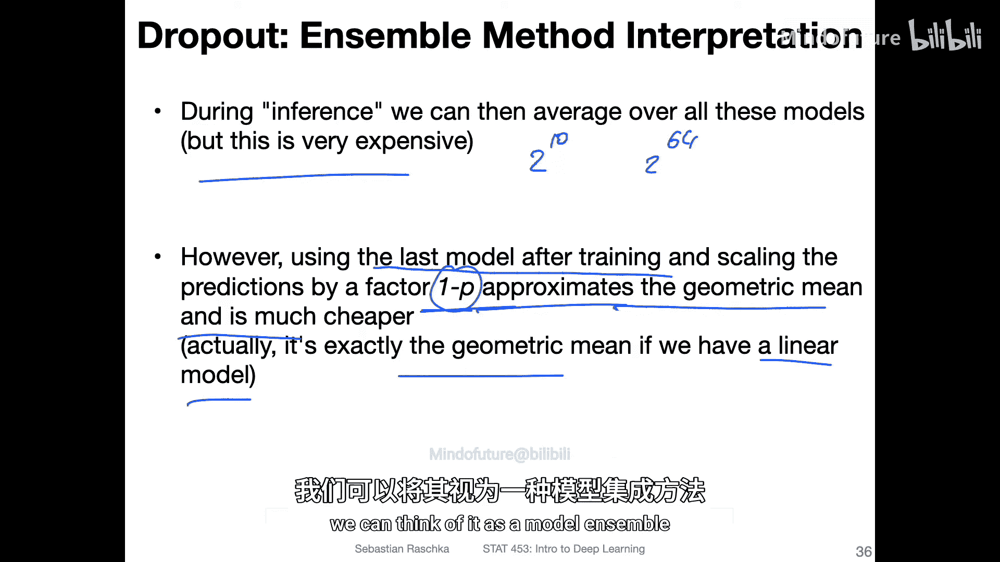

# 079：（可选）Dropout的集成解释 🧠

在本节中，我们将探讨Dropout为何能有效工作的另一种解释。我们将从集成方法的角度来理解Dropout，并解释它如何通过近似模型集成来提升神经网络的性能。

## 集成方法简介

上一节我们介绍了Dropout作为一种正则化技术。本节中，我们来看看Dropout与集成方法之间的联系。首先，我们需要理解什么是集成方法。

集成方法的核心思想是组合多个模型，并对这些模型的预测结果进行平均。直观地理解，假设你需要做一个重要的财务决策，例如进行一项投资。咨询一位专家（即一个模型）可能会得到不错的建议。然而，在实践中，咨询多位专家并综合考虑他们的共同意见通常是更好的做法。虽然有时单个专家的独特见解可能优于委员会，但平均而言，依靠多个模型的集体智慧（通过平均预测或多数投票）往往比依赖单一模型更可靠。

那么，为什么我们不总是使用集成方法呢？主要原因在于训练模型，尤其是在深度学习中，通常计算成本非常高。因此，在深度学习中，我们大多时候专注于训练单个模型，这从计算角度更为经济。当然，在生产环境中，我们仍然可以训练多个模型并组合它们的预测，以进一步增强鲁棒性。

## Dropout作为集成方法

现在，我们来探讨为什么可以将Dropout视为一种集成方法。

在Dropout过程中，每个前向传播（或每个小批量）都会随机丢弃一些神经元。这意味着每个小批量“看到”的神经网络结构都略有不同。从本质上讲，如果只考虑一个具有H个隐藏单元的隐藏层，我们在训练过程中实际上是从 **2^H** 种可能的网络结构中采样。例如，即使只有一个包含10个单元的隐藏层，也有 **2^10 = 1024** 种可能的组合。从这个角度看，Dropout训练过程就像是在遍历一个庞大的模型集合。

然而，这里存在一个关键限制：时间维度。我们并不是同时并行地使用所有这些模型。相反，在训练循环中，我们一次只使用一个采样得到的网络。例如，在第一次前向传播中，我们可能使用丢弃了某些神经元的网络A；在第二次前向传播中，使用丢弃了另一些神经元的网络B，依此类推。

这种限制也可以被视为一种**权重共享**。因为第一个模型会更新权重，而第二个模型将基于第一次反向传播更新后的权重进行工作。这就像常规训练一样，每次迭代更新权重，后续的模型都使用前一次迭代更新后的权重。因此，在不同的前向传播之间存在着权重共享。

这种权重共享可以看作是一种正则化，即我们添加了一个额外的约束或信息。在训练期间，我们通过这种权重共享进行正则化。理论上，在训练完成后进行推理时，我们可以创建所有这些不同的模型并对它们的预测进行平均。

但问题在于，即使对于一个只有10个隐藏单元的小型网络，也需要考虑1024个模型，这在计算上是极其昂贵的。对于具有64个甚至更多单元的实际网络，这种做法是完全不可行的。

## 近似集成预测

那么，我们如何解决这个计算成本问题呢？

实际上，我们之前讨论的标准Dropout技术，已经在近似这种集成模型的平均预测了。具体来说，在训练完成后，我们在测试阶段对神经元输出应用的缩放因子 **1/(1-p)**（其中p是丢弃概率），正是对集成模型几何平均预测的一种近似。

在原始的Dropout论文中论证到，对于一个线性模型，这种缩放方式恰好等价于对集成模型预测求几何平均。因此，我们无需真正生成和运行指数级数量的模型，只需使用训练得到的最终网络，并在测试时应用缩放，就能近似获得集成模型的效果。

这正是Dropout为何有效的解释之一：我们可以将其视为一种高效的、近似的模型集成方法。它获得了集成方法提升鲁棒性和性能的好处，同时又避免了训练和运行多个独立模型的巨大计算开销。

## 总结

本节课中，我们一起学习了Dropout的集成解释。我们了解到：

1.  **集成方法**通过组合多个模型的预测来提升性能，但计算成本高。
2.  **Dropout**在训练过程中通过随机丢弃神经元，隐式地创建了大量不同的网络结构，可被视为一种模型集成。
3.  由于时间维度和权重共享的限制，这些模型并非独立，而是在训练过程中顺序且共享权重地更新。
4.  在推理时，直接平均所有可能的子网络预测计算量巨大。Dropout采用在测试时对神经元输出乘以 **1/(1-p)** 的缩放方式，来近似等效于对集成模型预测求**几何平均**。
5.  因此，Dropout以一种计算高效的方式，获得了模型集成的正则化益处，这是其提升神经网络泛化能力的重要原因之一。