# 080：PyTorch中的Dropout 🧠

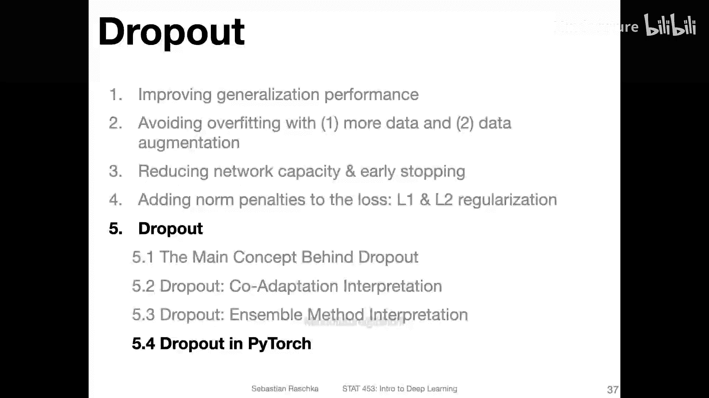

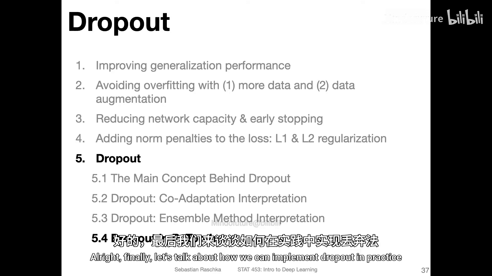

在本节课中，我们将学习如何在PyTorch中实现Dropout。Dropout是一种在训练神经网络时防止过拟合的有效技术。我们将了解其核心概念“反向Dropout”，并通过代码示例展示如何在PyTorch模型中添加Dropout层。

---

## 反向Dropout的概念

上一节我们介绍了Dropout的基本原理，本节中我们来看看其在实际框架中的实现方式，即“反向Dropout”。

在常规Dropout中，我们在训练时随机“丢弃”一部分神经元，而在测试时，为了补偿训练时因丢弃神经元而导致的激活值期望降低，我们会将激活值按比例 `1 - p` 进行缩放，其中 `p` 是丢弃概率。

然而，现代深度学习框架（包括PyTorch）普遍采用“反向Dropout”。其核心区别在于：**缩放操作被提前到了训练阶段**。在训练时，我们在丢弃神经元后，立即将保留下来的激活值放大 `1 / (1 - p)` 倍。这样，在测试时，由于没有神经元被丢弃，也无需进行任何缩放，激活值自然就处于网络所期望的尺度上。

**反向Dropout的缩放公式（训练时）：**
`激活值 = 保留的激活值 / (1 - p)`

这样做的主要优势在于**提升推理（测试）阶段的效率**。对于像搜索引擎这样需要处理海量预测请求的服务，避免在每次预测时进行额外的乘法运算，可以节省巨大的计算资源。无论是常规Dropout还是反向Dropout，最终效果是等价的，只是缩放发生的时机不同。

---

## 在PyTorch中使用Dropout

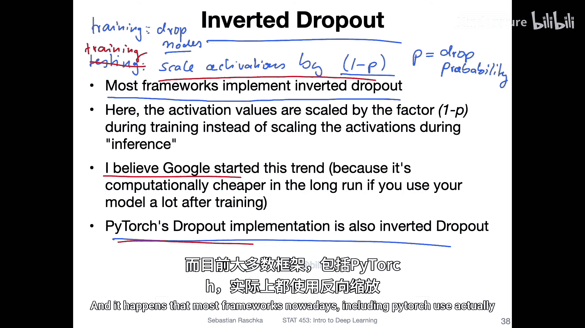

理解了反向Dropout后，我们来看看如何在PyTorch模型中具体实现它。

以下是一个包含两个隐藏层的多层感知机示例，我们在每个隐藏层的激活函数后添加了Dropout层。

```python
import torch.nn as nn

class MultilayerPerceptron(nn.Module):
    def __init__(self, input_size, hidden_size, num_classes, drop_p):
        super().__init__()
        self.layers = nn.Sequential(
            # 第一个隐藏层
            nn.Linear(input_size, hidden_size),
            nn.ReLU(),
            nn.Dropout(drop_p),  # 在ReLU后添加Dropout
            # 第二个隐藏层
            nn.Linear(hidden_size, hidden_size),
            nn.ReLU(),
            nn.Dropout(drop_p),  # 在ReLU后添加Dropout
            # 输出层
            nn.Linear(hidden_size, num_classes)
        )

    def forward(self, x):
        return self.layers(x)
```

**代码说明：**
1.  **`nn.Dropout(drop_p)`**：这是PyTorch中的Dropout层，`drop_p` 是神经元被丢弃的概率（例如0.5表示50%的丢弃率）。
2.  **放置位置**：通常将Dropout层放在激活函数（如ReLU）之后。对于ReLU，放在之前或之后效果相同，因为输入为0时输出也为0。但对于Sigmoid等函数，输入为0时输出为0.5，因此放在激活函数之后是更一致和安全的做法。
3.  **输出层**：我们通常不对输出层使用Dropout，因为直接丢弃类别预测节点是不合理的。

你可以为网络的不同部分设置不同的丢弃概率，这是一个可以调节的超参数。

---

## 训练与评估模式切换 🔄

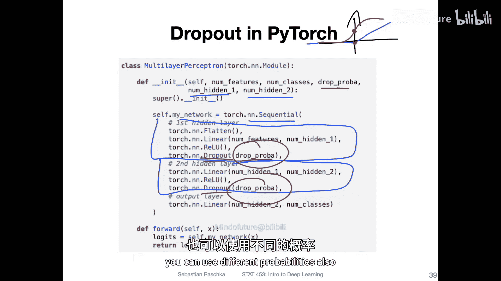

在PyTorch中使用Dropout时，一个至关重要的步骤是正确切换模型的模式。这通过 `model.train()` 和 `model.eval()` 方法实现。

```python
model = MultilayerPerceptron(...)
criterion = nn.CrossEntropyLoss()
optimizer = torch.optim.Adam(model.parameters())

# 训练阶段
model.train()  # 设置为训练模式
for epoch in range(num_epochs):
    # ... 前向传播、计算损失、反向传播、优化器更新权重
    outputs = model(inputs)
    loss = criterion(outputs, labels)
    optimizer.zero_grad()
    loss.backward()
    optimizer.step()

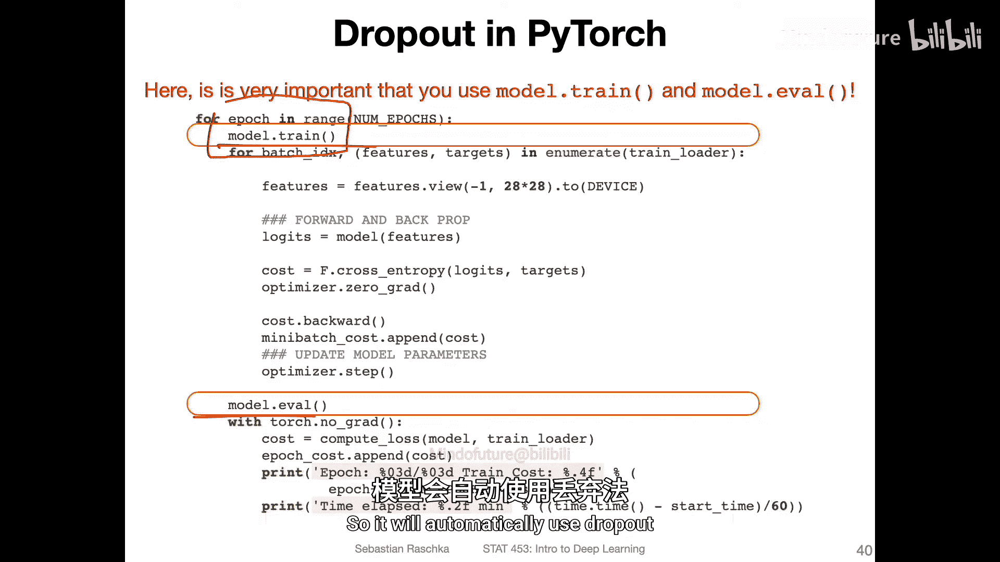

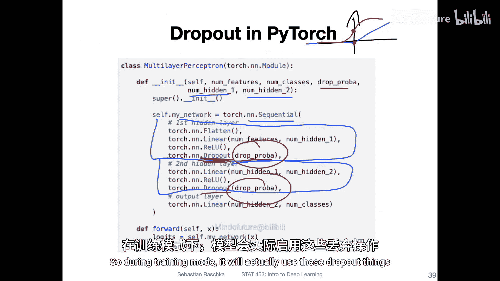

# 评估/测试阶段
model.eval()  # 设置为评估模式
with torch.no_grad():  # 同时关闭梯度计算以节省内存和计算
    test_outputs = model(test_inputs)
    # ... 计算准确率等指标
```

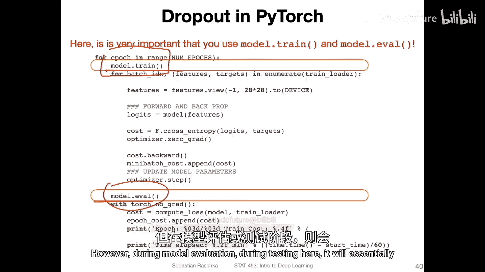

**模式的作用：**
*   **`model.train()`**：告知模型处于训练模式。此时，`nn.Dropout` 层会按照设定的概率 `p` 随机丢弃神经元。
*   **`model.eval()`**：告知模型处于评估（或测试）模式。此时，`nn.Dropout` 层会**自动失效**，即丢弃概率变为0，所有神经元都参与前向传播，相当于跳过了Dropout操作。

这是一个必须养成的好习惯，即使模型中没有Dropout层，明确指定模式也可以避免其他具有不同训练/测试行为的层（如BatchNorm）出现意外问题。

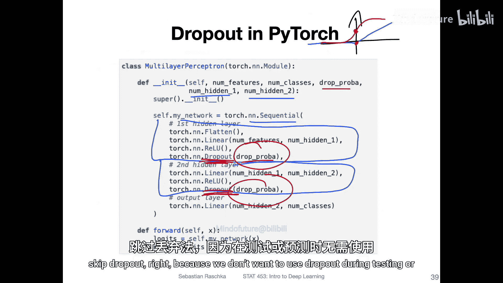

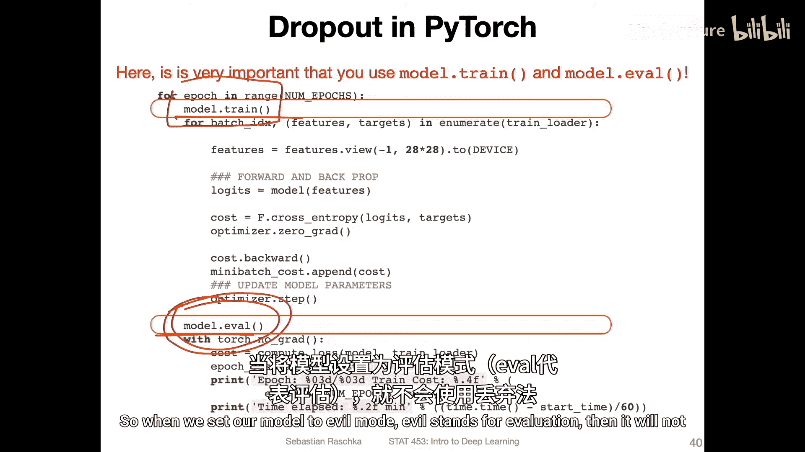

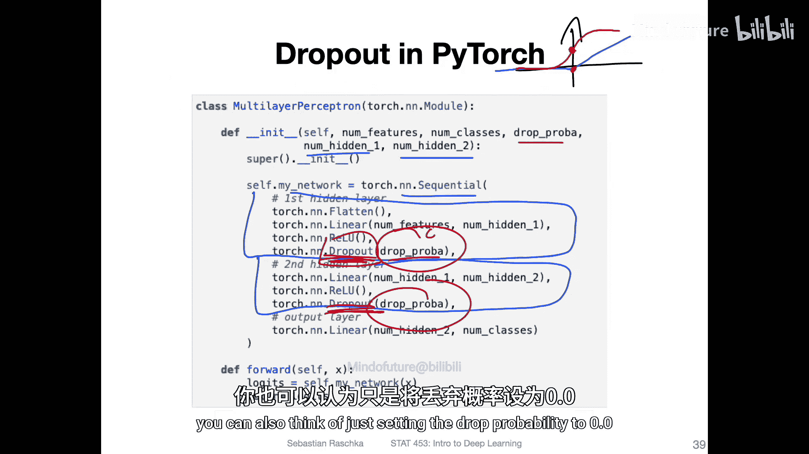

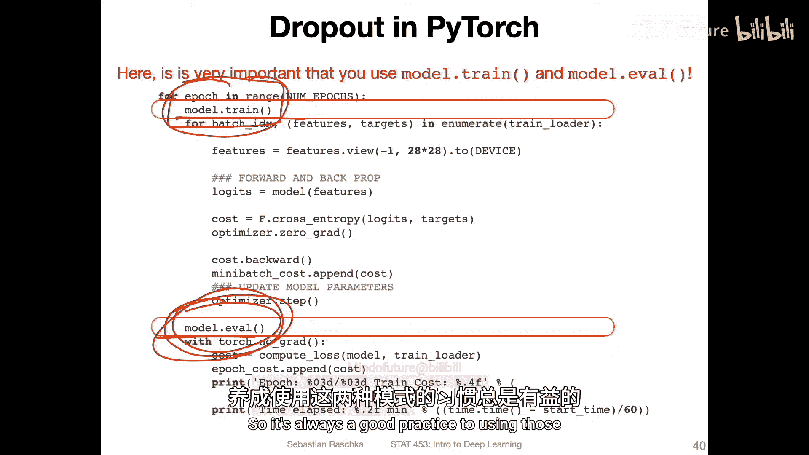

---

## Dropout效果与实用建议

我们通过一个在MNIST数据集上的实验来直观感受Dropout的效果。

*   **无Dropout的模型**：训练后期，训练准确率持续上升，但验证准确率停滞甚至下降，出现了明显的过拟合现象（训练与验证准确率曲线间存在较大“间隙”）。
*   **添加了50% Dropout的模型**：过拟合得到了有效抑制，训练与验证准确率曲线更加接近。但需要注意的是，测试集准确率可能略有下降（例如从97.5%降至96.5%），这可能是由于正则化强度过大，略微损害了模型的表示能力。

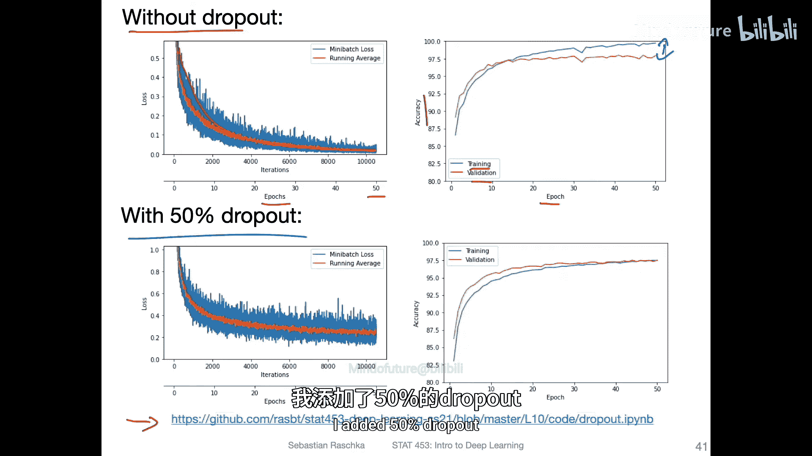

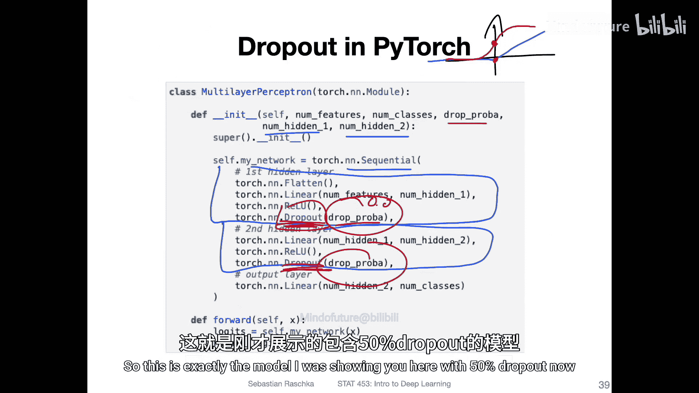

基于以上实践，以下是一些使用Dropout的实用建议：

以下是使用Dropout时的一些关键建议：
*   **先观察，后使用**：首先训练一个没有Dropout的基准模型。如果模型没有出现过拟合，则无需添加Dropout。
*   **应对过拟合**：如果观察到明显的过拟合（训练误差远低于验证误差），则添加Dropout是一个有效的应对策略。
*   **更大模型+Dropout**：Dropout的提出者建议，可以尝试设计一个容量更大、足以过拟合训练数据的模型，然后通过添加Dropout来控制过拟合。这种方法有时能获得比小模型更好的最终性能。
*   **调整丢弃率**：丢弃率 `p` 是一个重要的超参数。通常从0.5开始尝试，并根据验证集效果进行调整。不同层也可以使用不同的丢弃率。

---

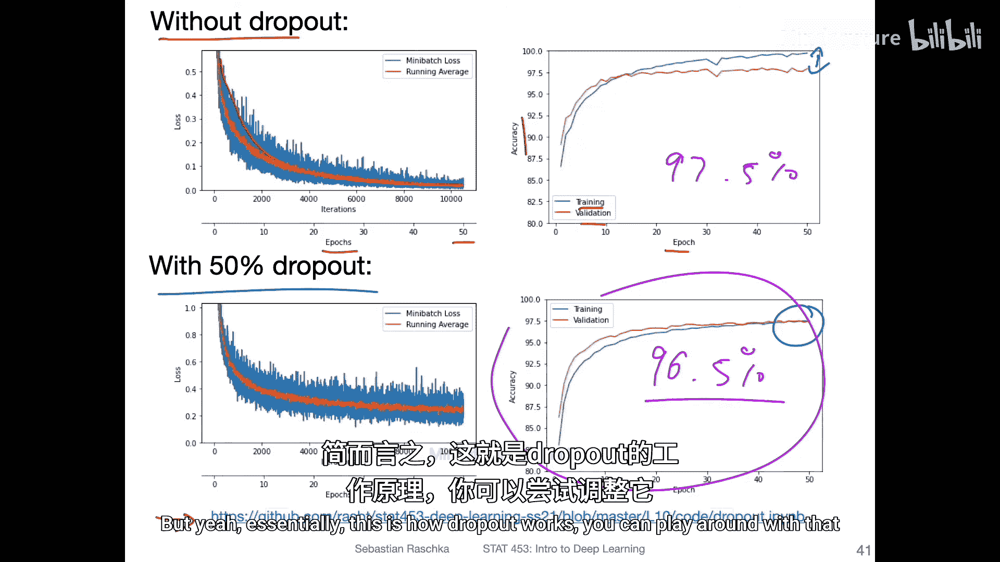

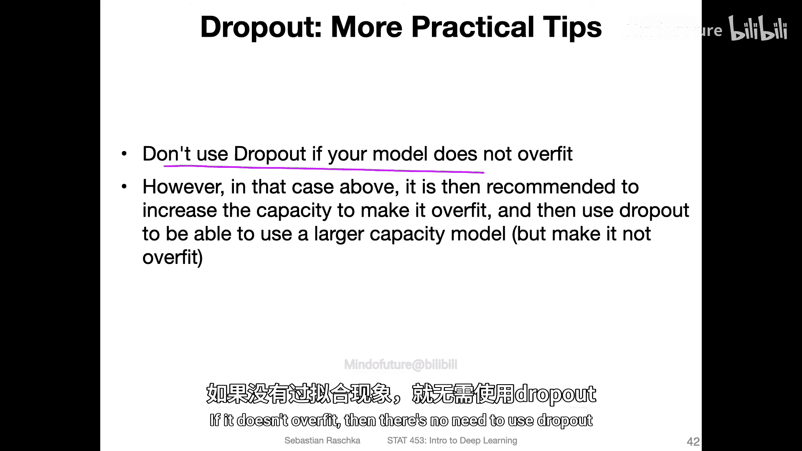

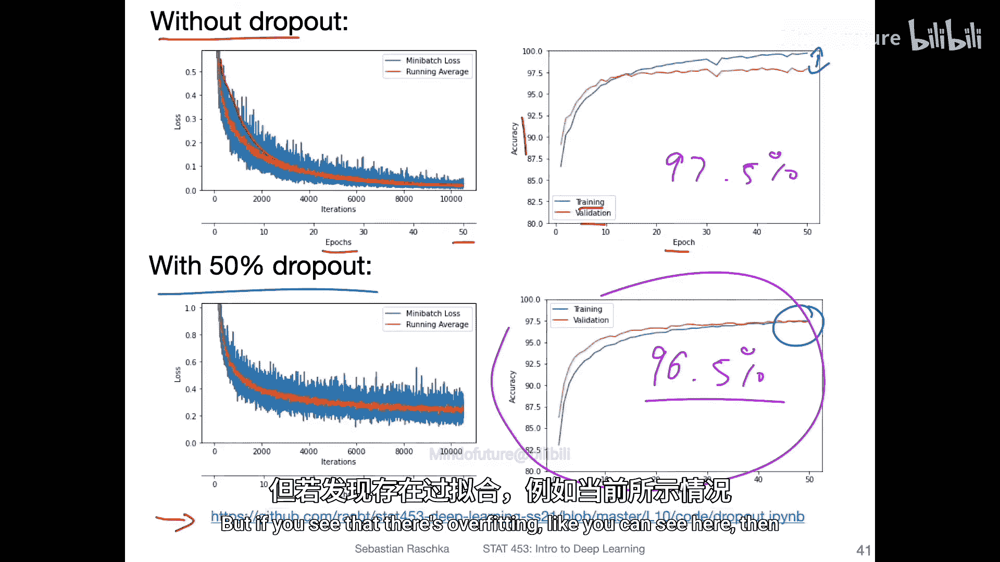

## 相关概念：DropConnect

在了解了Dropout之后，你可能会想到一个相关的思路：既然可以随机丢弃激活值，那么是否可以随机丢弃网络中的**权重**呢？

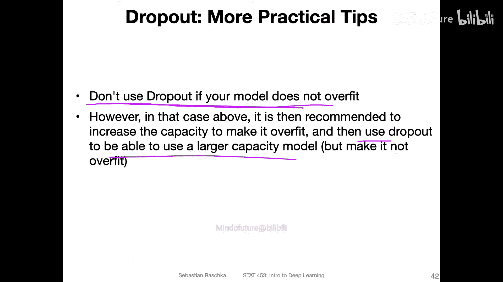

这个想法已经被研究并命名为 **DropConnect**。你可以将其视为Dropout的一种泛化形式。在DropConnect中，随机被置零的是权重矩阵中的元素，而非激活值。

从某种意义上说，如果将一个神经元的所有输入权重都丢弃，其效果就等同于丢弃该神经元的激活值。因此DropConnect比Dropout更灵活。

然而，根据实践反馈，DropConnect在实际应用中的效果通常不如经典的Dropout稳定和有效，因此在业界的使用远没有Dropout普遍。

---

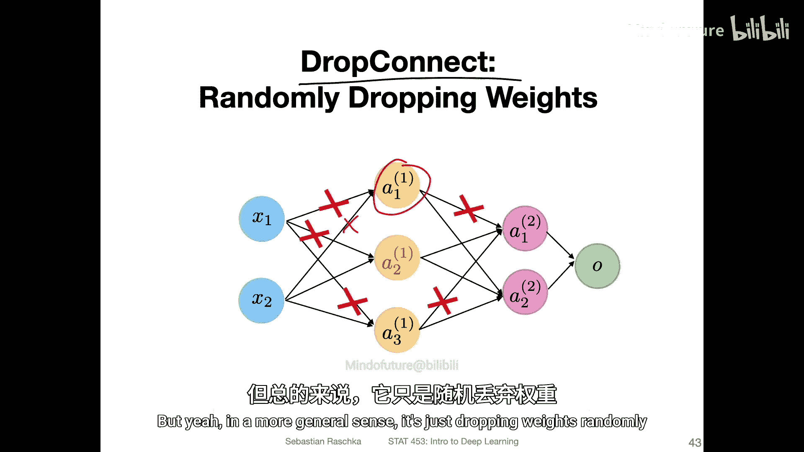

## 总结与延伸阅读

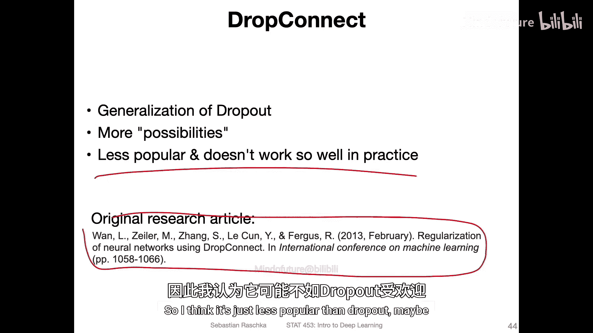

本节课中我们一起学习了如何在PyTorch中实现和使用Dropout。

1.  **核心机制**：我们介绍了“反向Dropout”，即在训练时对保留的激活值进行放大，从而在测试时无需额外操作。
2.  **代码实现**：学习了使用 `nn.Dropout` 层，并将其置于激活函数之后。同时，强调了使用 `model.train()` 和 `model.eval()` 来正确管理模型模式的重要性。
3.  **实践指导**：通过实验观察了Dropout抑制过拟合的效果，并总结了何时以及如何使用Dropout的实用建议。
4.  **相关概念**：简要介绍了DropConnect作为Dropout的一种泛化形式。

如果你想深入了解Dropout，强烈推荐阅读其原始论文《Dropout: A Simple Way to Prevent Neural Networks from Overfitting》。这篇论文写作清晰直观，非常适合作为入门研究论文阅读。


在接下来的课程中，我们将探讨其他提升神经网络训练效果的技术，例如权重初始化方法、学习率调整策略以及不同的优化器。