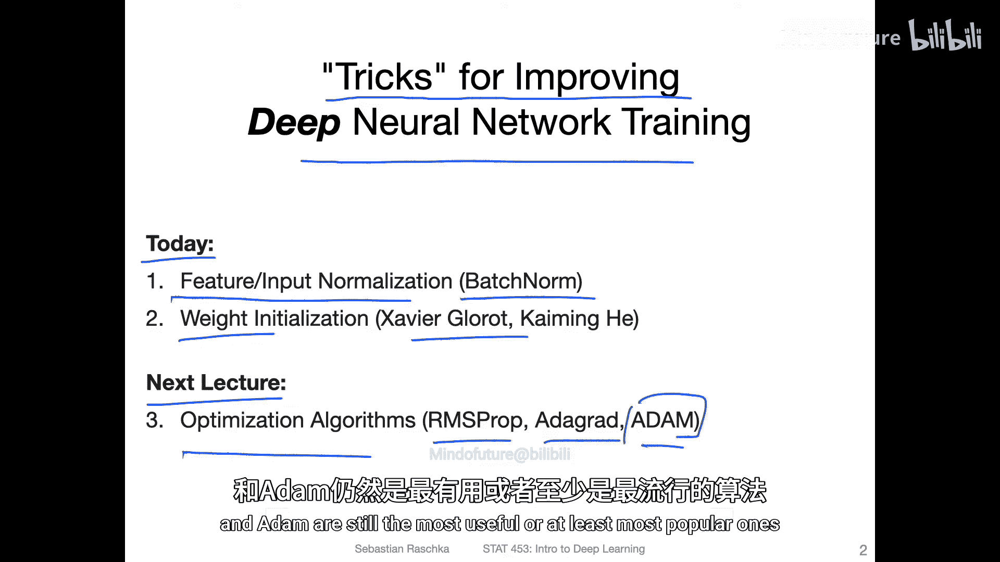
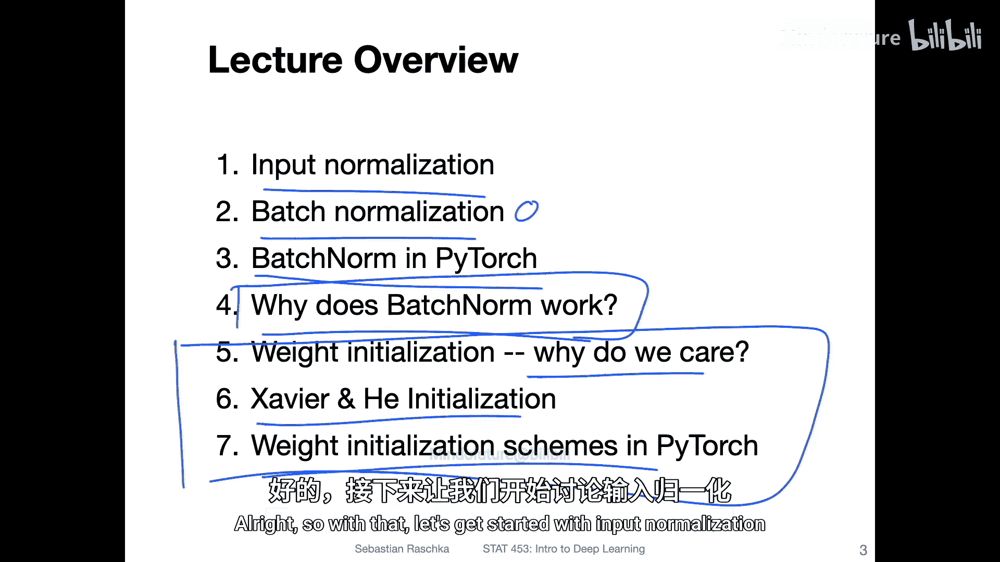

# 081：输入归一化与权重初始化——讲座概述

在本节课中，我们将要学习如何改进深度神经网络的训练过程。具体来说，我们将探讨输入归一化、批归一化以及不同的权重初始化方案。这些技术对于提升模型训练的速度和最终性能至关重要。

上一周，我们开始讨论改进神经网络训练和泛化性能的各种方法，并深入探讨了一些细节。当然，我们无法涵盖思维导图中列出的所有主题。然而，有几个重要的主题确实值得深入探讨。

## 输入归一化

首先，我们将简要介绍输入归一化。这是数据预处理中的一个基本步骤，旨在使输入特征的尺度标准化。

## 批归一化

接着，我们将重点转向批归一化。这是一种强大的技术，可以使神经网络训练得更好、更快。我们将学习其工作原理，并演示如何在PyTorch中实现它。

## 批归一化为何有效

然后，我们将深入探讨批归一化为何在实践中能产生积极效果。这是一个仍有争议的话题，我们将介绍一些主流的理论解释。

## 权重初始化方案

之后，我们将切换主题，讨论不同的权重初始化方案。我们将了解为何需要关注权重初始化，并介绍两种具体的技术：Xavier/Glorot初始化方案和Kaiming He初始化方案。我们也会看看它们在Python中是如何实现的。

## 后续内容预告

在下一讲中，我们将简要讨论用于改进梯度下降学习的优化算法，例如RMSprop、Adagrad和Adam。我们还将提供一个包含更多算法的列表。就个人而言，我认为带动量的随机梯度下降和Adam仍然是最有用或至少是最流行的算法。

本节课中，我们一起学习了输入归一化、批归一化的原理与实现，以及不同权重初始化方案的重要性。这些技术是构建高效、稳定深度学习模型的基础工具。