# 083：BatchNorm 工作原理 🧠

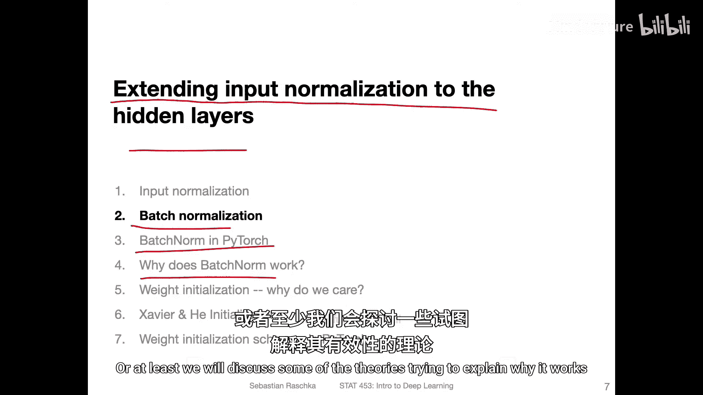

在本节课中，我们将学习一种称为批归一化（Batch Normalization）的技术。我们将了解它如何将输入归一化的思想扩展到神经网络的隐藏层，其工作原理，以及它为何能提升训练效果。

---

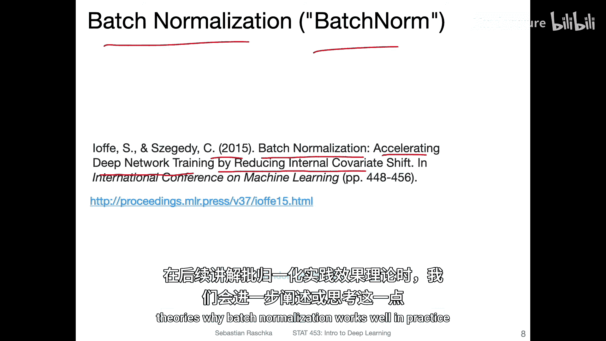

## 概述

上一节我们讨论了输入数据的标准化。本节中，我们来看看如何将类似的归一化思想应用到神经网络的隐藏层，这种方法被称为批归一化。我们将分步讲解其工作原理，并理解它如何帮助稳定训练过程。

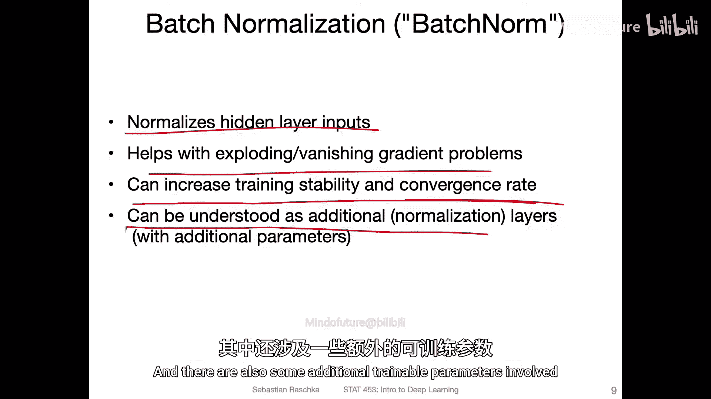

批归一化技术源于2015年的一篇重要论文，其核心思想是减少训练过程中网络内部特征分布的偏移（即内部协变量偏移），从而加速深度网络的训练。

简单来说，批归一化不仅对网络的输入进行归一化，也对每个隐藏层的输入进行归一化。这有助于缓解梯度爆炸或梯度消失问题，使训练过程更稳定、收敛更快。你可以将其视为网络中的一个额外归一化层，它本身也包含可学习的参数。

---

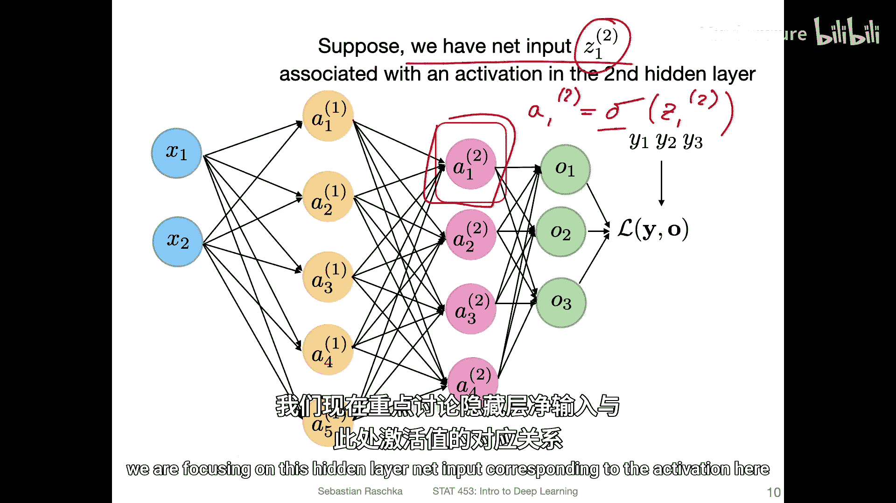

## 批归一化步骤详解

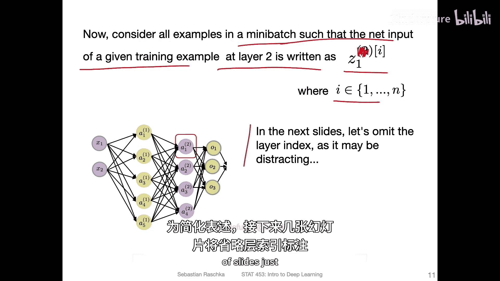

现在，让我们深入批归一化的具体步骤。假设我们有一个多层感知机，并聚焦于第二隐藏层中某个激活函数的净输入。

以下是批归一化的两个主要步骤：

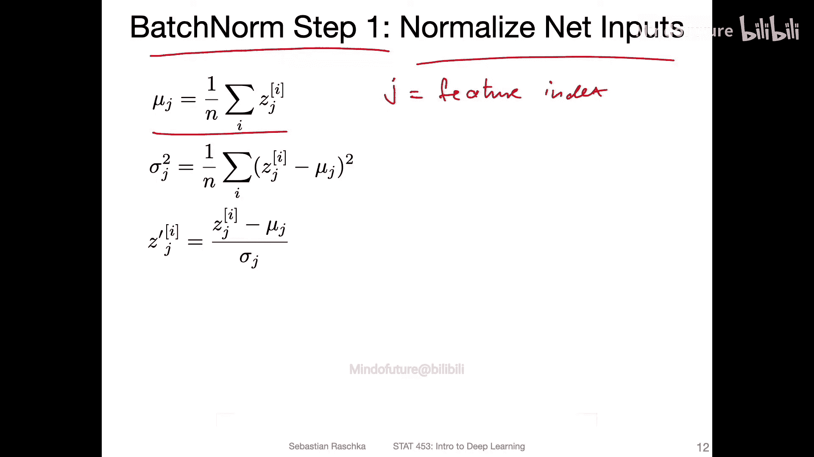

### 步骤一：归一化净输入

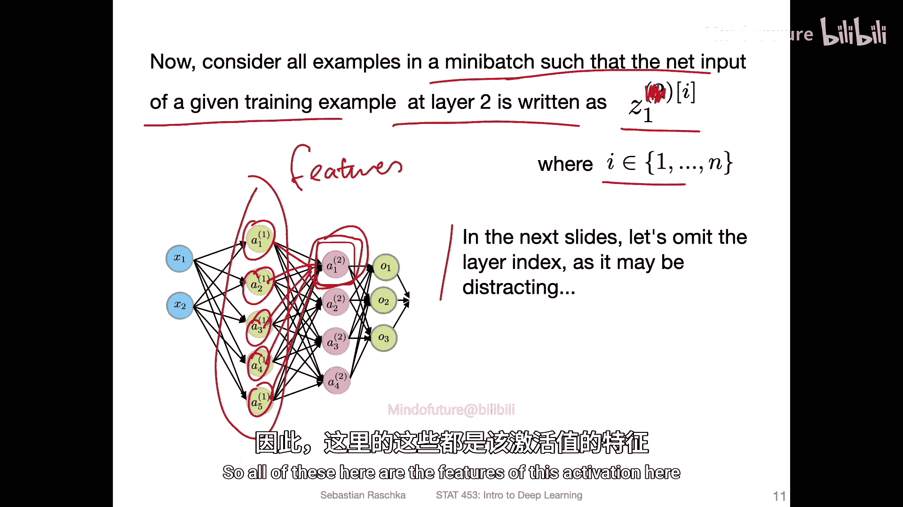

第一步是对隐藏层的净输入进行标准化，其过程与我们之前对输入数据进行的标准化类似。

假设我们有一个小批量（mini-batch）数据。对于该层中第 `j` 个特征（即来自前一层的第 `j` 个激活值）的净输入，我们计算其在小批量上的均值和方差，然后进行标准化。

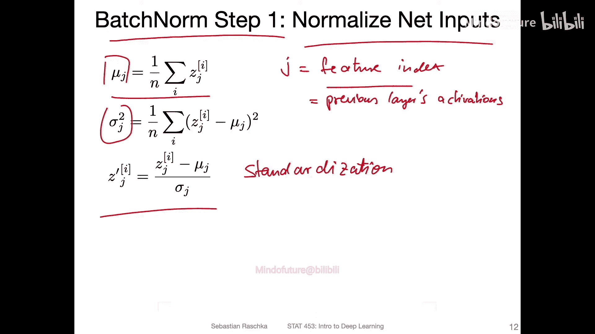

**公式如下：**

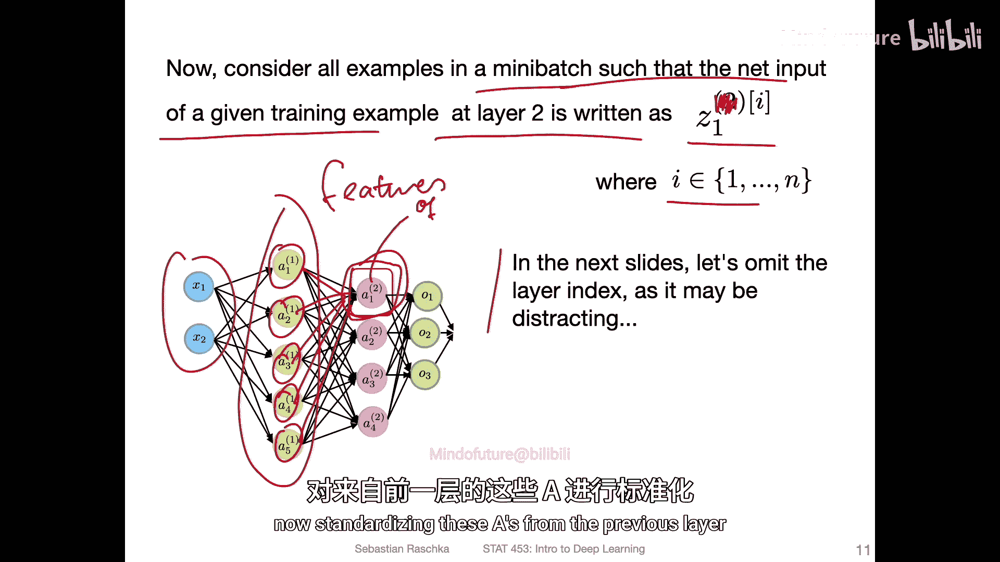

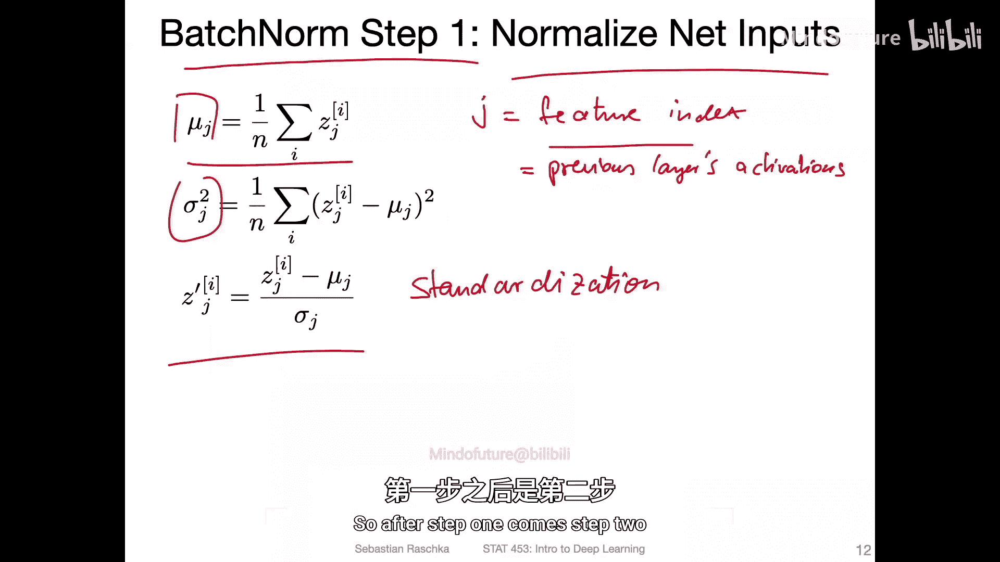

首先，计算均值：
`μ_j = (1/m) * Σ_{i=1}^{m} z_j^{(i)}`

然后，计算方差：
`σ_j^2 = (1/m) * Σ_{i=1}^{m} (z_j^{(i)} - μ_j)^2`

最后，进行标准化：
`ẑ_j^{(i)} = (z_j^{(i)} - μ_j) / √(σ_j^2 + ε)`

这里，`m` 是小批量的大小，`z_j^{(i)}` 是第 `i` 个样本在第 `j` 个特征上的净输入。`ε` 是一个很小的常数（例如 `1e-5`），用于确保数值稳定性，防止除以零。

### 步骤二：缩放与偏移

第一步完成了标准化，但网络可能并不总是希望数据具有零均值和单位方差。因此，第二步引入了两个可学习的参数：缩放参数 `γ` 和偏移参数 `β`。

**公式如下：**
`z̃_j^{(i)} = γ_j * ẑ_j^{(i)} + β_j`

参数 `γ_j` 和 `β_j` 会通过反向传播与网络的其他权重一起被学习。这使得网络有能力“撤销”第一步的标准化效果，或者将其调整为对当前任务更有利的分布。从某种意义上说，这为网络提供了更大的灵活性。

---

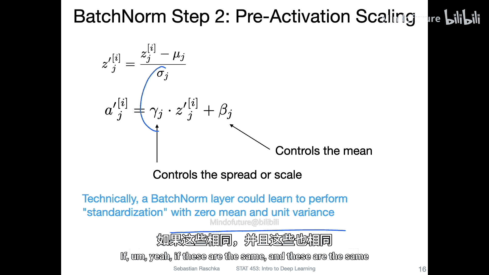

## 批归一化在神经网络中的流程

让我们将批归一化的步骤整合到前向传播过程中，看看它在实际网络中是如何工作的。

以下是批归一化层在网络中的计算流程：

1.  **计算净输入**：对于当前层，计算其净输入 `z`（即权重与前一层的输出相乘，再加上偏置）。
2.  **批归一化（步骤一）**：对净输入 `z` 应用标准化，得到 `ẑ`。
3.  **批归一化（步骤二）**：对标准化后的值 `ẑ` 进行缩放和偏移，得到 `z̃`。
4.  **应用激活函数**：将 `z̃` 输入到激活函数（如 ReLU、Sigmoid）中，得到该层的最终输出 `a`。
5.  **传递至下一层**：输出 `a` 将作为下一层的输入，重复上述过程。

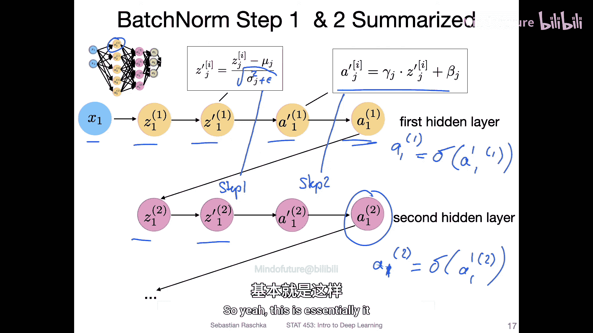

**代码示意流程：**
```python
# 假设 z 是当前层的净输入
z_hat = (z - mean(z)) / sqrt(var(z) + epsilon)  # 步骤一：标准化
z_tilde = gamma * z_hat + beta                   # 步骤二：缩放与偏移
a = activation_function(z_tilde)                 # 应用激活函数
```

---

## 重要细节与注意事项

在实现和使用批归一化时，有几个关键点需要注意。

以下是使用批归一化时的一些重要考量：

*   **偏置项变得冗余**：由于批归一化的第二步已经包含了偏移参数 `β`，它实际上扮演了传统偏置项的角色。因此，在使用了批归一化的层中，通常可以（并且更简洁）不设置额外的偏置项。在代码中，你可以通过设置 `bias=False` 来实现。
*   **可学习参数**：每个批归一化层会引入两组与特征维度相同的可学习参数向量：`γ`（缩放）和 `β`（偏移）。这略微增加了模型的参数量。
*   **理论解释**：批归一化为何有效，有多种理论解释，包括稳定内部特征分布、平滑优化地形、提供轻微的正则化效果等。其实际效果是使训练更稳定、收敛更快。

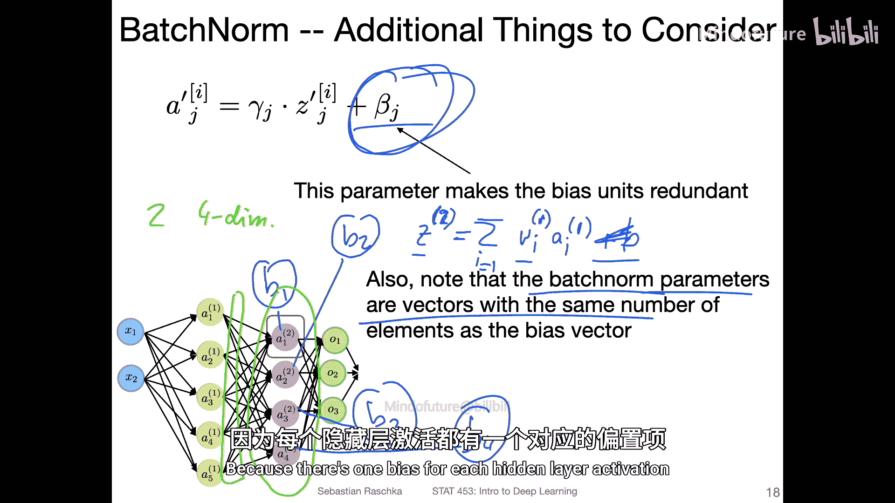

---

## 总结

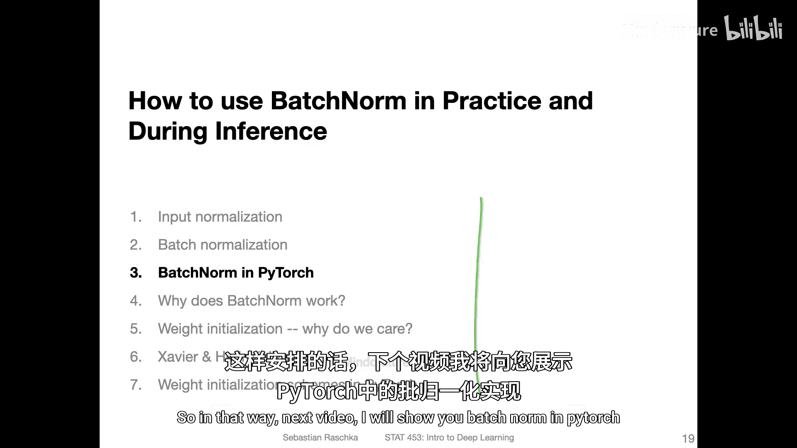

本节课中，我们一起学习了批归一化（BatchNorm）的工作原理。我们了解到，它通过两个步骤——首先标准化隐藏层的净输入，然后进行可学习的缩放与偏移——来稳定深度神经网络的训练过程。这种方法有助于缓解梯度问题，通常能加快模型的收敛速度。在下一节，我们将在 PyTorch 中实际应用批归一化。