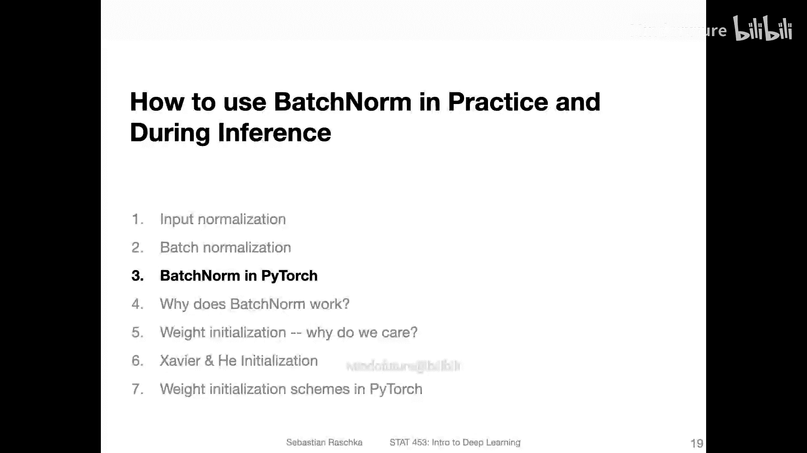
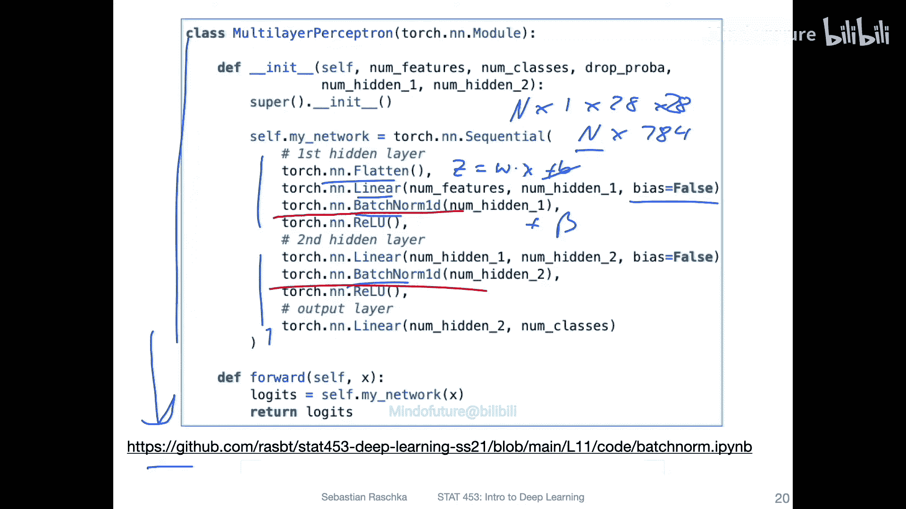
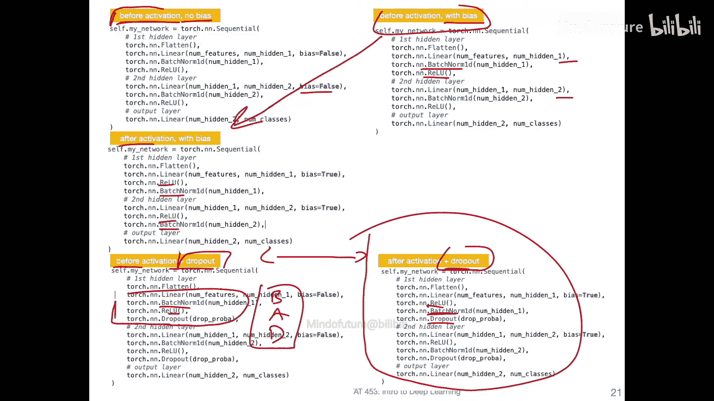
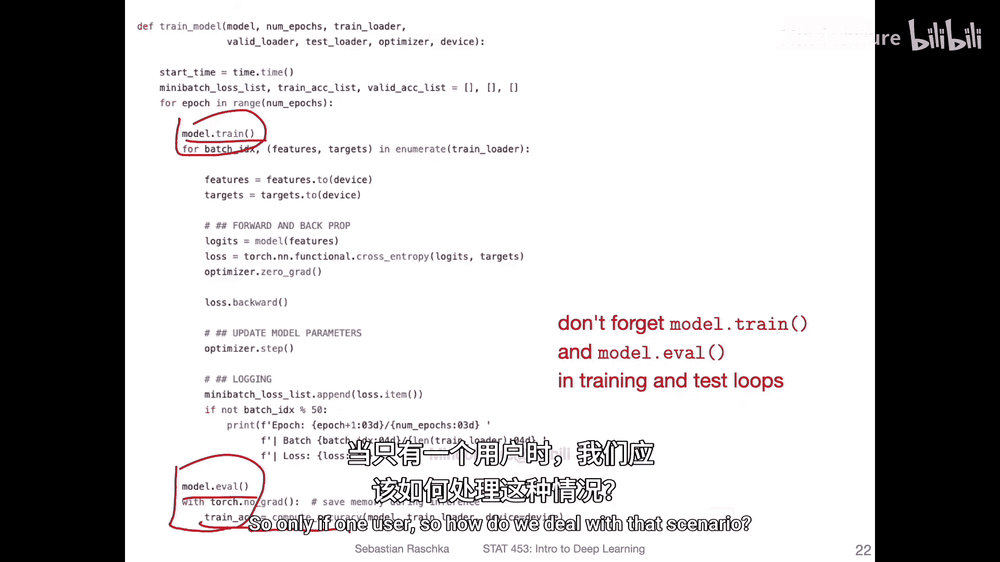
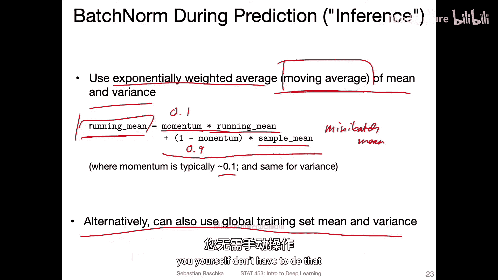
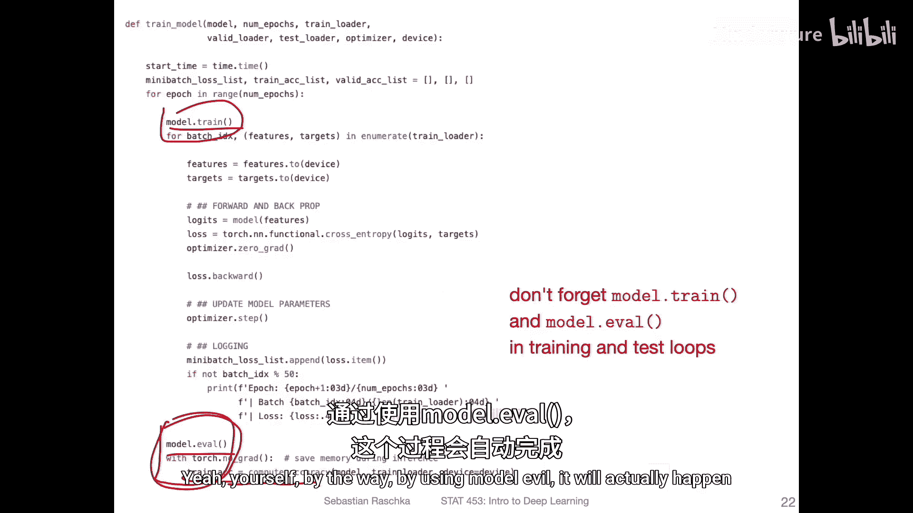
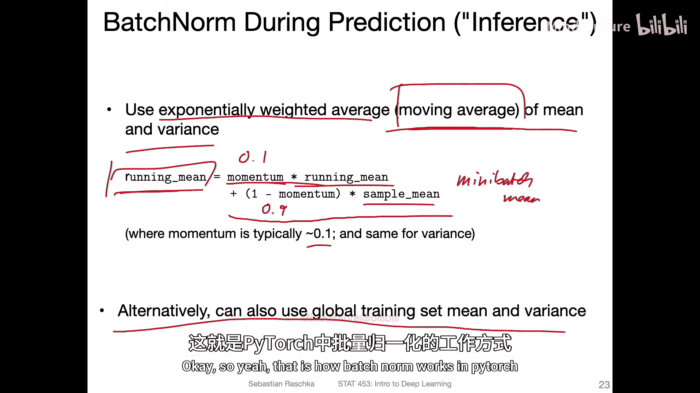
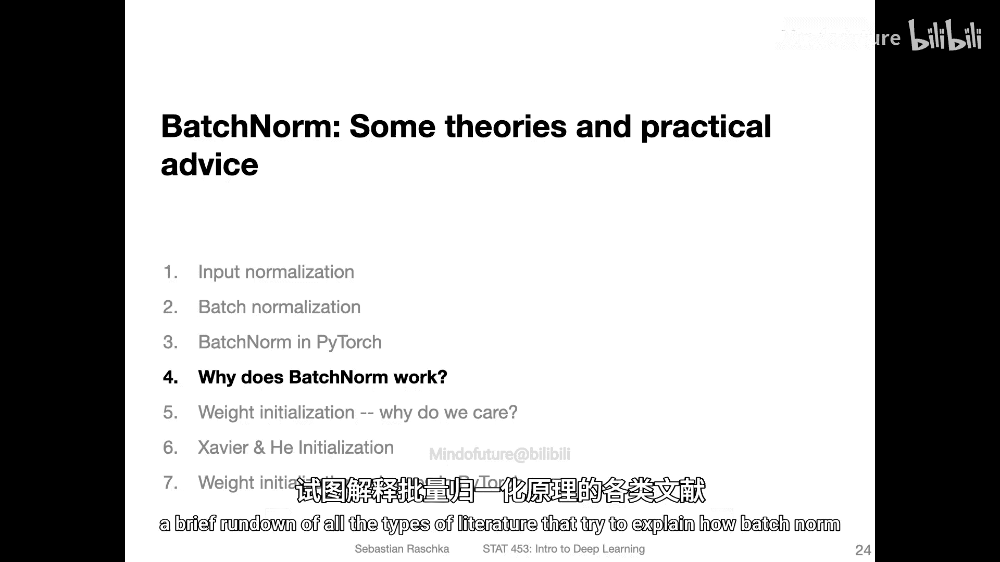

# 084：PyTorch中的BatchNorm——代码示例 📘



在本节课中，我们将学习如何在PyTorch中实际使用批归一化（Batch Normalization），并简要讨论在模型推理阶段批归一化是如何工作的。


## 概述

批归一化是深度学习中一项重要的技术，它通过标准化每一层的输入来加速训练并提升模型性能。在训练时，它使用小批次的统计数据；但在推理时，我们可能只有单个数据点。本节将通过代码示例，展示如何在PyTorch中实现批归一化，并解释其在不同模式下的行为。

## 在PyTorch中实现批归一化

上一节我们介绍了批归一化的理论基础，本节中我们来看看如何在PyTorch中具体实现它。我们将基于一个多层感知机的代码进行修改。

以下是实现批归一化的核心代码片段：

```python
import torch.nn as nn

class MultilayerPerceptron(nn.Module):
    def __init__(self, input_size, hidden_size, num_classes):
        super().__init__()
        # 展平输入，例如将28x28的图像转换为784维向量
        self.flatten = nn.Flatten()
        # 第一个隐藏层
        self.linear1 = nn.Linear(input_size, hidden_size, bias=False) # 设置bias=False
        self.bn1 = nn.BatchNorm1d(hidden_size) # 添加BatchNorm1d层
        self.relu1 = nn.ReLU()
        # 第二个隐藏层
        self.linear2 = nn.Linear(hidden_size, hidden_size, bias=False)
        self.bn2 = nn.BatchNorm1d(hidden_size)
        self.relu2 = nn.ReLU()
        # 输出层
        self.linear_out = nn.Linear(hidden_size, num_classes)

    def forward(self, x):
        x = self.flatten(x)
        x = self.linear1(x)
        x = self.bn1(x) # BatchNorm在激活函数之前
        x = self.relu1(x)
        x = self.linear2(x)
        x = self.bn2(x)
        x = self.relu2(x)
        x = self.linear_out(x)
        return x
```



**代码说明：**
*   `nn.BatchNorm1d`：这是用于全连接层的批归一化。对于卷积层，我们会使用`nn.BatchNorm2d`。
*   `bias=False`：在线性层中，我们通常将偏置项设置为`False`。因为在批归一化中，可学习的参数 `β` 已经起到了偏置的作用，再添加一个偏置项是冗余的。不过在实践中，保留它通常也不会造成问题。
*   位置：在最初的论文中，批归一化被放置在**线性层之后、激活函数之前**。这是本示例采用的方式。

## 批归一化与Dropout的实验比较

为了更深入地理解批归一化的效果，我们进行了一些简单的实验，并将其与Dropout技术进行了比较。

以下是实验的主要发现：

1.  **偏置项的影响**：在线性层中启用或禁用偏置项，在本实验中对模型最终性能没有产生明显差异。
2.  **批归一化的位置**：将批归一化层放在激活函数**之后**（即 线性层 -> 激活函数 -> BatchNorm），也是一种常见的做法。在本实验的简单网络上，两种位置带来的性能差异很小。
3.  **与Dropout结合**：
    *   当同时使用Dropout和批归一化时，模型不再出现过拟合现象。
    *   一个便于记忆的经验法则是：如果采用 **B**atchNorm -> **A**ctivation -> **D**ropout 的顺序（即BAD），可能不如采用 **A**ctivation -> **B**atchNorm -> **D**ropout 的顺序（将BatchNorm放在激活之后）常见和稳定。尽管在本实验中差异不大，但在更复杂的网络（如卷积网络）中，后一种顺序可能更受推荐。

## 训练与推理模式

批归一化在训练和推理阶段的行为是不同的，理解这一点至关重要。

在训练函数中，我们必须正确设置模型的模式：



```python
def train(model, data_loader, ...):
    model.train() # 设置为训练模式
    # ... 训练循环 ...

def evaluate(model, data_loader, ...):
    model.eval() # 设置为评估（推理）模式
    with torch.no_grad():
        # ... 评估循环 ...
```

*   **训练模式 (`model.train()`)**: 在此模式下，`BatchNorm`层会计算当前小批次数据的均值和方差，并用它们来标准化数据。同时，它会持续更新两个**运行统计量**：`running_mean`（运行均值）和 `running_var`（运行方差）。
*   **评估/推理模式 (`model.eval()`)**: 在此模式下，`BatchNorm`层停止更新运行统计量，并固定使用训练阶段最终得到的 `running_mean` 和 `running_var` 来标准化数据。这是为了模拟推理场景，因为在新数据预测时，我们可能只有单个样本，无法计算有意义的批次统计量。

## 推理时的处理机制



那么，在推理时使用的 `running_mean` 和 `running_var` 是如何计算的呢？

主要有两种方式，PyTorch采用的是第二种：

1.  **使用全局训练集统计量**：计算整个训练集特征的均值和方差。这种方法虽然直观，但在实践中并不常用。
2.  **使用指数加权移动平均**：这是PyTorch等框架采用的标准方法。在每次训练迭代中，它都会更新运行统计量。

其更新公式如下：
`running_mean = momentum * running_mean + (1 - momentum) * batch_mean`
`running_var = momentum * running_var + (1 - momentum) * batch_var`

其中，`momentum` 是一个超参数（默认为0.1），`batch_mean` 和 `batch_var` 是当前小批次的统计量。这实际上是在维护一个跨批次的、平滑的均值和方差估计，并在推理时使用这些稳定的值。

## 总结





本节课中我们一起学习了：
1.  如何在PyTorch中通过添加 `nn.BatchNorm1d` 或 `nn.BatchNorm2d` 层来实现批归一化。
2.  通常将线性层的偏置设为 `False`，因为批归一化的 `β` 参数已承担其角色。
3.  批归一化可以放在激活函数之前或之后，后者在与Dropout结合时可能是更常见的选择。
4.  必须通过 `model.train()` 和 `model.eval()` 正确管理模型模式，这对批归一化至关重要。
5.  在推理阶段，批归一化使用训练时通过指数移动平均计算得到的运行均值和方差，从而能够处理单个数据点的预测。





通过本教程，你应该能够在自己的PyTorch项目中有效地使用批归一化技术来提升训练稳定性和模型性能。