# 085：BatchNorm为何有效 🧠

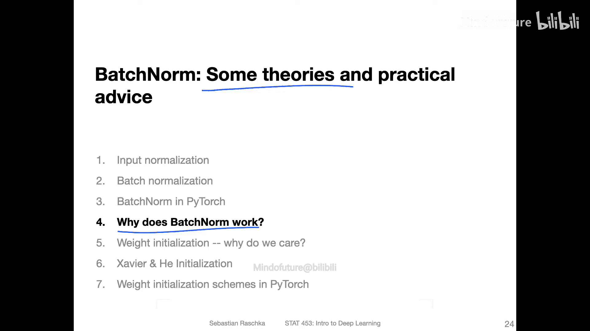

在本节课中，我们将探讨批归一化（Batch Normalization）为何有效。我们将回顾其提出的初衷，分析几种主流理论，并基于研究论文提供一些实证证据。最后，我们会给出一些实用的建议。

---

## 批归一化的工作原理回顾

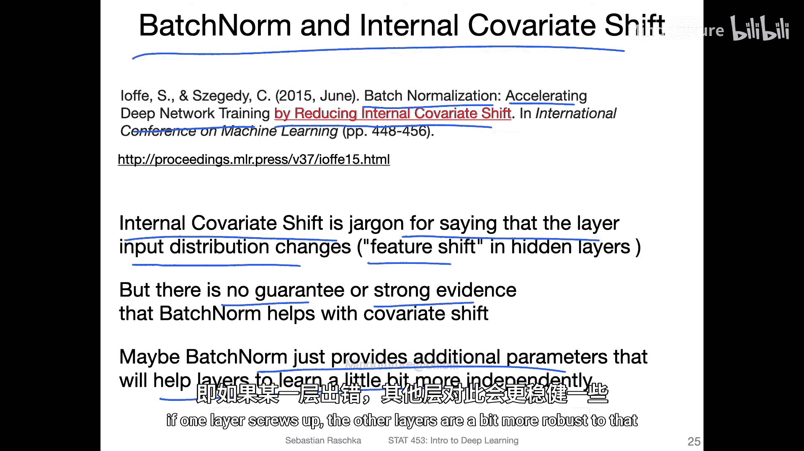

在之前的视频中，我们讨论了批归一化如何工作。其核心操作是对每一层的输入进行标准化，使其均值为0，方差为1，并引入可学习的缩放和平移参数。

**公式**：
对于一个批次的数据 `x`，批归一化计算如下：
1.  计算批次均值：`μ_B = mean(x)`
2.  计算批次方差：`σ_B² = var(x)`
3.  归一化：`x̂ = (x - μ_B) / sqrt(σ_B² + ε)`
4.  缩放与平移：`y = γ * x̂ + β`

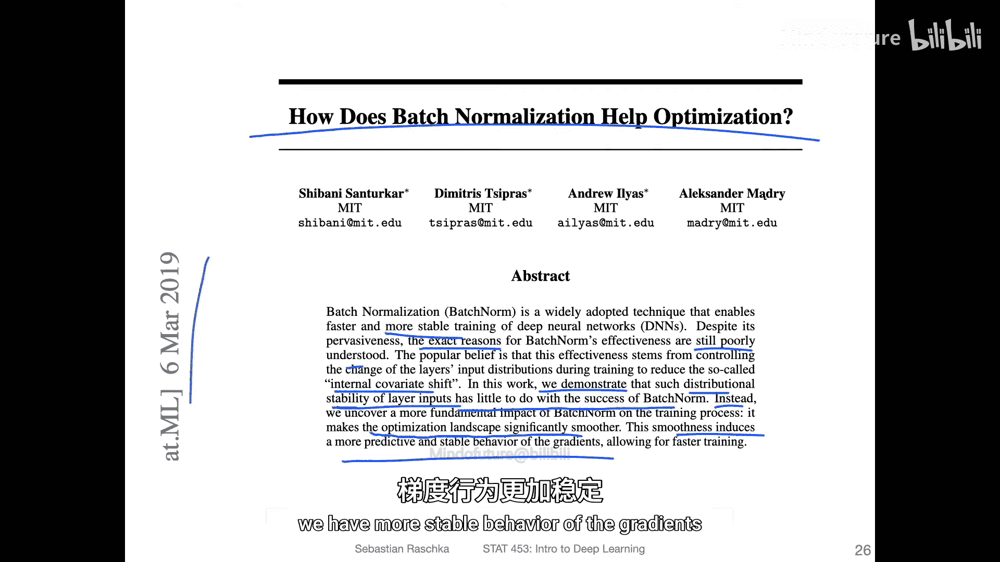

其中，`γ` 和 `β` 是可学习的参数，`ε` 是一个很小的常数，用于数值稳定性。

---

## 关于BatchNorm有效性的理论探讨

现在，让我们来探讨批归一化为何有效。这里没有唯一的答案，但我们可以汇总一些理论和实证证据来支持某些观点。

### 理论一：减少内部协变量偏移

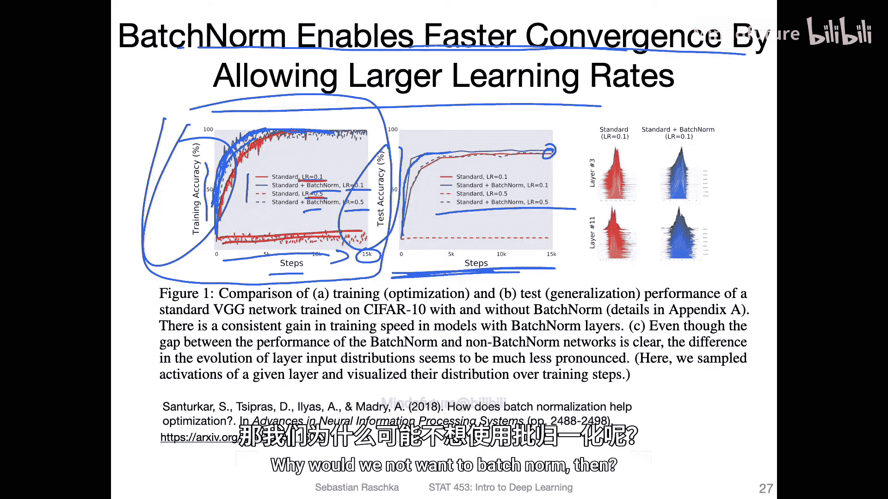

原始提出批归一化的论文认为，它通过减少“内部协变量偏移”来加速训练。
*   **什么是内部协变量偏移？** 它指的是神经网络中某一层的输入分布（即特征分布）在训练过程中会发生变化。这种分布的不稳定被认为会拖慢训练。
*   **批归一化的作用**：通过持续地对每一层的输入进行重归一化，批归一化旨在稳定这些分布。
*   **现状**：然而，目前并没有强有力的证据完全支持这一理论。后续有论文对这一解释提出了质疑。

### 理论二：平滑优化景观

一项2019年的研究提出了不同的观点。该论文发现，批归一化的成功与减少内部协变量偏移关系不大。
*   **核心发现**：批归一化主要作用是**使损失函数的优化景观（landscape）变得更加平滑**。
*   **带来的好处**：
    1.  **梯度更稳定**：平滑的景观意味着梯度变化更可预测，减少了训练的不稳定性。
    2.  **允许使用更大的学习率**：因为梯度更稳定，模型能够承受更大的更新步伐，从而可能加速收敛。
    3.  **对超参数更鲁棒**：训练过程对学习率等超参数的选择不那么敏感，降低了调参难度。

该论文通过实验表明，在使用批归一化后，即使使用较大的学习率，训练也能保持稳定，而在不使用批归一化时，大学习率可能导致训练失败。

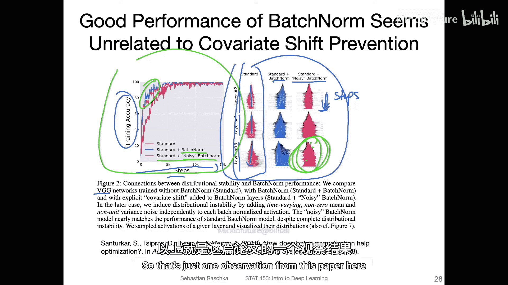

### 其他理论观点

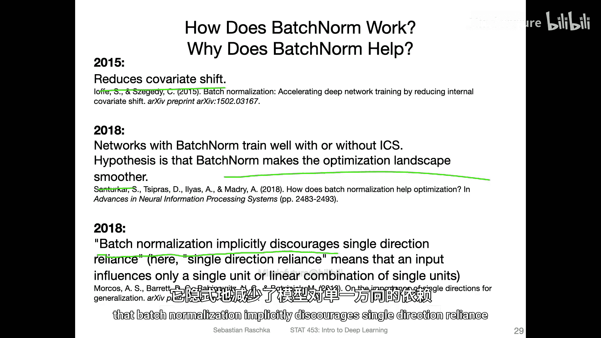

除了上述两种，学术界还有其他一些解释：
*   **减少对单一方向的依赖**：批归一化可能隐式地鼓励模型不过度依赖某些特定的特征方向，从而提升泛化能力。
*   **作为隐式正则化器**：它可能通过引入轻微噪声（来自小批次的统计估计）起到正则化的作用，防止过拟合。
*   **层间解耦**：有观点认为批归一化使网络各层之间的依赖性降低，某一层的变化不会过快地影响到其他层，提高了训练的稳定性。

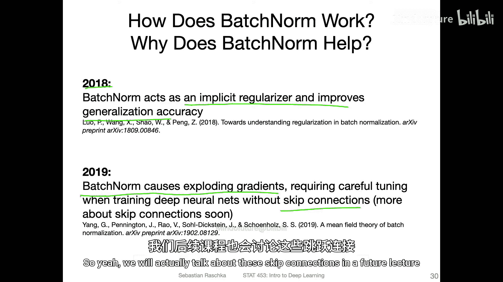

---

## 实践建议与注意事项

了解了理论背景后，我们来看看在应用批归一化时的一些实用技巧和注意事项。

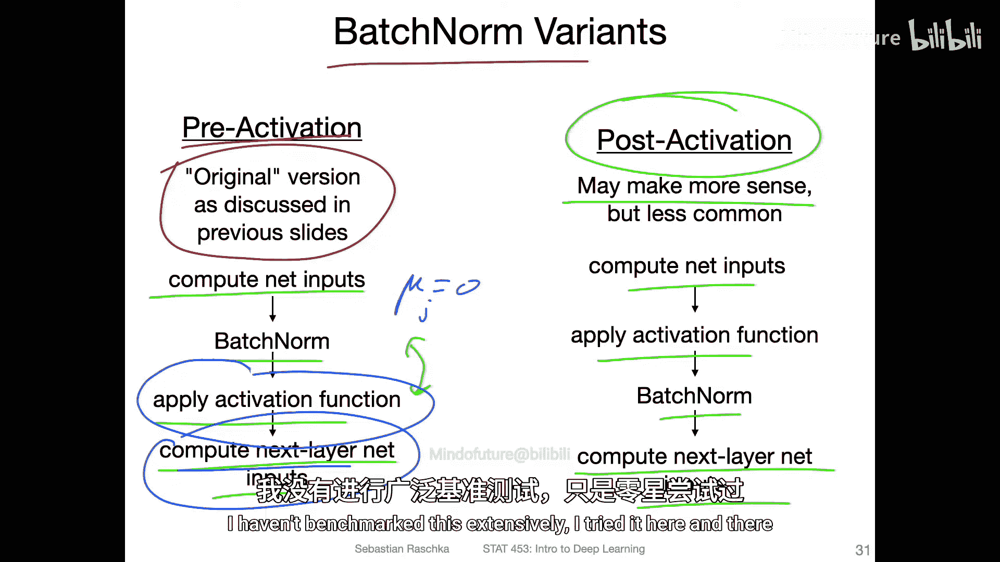

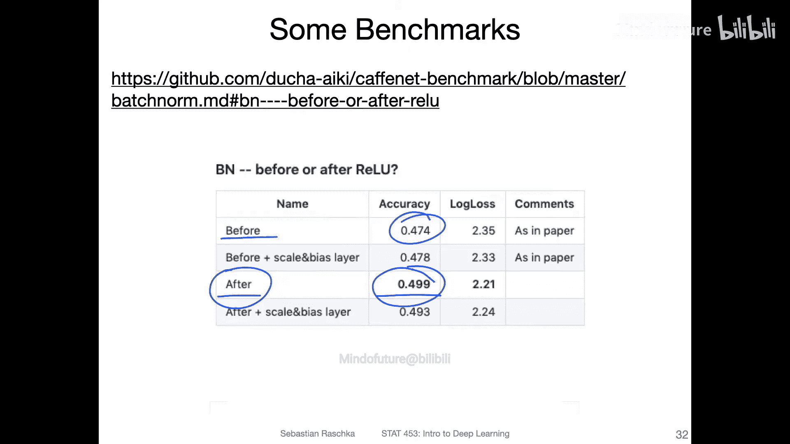

### 1. 放置位置：激活函数之前还是之后？

原始论文将批归一化层放在**激活函数之前**。即：`全连接层 -> BatchNorm -> 激活函数`。
*   **逻辑**：先对线性变换的结果进行归一化，再送入非线性激活函数。

然而，在实践中，将其放在**激活函数之后**也值得尝试。即：`全连接层 -> 激活函数 -> BatchNorm`。
*   **逻辑**：某些激活函数（如Sigmoid）会改变数据的分布。如果在激活前归一化到0均值，经过Sigmoid后输出会集中在0.5附近，这可能并非下一层期望的输入分布。放在激活后可以确保输入下一层的特征具有稳定的分布。
*   **建议**：一些实验表明，放在激活函数之后可能获得更好的效果。这是一个可以尝试的调优点。

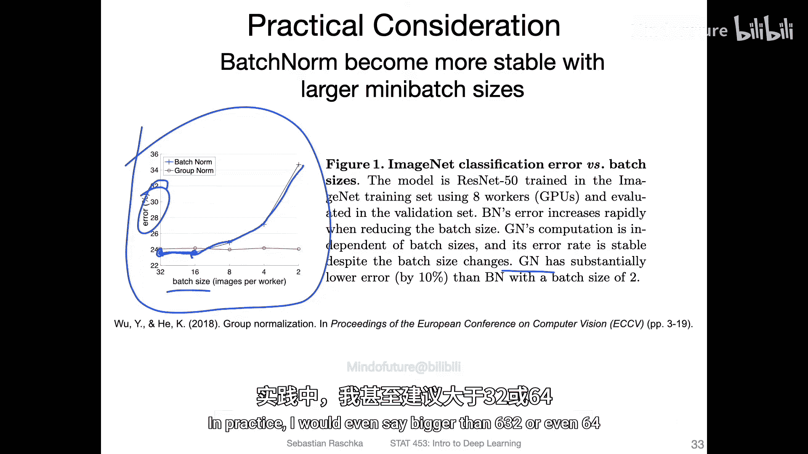

### 2. 批次大小的影响

批归一化的效果严重依赖于**批次大小**。
*   **问题**：当批次过小时，计算出的均值 `μ_B` 和方差 `σ_B` 统计量会非常嘈杂和不准确，这会损害批归一化的效果，甚至使训练不稳定。
*   **建议**：在实践中，**建议使用大于16（最好是32或64）的批次大小**。研究显示，当批次大小降至8、4或2时，使用批归一化的模型性能会显著下降。

### 3. 批次大小为何常选2的幂次？

你可能会注意到，常见的批次大小如32、64、128都是2的幂次方。
*   **硬件优化**：GPU的并行计算单元（核心数）通常是2的幂次方。选择2的幂次作为批次大小，可以更好地让计算任务在GPU核心间均衡分配，提高硬件利用率。
*   **简化超参数搜索**：将搜索空间限制在2的幂次上（如32, 64, 128, 256），大大减少了需要尝试的超参数组合数量，让调参过程更高效。

---

## 延伸阅读与最新进展

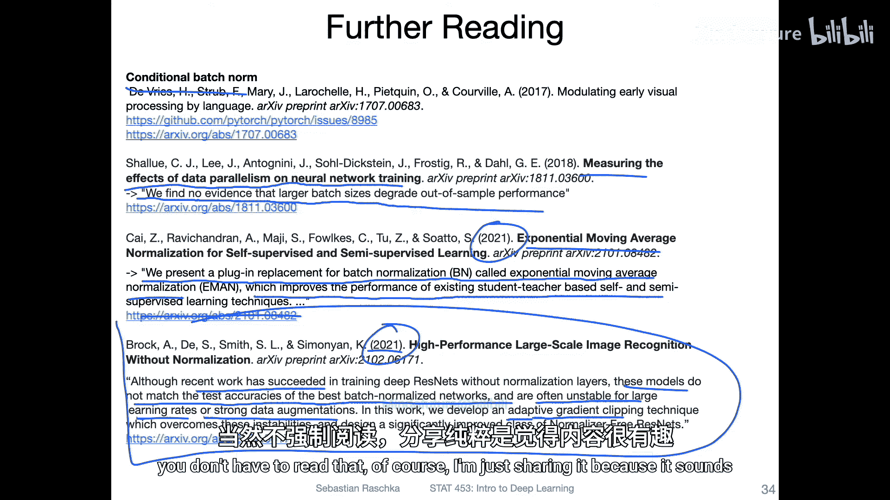

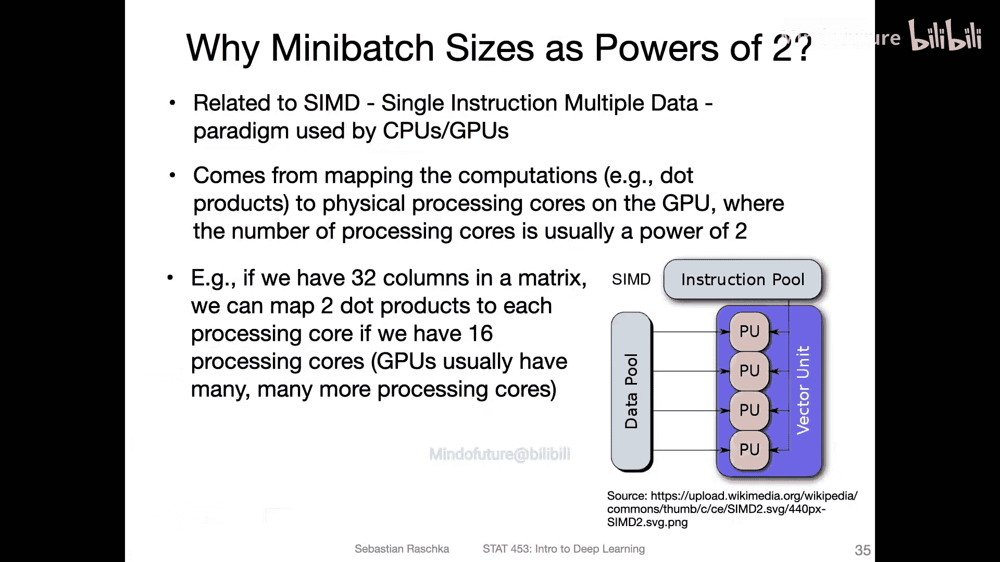

如果你对批归一化及其替代方案感兴趣，这里有一些进阶阅读方向：
*   **条件批归一化**：在归一化过程中引入类别信息，为不同类别学习不同的 `γ` 和 `β` 参数。
*   **大批次训练**：有研究探讨了大批次训练对泛化能力的影响，结论并不统一，是一个有趣的议题。
*   **批归一化的替代方案**：
    *   **Group Normalization**：针对卷积网络设计，不依赖于批次维度，在小批次场景下表现更好。
    *   **EMA Normalization**：使用指数移动平均进行归一化的新方法。
    *   **无归一化训练**：最新研究通过“自适应梯度裁剪”等技术，尝试在不使用批归一化的情况下也能稳定训练深度网络并获得良好性能。

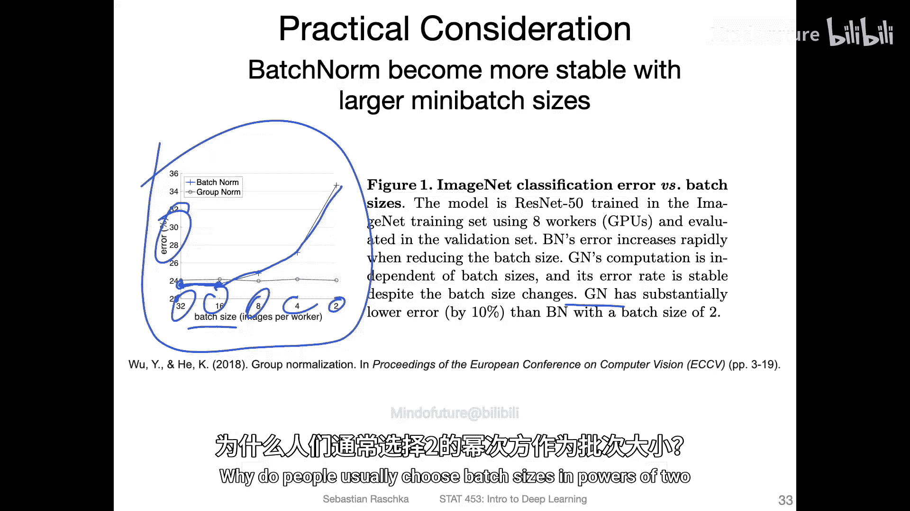

---

## 总结

本节课我们一起深入探讨了批归一化为何有效。
1.  我们回顾了其减少**内部协变量偏移**的原始动机，但也了解到这一理论存在争议。
2.  我们重点介绍了一个被广泛认可的观点：批归一化通过**平滑优化景观**，使得梯度更稳定、允许使用更大的学习率，从而加速并稳定了训练过程。
3.  在实践部分，我们讨论了批归一化的**放置顺序**（激活函数前后）、**批次大小**的关键影响（建议>16），以及选择**2的幂次作为批次大小**的硬件与调参优势。

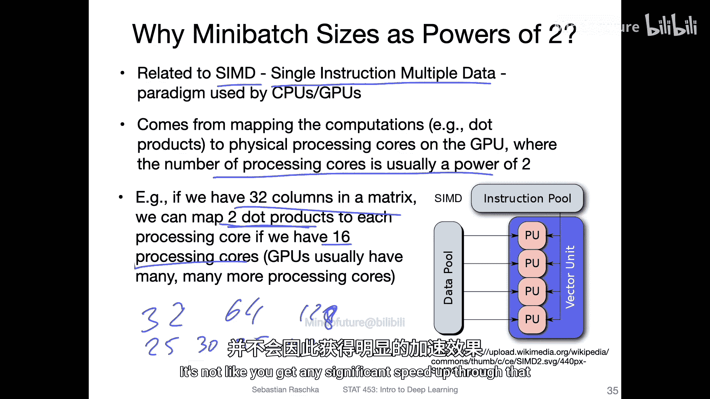

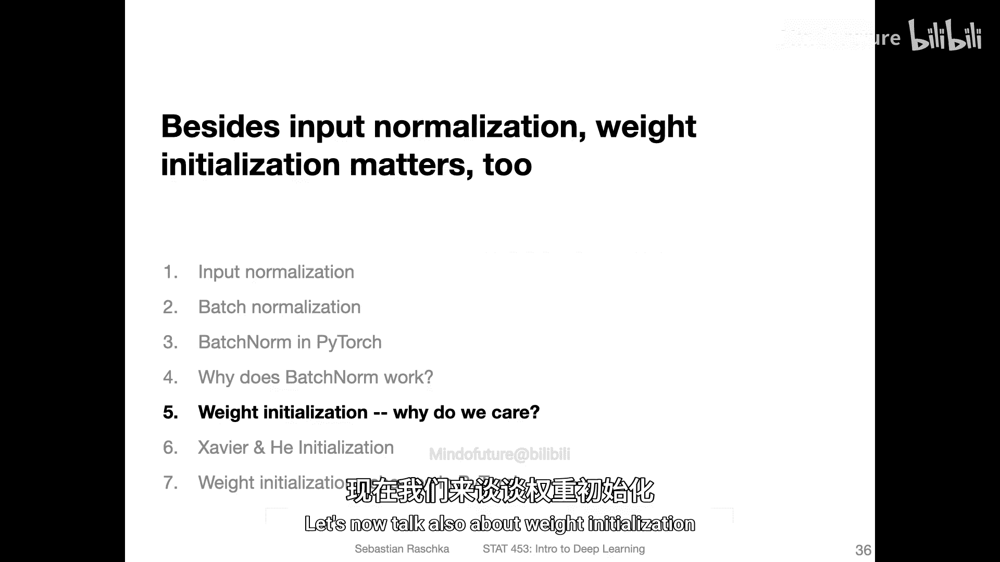

批归一化是现代深度神经网络中一项至关重要的技术，理解其背后的原理和最佳实践，将帮助你更有效地构建和训练模型。