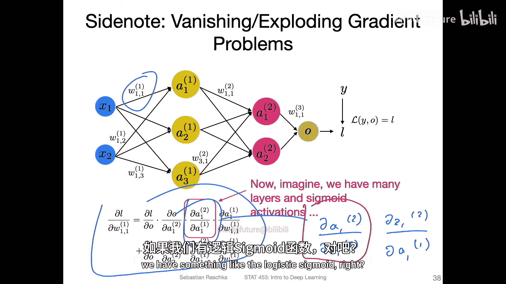
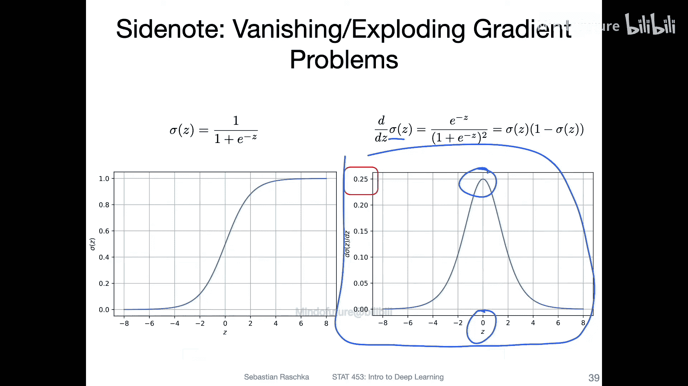
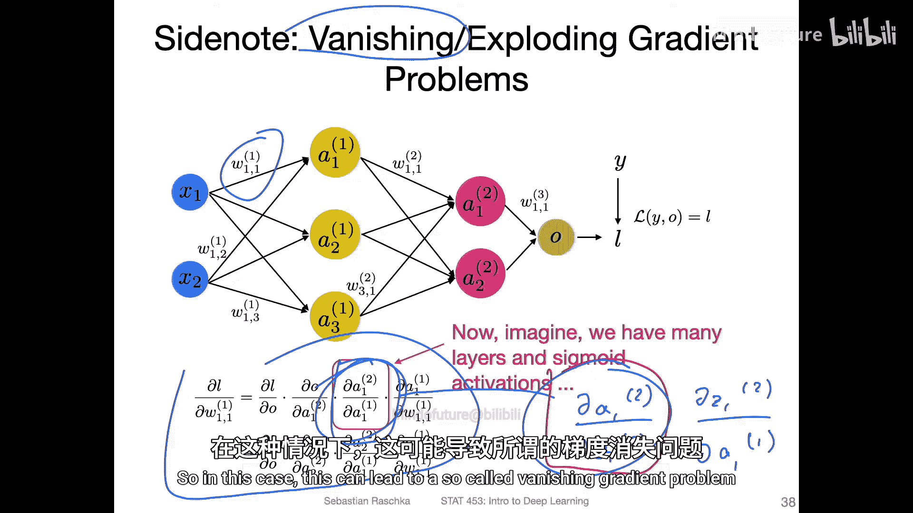
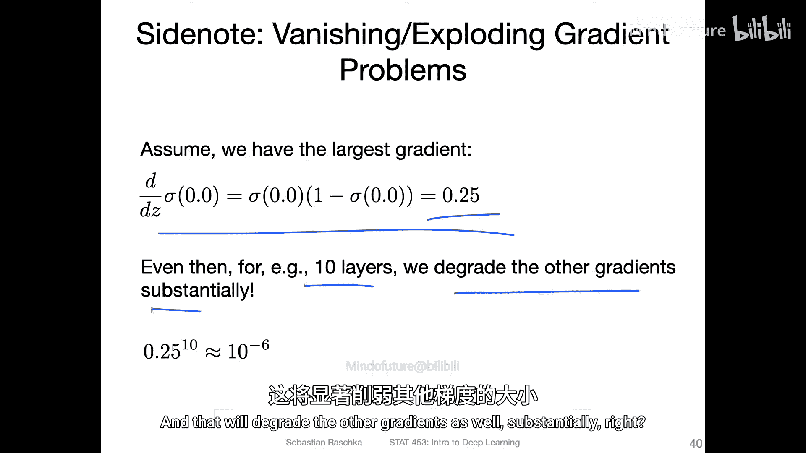
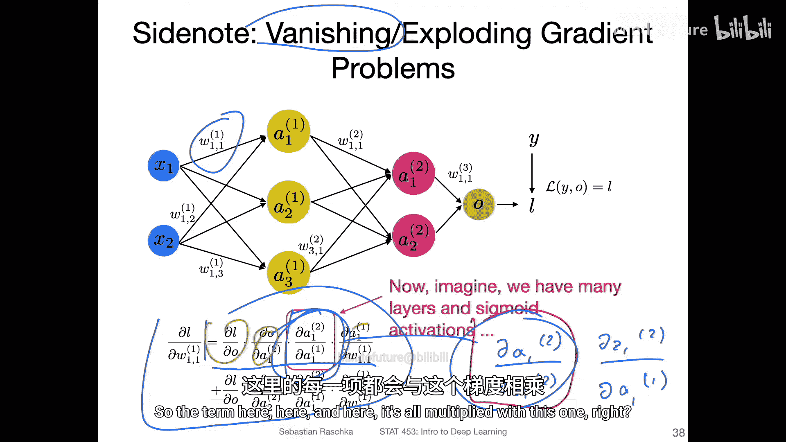
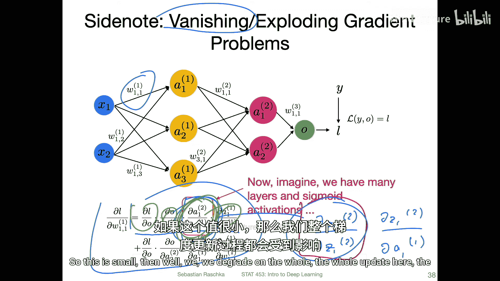
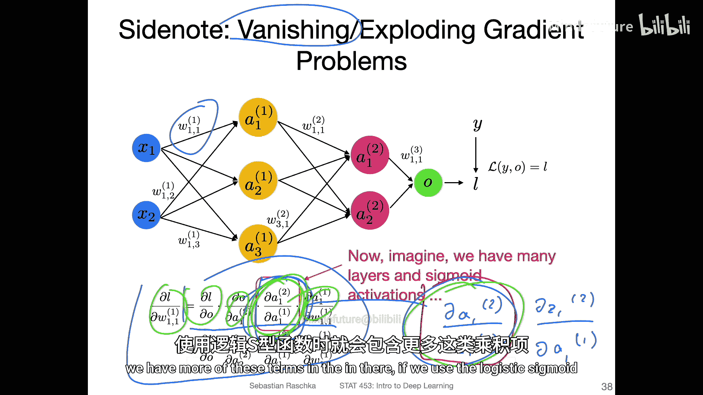
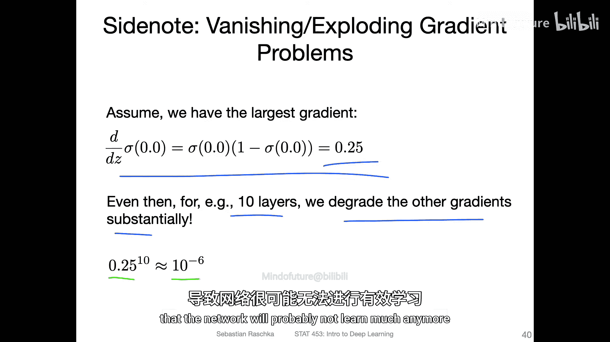
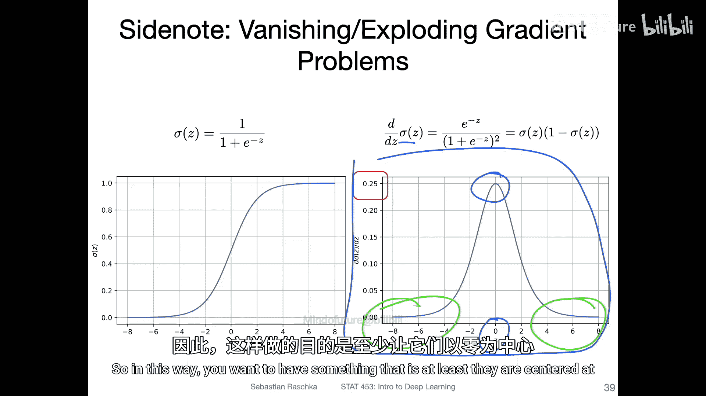

# 086：权重初始化——为何重要 🧠

在本节课中，我们将探讨神经网络中权重初始化的重要性。上一节我们讨论了输入归一化，本节中我们来看看权重初始化为何同样关键，以及不恰当的初始化可能导致的“梯度消失”问题。

权重初始化不仅是为了打破多层感知机中的对称性，还需要将权重保持在合适的尺度上。这与之前提到的输入归一化有紧密联系。

为了理解权重初始化的影响，让我们回顾一下多层感知机中更新单个权重的过程。关键在于计算激活函数对其输入的导数。

例如，考虑逻辑Sigmoid函数。其导数在其输入为0时最大，最大值仅为0.25。

在反向传播中，我们需要计算损失函数对前面层权重的梯度。这个计算过程涉及链式法则，会多次乘以激活函数的导数项。

如果激活函数的导数始终小于1（如Sigmoid函数），并且在网络中有许多层，那么这些小于1的值会被反复相乘。

这会导致所谓的“梯度消失”问题。梯度值随着反向传播到更早的层而指数级减小。

例如，假设Sigmoid导数的最大值是0.25。对于一个10层的网络，梯度可能会缩小到大约 (0.25)^10，即约 10^{-6} 的数量级。如此小的梯度会使网络参数更新极其缓慢，导致学习停滞。

因此，对于使用Sigmoid等激活函数的网络，将权重初始化为以0为中心的小随机数是一个好主意。这样可以使网络的初始输入落在激活函数梯度较大的区域（例如Sigmoid函数在0附近）。

以下是几种常见的传统初始化方法思路：
*   从均匀分布中采样，例如范围在 [-0.5, 0.5] 或更小的 [-0.05, 0.05]。
*   从均值为0、方差较小的高斯（正态）分布中采样。

对于ReLU等激活函数，初始化的要求可能不同。但总的来说，让初始权重值既有正也有负，可以为网络提供更多的组合可能性。

如今，更常见和推荐的方法是使用Xavier初始化或Kaiming（He）初始化等专门设计的方案，我们将在下一个视频中详细讨论。

本节课中我们一起学习了权重初始化的重要性。不恰当的初始化，尤其是与Sigmoid类激活函数结合时，会导致梯度消失，严重阻碍深层网络的学习。因此，选择以0为中心、尺度合适的初始值至关重要。现代深度学习框架通常提供了这些更先进的初始化方法。