# 088：PyTorch中的权重初始化 🔧


在本节课中，我们将学习PyTorch如何处理权重初始化，以及如何根据需要自定义初始化方案。权重初始化是神经网络训练中的一个重要环节，它影响着模型训练的起点和收敛速度。

## PyTorch的默认初始化方案

上一节我们介绍了权重初始化的概念，本节中我们来看看PyTorch框架的默认做法。PyTorch的默认权重初始化方案会随着版本更新而变化。在当前的1.8版本中，无论是全连接层（`Linear`）还是卷积层（`Conv`），默认都使用**Kaiming均匀初始化**。

以下是PyTorch源码中相关的初始化代码片段：

```python
# 这是PyTorch内部初始化逻辑的示意
# 对于Linear层，默认使用Kaiming均匀初始化，并假设激活函数为Leaky ReLU
def reset_parameters(self):
    init.kaiming_uniform_(self.weight, a=math.sqrt(5))
    if self.bias is not None:
        fan_in, _ = init._calculate_fan_in_and_fan_out(self.weight)
        bound = 1 / math.sqrt(fan_in)
        init.uniform_(self.bias, -bound, bound)
```

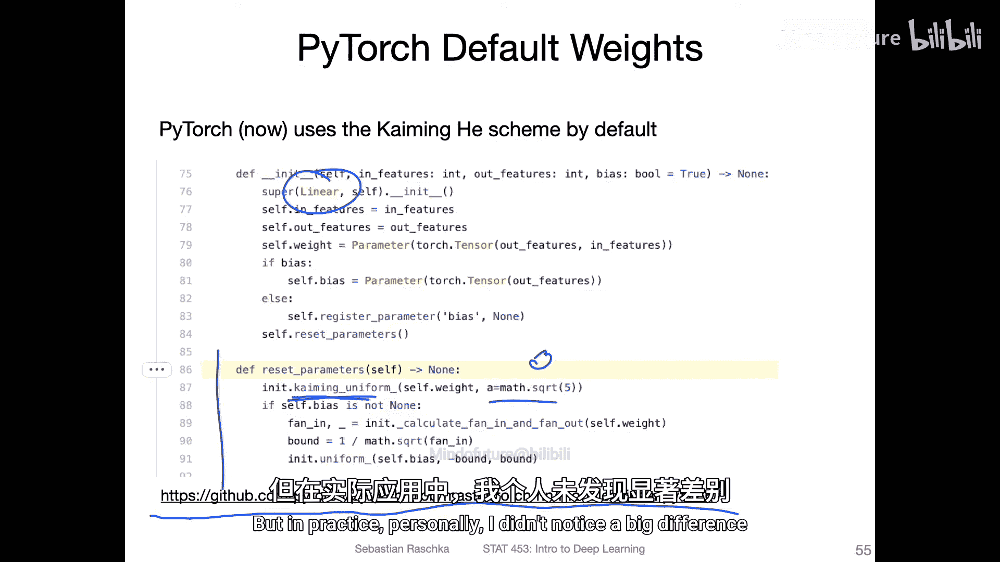

值得注意的是，代码中的 `a=math.sqrt(5)` 参数是针对Leaky ReLU激活函数设置的。这意味着PyTorch默认假设你会在这些层之后使用Leaky ReLU。如果你使用的是普通的ReLU激活函数，理论上将这个参数设为0可能更合适。但在实践中，使用默认值通常也不会造成显著差异。

## 如何手动覆盖默认初始化

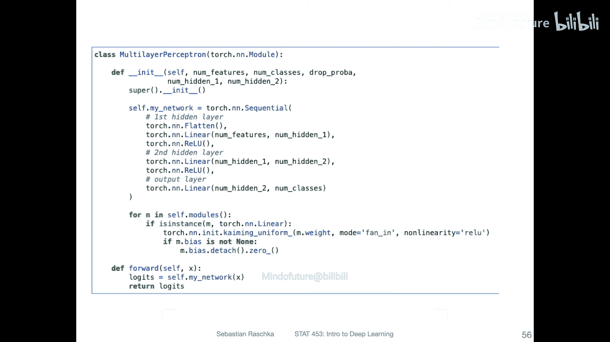

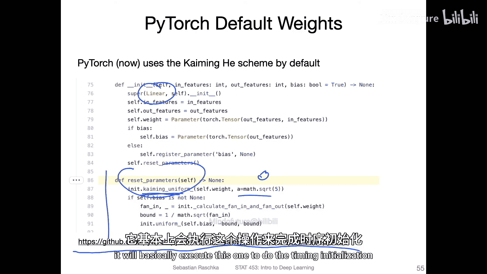

虽然默认方案在大多数情况下表现良好，但有时我们可能需要根据特定的网络结构或激活函数来调整初始化策略。以下是如何手动覆盖PyTorch自动初始化过程的方法。

一种便捷的方式是在定义网络模型后，遍历其所有模块，并对特定类型的层（如全连接层）应用自定义的初始化。以下是具体的操作步骤：

1.  首先，定义一个简单的多层感知机（MLP）模型。
2.  然后，遍历模型中的所有子模块。
3.  筛选出全连接层（`nn.Linear`）。
4.  对这些层的权重和偏置应用新的初始化方案。

以下是实现此过程的代码示例：

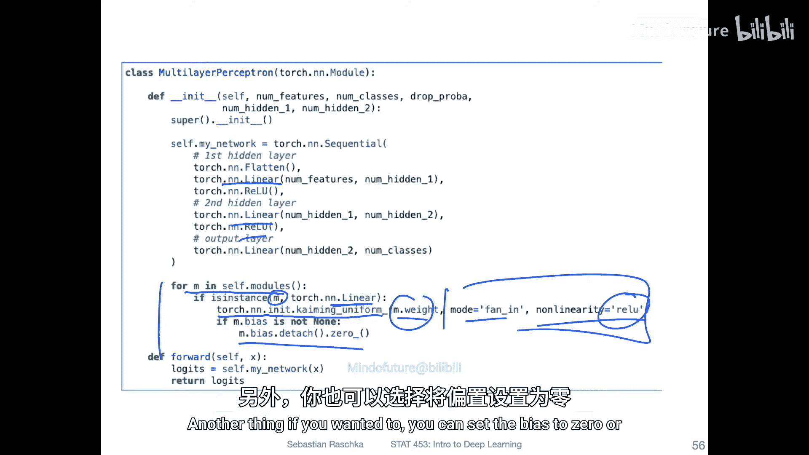

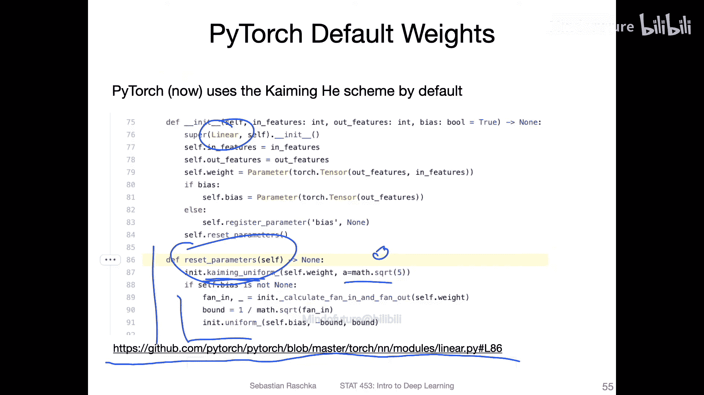

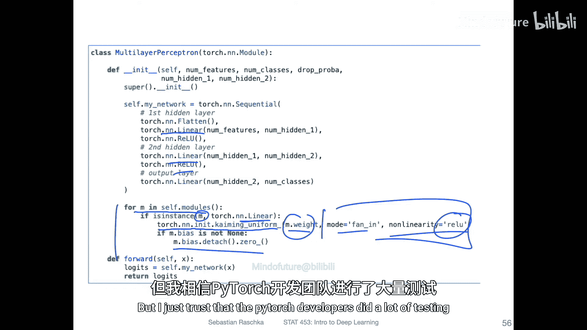

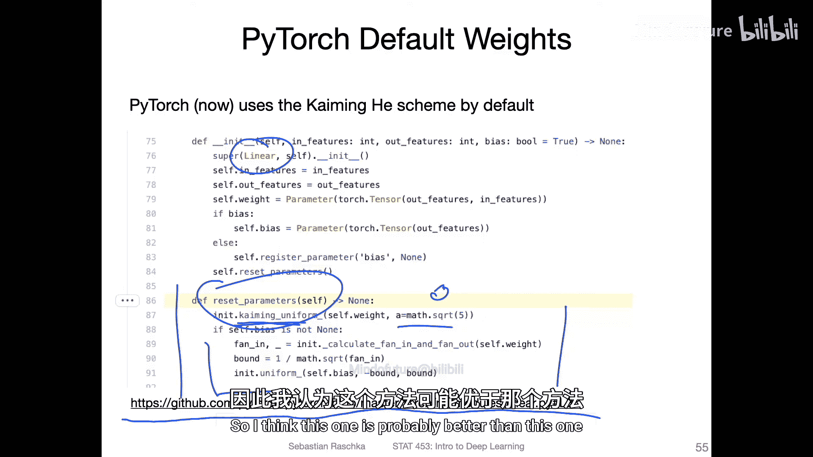

```python
import torch
import torch.nn as nn
import torch.nn.init as init

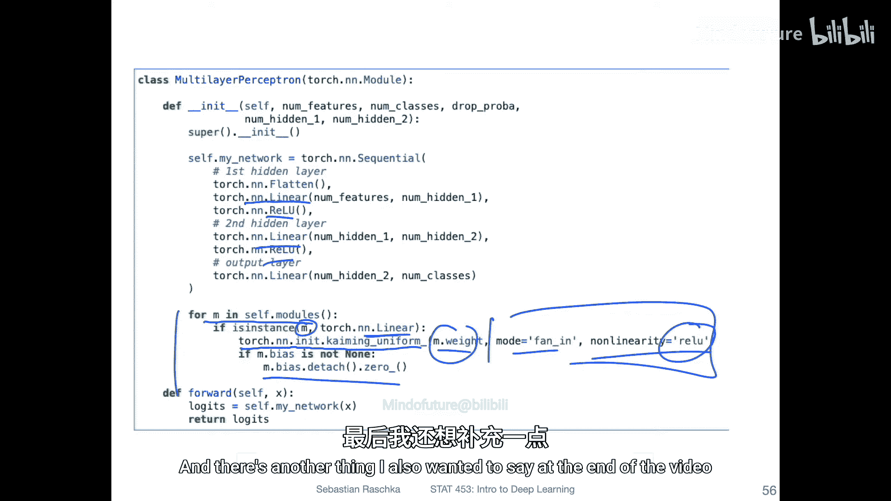

# 1. 定义一个简单的MLP模型
class SimpleMLP(nn.Module):
    def __init__(self, input_size=784, hidden_size=256, output_size=10):
        super(SimpleMLP, self).__init__()
        self.layers = nn.Sequential(
            nn.Linear(input_size, hidden_size),
            nn.ReLU(),
            nn.Linear(hidden_size, output_size)
        )

    def forward(self, x):
        return self.layers(x)

# 2. 实例化模型
model = SimpleMLP()

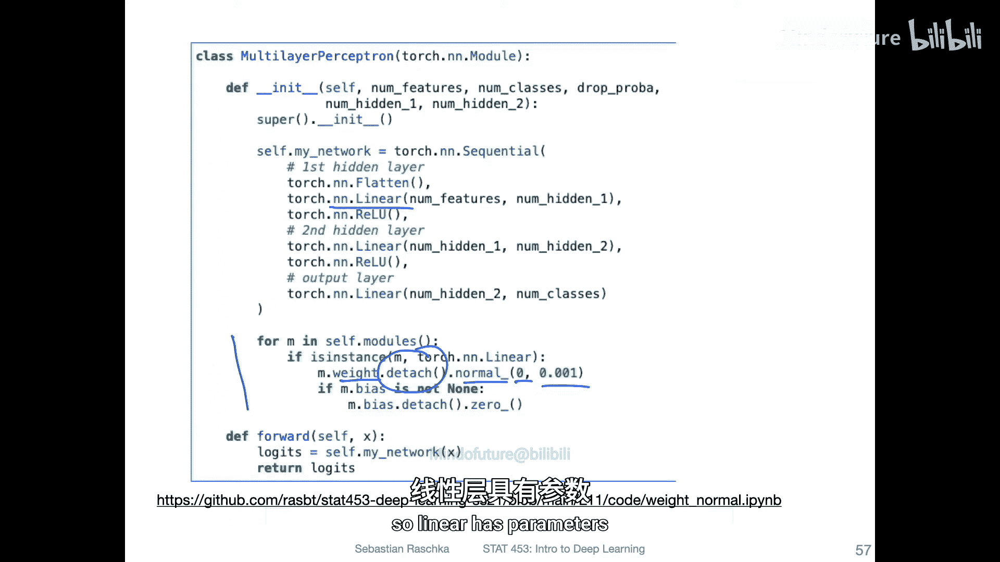

# 3. 遍历模型模块并应用自定义初始化
for m in model.modules():
    if isinstance(m, nn.Linear):
        # 使用Kaiming均匀初始化，并指定非线性函数为ReLU
        init.kaiming_uniform_(m.weight, nonlinearity='relu')
        # 将偏置初始化为0
        if m.bias is not None:
            init.constant_(m.bias, 0)
```

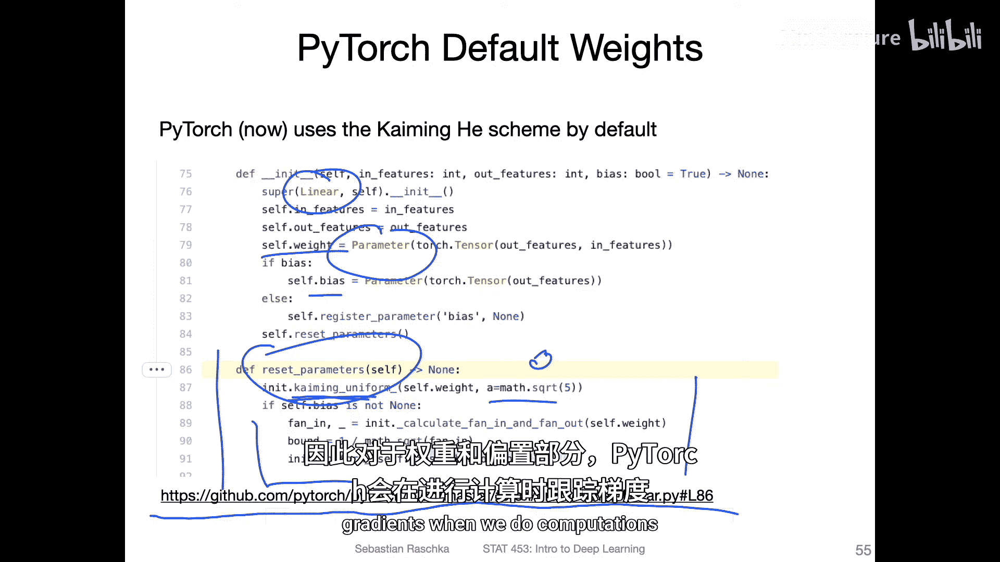

在这段代码中，我们使用了 `init.kaiming_uniform_` 函数，并明确指定了 `nonlinearity='relu'`，这比修改源码更为方便。对于偏置，我们简单地将其初始化为0。PyTorch开发团队经过了大量测试，其默认方案通常是稳健的起点。

## 其他初始化方案示例：高斯初始化

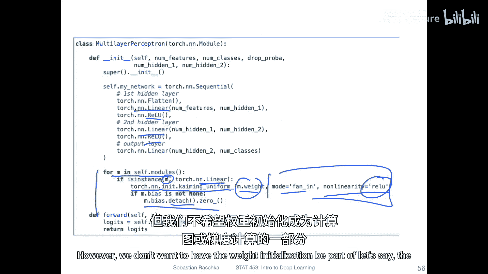

除了Kaiming初始化，我们也可以使用其他分布，例如高斯（正态）分布来初始化权重。

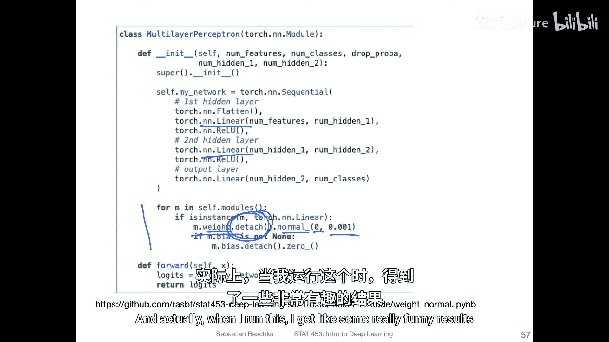

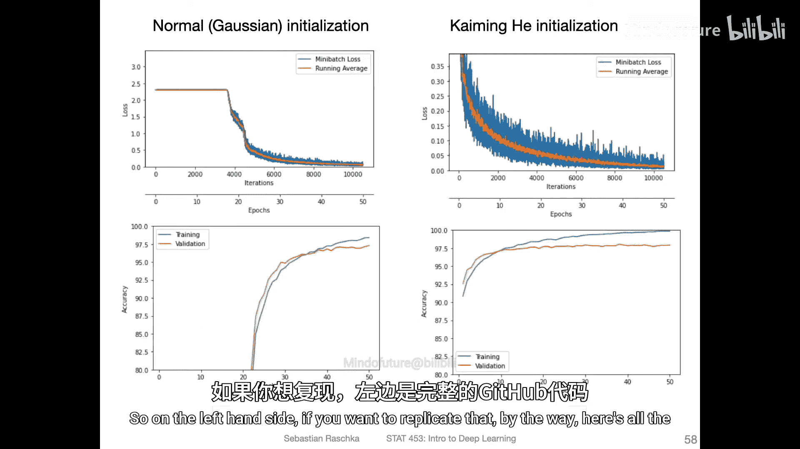

以下是使用高斯分布进行初始化的代码：

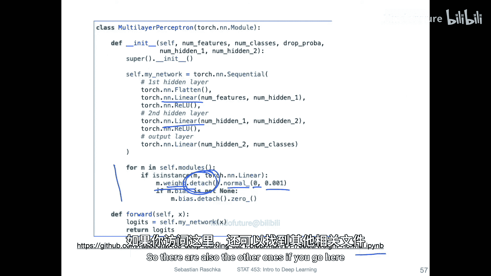

```python
for m in model.modules():
    if isinstance(m, nn.Linear):
        # 从均值为0，标准差为0.001的高斯分布中采样权重
        m.weight.data = torch.randn_like(m.weight) * 0.001
        # 使用.detach()确保此操作不被计入计算图
        m.weight.data = m.weight.data.detach()
        if m.bias is not None:
            init.constant_(m.bias, 0)
```

这里有一个关键点：我们使用了 `.detach()` 方法。在PyTorch中，所有可学习参数（`Parameter`）默认都会跟踪梯度以进行反向传播。然而，权重初始化操作本身不应该成为计算图的一部分，它仅仅是训练的起点。使用 `.detach()` 可以将新初始化的权重张量从当前计算图中分离，防止梯度在此处被计算，这是一种良好的实践。

## 初始化方案的影响与批归一化

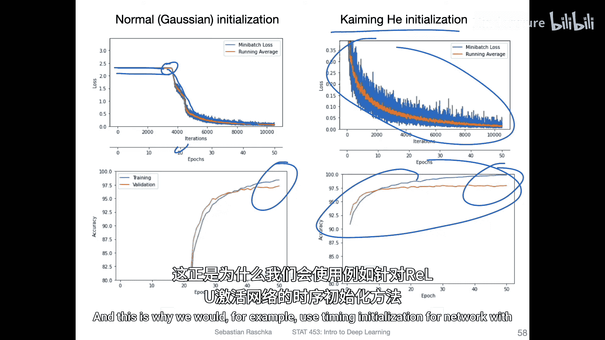

不同的初始化方案对训练过程有实际影响。例如，在实验中，使用标准差为0.001的高斯初始化可能会导致网络在训练初期（如前20个周期）损失几乎不下降，之后才突然开始学习。而使用Kaiming初始化的网络则能更平稳、更快地开始训练。

然而，需要强调的是，当网络中使用**批归一化**（Batch Normalization）时，权重初始化的选择变得不那么关键。因为批归一化层会对每个小批量的激活值进行标准化，这在一定程度上抵消了初始权重尺度不同带来的影响，使得网络对初始化方案更加鲁棒。


实验表明，即使使用简单的高斯初始化，只要配合批归一化，网络也能快速且稳定地训练。

## 总结

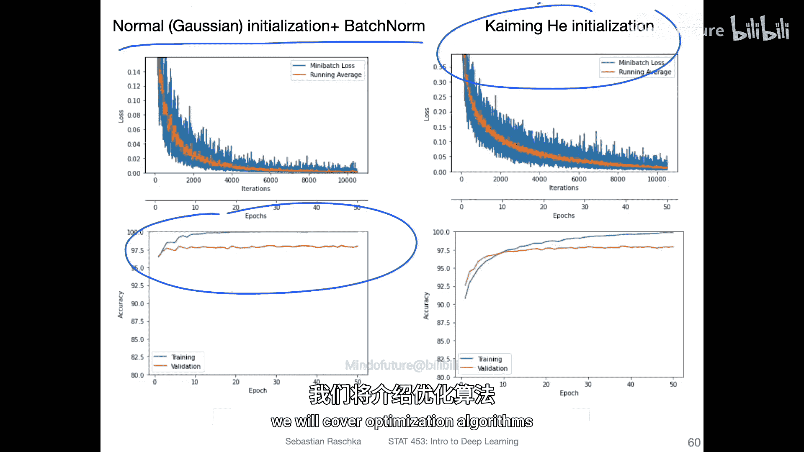

本节课中我们一起学习了PyTorch中的权重初始化。我们了解到PyTorch默认使用Kaiming均匀初始化，并掌握了如何手动覆盖默认设置，为全连接层等模块应用自定义的初始化方案（如针对ReLU的Kaiming初始化或高斯初始化）。我们还学习了使用 `.detach()` 来正确初始化参数。最后，我们认识到批归一化技术能够增强网络对权重初始化方式的鲁棒性。虽然选择合适的初始化很重要，但对于使用了现代技巧（如批归一化）的网络，PyTorch的默认设置通常是一个可靠的选择。