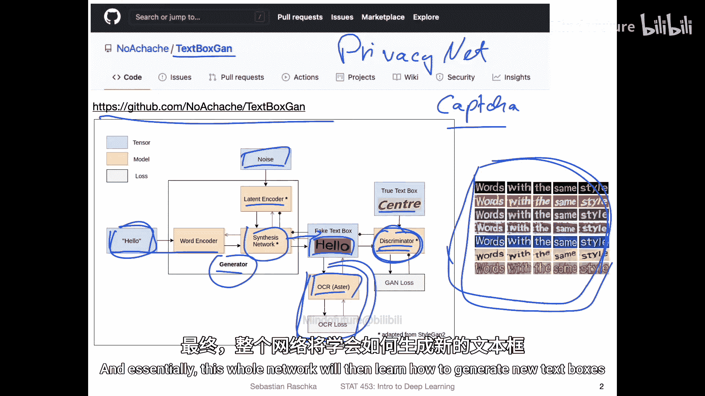
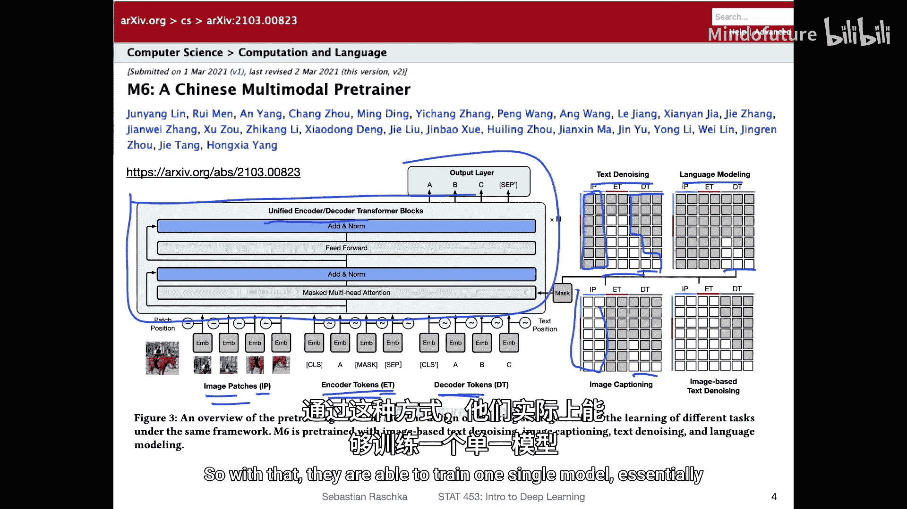
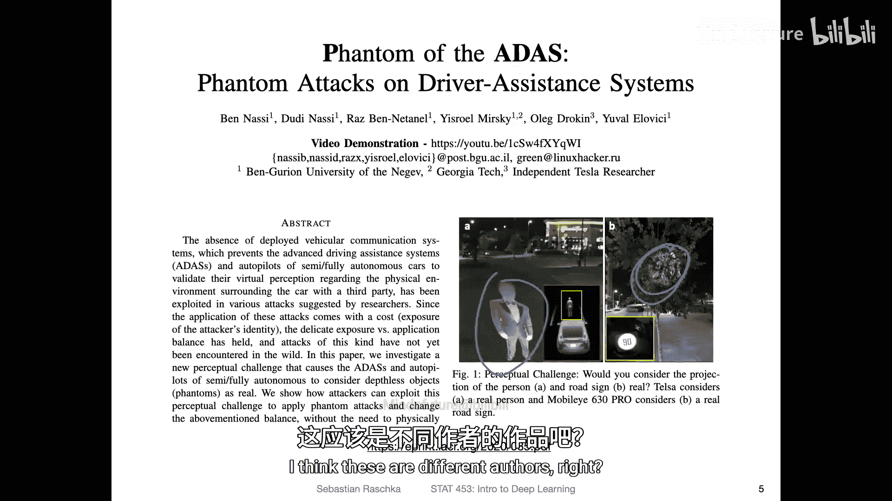
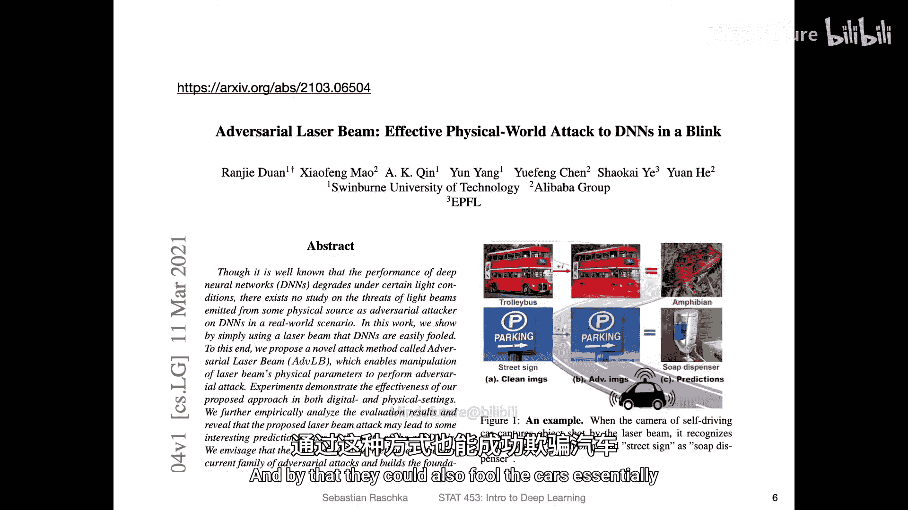
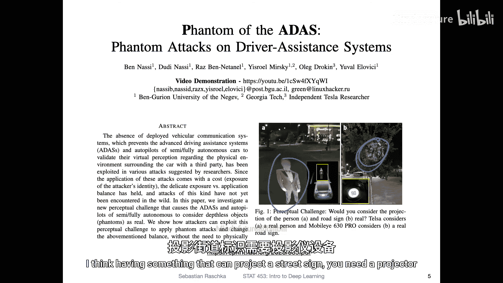
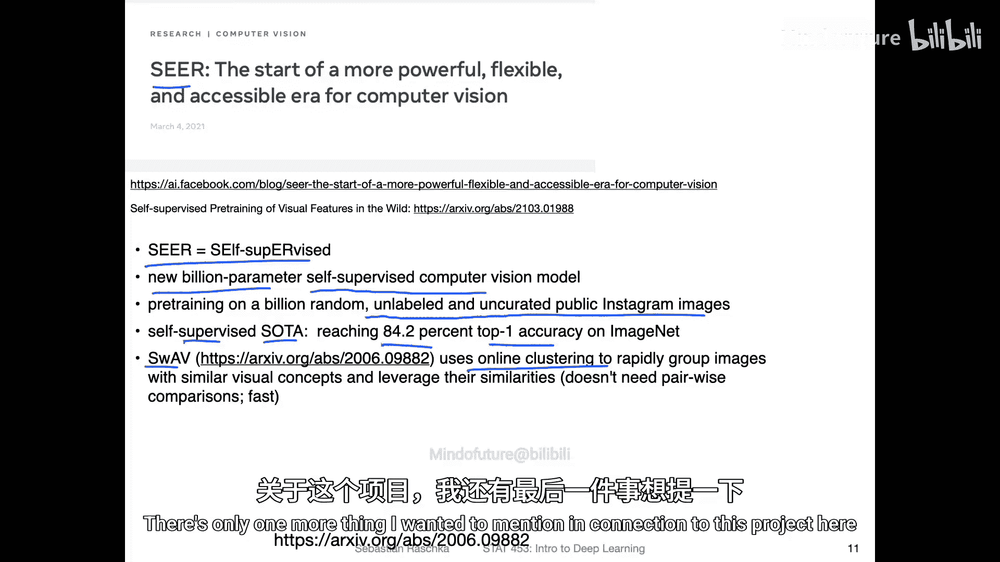
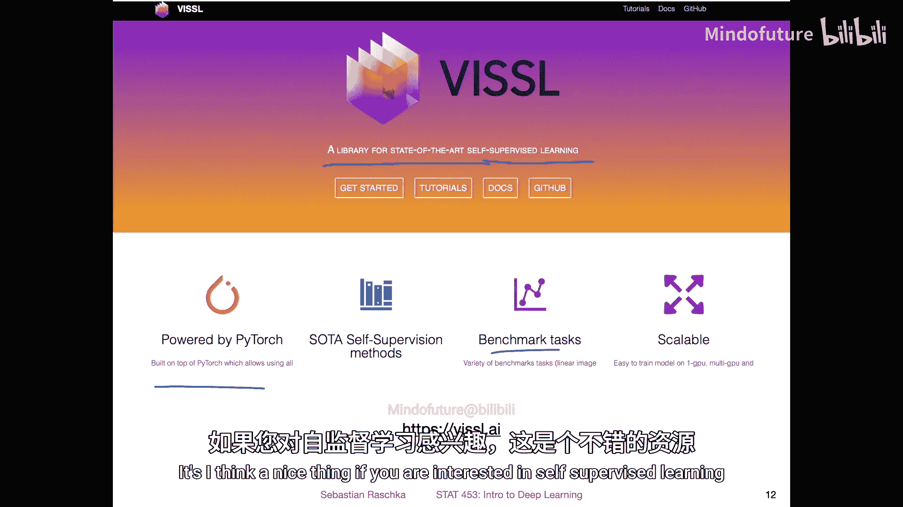

# 089：2021年3月13日深度学习新闻 📰

在本节课中，我们将回顾2021年3月13日深度学习领域的一些最新动态。内容涵盖从生成对抗网络（GAN）的趣味应用到大型多模态模型，再到深度学习系统的安全性与公平性等广泛主题。我们将探讨这些项目的核心思想、技术细节及其对领域的影响。

---

## 文本盒生成GAN 📦

首先，我们来探讨一个在GitHub上看到的项目，它被称为“文本框GAN”。据作者所言，这是首个将生成对抗网络（GAN）应用于生成新文本框设计的应用。

以下是其生成效果的一些示例。我们对此感兴趣的原因在于，它或许能用于设计新的海报或类似物品，但本质上，它只是展示GAN如何生成新数据的一个简洁而优雅的示例。在本课程后续部分，我们将更详细地讨论GAN。这里，它只是一个GAN可能样貌的例证。此外，该Git仓库包含了对工作原理的清晰描述，是一个很好的示例项目。

那么，这里具体是如何工作的呢？让我们简要了解一下。

通常，GAN由两部分组成：一个生成器和一个判别器。生成器的任务是生成模仿训练集数据的新数据。判别器的任务是区分生成器产生的“假”数据（即与训练集分布不同的数据）和“真”数据（即与训练集分布相似的数据）。本质上，生成器学习如何“欺骗”判别器，使得判别器无法区分生成的数据和真实数据。从这个意义上说，你可以认为生成器在学习训练数据集的分布。

在这个项目中，有一个轻微的修改。标准的GAN通常接收一些噪声作为输入。这个噪声向量被输入网络，然后网络生成新数据。为什么需要噪声？因为如果没有噪声，生成器作为一个函数，将总是产生相同的输出。噪声的存在确保了每次能产生不同的输出。

此外，这里还有一个词编码器，它接收一个单词作为输入。这个单词随后会被包含在输出的图像中。为了确保这个单词确实被包含在输出图像中，还有一个OCR模块，用于判断图像中的文本是否与输入的单词相符。正因如此，这个模块不能用于生成验证码（CAPTCHA），因为OCR能够轻易识别出单词，使得机器人可以轻松破解这种验证码。

无论如何，这是一种非常有用的技术，可以在此处添加额外的约束。例如，几年前，我们在人脸隐私保护方面也做过类似的工作，设计了一个名为“Privacy-Net”的GAN，旨在隐藏某些人脸属性，同时保持人脸匹配的准确性。其目标是让人脸图像在护照验证等场景中仍然有用，但如果有人在监控摄像头上捕获图像，则无法进行性别等数据挖掘。在那里，我们以类似的方式使用了人脸嵌入。

最终，判别器判断生成的图像是“假”还是“真”，整个网络由此学习如何生成新的文本框。

---

## 大型多模态模型M6 🇨🇳

接下来，我们来看一个规模更大的项目。这是一个名为M6的大型多模态预训练模型，由阿里巴巴和清华大学合作开发。

他们使用了英伟达的Megatron框架，在1.9万亿张图像和292GB的文本数据上进行了训练，这是一个非常庞大的工程。这里新颖且有趣的点在于，它是中文模型而非英文模型。看到这些语言模型在英语以外的语言（如中文）上也表现良好，这很有趣。中文包含多种字符类型，相比只有26个字母的英文文本，挑战性更大一些。因此，这本身也是一个有趣的研究案例。

他们训练了两个模型：一个100亿参数和一个1000亿参数的Transformer。这是通过自监督预训练完成的，预训练后的模型可以用于许多不同的下游任务，例如生成描述、图像搜索、问答或诗歌生成等。

简而言之，他们是如何做到让一个模型适用于这么多不同任务的呢？关键在于**掩码策略**。他们有一个统一的编码器-解码器模型（基于英伟达的Megatron架构）。根据不同的任务，他们采用不同的输入掩码方式。

例如：
*   **文本去噪**：他们掩码掉大部分编码器标记（ET）和解码器标记（DT），但保留一些解码器标记。
*   **语言建模**：只使用解码器标记。
*   **图像描述生成**：使用图像块（IP）和解码器标记。

通过这种方式，他们能够基于任务使用不同类型的输入，从而用单一的模型完成多种任务。

---

## 深度学习系统的脆弱性 🚗

与上一个项目完全无关，本周我在arXiv上看到了一个非常有趣的项目，它突显了深度学习在实践中仍然可能非常脆弱，我们在使用时必须对某些事情保持谨慎。

这个项目让我想起了大约一年前看到的另一个项目。在那个项目中，作者试图欺骗特斯拉的自动驾驶系统。他们通过将街道标志投影到树上，成功地让系统误以为那是真实的街道标志。试想，如果有恶意行为者这样做，可能会导致车祸。例如，他们曾将埃隆·马斯克的剪影投影到街道上，汽车误以为街上有行人而紧急刹车。

本周在arXiv上看到的项目是这项工作的一个更新，但作者可能不同。他们使用激光束做了类似的事情。通过将激光束投射到图像中，他们也能欺骗汽车。相比需要投影仪的街道标志欺骗，激光束设备可能更便携，因此这种攻击方式更令人担忧。这本质上表明，要使自动驾驶汽车安全，我们还有很长的路要走。

---

## 算法公平性 ⚖️

与安全话题相关，另一个重要主题是**公平性**。我们如何设计公平的机器学习和深度学习系统？本周Facebook有一篇关于此主题的博客文章，名为《在实践中：将算法公平性方法应用于复杂生产系统》。博文中还链接了一篇研究论文，虽然篇幅较长，但推荐阅读，我认为这是一个重要的主题。

在这篇论文中，他们概述了使机器学习和深度学习变得公平所面临的挑战和采用的方法。这实际上是一个非常棘手的问题。我不是这个领域的专家，但看起来确实不容易解决。

我想强调的一点是关于**标签公平性**。在实践中，我们通常假设数据所附的标签是正确的，是绝对的“真实”标签。但在现实世界中，这些标签是否正确、是否应该被字面理解、是否需要持保留态度，并不总是那么显而易见或清晰。

例如，测量用户是否点击了网站上的某个按钮，这个“点击”标签是可以非常自信地测量的。但其他情况，比如识别网络欺凌，用于标记的标签通常由人工标注者生成，判断某个帖子是否与欺凌相关。由于这是基于人类判断，它可能也嵌入了人类的偏见。在某些情况下，标签是否正确更加微妙，存在灰色地带。正如文中所说，通常有书面的政策来识别欺凌，为标注者制定良好的政策很重要。但不同的人应用政策的方式可能不同，标注者存在隐性和显性的偏见。因此，在某些情境下，我们不能总是相信这些标签是绝对的“真实”，这使得某些机器学习应用比其他更具挑战性。

与此相关，对于你们的课程项目，一个有趣的做法是：从你的数据集中抽取一个样本（例如，一个分类问题的10万张图像中抽取100张），在不看标签的情况下，尝试预测其类别标签。然后统计你预测正确的次数，除以100，你就能感受到人类在该数据集上的准确率，以及人类预测与实际数据集中标签的关系。这能让你了解任务的难度。例如，如果你有MNIST数据集，尝试预测100个手写数字，看看是否能达到100%准确率。这既能让你了解标签是否正确，也能让你感受任务的难度。

---

## 泛化性能与在线/离线学习 📈

既然我们本周讨论了提高泛化性能，并且将继续这个话题，这里有一篇有趣的研究文章，从在线学习和离线学习的角度来理解深度学习中的泛化，标题是《好的在线学习者是好的离线泛化者》。

他们研究了两种场景：
1.  **现实世界场景**：这也是我们在课堂上一直考虑的。我们有一个给定的训练集，从中抽取n个训练样本，使用小批量随机梯度下降训练模型，并运行多个周期（epoch）。
2.  **理想世界场景**：这里，他们不是在一个固定大小的训练集上进行小批量梯度下降，而是拥有无限数据。他们每次都从新数据的分布中抽取一个新的小批量，数据永不重复，因此也没有“周期”的概念。

他们比较了现实世界与理想世界在泛化性能上的差异。结果非常有趣：在测试集性能上，理想世界和现实世界场景产生的模型**没有差异**。图中红线和蓝线分别代表理想世界和现实世界，可以看到几乎没有区别。

不过，这项研究有一个注意事项：他们如何为理想世界场景生成新数据？他们使用了一个生成模型，从该模型中采样生成了600万张类似CIFAR-10的合成图像。然后，他们使用另一个准确率为98.5%的模型来为这些图像打标签。这是一个可以接受的方法，否则从哪里获得这么多数据呢？但这也是一个小问题，因为这些不是真实图像，而是使用生成模型生成的、看起来像真实图像的图像。

另外一点需要注意的是，他们报告的不是常规的测试准确率，而是所谓的“测试软错误”（test soft error）。他们将分类器的“软准确率”定义为在正确标签上的Softmax概率。说实话，我不完全确定他们为什么这样做，而不是报告常规的测试准确率。但这本身是一个有趣的点。

为了确保这个观察结果不是他们所使用的特定ResNet模型的产物，他们也尝试了不同的模型，并看到了相同的效果。

该论文还有一个关于预训练的可视化。他们比较了理想世界和现实世界场景下，有预训练和无预训练（随机权重初始化）的模型。他们发现，无论是随机初始化还是预训练模型，现实世界和理想世界场景之间都没有显著差异。然而，有趣的是，预训练确实有很大帮助。预训练模型（在ImageNet上预训练，然后在CIFAR-10上微调）的误差下降速度远快于随机初始化的模型。这突显了首先在更大数据集上预训练模型，而不是进行随机权重初始化，对于更快获得良好性能确实非常有益。此外，最终性能也存在巨大差距，预训练不仅训练更快，而且能产生更好的模型。

---

## 自监督学习与Seer项目 🔍

与预训练相关，本周还有另一个有趣的项目，叫做“Seer”。Seer代表自监督（Self-supervised）。预训练在某种意义上与自监督学习非常相似。自监督学习是预训练的一种形式。在上一张幻灯片中，我展示了他们在ImageNet上预训练模型，但那里他们使用的是ImageNet自带的标签。自监督学习基本上是使用未标记的数据进行预训练，然后基于数据本身的某些信息生成标签，例如，可以掩码图像中的某些部分，或者对图像进行聚类等。

我们之前稍微讨论过自监督学习，它有点超出本课程的范围。我在一些课程项目反馈中提到，这可能是一个值得你们深入了解的有趣方向，但当然不是必须的，因为它属于更高级的内容。无论如何，Seer是一个有趣的项目。他们使用自监督学习训练了一个拥有10亿参数的模型，并使用了来自Instagram的未标记数据。通过这样做，他们在自监督学习上达到了新的最先进性能，在ImageNet上获得了84.2%的Top-1准确率。

他们是如何做到的？他们使用了一种名为SwAV的在线聚类算法，这种算法效率很高，且不依赖于成对的图像比较。同样，由于这已经是一个很长的视频，我不想深入太多细节。

与这个项目相关，我想提的最后一件事是另一个有趣的库或模块，它用于自监督学习基准测试。这是一个支持PyTorch的、用于最先进自监督学习的库。它本质上是一个提供基准测试和预训练模型的库，你可以用它来与你的模型进行比较。如果你对自监督学习感兴趣，例如想用于课程项目，这是一个值得关注的好工具。

---

## 总结 📝

本节课中，我们一起回顾了2021年3月深度学习领域的多项进展。我们从生成对抗网络（GAN）在文本框生成上的趣味应用开始，了解了其基本工作原理。接着，我们探讨了大型中文多模态预训练模型M6，看到了如何通过统一的掩码策略让单一模型适应多种任务。然后，我们讨论了深度学习系统在现实世界中的脆弱性，特别是自动驾驶系统可能面临的新型攻击，以及构建公平机器学习系统所面临的标签偏见等挑战。最后，我们研究了关于泛化性能的理论探索，比较了在线与离线学习场景，并介绍了自监督学习的最新进展及其工具库。这些内容展示了深度学习领域从基础研究到实际应用，再到安全与伦理考虑的广阔图景。