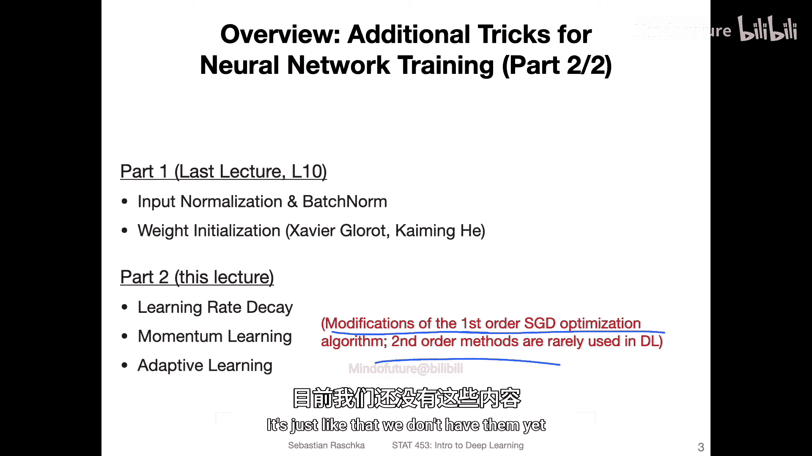
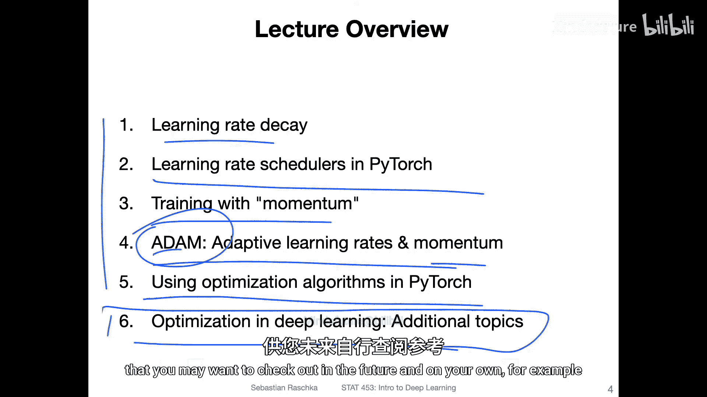
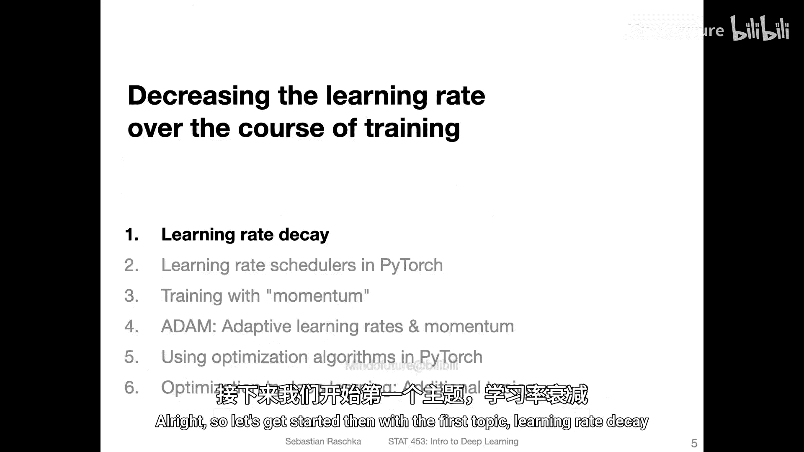

# 090：改进基于梯度下降的优化——讲座概述

在本节课中，我们将学习一系列用于改进神经网络泛化性能的技术，特别是那些与优化算法相关的技巧。我们将探讨学习率调度、动量学习以及自适应学习率等方法，这些方法都是对标准随机梯度下降的改进，旨在使训练过程更高效、更稳定。

在过去的几周里，我们已经介绍了一些改进神经网络训练的主题，例如用于减少过拟合的正则化技术（如L2正则化和Dropout），以及输入和隐藏层激活的标准化方法（如输入标准化和批量归一化）。此外，还有像Xavier/Glorot和Kaiming初始化这样的权重初始化方案。

本节中，我们将重点关注优化算法本身的改进。这些技巧都属于一阶优化方法（即随机梯度下降）的范畴。虽然存在更高级的二阶优化方法（如涉及海森矩阵的方法），但由于其计算成本过高且在实践中并未带来显著的性能提升，目前并未被广泛采用。

以下是本节课将要涵盖的六个主题：
1.  **学习率衰减**：在训练过程中逐步降低学习率，以减少随机梯度下降中的噪声。
2.  **动量**：在梯度更新中加入动量项，以加速收敛并在正确的方向上更好地引导优化过程。
3.  **自适应学习率**：根据参数的历史梯度信息动态调整每个参数的学习率。
4.  **Adam算法**：结合了动量和自适应学习率的流行优化算法，通常能取得很好的开箱即用效果。
5.  **在PyTorch中的实现**：演示如何在代码中应用上述优化技巧。
6.  **其他高级主题**：简要介绍近年来涌现的其他优化算法，供有兴趣的学员深入探索。

---

## 深度学习与生成式模型：12.1：学习率衰减

上一节我们概述了本节课的主要内容。现在，让我们从第一个主题——学习率衰减开始。

学习率衰减是一种简单的策略，其核心思想是在训练过程中逐步降低学习率。在训练初期，使用较大的学习率有助于快速接近最优解；而在训练后期，使用较小的学习率则有助于精细调整参数，减少在最优解附近的震荡，从而稳定收敛。

以下是几种常见的学习率衰减方法：
*   **步长衰减**：每经过固定的训练轮数（epoch），就将学习率乘以一个衰减因子（例如0.1）。
    ```python
    # 伪代码示例
    if epoch % decay_step == 0:
        learning_rate = learning_rate * decay_rate
    ```
*   **指数衰减**：学习率随着训练轮数呈指数下降，公式为：`η_t = η_0 * γ^t`，其中`η_0`是初始学习率，`γ`是衰减率，`t`是时间步或轮数。
*   **余弦退火**：学习率根据余弦函数从初始值下降到0。

在PyTorch中，我们可以方便地使用`torch.optim.lr_scheduler`模块来实现各种学习率调度策略。

---

## 深度学习与生成式模型：12.2：动量

在了解了如何调整学习率之后，我们来看看如何通过引入动量来改进梯度下降的方向。

动量方法模拟了物理学中动量的概念。它通过累积过去梯度的指数加权平均来更新当前参数，而不是仅仅使用当前的梯度。这有助于在梯度方向持续一致的维度上加速更新，并在梯度方向频繁改变的维度上抑制震荡，从而使优化过程更加平滑且快速。

带有动量的梯度下降更新公式如下：
```
v_t = β * v_{t-1} + (1 - β) * ∇J(θ_t)
θ_{t+1} = θ_t - η * v_t
```
其中：
*   `v_t` 是当前时刻的动量（速度）。
*   `β` 是动量系数，通常取值在0.8到0.99之间，用于控制历史梯度的影响程度。
*   `∇J(θ_t)` 是当前时刻的梯度。
*   `η` 是学习率。
*   `θ_t` 是当前参数。

---

## 深度学习与生成式模型：12.3：自适应学习率与Adam算法

上一节我们介绍了动量，它主要改进了梯度更新的方向。本节我们将结合另一个强大的思想——自适应学习率，并介绍集两者之大成的Adam算法。

自适应学习率方法（如AdaGrad, RMSProp）的核心思想是为每个参数维护一个独立的学习率。这个学习率会根据该参数历史梯度的大小进行调整：对于梯度较大的参数，降低其学习率（因为可能已经接近最优）；对于梯度较小的参数，则适当提高其学习率（以加快更新）。这有助于处理稀疏数据或不同尺度特征的问题。

**Adam（Adaptive Moment Estimation）** 算法是目前最流行的优化器之一。它同时结合了**动量**（一阶矩估计）和**自适应学习率**（二阶矩估计）的优点。其更新步骤如下：

1.  计算梯度的一阶矩（均值）`m_t`和二阶矩（未中心化的方差）`v_t`的指数移动平均。
2.  对一阶矩和二阶矩的估计进行偏差校正（特别是在训练初期）。
3.  使用校正后的矩来更新参数。

Adam的更新规则如下：
```
m_t = β1 * m_{t-1} + (1 - β1) * g_t
v_t = β2 * v_{t-1} + (1 - β2) * g_t^2
m_hat_t = m_t / (1 - β1^t)
v_hat_t = v_t / (1 - β2^t)
θ_t = θ_{t-1} - η * m_hat_t / (sqrt(v_hat_t) + ε)
```
其中`g_t`是当前梯度，`β1`和`β2`是衰减率，`η`是学习率，`ε`是一个很小的数用于数值稳定。

由于其鲁棒性和通常良好的开箱即用性能，Adam成为了深度学习实践中的首选优化器。

---

## 深度学习与生成式模型：12.4：在PyTorch中的实现

理论介绍完毕，现在让我们看看如何在PyTorch中实际使用这些优化技巧。

PyTorch的`torch.optim`模块提供了所有常见的优化器。以下是一个简单的示例，展示如何定义网络、损失函数、优化器以及学习率调度器：



```python
import torch
import torch.nn as nn
import torch.optim as optim

# 1. 定义模型
model = nn.Sequential(nn.Linear(10, 5), nn.ReLU(), nn.Linear(5, 1))

# 2. 定义损失函数
criterion = nn.MSELoss()

# 3. 定义优化器（例如SGD带动量，或Adam）
# 使用SGD带动量
optimizer = optim.SGD(model.parameters(), lr=0.01, momentum=0.9)
# 或者使用Adam
# optimizer = optim.Adam(model.parameters(), lr=0.001)

# 4. 定义学习率调度器（例如步长衰减）
scheduler = optim.lr_scheduler.StepLR(optimizer, step_size=30, gamma=0.1)

# 训练循环
for epoch in range(100):
    # ... 前向传播，计算损失 ...
    loss = criterion(output, target)

    # 反向传播
    optimizer.zero_grad() # 清零梯度
    loss.backward()       # 计算梯度
    optimizer.step()      # 更新参数

    # 更新学习率（在每个epoch之后）
    scheduler.step()

    # ... 打印日志等 ...
```
通过`torch.optim.lr_scheduler`，你可以轻松实现指数衰减、余弦退火等多种调度策略。

---

## 深度学习与生成式模型：12.5：其他高级优化主题

除了Adam，研究社区还在不断提出新的优化算法。虽然本课程不要求深入掌握，但了解这些方向有助于拓宽视野。以下是一些值得关注的高级主题：

*   **Adam的变体**：如AdamW（修正了权重衰减的实现）、AMSGrad、Nadam等，旨在解决Adam可能存在的收敛问题或改进其性能。
*   **学习率热身**：在训练开始时从一个很小的学习率逐步增加到预设值，有助于训练初期模型的稳定性。
*   **周期性学习率**：如SGDR（带重启的随机梯度下降），让学习率周期性地变化，可能有助于跳出局部最优。
*   **Lookahead优化器**：通过维护两组权重（“快权重”和“慢权重”）来进行更新，可能带来更稳定的训练和更好的泛化。

对于希望深入了解这些前沿话题的学员，可以在课程资料中找到相关的论文和博客链接。

---

## 总结



本节课中，我们一起学习了如何改进基于梯度下降的神经网络优化过程。我们首先介绍了**学习率衰减**策略，它通过在训练中降低学习率来稳定收敛。接着，我们探讨了**动量**方法，它通过累积历史梯度来加速正确方向的更新并抑制震荡。然后，我们介绍了**自适应学习率**的思想，并详细讲解了结合动量和自适应学习率的**Adam算法**，该算法因其高效和鲁棒性而被广泛使用。最后，我们演示了如何在PyTorch中实现这些优化器，并简要概述了其他一些高级优化研究方向。



掌握这些优化技巧对于成功训练深度学习模型至关重要。它们不仅适用于我们目前学到的全连接网络，也同样适用于后续课程中将介绍的卷积神经网络、循环神经网络、生成对抗网络等更复杂的架构。