# 091：学习率衰减 📉

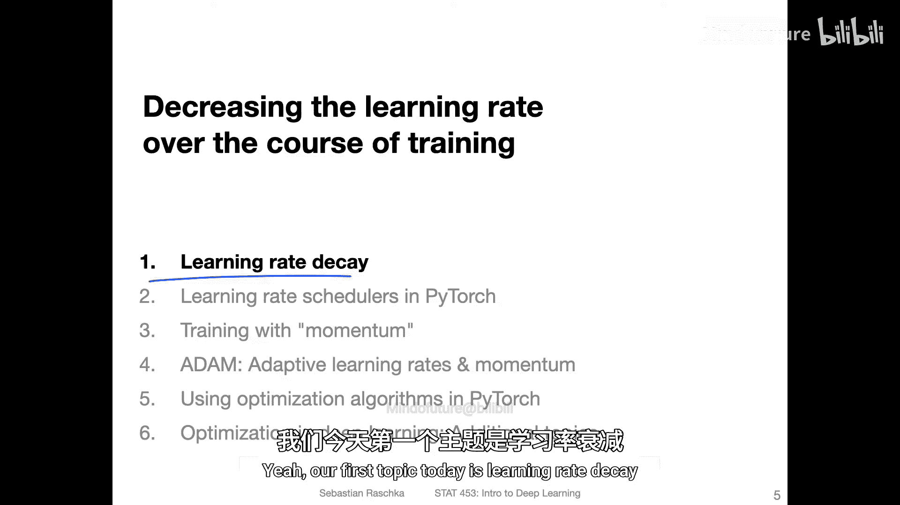

在本节课中，我们将要学习一个重要的训练技巧：学习率衰减。学习率衰减指的是在模型训练过程中，逐步降低学习率的过程。这有助于稳定训练，减少损失函数在接近最优解时的振荡，并可能帮助模型收敛到更好的解。

## 回顾小批量学习

上一节我们介绍了优化算法的基本概念，本节中我们来看看学习率衰减。首先，让我们简要回顾一下小批量学习。

小批量学习是随机梯度下降的一种形式。我们从训练集中抽取小批量数据。每个小批量可以被视为从训练集中抽取的一个样本，而训练集本身又是从总体分布中抽取的一个样本。在处理每个小批量时，我们会执行前向传播和反向传播。

如果我们抽取这些小批量样本，与使用整个训练集相比，我们得到的梯度会更“嘈杂”。但这既有优点也有缺点。使用小批量而非整个训练集计算梯度，可能导致梯度噪声更大。然而，这种噪声实际上可能是有益的，因为它可以帮助算法逃离局部最小值。

## 噪声梯度的利与弊

下图左侧展示了一个凸损失函数的损失曲面，中心是我们希望达到的全局最小值。在深度学习中，我们通常处理的是非凸损失函数，而噪声梯度可以帮助算法逃离可能陷入的局部最小值。

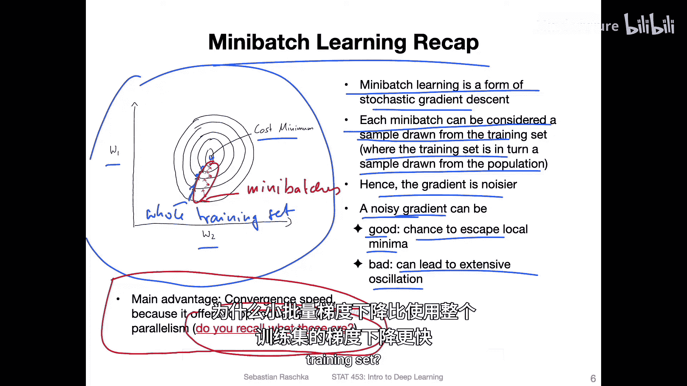

但问题是，噪声也可能导致振荡。例如，如果使用整个训练集，更新方向可能垂直于等高线；但如果使用小批量，更新可能会更嘈杂、更振荡。这当然不如直接路径理想。因此，小批量学习有利有弊。

今天，我们还将学习像动量这样的技术来帮助解决这个问题。但另一种帮助减少振荡的方法是降低学习率，使算法不会在错误方向上迈出太大的步伐。此外，使用更大的批量大小来收集更具代表性的样本也可以减少噪声。

## 小批量学习的优势

除了可能帮助逃离局部最小值，小批量学习还有什么优势呢？我们之前讨论过收敛速度：与每次更新只使用一个训练样本的随机梯度下降相比，小批量梯度下降实际上更快。它也可能比使用整个训练集进行更新的梯度下降更快。如果你不记得原因，我们在之前的讲座中已经介绍过，但重新思考一下是个好主意：为什么小批量梯度下降比单样本更新的随机梯度下降更快？为什么它又比使用整个训练集的梯度下降更快？

## 学习率与振荡

接下来，我们看看振荡的另一个例子。下图展示了一个使用非常大学习率的SGD示例。你可以看到，如果学习率太大，我们会增加噪声或产生大幅振荡，基本上就是“超调”了。如果最小值在中心，而学习率太大，第一次更新可能会走过头，然后第二次更新又得折返，这非常低效。因此，过大的学习率是有害的。

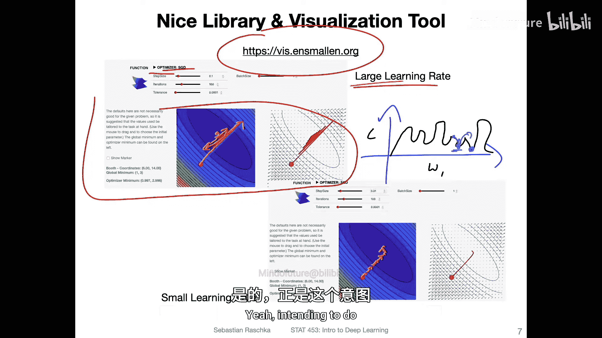

那么，如何正确解决这个问题呢？我们可以使用较小的学习率，如下方所示。但问题是，收敛需要很长时间。这里需要很多小步才能收敛。在深度学习的背景下，我们面临的是非凸损失函数。如果我的损失函数（对于给定权重）是非凸的，算法可能会陷入局部最小值。例如，全局最小值在这里，而我目前在这里。我在这里进行一次更新，然后可能就陷在这里了，因为这里的梯度为零，而由于学习率太小，它无法越过这个“小山丘”。

因此，有时噪声更大的更新实际上有助于克服这些局部最小值。所以，噪声并不一定是坏事。这本质上是在噪声太少和噪声太多之间找到一个最佳平衡点。在训练开始时，较大的噪声可能有助于克服一些局部最小值，但随着时间的推移，需要减少这种噪声，而这正是学习率衰减旨在实现的目标。

## 批量大小的选择

在讨论学习率衰减之前，让我再给出一个关于使用小批量的实用建议。通常建议使用较大的批量大小。有些人推荐小批量，因为他们发现这有助于泛化。但另一个常见的建议是选择合理较大的批量大小，例如256、512、1024等。为什么呢？

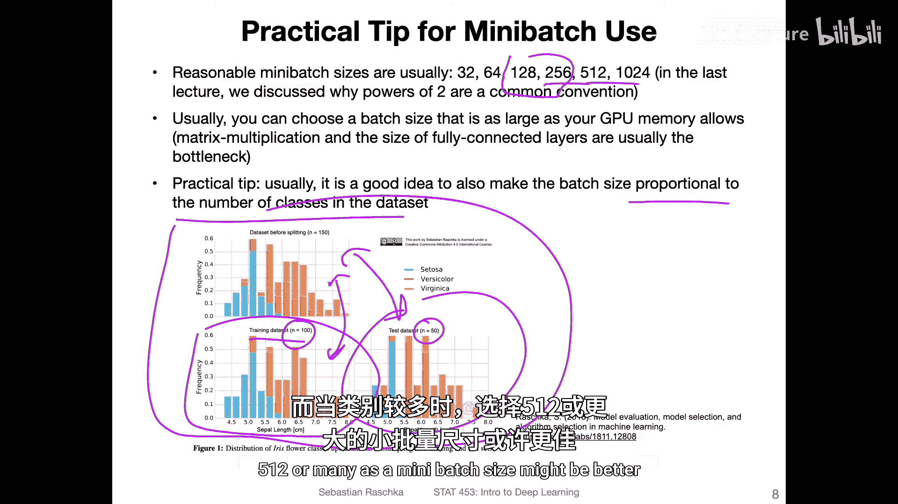

这与有效利用GPU有关，同时也与避免更新过于嘈杂有关。下图试图说明这一点：如果你有一个像这样的数据集（展示三个类别的分布），然后将其分割成更小的样本。这里有一个大小为100的训练集样本和一个大小为50的样本。我想说明的是，如果我们有一个更大的样本，我们大致能保持分布，或者至少比更小的样本更好地保持了分布。你可以看到，这里和这里的分布有些不同。如果分布差异太大，可能就不理想了。因此，拥有更大的批量大小可以在一定程度上稳定训练。所以，选择与数据集中类别数量成比例的批量大小也是一个好主意。例如，如果只有两个类别，批量大小128或256可能是个好数字；如果有更多类别，选择512的批量大小可能更好。

## 批量大小实验

这里我在MNIST数据集上运行了一个实验，展示了使用不同批量大小进行训练的情况。左侧我使用了每个小批量1024个样本，右侧使用了64个样本。你可以看到最终性能大致相同，几乎一样。但在左侧，训练曲线比右侧的平稳得多，这是预期的，因为左侧使用了更大的批量。

我训练了相同的100个周期。你可以看到，较小的批量收敛得更快，因为它有更多的更新次数（这里80,000次迭代 vs 左侧5,000次）。根据训练和验证准确率，较小的批量收敛得更快，而较大的批量则需要更长的时间收敛，甚至直到最后仍在改进。因此，使用较大的批量大小有助于稳定训练，并且由于更新次数更少、每次更新计算量更大，可能整体运行得更快。

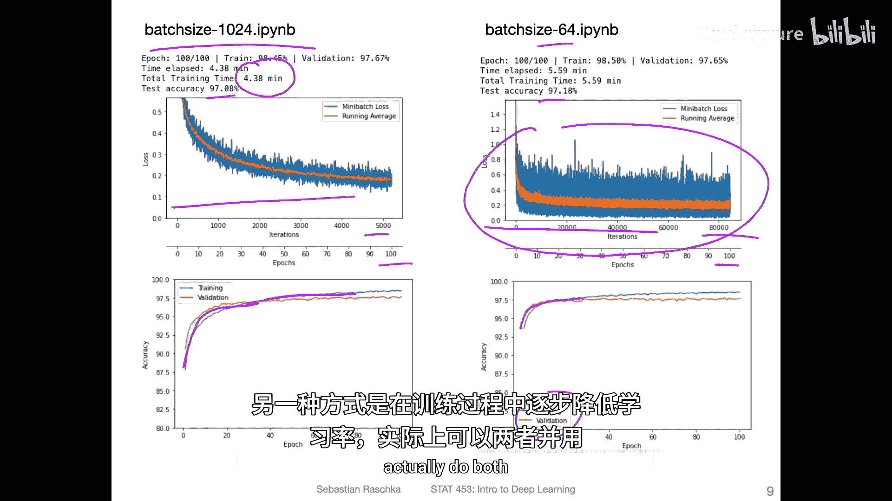

## 引入学习率衰减

如前所述，如果我们只是想减少噪声，一种方法是选择更大的批量大小，另一种方法是在训练过程中降低学习率。实际上，我可以两者都用：使用较大的批量大小并降低学习率。

现在，让我们正式讨论学习率衰减。如前所述，我们可能会遇到所谓的“批量效应”，即小批量是训练集的样本，小批量损失和梯度是我们将在整个训练集上计算的全梯度的近似。图中红线应象征整个训练集上的损失。当我们使用这些小批量时，损失曲线通常噪声大得多。通常，随着训练进行，损失会变小，因此振荡也会在一定程度上变小，因为网络学得越来越好，损失本身在减小，梯度也随之变小，更新幅度也变小。但通常在曲线末端我们仍然会看到这些振荡。如果我们想要衰减或抑制这些振荡，可以使用衰减的学习率。一旦我们接近这个点，就可以缩小学习率，使更新更平滑、更稳定。

但如图所示，这里实际上存在一个危险：如果我们过早地衰减学习率，可能会过早地停止网络学习。例如，如果我在这个振荡点调整学习率，并且调整幅度过大，那么网络可能停止更新，损失就停留在这个点，这也不理想。因此，在实践中，我通常建议先在不使用学习率衰减的情况下训练网络，然后将此性能保存为基线，再添加学习率衰减方法，看看是否能改进该基线。因为在我使用学习率衰减时，通常衰减过多，导致性能反而比不使用衰减时更差。衰减过多是一个真实存在的可能性。

## 常见的学习率衰减方法

让我展示一些降低学习率的常见方法。学习率衰减最常见的一种变体是指数衰减，其公式为：

**η_t = η_0 * e^{-k*t}**

其中，η_0 是初始学习率，t 是时间步（可以是迭代次数，但更常见的是周期数），k 是衰减率。我在右侧绘制了示意图。如果你在每个周期后更新，选择衰减率为0.1，初始学习率为0.5，你会看到网络在大约第40个周期后基本停止学习。所以这确实取决于参数设置。如果你希望有更多的小幅度更新，也许可以选择衰减率为0.01，这样衰减得更慢。这又引入了一个需要调整的超参数，这就是为什么我建议先不使用学习率衰减进行训练，之后再添加它来观察是否有所改进。在深度学习训练中，有很多这样的小细节需要调整和改变，以观察它们如何影响性能。

另一种常见的学习率衰减变体是将学习率减半。这通常是我在实践中最常使用的方法。你基本上在每个步骤t（可以是每个周期或每10个周期）更新学习率。我稍后会展示我个人在实践中使用的另一种修改版本。本质上，你就是每t次迭代或周期将学习率减半。

还有逆时衰减，本质上与指数衰减类似，只是计算方式略有不同。同样，我在右侧绘制了示意图以供参考，但它与指数衰减非常相似。

## 其他学习率调度器

学习率衰减这个话题有时也被称为学习率调度。例如，有一篇关于循环学习率的论文，我提到它是因为我看到很多人在实践中使用它。就我个人而言，我还没有用它取得过成功，但我经常听到人们说它可以改善效果。循环学习率本质上是让学习率上升、下降、再上升、再下降，如此循环往复。这是一种有趣的技术。

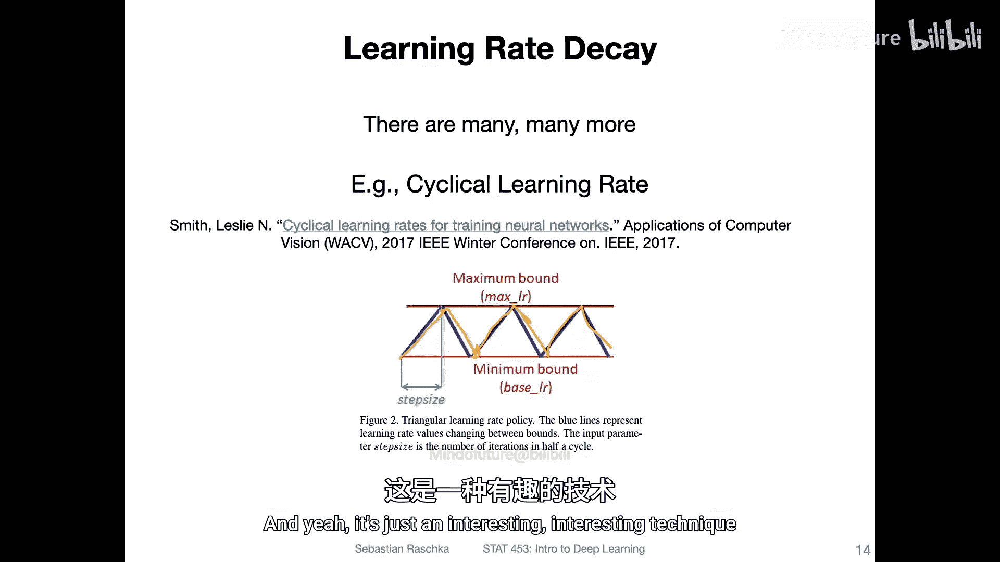

还有另一篇论文（我认为与循环学习率论文的作者是同一批人），在这篇论文中，作者建议不进行学习率衰减，而是增加批量大小，因为这可以产生类似的效果。他们指出，在相同训练周期数后能达到相同的测试准确率，但参数更新次数更少，从而带来更大的并行性和更短的训练时间。本质上，增加批量大小可以产生与衰减学习率相同的积极效果，但可能更高效。这也相当有趣。

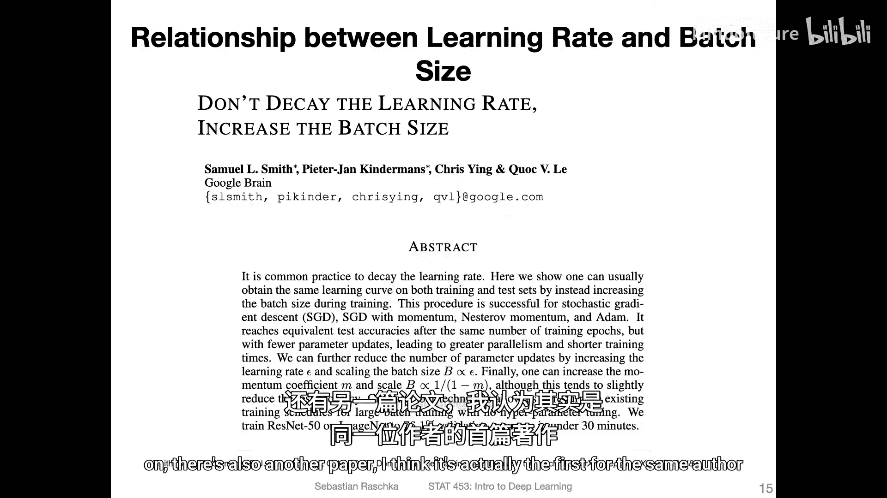

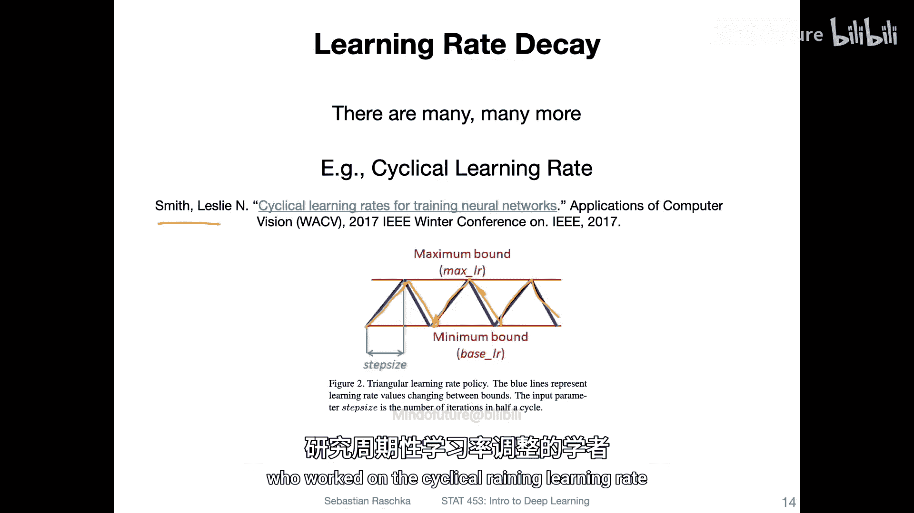

下图模拟了这一点。左侧是两种衰减学习率的方法（展示验证集准确率随周期数的变化），右侧是增加批量大小的方法。你可以看到，最终它们大致达到了相同的性能。在右侧，他们展示了随着批量增大，参数更新次数减少，这只是因为你的小批量变大了。

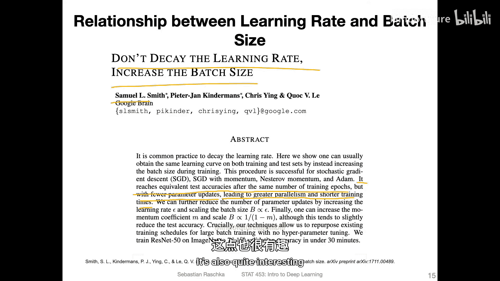

## 总结与预告

本节课中我们一起学习了学习率衰减的核心概念。我们了解到，学习率衰减通过在训练后期降低学习率，有助于稳定训练、减少振荡，并可能帮助模型更好地收敛。我们讨论了其原理、与小批量学习的关系、批量大小的选择，以及几种常见的衰减方法（如指数衰减、步进衰减）。我们还了解到，增加批量大小有时可以作为学习率衰减的替代方案。

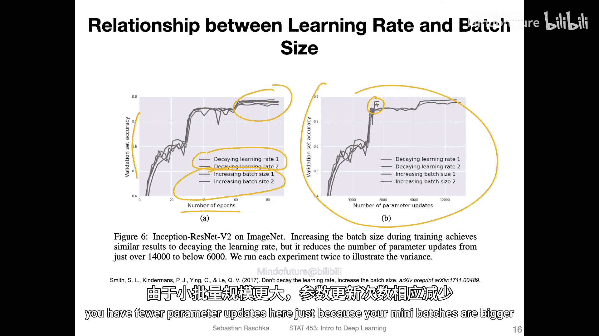

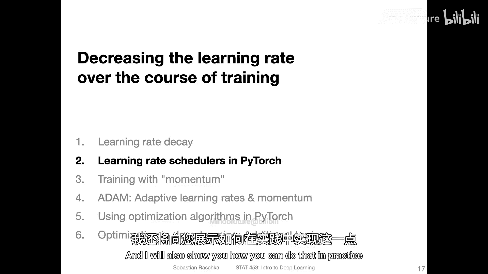

在下一个视频中，我将展示我最喜欢的进行学习率衰减的方式（它是一种学习率减半的修改版本），并演示如何在实践中实现它。