# 092：PyTorch中的学习率调度器 📉

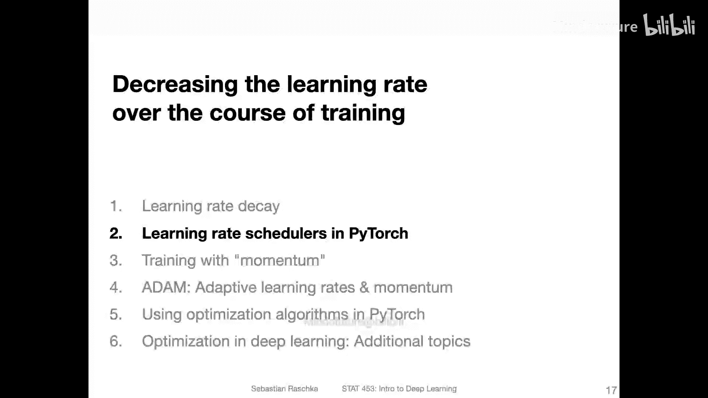

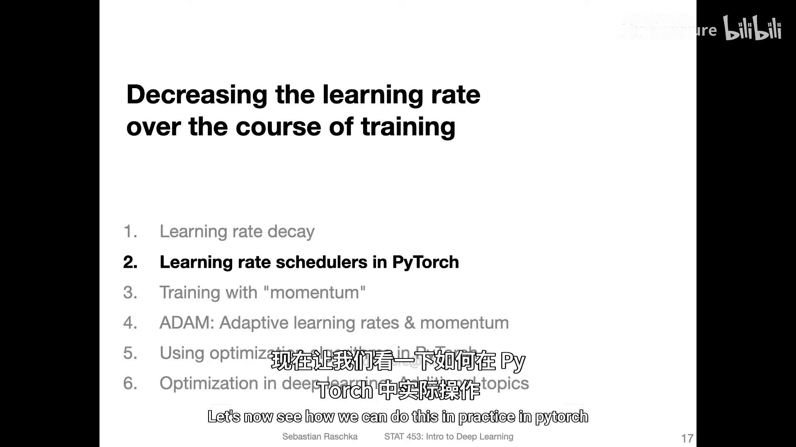

在本节课中，我们将学习如何在PyTorch中实现学习率衰减。学习率衰减是一种在训练过程中动态降低学习率的技术，有助于模型在训练后期更精细地调整参数，从而可能达到更好的性能。

## 概述

上一节我们讨论了什么是学习率衰减及其潜在价值。本节中，我们来看看如何在PyTorch中实际应用它。

## 手动实现学习率衰减

首先，我们可以通过手动定义函数来实现学习率衰减。这是一种较为繁琐但灵活的方式。

以下是一个实现指数衰减的函数示例：

```python
def adjust_learning_rate(optimizer, epoch, initial_lr, decay_rate):
    """每10个epoch将学习率乘以衰减因子。"""
    if epoch % 10 == 0:
        for param_group in optimizer.param_groups:
            param_group['lr'] = initial_lr * (decay_rate ** (epoch // 10))
```

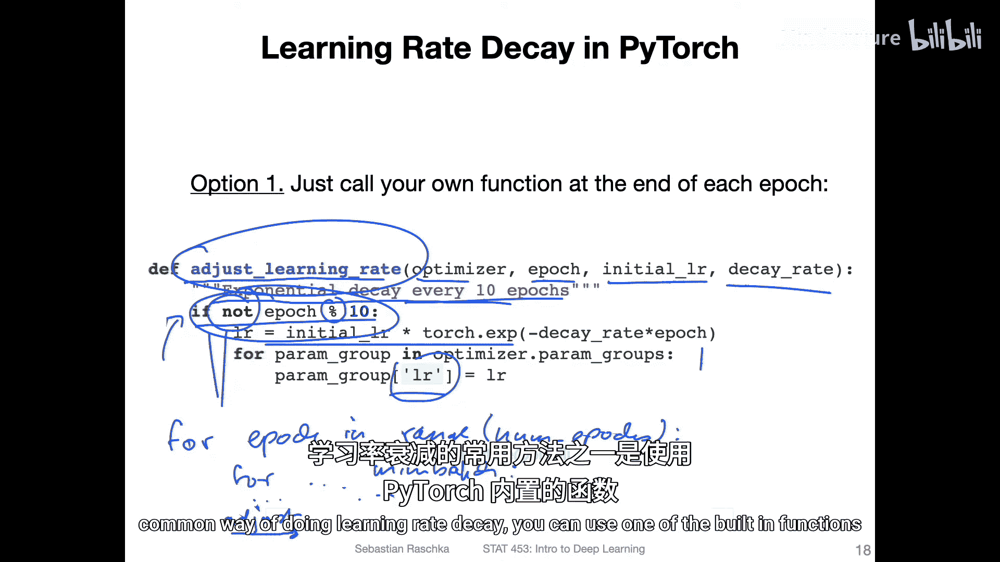

这个函数的核心逻辑是：每经过10个训练周期（epoch），就将优化器中的所有参数组的学习率乘以一个衰减因子。这里的 `decay_rate` 就是衰减率，例如0.1表示学习率变为原来的十分之一。

在训练循环中，你可以在每个epoch结束后调用此函数：

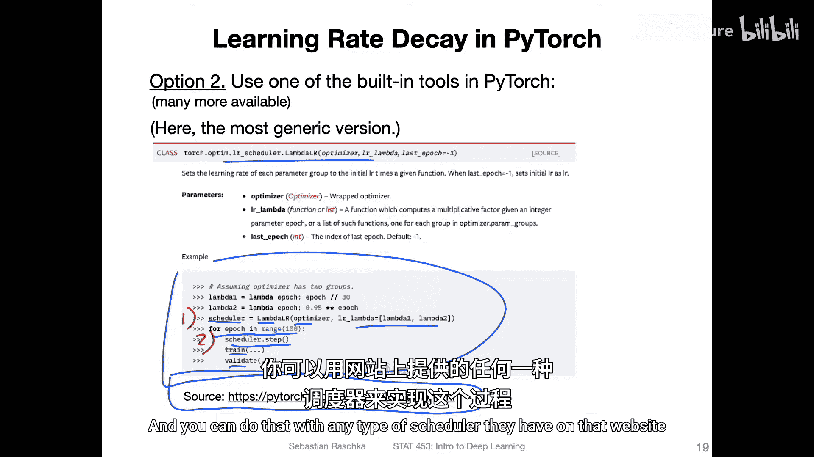

```python
for epoch in range(num_epochs):
    # ... 在每个mini-batch上进行训练 ...
    adjust_learning_rate(optimizer, epoch, initial_lr=0.01, decay_rate=0.1)
```

然而，这只是手动实现的方式。在实践中，如果你想使用现有的、常见的学习率衰减方法，可以直接使用PyTorch内置的调度器。

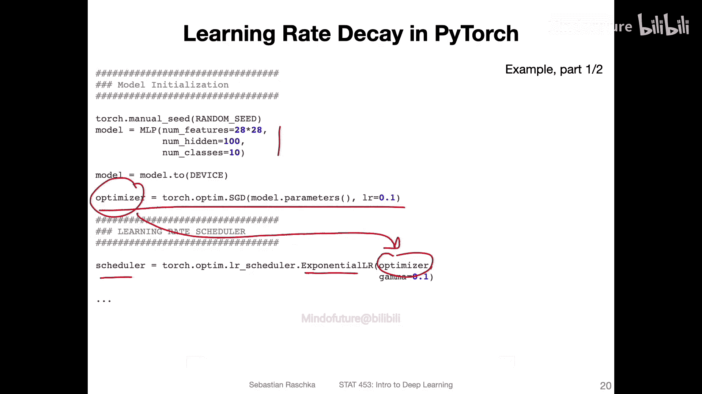

## 使用PyTorch内置调度器

PyTorch在 `torch.optim.lr_scheduler` 模块中提供了多种学习率调度器。使用它们通常只需要两个步骤：初始化和在训练循环中调用 `.step()`。

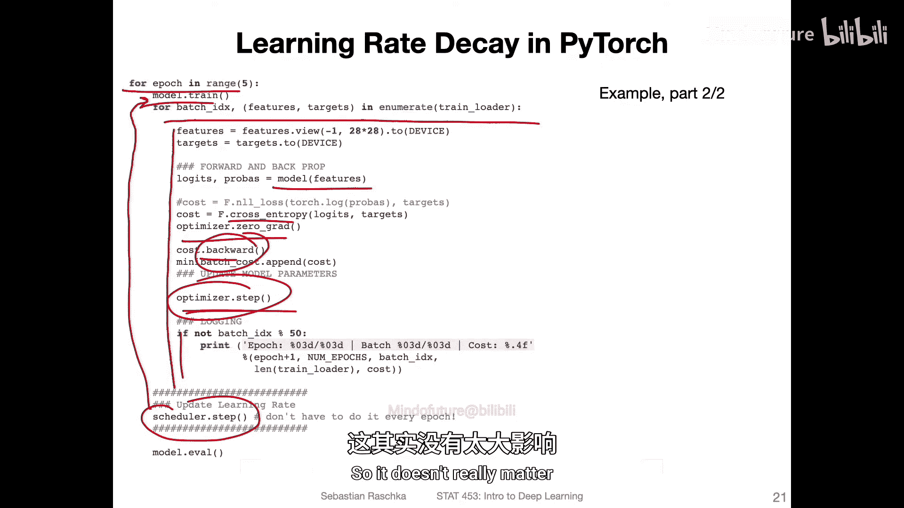

以下是使用 `ExponentialLR` 调度器的通用流程：

1.  **初始化调度器**：在定义优化器之后，用优化器和其他参数初始化调度器。
2.  **在训练循环中更新**：在每个epoch结束后调用调度器的 `.step()` 方法。

```python
import torch.optim as optim
import torch.optim.lr_scheduler as lr_scheduler

# 1. 初始化模型和优化器
model = ...
optimizer = optim.SGD(model.parameters(), lr=0.1)

# 2. 初始化调度器
scheduler = lr_scheduler.ExponentialLR(optimizer, gamma=0.9) # gamma是衰减因子

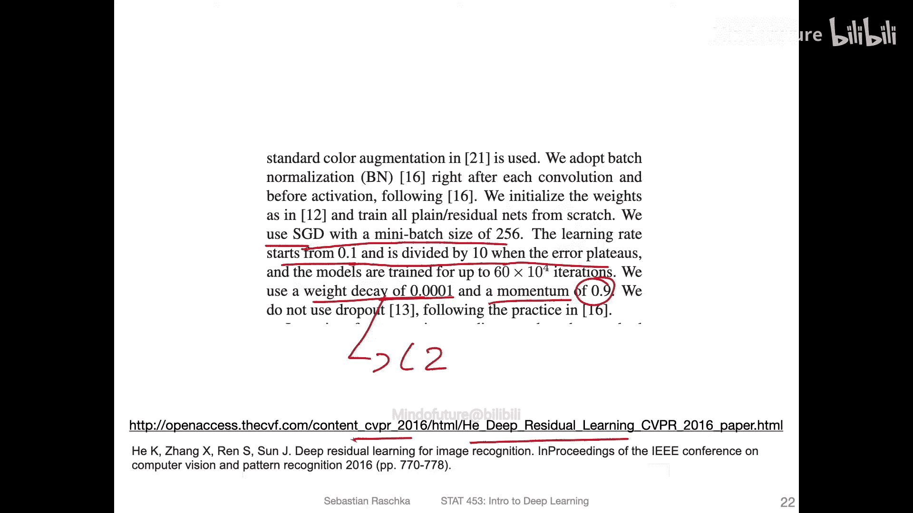

# 训练循环
for epoch in range(num_epochs):
    # 训练一个epoch...
    train(...)
    # 在每个epoch后更新学习率
    scheduler.step()
```

通过访问PyTorch官方文档，你可以找到更多类型的调度器，如 `StepLR`、`MultiStepLR`、`ReduceLROnPlateau` 等。

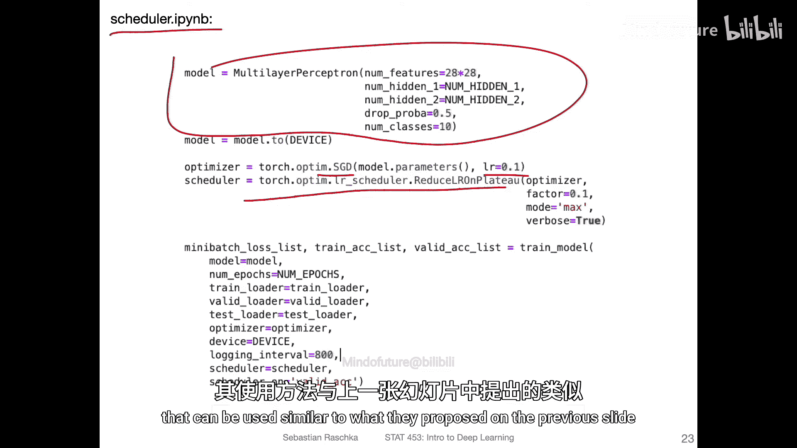

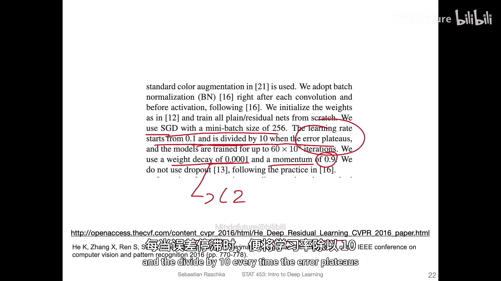

## 一个有效的实践策略：基于验证集性能的衰减

接下来，我们介绍一种在实践中非常有效的策略，它源自2016年关于深度残差网络（ResNet）的论文。其核心思想是：**当模型在验证集上的性能（如准确率）停止提升（达到平台期）时，将学习率除以10**。

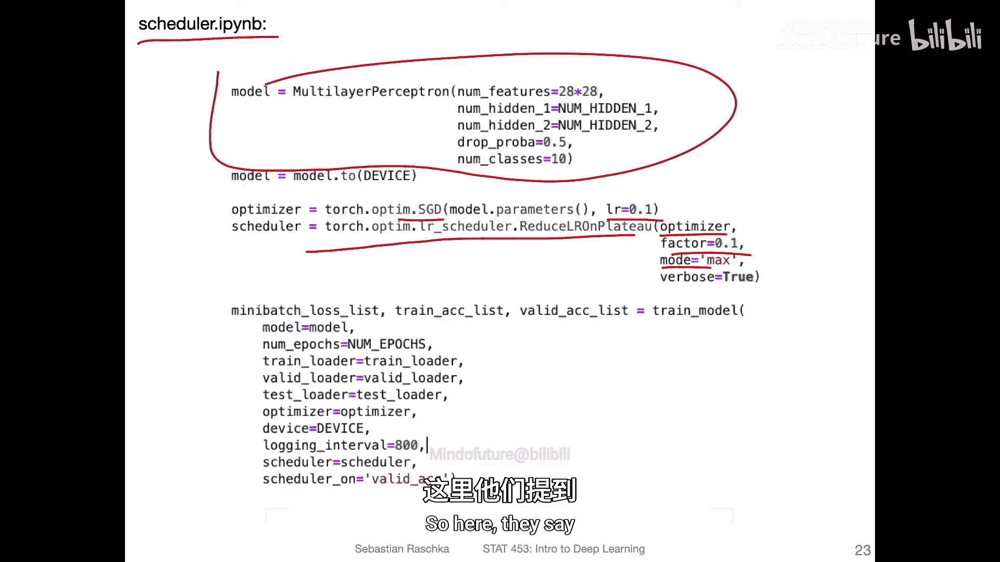

这种方法通常与带动量的SGD优化器配合使用。以下是关键的超参数设置：
*   **优化器**：SGD with momentum
*   **初始学习率**：0.1
*   **动量（momentum）**：0.9
*   **权重衰减（weight decay）**：0.0001 (即L2正则化)
*   **衰减触发条件**：验证集准确率不再显著提升
*   **衰减因子**：0.1 (即学习率除以10)

在PyTorch中，我们可以使用 `ReduceLROnPlateau` 调度器轻松实现此策略。

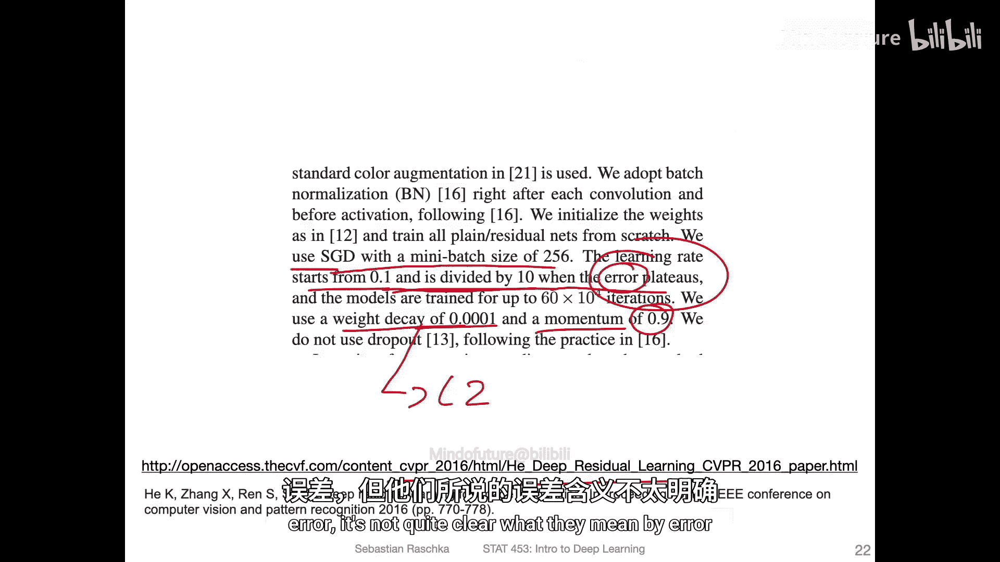

```python
from torch.optim.lr_scheduler import ReduceLROnPlateau

# 初始化优化器
optimizer = optim.SGD(model.parameters(), lr=0.1, momentum=0.9, weight_decay=1e-4)

# 初始化调度器，监控验证集准确率
scheduler = ReduceLROnPlateau(optimizer,
                              mode='max',        # 因为我们希望准确率‘max’imize（最大化）
                              factor=0.1,        # 学习率衰减因子
                              patience=3,        # 容忍性能不提升的epoch数
                              verbose=True)      # 打印衰减信息

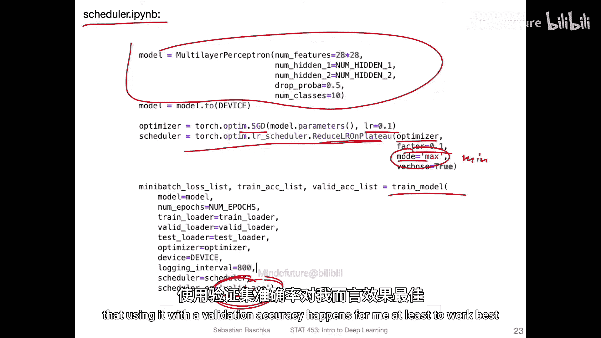

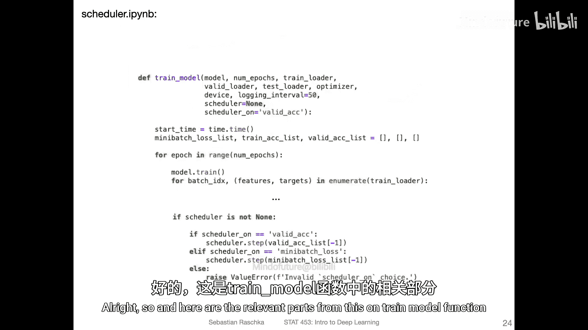

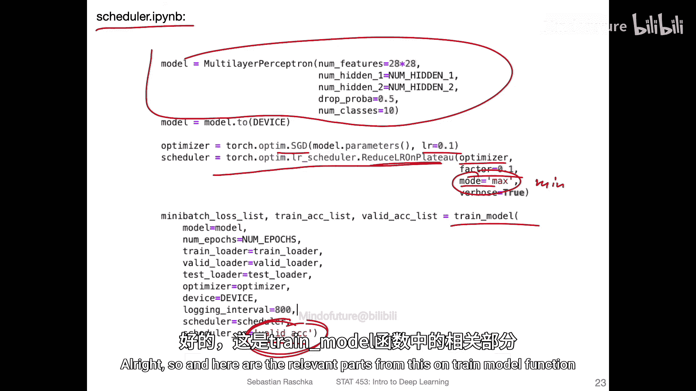

# 在训练循环中
for epoch in range(num_epochs):
    train_loss, train_acc = train_epoch(...)
    val_loss, val_acc = evaluate(...)

    # 注意：scheduler.step() 需要传入被监控的指标（这里是验证集准确率）
    scheduler.step(val_acc)
```

在这个例子中，`mode='max'` 表示我们监控的指标（验证准确率）是越大越好。如果连续 `patience=3` 个epoch该指标都没有提升，调度器就会将学习率乘以 `factor=0.1`。根据经验，基于验证集准确率（而非训练损失）来触发衰减通常效果更好。

## 模型保存与加载

在使用学习率调度器和长时间训练时，保存和加载模型检查点至关重要。这不仅可以用于后续的预测任务，还可以从中间状态继续训练，而无需从头开始。

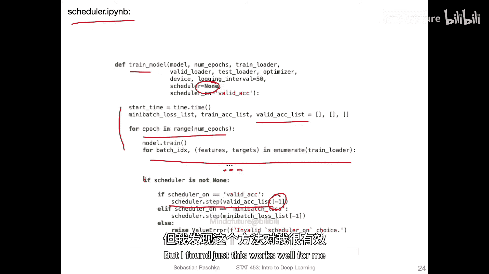

PyTorch推荐的方式是保存和加载模型的 **状态字典（state_dict）**，它包含了模型的所有可学习参数。

以下是保存和加载模型、优化器及调度器状态的示例：

```python
import torch

# ---------- 保存检查点 ----------
checkpoint = {
    'epoch': epoch,
    'model_state_dict': model.state_dict(),
    'optimizer_state_dict': optimizer.state_dict(),
    'scheduler_state_dict': scheduler.state_dict() if scheduler else None,
    'val_accuracy': val_acc,
    # ... 可以保存其他任何需要的信息
}
torch.save(checkpoint, 'model_checkpoint.pth')

# ---------- 加载检查点 ----------
# 1. 首先重新初始化模型、优化器结构（必须与保存时相同）
model = MyModel(...)
optimizer = optim.SGD(model.parameters(), lr=0.01)
scheduler = ReduceLROnPlateau(optimizer, ...)

# 2. 加载字典
checkpoint = torch.load('model_checkpoint.pth')

# 3. 将状态加载到对应的对象中
model.load_state_dict(checkpoint['model_state_dict'])
optimizer.load_state_dict(checkpoint['optimizer_state_dict'])
if scheduler and checkpoint['scheduler_state_dict']:
    scheduler.load_state_dict(checkpoint['scheduler_state_dict'])

# 4. 可以获取其他信息，例如从该epoch继续训练
start_epoch = checkpoint['epoch'] + 1
```

通过这种方式，优化器中动态调整后的学习率以及调度器的状态都能被完整保存和恢复。

## 总结

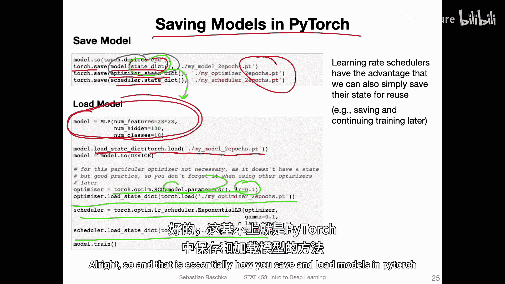

本节课中我们一起学习了PyTorch中的学习率调度。我们首先回顾了手动实现衰减的方法，然后重点介绍了使用PyTorch内置 `lr_scheduler` 模块的便捷方式。我们深入探讨了一种基于验证集性能触发衰减的有效策略，并使用 `ReduceLROnPlateau` 调度器实现了它。最后，我们学习了如何保存和加载包含模型、优化器及调度器状态的检查点，这对于实际项目的模型管理和继续训练至关重要。掌握这些工具能让你更高效地管理和优化深度学习模型的训练过程。