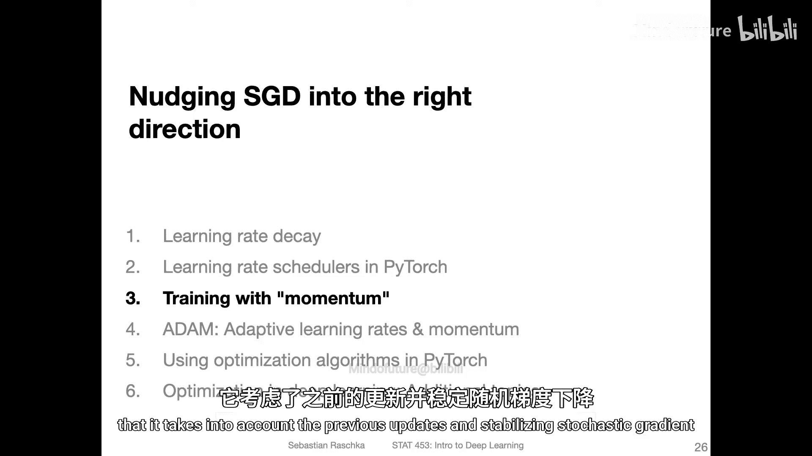
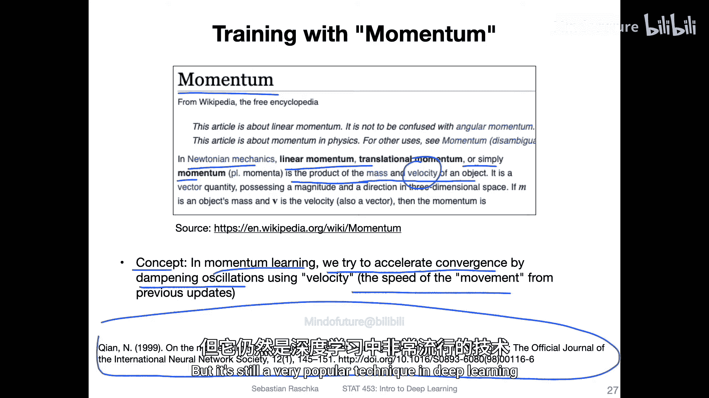
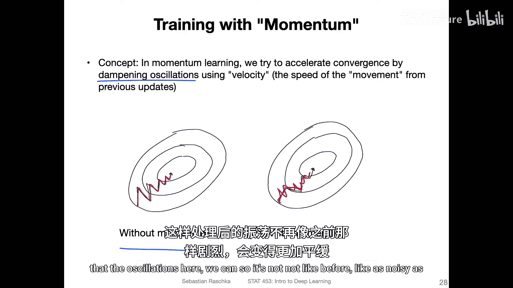
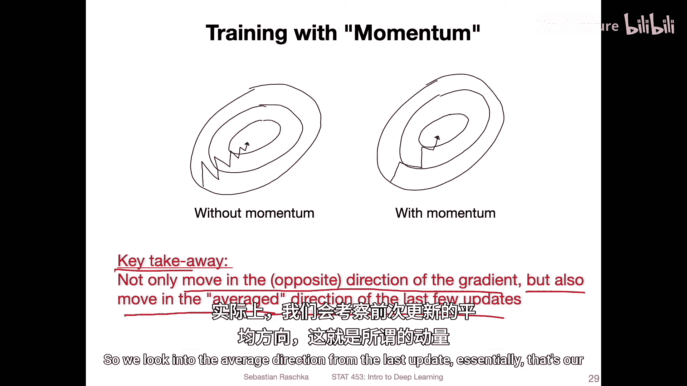
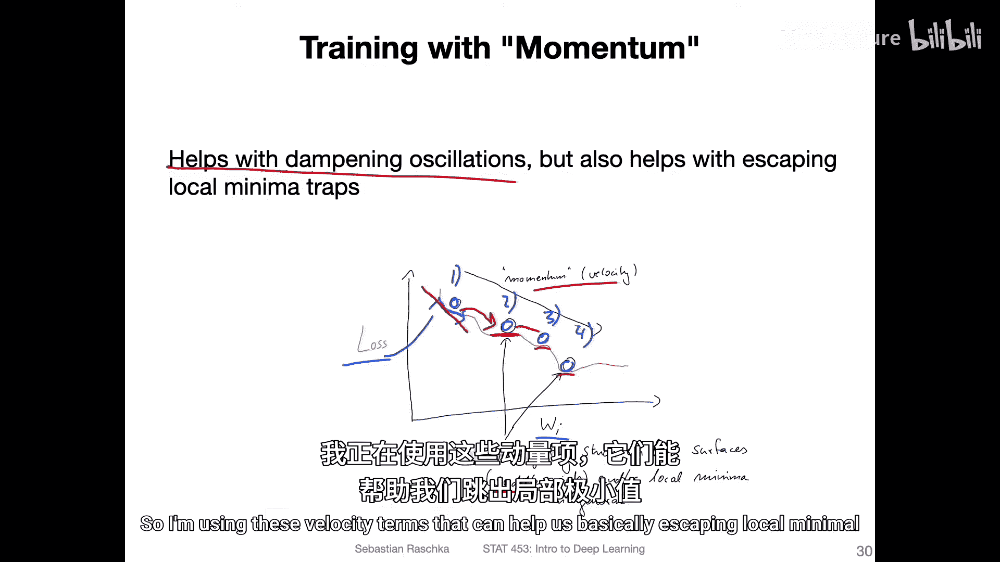
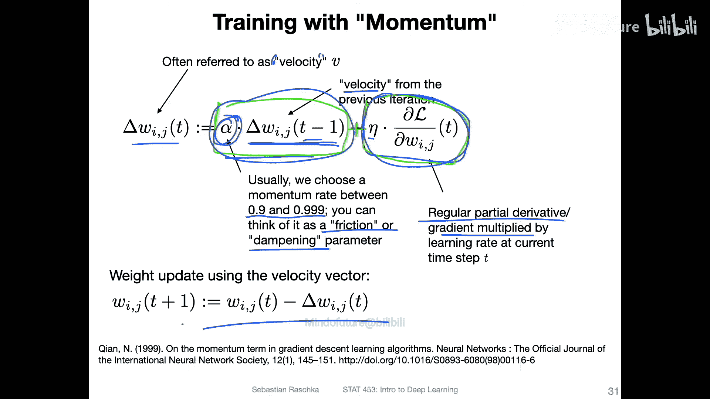
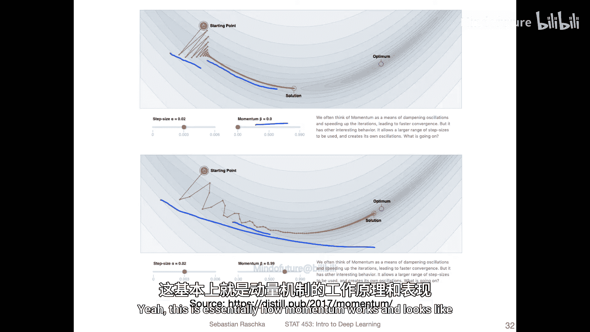
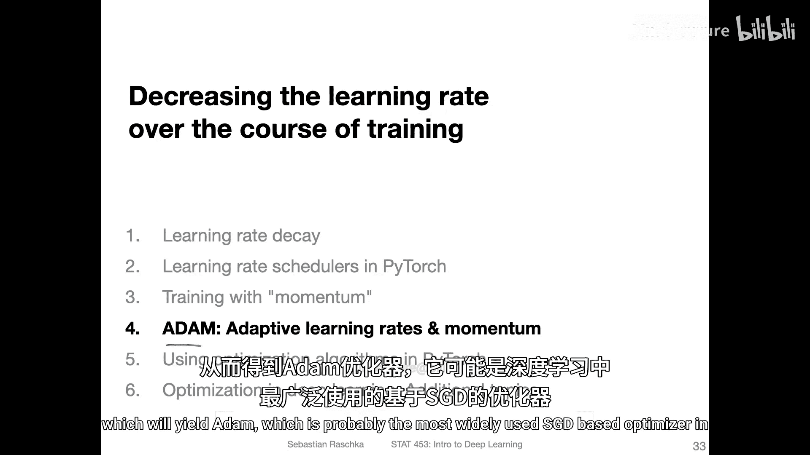

# 093：带动量的随机梯度下降 🚀

在本节课中，我们将学习一种名为“动量”的技术，它可以被添加到随机梯度下降中，以考虑之前的更新，从而稳定梯度下降过程，使其噪声更小。

## 动量概念的引入

上一节我们介绍了基础的随机梯度下降。本节中我们来看看如何通过引入“动量”来改进它。

在物理学中，线性动量是物体的质量与其速度的乘积。在SGD的权重更新中，我们没有“质量”的概念，但可以引入一个类似“速度”的概念，即更新的速度。

在动量学习中，我们试图通过利用这个“速度”（即先前更新的移动速度）来加速收敛并抑制振荡。其核心思想是考虑更新在时间进程中的进展，以此来减弱振荡。这项技术可以追溯到1999年的一篇论文，至今仍是深度学习中非常流行的技术，常与学习率衰减结合使用。

## 动量如何工作

以下是动量如何抑制振荡的示意图。

左侧展示了普通小批量SGD可能出现的“之”字形路径，这是由于梯度噪声造成的。你可以看到，平均而言，存在一个向某个方向移动的趋势。我们可以利用这个“速度”将其添加到更新中，以减弱振荡，使得更新路径不像之前那样嘈杂，而是被稍微“抑制”了。

关键要点是：在常规梯度下降中，我们通常沿梯度的反方向移动。而使用动量后，我们还会沿最近几次更新的平均方向移动。这个平均方向就是我们的“速度”。

## 动量的优势

动量不仅有助于抑制振荡，还能帮助我们跳出局部最小值。想象一下，当更新过程存在噪声，但最终落在一个平坦区域时，梯度将为零。此时，额外的速度项实际上可以帮助推动你离开这个平坦区域。

下图试图说明这一点。

图中红色曲线是某个权重 `W_i` 的简化损失曲线。圆圈代表不同时间步的当前位置（例如时间步1、2、3、4）。更新过程可能如下：首先沿斜坡下降，然后到达一个平坦表面，此处梯度为零。常规梯度下降会在此停止。但通过动量，由于它考虑了先前更新的平均方向，可能会提供必要的推力，推动权重继续下降。因此，使用速度项可以帮助我们逃离局部最小值或梯度平坦的鞍点。

## 动量更新的具体形式

那么，这种基于速度的更新具体是怎样的呢？让我们逐步解析。

首先，底部公式是常规SGD的更新规则：

`W_{i,j}^{(t+1)} = W_{i,j}^{(t)} - \eta \cdot \frac{\partial L}{\partial W_{i,j}^{(t)}}`

其中：
*   `W_{i,j}^{(t)}` 是当前时间步 `t` 的权重。
*   `\eta` 是学习率。
*   `\frac{\partial L}{\partial W_{i,j}^{(t)}}` 是损失 `L` 对权重的偏导数。

现在，我们不直接使用上述偏导数乘以学习率的部分，而是对其进行修改。我们添加一个额外的项，整个左侧部分我们称之为“速度” `v`：

`v^{(t)} = \alpha \cdot v^{(t-1)} + \eta \cdot \frac{\partial L}{\partial W_{i,j}^{(t)}}`

然后，权重更新公式变为：

`W_{i,j}^{(t+1)} = W_{i,j}^{(t)} - v^{(t)}`

让我们分解这个速度公式：
*   `v^{(t-1)}`：这是上一个时间步的速度（即先前的更新方向）。
*   `\alpha`：这是动量率，通常在0.9到0.999之间。你可以将其视为摩擦或阻尼参数。`\alpha` 越大，当前更新受先前更新的影响就越大。
*   `\eta \cdot \frac{\partial L}{\partial W_{i,j}^{(t)}}`：这是当前时间步的常规梯度更新量。

本质上，我们是将先前的更新（乘以一个系数）加到当前的更新上。这可以看作是一种移动平均，也就是动量项。

## 动量在实际中的表现

下图展示了动量在实际模拟中的表现（图中将动量率 `\alpha` 标记为 `\beta`，但含义相同）。

这里展示了两种动量值下的优化路径：
*   **动量 = 0**：这等同于常规梯度下降。可以看到路径非常嘈杂且振荡明显。
*   **动量 = 0.9**：振荡明显减弱，路径更加稳定，因为它考虑了平均方向。你还可以看到更新点更加密集，意味着达到相同位置所需的更新步骤可能更少。

这就是动量的工作原理和实际效果。

## 总结与预告

本节课中我们一起学习了带动量的随机梯度下降。我们了解到，动量通过引入一个基于先前更新方向的“速度”项，能够有效抑制优化过程中的振荡，并有助于逃离平坦区域或局部最小值。其核心更新公式结合了历史速度与当前梯度。

在下一节视频中，我将讨论自适应学习率。首先会介绍RMSProp算法，然后我们会将自适应学习率的概念与动量相结合，这将得到Adam优化器——这可能是目前应用最广泛的基于SGD的优化算法。

