# 094：Adam - 结合自适应学习率与动量 🚀

在本节课中，我们将学习一种名为Adam的优化算法。Adam结合了动量（Momentum）和自适应学习率（Adaptive Learning Rates）两种技术的优点，是目前深度学习中最流行、最有效的优化器之一。我们将从理解自适应学习率的概念开始，逐步过渡到Adam算法的具体构成。

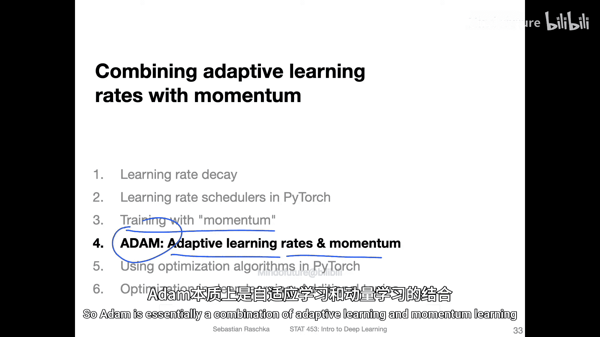

## 概述

在上一节中，我们介绍了动量项，它通过引入一个“速度”项来帮助抑制随机梯度下降中的振荡，并有助于克服损失曲面上的平坦区域，如鞍点或局部最小值。

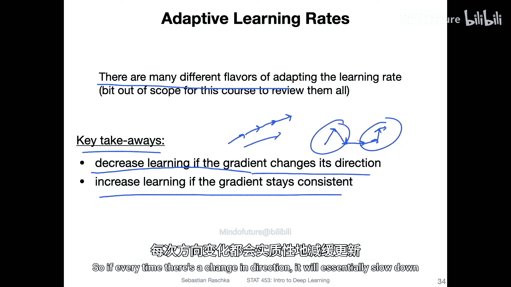

本节中，我们将学习一个略有不同但相关的概念：自适应学习率。随后，我们将看到如何将动量与自适应学习率结合起来，这种结合的算法就是Adam。

## 自适应学习率的概念

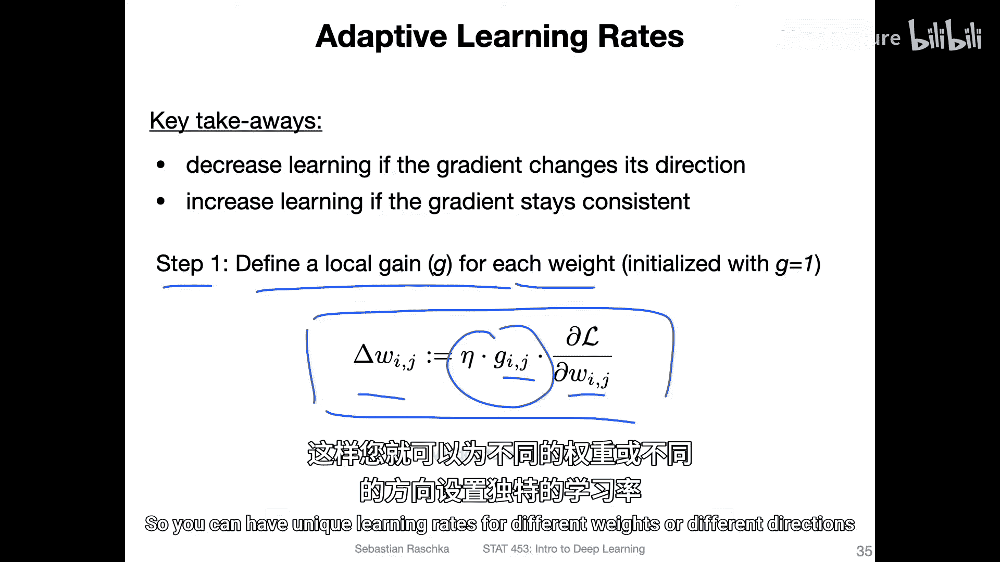

自适应学习率的核心思想是在正确的时刻加速或减速学习过程。具体来说，当梯度方向一致时，我们加速学习；当梯度方向频繁改变时，我们减速学习。

以下是其工作原理的一个简单示例：
*   **方向一致时加速**：如果连续几次参数更新都朝着大致相同的方向进行，这表明我们很可能正朝着正确的方向前进，因此可以加速学习以更快收敛。
*   **方向改变时减速**：如果更新方向频繁改变，这可能意味着存在噪声或我们正走向错误的方向。此时减速可以防止模型过于激进地走向错误方向。

## 实现自适应学习率

如何实现自适应学习率？主要有两个步骤。

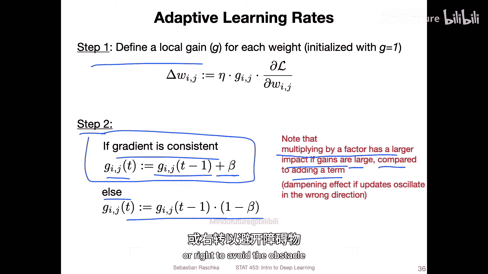

**第一步：初始化局部增益**
为网络中的每一个权重参数 `w_ij` 初始化一个对应的局部增益 `g_ij`。参数更新公式变为：
`Δw_ij = -η * g_ij * (∂L/∂w_ij)`
其中，`η` 是全局学习率，`(∂L/∂w_ij)` 是损失函数对该权重的梯度。`g_ij` 可以被视为该权重独有的学习率，使得不同参数可以有不同的更新速度。

**第二步：在训练中调整增益**
在训练过程中，我们根据梯度方向的一致性来动态调整每个增益 `g_ij`：
*   **方向一致**：缓慢增加增益（例如，加上一个小的正值 `β`）。这类似于平缓地踩下油门加速。
*   **方向改变**：快速减小增益（例如，乘以一个小于1的因子 `β`）。这类似于遇到急转弯时猛踩刹车，能产生更强的阻尼效果。

## RMSprop：一种流行的自适应学习率算法

在介绍Adam之前，需要了解一个重要的自适应学习率变体：RMSprop。它是对更早的Rprop算法的改进，由Geoffrey Hinton在其课程中提出。

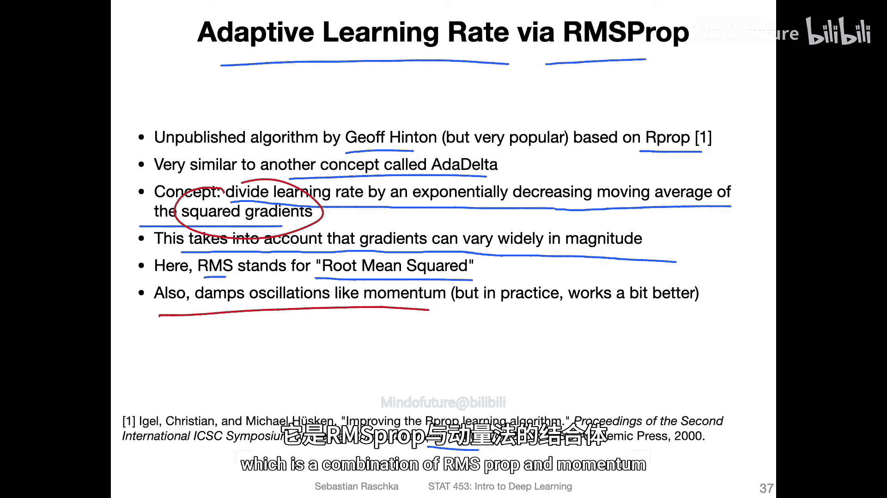

RMSprop的核心思想是：**将学习率除以一个平方梯度的指数衰减移动平均值**。这样做不仅实现了自适应学习率，还能根据梯度的大小进行缩放（因为某些权重的梯度可能远大于其他权重），并具有抑制振荡的效果。

其计算公式如下：
1.  计算平方梯度的移动平均（第二矩估计）：
    `E[g²]_t = β * E[g²]_{t-1} + (1 - β) * g_t²`
    其中，`g_t` 是当前时间步 `t` 的梯度，`β` 是衰减率（通常接近1，如0.9）。
2.  使用该移动平均来缩放更新：
    `Δw_t = - (η / √(E[g²]_t + ε)) * g_t`
    这里，`ε` 是一个很小的常数（如1e-8），用于防止除以零的错误。开平方根是为了使缩放因子与权重具有相同的量纲。

在实践中，人们发现RMSprop通常比单纯的动量法效果更好。

## Adam：自适应矩估计

Adam算法结合了动量法和RMSprop的优点，是目前深度学习领域应用最广泛的优化器。它通常能取得与精心调参的“SGD+动量+学习率调度器”相当甚至更好的性能，且需要更少的超参数调优。

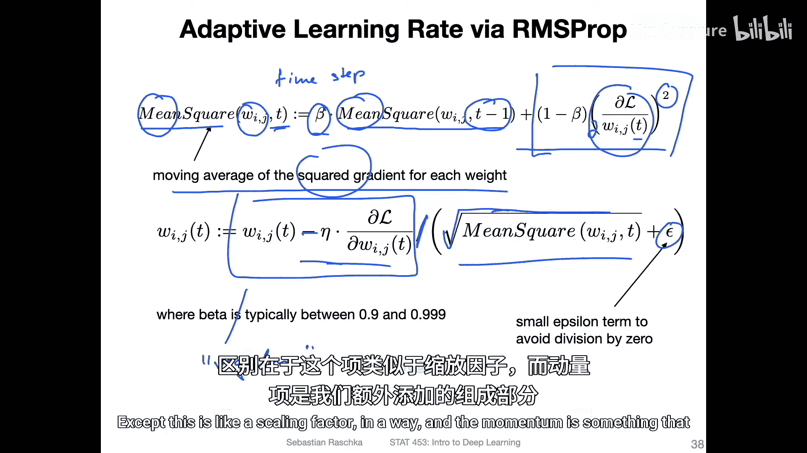

Adam的名字来源于“Adaptive Moment Estimation”（自适应矩估计）。它同时计算梯度的一阶矩（均值，即动量）和二阶矩（未中心化的方差，即RMSprop中的平方梯度均值）。

以下是Adam算法的简化版计算步骤（为了清晰起见，略去了原论文中的偏差校正步骤，但主流实现如PyTorch的`torch.optim.Adam`默认会进行校正）：

1.  **计算动量（一阶矩）**：
    `m_t = β1 * m_{t-1} + (1 - β1) * g_t`
    这类似于我们之前定义的动量项，其中 `β1` 是动量衰减率。

2.  **计算RMSprop项（二阶矩）**：
    `v_t = β2 * v_{t-1} + (1 - β2) * g_t²`
    这与RMSprop中计算平方梯度移动平均的步骤完全相同，其中 `β2` 是平方梯度的衰减率。

3.  **（可选）偏差校正**：由于 `m_t` 和 `v_t` 初始化为0，在训练初期会偏向于0。原论文提出了偏差校正：
    `m̂_t = m_t / (1 - β1^t)`
    `v̂_t = v_t / (1 - β2^t)`
    其中 `t` 是时间步（迭代次数）。这有助于在早期阶段获得更准确的估计。

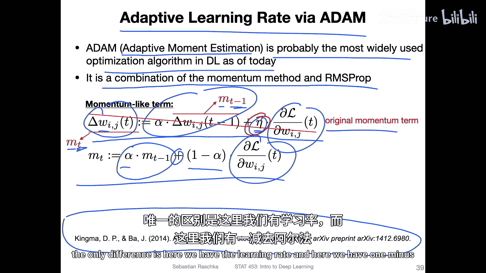

4.  **参数更新**：
    `w_{t+1} = w_t - η * m̂_t / (√(v̂_t) + ε)`
    最终更新结合了动量项 `m̂_t` 的方向和由 `v̂_t` 决定的自适应学习率。`ε` 同样是为了数值稳定性。

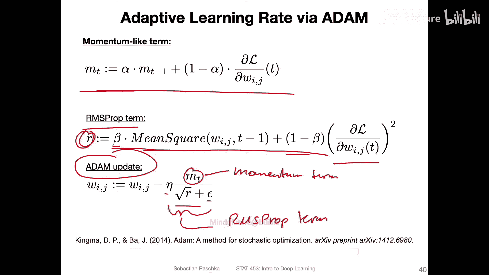

**默认超参数**：在实践中，`β1`、`β2` 和 `ε` 通常使用其默认值（如 `β1=0.9`, `β2=0.999`, `ε=1e-8`）就能取得很好效果，主要需要调节的是学习率 `η`。

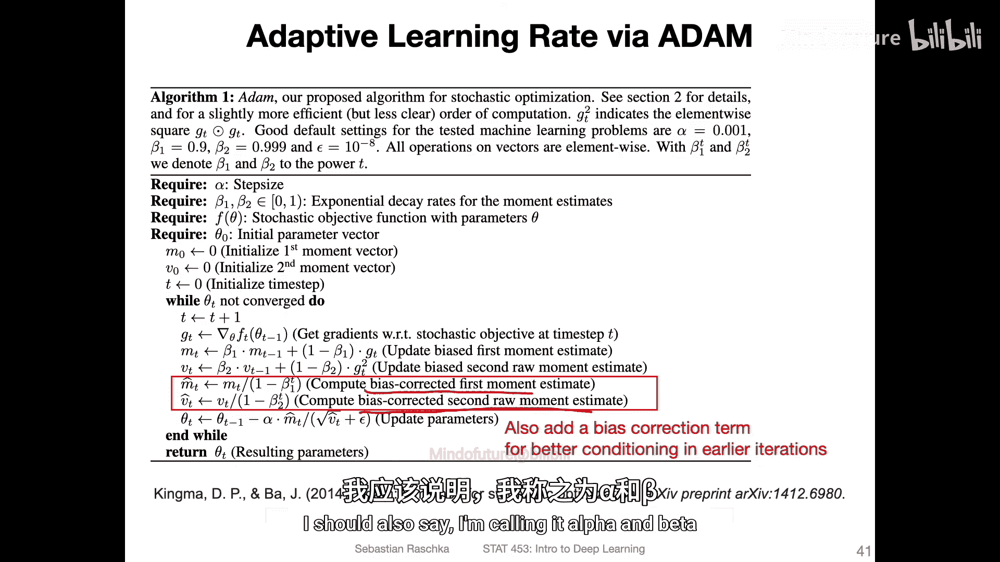

## 总结

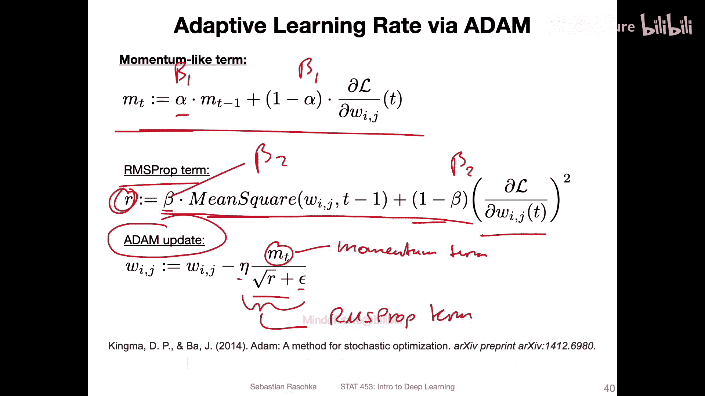

本节课我们一起学习了Adam优化算法。
*   我们首先回顾了**动量法**如何帮助加速收敛并抑制振荡。
*   接着，我们引入了**自适应学习率**的概念，它通过根据梯度方向的一致性动态调整每个参数的学习速度来优化训练过程。
*   然后，我们介绍了一种具体的自适应学习率算法——**RMSprop**，它通过除以平方梯度的移动平均来实现自适应缩放。
*   最后，我们深入探讨了**Adam算法**，它创造性地将动量（提供方向惯性）和RMSprop（提供自适应学习率缩放）结合起来。Adam通过估计梯度的一阶矩和二阶矩，实现了高效、稳定且通常无需复杂调参的优化，使其成为当前深度学习任务中的首选优化器。

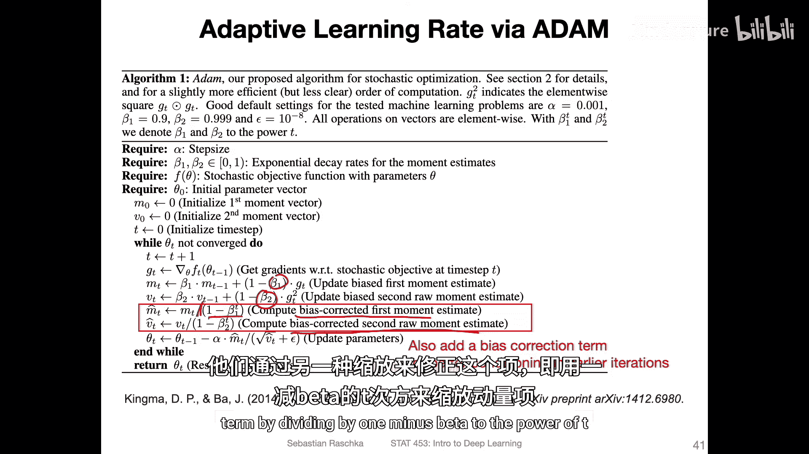

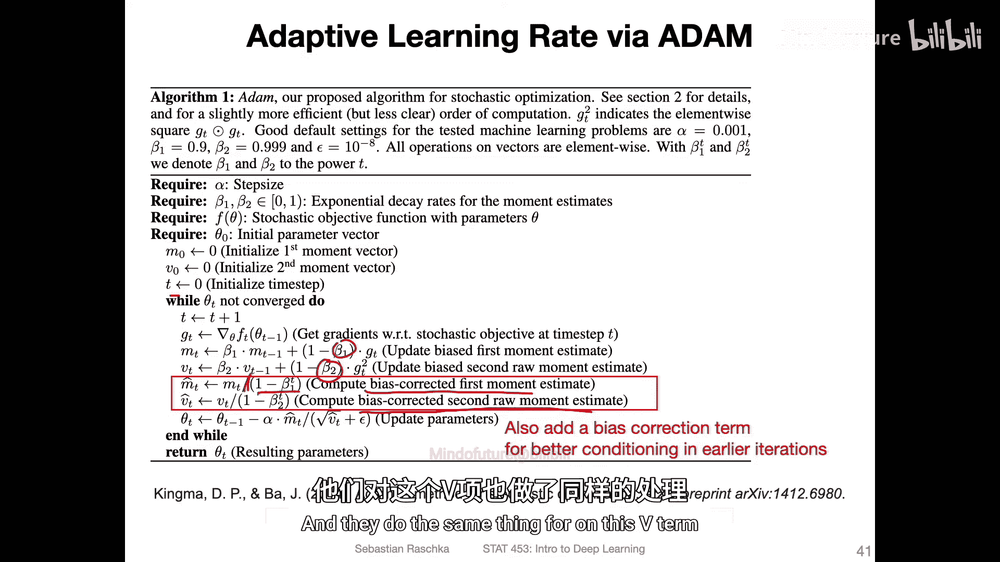

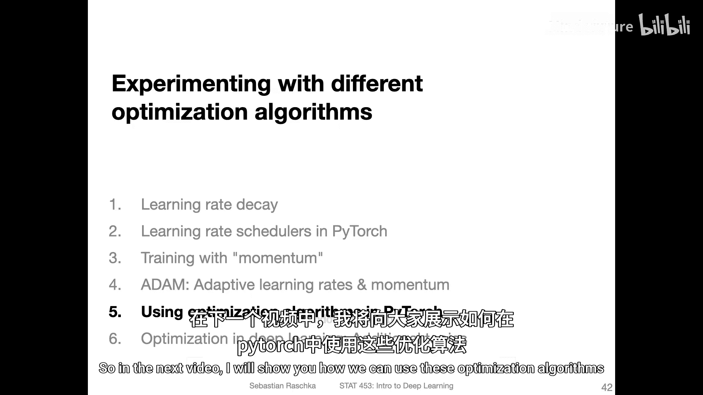

在下一节中，我们将学习如何在PyTorch中实际使用这些优化算法。