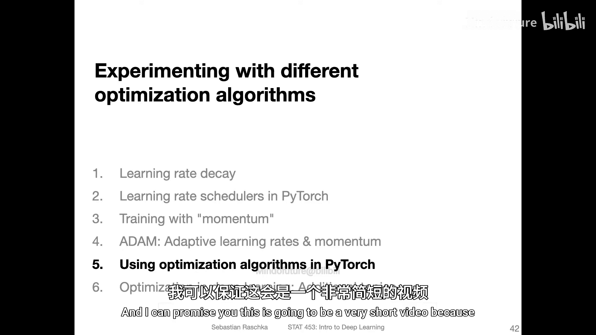
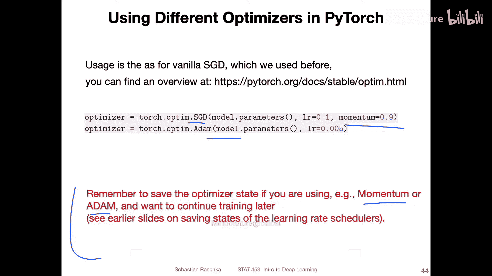
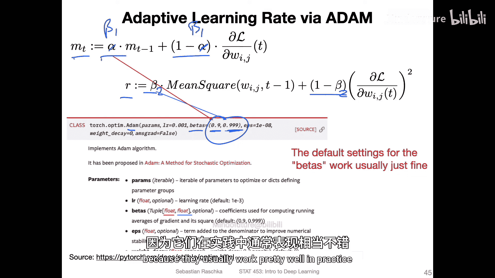
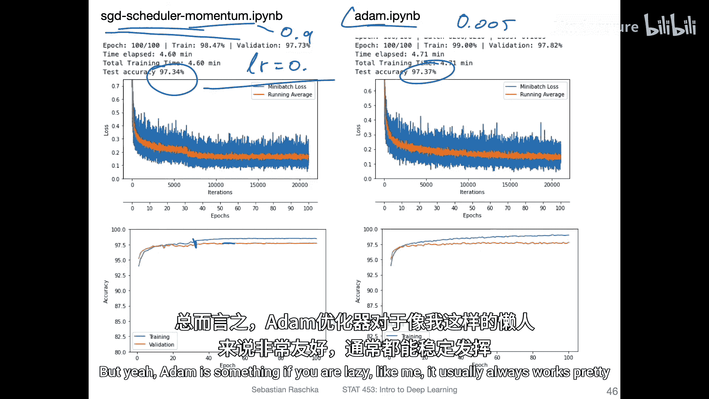
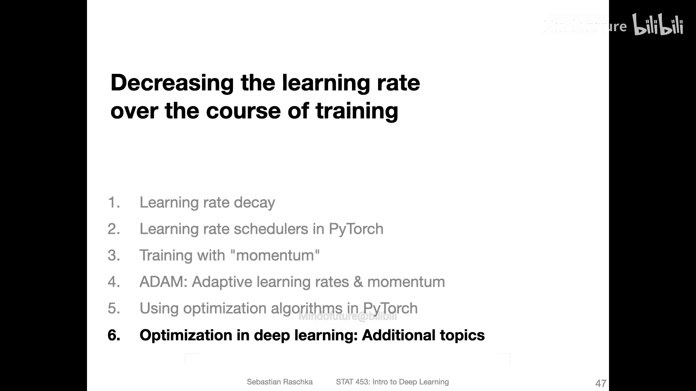

# 095：在PyTorch中选择不同的优化器 🚀



在本节课中，我们将学习如何在PyTorch中实际使用不同的优化算法。主要内容包括介绍最常用的优化器、如何设置其参数，并通过代码示例展示它们的使用方法。

## 概述

在深度学习中，优化器负责更新模型的参数以最小化损失函数。选择合适的优化器及其参数对训练效果至关重要。本节将重点介绍两种最常用的优化器：带动量的随机梯度下降（SGD）和Adam，并说明如何在PyTorch中轻松应用它们。

## 常用优化器介绍

上一节我们介绍了优化算法的理论基础，本节中我们来看看如何在代码中实现它们。在PyTorch中，使用优化器非常简单直接。

最常用的优化算法仍然是**随机梯度下降（SGD）**、**带动量的SGD**以及**Adam**。当然也存在其他优化算法，我们将在下一个视频中提及。但在实践中，这两种通常是大多数人使用的。

以下是在PyTorch中创建这些优化器的基本方法：

```python
# 导入PyTorch的优化模块
import torch.optim as optim

# 创建带动量的SGD优化器
optimizer_sgd = optim.SGD(model.parameters(), lr=0.01, momentum=0.9)

# 创建Adam优化器
optimizer_adam = optim.Adam(model.parameters(), lr=0.001)
```

## 学习率设置建议

学习率是优化器中最重要的超参数之一。其最佳值取决于具体的数据集、权重初始化、数据归一化、批归一化等多种因素，因此需要通过实验来确定。

以下是关于学习率设置的一些经验性建议：



*   **对于SGD**：我通常发现使用学习率`0.01`或`0.001`效果不错。当我使用SGD时，我通常也会配合使用**学习率调度器**。如果使用调度器，我通常以`0.1`作为初始学习率。
*   **对于Adam**：我通常不做太多调整，使用学习率`0.001`或`0.005`对我来说效果通常很好。与SGD相比，使用Adam时通常更容易找到一个合适的学习率。对于SGD，我需要尝试更多设置才能使其正常工作，而对于Adam，在实践中通常有多个学习率值都能取得良好效果。

## 保存与加载优化器状态

如果你使用的是带动量或自适应学习率的优化器变体（如带动量的SGD或Adam），并且希望保存模型以便后续继续训练，那么你也需要**保存和加载优化器的状态**。这是因为这些优化器内部维护了状态（例如动量的状态和自适应学习率RMSprop组件的状态）。

我在大约两三个视频前的课程中讨论过如何保存和加载优化器。因此，如果你使用带动量或Adam的版本并希望在之后的时间点继续训练，请确保你知道如何保存和加载优化器状态。

## Adam优化器的参数



在之前的视频中，我提到Adam有两个核心参数：用于动量项的α参数和用于RMSprop项的β参数。在PyTorch的Adam优化器中，这些参数也是可配置的。

在Adam优化器中，这两个参数通过一个名为`betas`的元组来设置，正如论文中所述。第一个值对应动量β（beta1），第二个值对应RMSprop β（beta2）。

```python
# Adam优化器，自定义beta1和beta2参数
optimizer_adam_custom = optim.Adam(model.parameters(), lr=0.001, betas=(0.9, 0.999))
```

就个人而言，我从不更改这些参数。保持其默认值通常对我来说效果很好。同样，在许多深度学习论文中，当作者描述其方法时，几乎没有人更改这些参数，他们总是说使用默认参数，因为它们在实践中通常表现得相当不错。

## 实践示例与比较

以下是两个使用不同优化算法设置的示例。

在左侧的示例中，我使用了**SGD并配合了一个学习率调度器**。该调度器在验证准确率停滞时（即不再提升并出现波动）将学习率减半。这样做的目的是在训练后期进入微调阶段时稳定训练过程。你可以看到，在训练初期曲线较为震荡，可能在这次学习率减半之后，训练变得更加稳定，因为不再有改进，我们降低了学习率以减少振荡。通过此设置，我在测试集上达到了**97.34%**的准确率。

在右侧的示例中，我只是使用了**Adam及其默认参数**。我想我在这里使用了`0.005`的学习率。我得到了基本相同的性能。但你可以看到，因为我们没有使用学习率调度器，所以可能在该区域附近看到曲线稍微更震荡一些。但说实话，两者在实践中都工作得非常好。

我通常发现Adam对我来说效果稍好一些，但我也是一个非常没有耐心的人。我想如果我更多地调整SGD，我可能也能获得类似甚至更好的性能。但Adam的好处在于，如果你像我一样“懒”，它通常总是能工作得很好，我正是因为这个原因而喜欢它。



## 总结



本节课中我们一起学习了在PyTorch中应用优化器的核心知识。我们介绍了最常用的SGD（带动量）和Adam优化器，讨论了学习率设置的经验法则，强调了在使用自适应优化器时保存其状态的重要性，并通过示例对比了两种优化器的典型使用方式。对于初学者，从Adam及其默认参数开始尝试是一个简单有效的选择。在下一节中，我们将简要介绍一些更高级的优化概念，为你未来的深入学习提供参考。