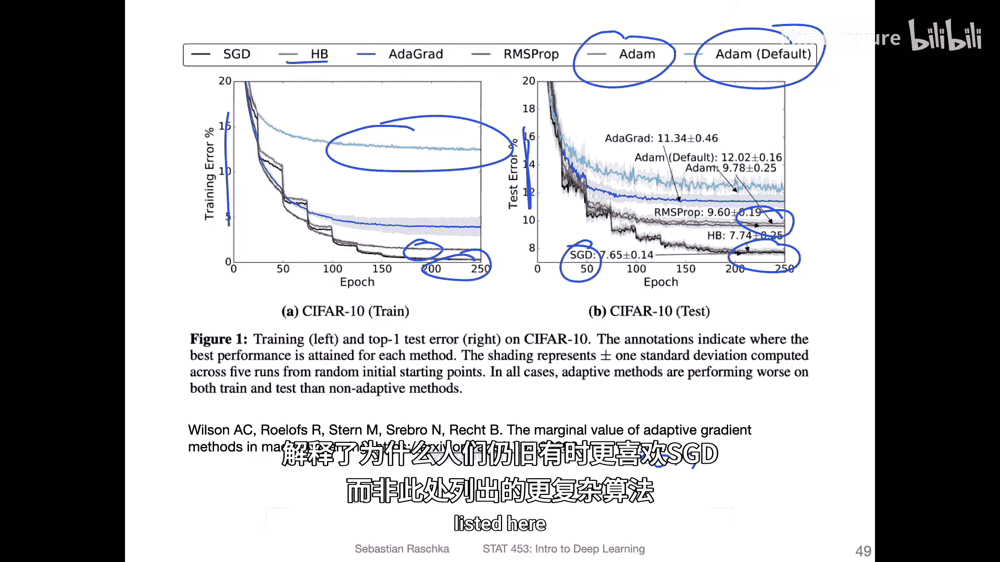
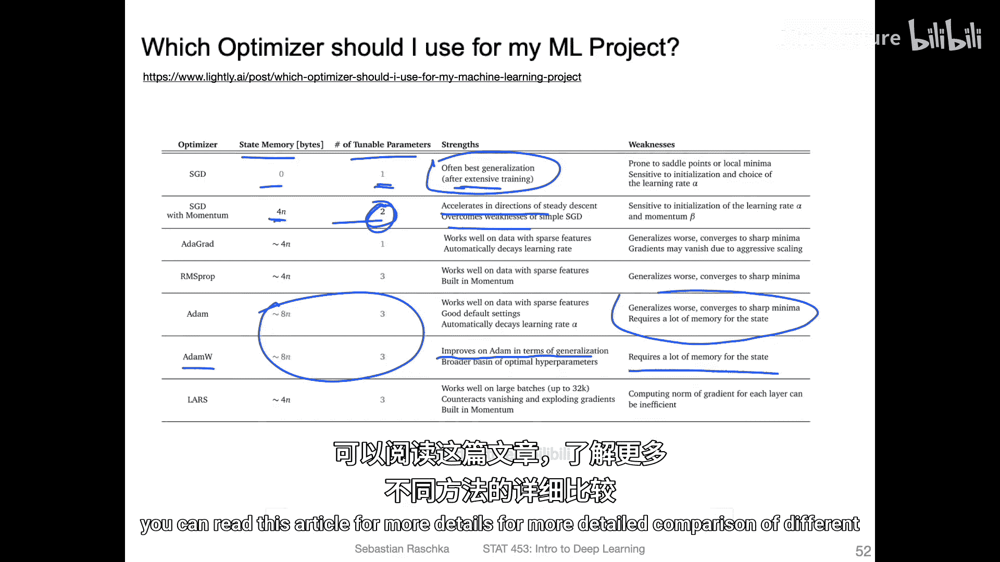
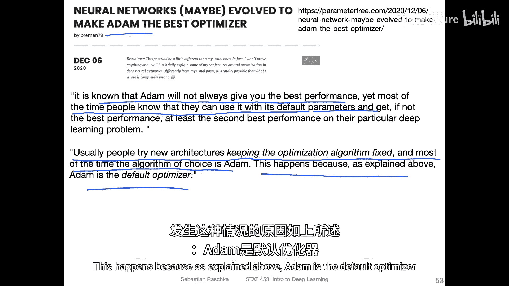
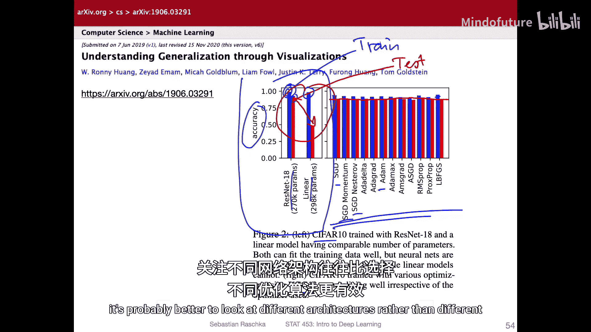
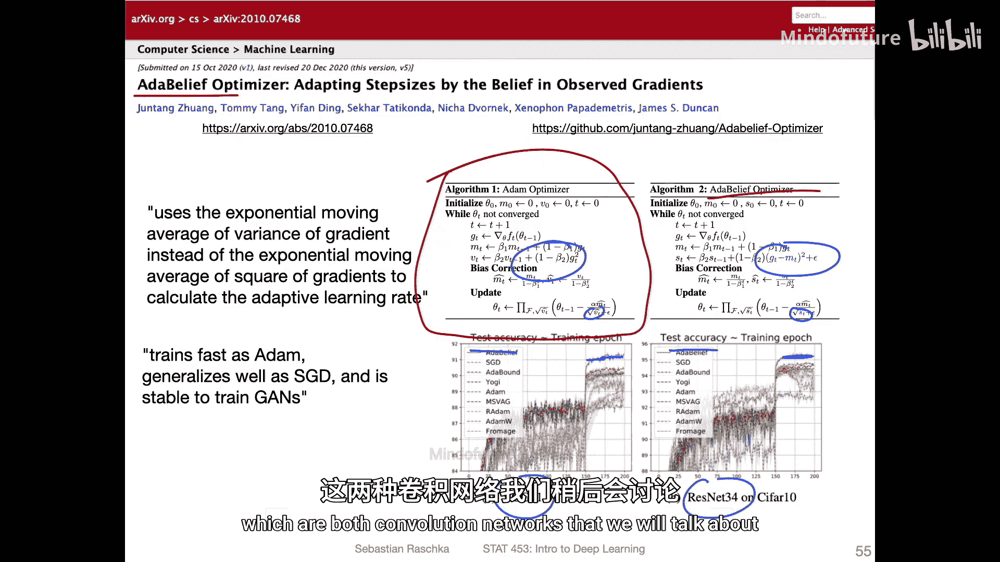

# 096：优化算法附加主题与研究 📚

在本节课中，我们将探讨优化算法的一些高级主题和最新研究。我们将回顾经典算法如SGD和Adam的对比，并了解一些新的优化器变体。理解这些内容有助于你在实际项目中做出更明智的算法选择。

上一节我们介绍了主流的优化算法，本节中我们来看看关于这些算法的更多研究、比较以及一些有趣的观察。

## 优化算法的性能对比与研究

Adam优化器自2014年提出以来，出现了许多与之比较或改进的方法。原始的Adam论文对比了多种算法，但如今相关方法数量可能已增长数倍。

一个未深入讨论的方法是SGD with Nesterov Momentum，它是带动量SGD的改进版本。理论上它可能优于常规动量法，但在实践中，大多数人仍使用常规动量SGD，因为它通常表现最佳且最简单。

Adam的优点在于其超参数调优需求较低。然而，SGD在泛化性能方面通常表现优异。

## 训练损失与泛化性能

下图展示了不同优化算法在训练损失上的表现。研究发现，Adam在降低训练成本或损失方面表现最佳。



然而，低的训练损失并不直接意味着模型在新数据上泛化能力强。模型可能过拟合。我们追求低训练损失，但若过拟合程度高，模型性能可能反而不如一个训练损失稍高但过拟合更少的模型。

为了更详细地说明，下图来自一篇论文（可能发表于2017年），它同时展示了训练误差和测试误差。



有趣的是，他们发现：
*   在训练集上，SGD的表现优于Adam。
*   在测试集上，常规SGD的表现也优于经过调优的Adam。
这个发现并非个例，其他研究也观察到，如果调优得当，SGD通常具有最佳的泛化性能。

一种可能的解释是SGD的噪声更大。这种噪声可能有助于避免陷入某些尖锐的最小值点，或者防止找到过于完美的损失值（那可能导致过拟合）。有时，较高的训练损失未必是坏事。


## 混合优化策略

有一篇有趣的论文提出了一种混合策略：在训练初期使用自适应方法（如Adam），然后在适当时候切换到SGD。

论文指出，尽管自适应优化方法（如Adam、Adagrad、RMSprop）在训练结果上表现优异，但它们的泛化能力通常不如SGD。这些方法在训练初期表现良好，但在后期阶段会被SGD超越。

下图展示了这种策略的测试误差对比，使用Adam后切换至SGD（SWATS方法）可以获得比单独使用Adam更低的测试误差，即更好的泛化性能。



## 算法综合比较

以下是一篇博客文章对不同算法优缺点的客观总结：

以下是不同优化算法的特点对比：
*   **SGD**:
    *   **状态内存**: 低
    *   **收敛速度**: 慢
    *   **优点**: 泛化能力最佳
    *   **缺点**: 需要大量调优和更多训练周期
*   **SGD with Momentum**:
    *   **状态内存**: 低
    *   **收敛速度**: 中等
    *   **优点**: 加速训练，克服SGD的一些弱点
*   **Adam**:
    *   **状态内存**: 高
    *   **收敛速度**: 快
    *   **优点**: 通常表现良好，超参数鲁棒
    *   **缺点**: 泛化能力通常不如SGD
*   **AdamW**:
    *   改进了Adam的泛化能力，但需要更多的状态内存。

AdamW是近期一些人开始使用的变体，它比常规Adam稍好。如果你感兴趣，可以阅读相关文章进行更详细的比较。

## 关于Adam流行的另一种观点

人们常认为Adam在各种架构上都能表现良好。但有观点认为，这可能是因为架构的演变使得Adam成为了最佳选择。


这种观点指出，众所周知Adam并非总能提供最佳性能，但大多数时候人们知道可以使用其默认参数，通常就能在问题上获得不错的性能。这可能不是因为Adam本身有多好，而是因为Adam在过去表现良好，导致新架构在设计时，开发者默认会使用Adam进行测试和优化。因此，新架构在某种程度上“适应”了Adam，形成了一个类似“鸡生蛋还是蛋生鸡”的循环偏差。

## 架构与优化器的重要性对比

最近的一些独立评估提出了一个有趣的观点：**优化算法的选择可能没有我们想象的那么重要**。

下图左侧使用ResNet-18（一种卷积网络），右侧使用多层感知机（MLP），两者都在CIFAR-10数据集上训练。




蓝线代表训练集准确率，红线代表测试集准确率。可以看到，对于两种网络，训练集准确率几乎相同。然而，测试集准确率却存在巨大差异。这表明**架构选择对泛化性能有巨大影响**。

相比之下，下图展示了在VGG-13（另一种卷积网络）上使用不同优化算法（SGD、带动量SGD、带动量SGD Nesterov、Adam）的结果。



虽然训练性能略有不同，但测试性能几乎完全相同。优化算法类型带来的差异微乎其微（可能只有1-2个百分点）。这表明，**如果你想提升模型性能，关注不同架构可能比纠结于不同优化算法更有效**。

## 新兴优化器：AdaBelief

尽管如此，近期出现了一个迅速流行的新优化器——**AdaBelief**，它本质上是Adam的一个修改版本。

左侧是常规Adam优化器的更新公式，右侧是AdaBelief优化器，蓝色字体标出了关键改动。

```
# Adam 更新规则 (概念性表示)
m_t = β1 * m_{t-1} + (1 - β1) * g_t
v_t = β2 * v_{t-1} + (1 - β2) * g_t^2
参数更新 = - η * m_t / (sqrt(v_t) + ε)

# AdaBelief 更新规则 (概念性表示)
m_t = β1 * m_{t-1} + (1 - β1) * g_t
s_t = β2 * s_{t-1} + (1 - β2) * (g_t - m_t)^2 + ε
参数更新 = - η * m_t / (sqrt(s_t) + ε)
```


其主要思想是将`v_t`（梯度平方的指数移动平均）替换为`s_t`（预测梯度`m_t`与当前梯度`g_t`之差的平方的指数移动平均），即衡量对梯度方向的“信念”。下图显示，在VGG-11和ResNet-34等卷积网络上，AdaBelief（蓝色）的表现优于其他优化器。


---


本节课中我们一起学习了优化算法领域的一些深入话题和研究动态。我们比较了SGD和Adam在训练与泛化上的差异，探讨了混合优化策略，并了解了算法选择与模型架构重要性之间的对比。最后，我们简要介绍了新兴的AdaBelief优化器。记住，没有“一刀切”的最佳优化器，理解其原理和适用场景，结合具体任务和架构进行选择，才是关键。