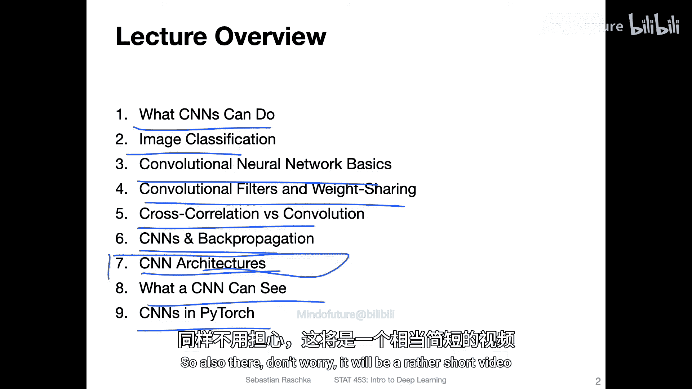
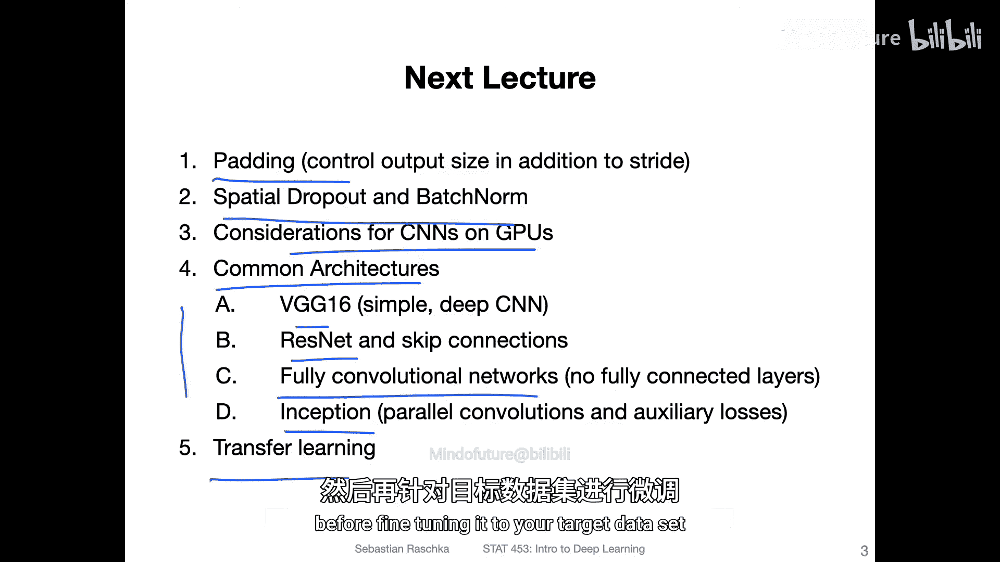
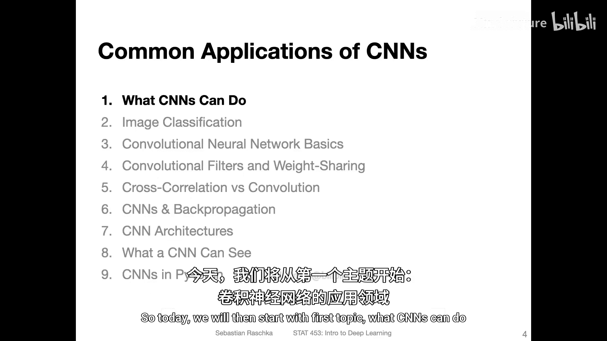

# 097：卷积神经网络入门——讲座概述

在本节课中，我们将要学习卷积神经网络的基础概念。卷积神经网络是一种特别擅长处理图像数据的神经网络架构。我们将从宏观层面了解其工作原理、核心组件以及典型应用。

---

## 应用领域

首先，我们来看看卷积神经网络能做什么。卷积神经网络在计算机视觉领域有广泛的应用。

以下是卷积神经网络的一些主要应用方向：
*   **图像分类**：识别图像中的主要物体类别。
*   **目标检测**：在图像中定位并识别多个物体。
*   **语义分割**：为图像中的每个像素分配一个类别标签。
*   **图像生成**：创建新的、逼真的图像。

## 聚焦图像分类

为了更清晰地研究卷积神经网络，我们将以**图像分类**作为主要例子。这是一个流行且基础的应用，能帮助我们理解其核心思想。

## 卷积网络基础

上一节我们介绍了卷积网络的应用，本节中我们来看看它的基本原理。卷积神经网络的核心设计灵感来源于生物视觉皮层，它通过一系列特殊的操作来处理图像数据。

以下是卷积神经网络的三个关键组成部分：
*   **卷积层**：使用可学习的滤波器在图像上滑动，提取局部特征（如边缘、纹理）。
*   **池化层**：对特征图进行下采样，减少数据量并增强特征的空间不变性。
*   **全连接层**：在网络的末端，将提取的高级特征映射到最终的分类结果。

## 卷积滤波器与权重共享

卷积操作的核心是**卷积滤波器**（或称为**卷积核**）。一个滤波器是一个小的权重矩阵（例如3x3），它在输入图像上滑动，计算局部区域的加权和，生成**特征图**。

**权重共享**是卷积网络的一个重要特性。这意味着同一个滤波器会应用于输入的所有位置。这极大地减少了需要学习的参数数量，并使网络能够检测到图像中任何位置出现的相同特征。

一个3x3卷积操作的简化公式可以表示为：
`输出特征图[x, y] = Σ_i Σ_j (输入[x+i, y+j] * 滤波器[i, j]) + 偏置`

## 互相关与卷积

在深度学习的语境下，我们通常所说的“卷积”在技术上指的是**互相关**操作。严格来说，数学上的卷积在计算前会将滤波器旋转180度。然而，由于滤波器参数是可学习的，这个旋转操作可以被吸收到学习过程中，因此两者在实践中是等价的。了解这个细微差别可能在某些场合有用。

## 卷积网络中的反向传播

关于卷积网络如何通过反向传播算法进行学习，其数学推导较为复杂。在本入门课程中，我们不做深入展开。重要的是理解，现代深度学习框架（如PyTorch）的**自动微分**功能可以自动计算这些梯度，我们只需定义网络的前向传播过程即可。

## 经典网络架构概览



有多种经典的卷积神经网络架构被提出，它们在层数、连接方式和设计理念上各有不同。这些将是下一节课的重点内容。

以下是几种重要的架构类型：
*   **VGGNet**：通过堆叠多个小尺寸卷积核来构建深度网络。
*   **ResNet**：引入了残差连接，解决了极深网络中的梯度消失问题。
*   **Inception**：在单层内使用不同尺寸的滤波器并行处理，更高效地提取多尺度特征。

## 卷积网络看到了什么？

我们可以通过可视化技术来窥探卷积网络的内部。例如，可以将第一层卷积滤波器可视化，它们通常学习到类似边缘、颜色和纹理检测器的模式。我们也可以生成最大化特定神经元激活的输入图像，从而理解高层神经元所响应的复杂模式。

## 在PyTorch中使用卷积网络

最后，我们来看看如何在PyTorch中实现一个简单的卷积神经网络。这并不复杂，PyTorch提供了`torch.nn`模块，其中包含了`Conv2d`, `MaxPool2d`等现成的层，使得构建CNN变得非常直观。

一个简单的CNN定义代码框架如下：
```python
import torch.nn as nn
import torch.nn.functional as F

class SimpleCNN(nn.Module):
    def __init__(self):
        super(SimpleCNN, self).__init__()
        self.conv1 = nn.Conv2d(3, 16, 3) # 输入通道3，输出通道16，卷积核3x3
        self.pool = nn.MaxPool2d(2, 2)   # 2x2最大池化
        self.fc1 = nn.Linear(16 * ... * ..., 10) # 全连接层，输出10类

    def forward(self, x):
        x = self.pool(F.relu(self.conv1(x)))
        x = x.view(x.size(0), -1) # 展平
        x = self.fc1(x)
        return x
```

---

## 下节课预告

本节课中我们一起学习了卷积神经网络的基础概念、核心组件和简单应用。在下一讲中，我们将深入探讨更高级的主题，包括：
*   适用于卷积网络的特殊正则化技术（如空间Dropout）。
*   在GPU上高效训练CNN的注意事项。
*   对VGG、ResNet、Inception等经典架构的详细分析。
*   **迁移学习**的原理与实践：即在一个大型数据集上预训练网络，然后在一个较小的特定数据集上进行微调，这对于数据有限的项目非常有用。





我们下节课再见。