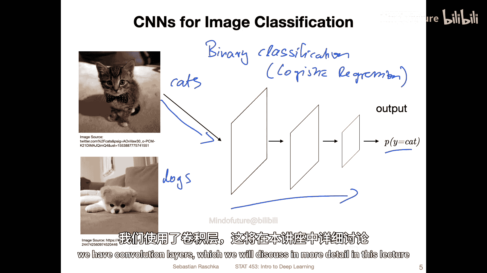
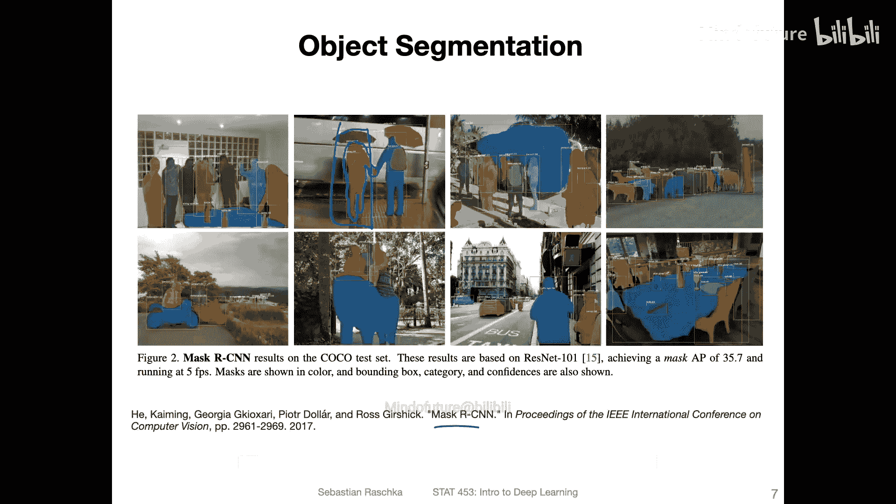
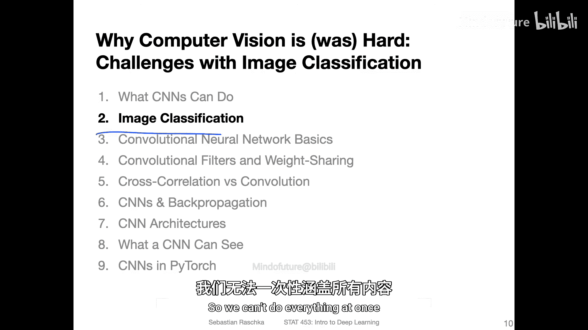

# 098：卷积神经网络的常见应用 🖼️

在本节课中，我们将学习卷积神经网络（CNN）的几种常见应用。我们将从最简单的图像分类开始，逐步了解物体检测、图像分割、人脸识别以及生成对抗网络等高级任务。通过本节的学习，你将建立起对CNN应用场景的宏观认识。

---

## 图像分类 📊

上一节我们介绍了CNN的基本概念，本节中我们来看看其最基础的应用——图像分类。图像分类任务的目标是让模型识别输入图像所属的类别。

最简单的CNN应用是图像分类。这里有一个二分类问题的例子。它与我们之前讨论的逻辑回归类似。区别在于，现在的输入是图像，而不是更简单的特征数据。这是一个猫与狗的二分类问题。输入图像被送入网络，经过卷积层处理。网络末端通常有全连接层（图中未显示）。最终，网络会输出一个概率分数，表示该图像是猫的概率。

当然，你也可以将其扩展到多类别分类，使用我们之前讨论过的Softmax层。本质上，这与我们在多层感知机中所做的相同，只是我们使用了卷积层，这将在本讲座中详细讨论。

---

## 物体检测 🎯

除了常规分类，CNN另一个常见的应用是物体检测。你可以将其视为分类和物体定位的混合任务，因为通常你需要预测一个边界框，同时还要预测该边界框对应的类别标签。

因此，你本质上需要完成两个任务：一是识别物体（例如这里的汽车），二是为其分配类别标签。网络需要学习如何绘制这些边界框。你可以将其视为一种回归任务，学习边界框的坐标。同时，网络还需要分配标签。YOLO（You Only Look Once）是这方面的一个常见例子。当然，也存在许多其他方法。由于课程范围限制，我们不会深入讨论这个话题，但如果你感兴趣，YOLO的原始论文是一个很好的起点。

---

## 图像分割 ✂️

与物体检测相关的任务是图像分割。它相对类似，但更进一步：其目标不是仅仅识别一个边界框，而是为物体生成一个精确的掩码。

例如，对于一个人物，图像分割不是仅仅在人物周围画一个方框，而是提取出人物的精确轮廓掩码。因此，在这个意义上，它是物体检测的一个更精确的版本。Mask R-CNN是这方面的一个传统方法。同样，由于这是更高级的主题，本课程不会过多讨论细节，但需要知道这项技术存在。

---

## 人脸识别 👤

另一个任务是与人脸识别相关。人脸识别在某种程度上与分类有关，但并不完全相同。它更多地是关于成对比较。

虽然你可以将人脸识别表述为一个图像分类任务（例如，有10000个潜在人物，你想知道图片中的人是谁），但这会成为一个有10000个类别的分类任务，计算成本高昂，且每个类别的样本通常很少，训练这样的系统会非常繁琐。

因此，人们通常采用一种称为“成对损失”或“三元组损失”的方法。通过这种方式，你学习一种相似度分数。如果两张输入图像是同一人，则应给出高相似度分数；如果是不同人，则应给出低相似度分数。然后你可以设置一个阈值来判断是否为同一人。实现这一点的一种传统方法是使用孪生网络，它包含两个卷积网络来生成图像的特征表示，然后基于特征表示计算相似度（如欧氏距离或余弦相似度）。同样，这属于更高级的主题，本课程主要关注用于分类的卷积网络。

---

## 生成对抗网络 🎨

本课程后续将使用卷积网络的另一个主题是生成对抗网络。我们也可以在图像合成的背景下使用卷积网络，即所谓的生成对抗网络。

生成对抗网络本质上是能够生成数据的网络。其工作原理是：你有一个生成器和一个判别器。生成器接收一些噪声（通常是从随机分布中采样的随机向量），然后通过一个卷积网络将其构造成一张图像。从这个意义上说，它更像一个反向的卷积网络，最终输出生成的图像。判别器则必须判断这张图像是真实的还是生成的。

你训练生成器，使其能够“欺骗”判别器，让判别器认为生成的图像实际上来自训练集。同时，你训练判别器，使其能更好地区分生成图像和真实图像。这是一个极小极大博弈，你持续进行这个过程，直到生成器能够产生看起来逼真的图像。这些图像通常不在训练集中，它们是合成或插值产生的。它们可能看起来与训练集图像相似，但通常不是训练集中的任何一张具体图像。

这非常有用，你可以用它做很多有趣的事情，例如，最近人们开始用它来制作合成训练样本以扩大训练集，或用于图像编辑。我们也在一个名为“Privacy Net”的项目中使用它，从图像中移除敏感或私人信息。GANs有很多应用，我们将在后续课程中更详细地讨论。

---

## 总结 📝

本节课我们一起学习了卷积神经网络的多种常见应用。我们从最基础的图像分类开始，了解了物体检测、图像分割、人脸识别等更复杂的视觉任务，并初步认识了用于图像合成的生成对抗网络。这些应用展示了CNN在计算机视觉领域的强大能力和广泛用途。在接下来的课程中，我们将首先聚焦于图像分类这一基础任务，因为它是最核心且最适合入门的学习起点。