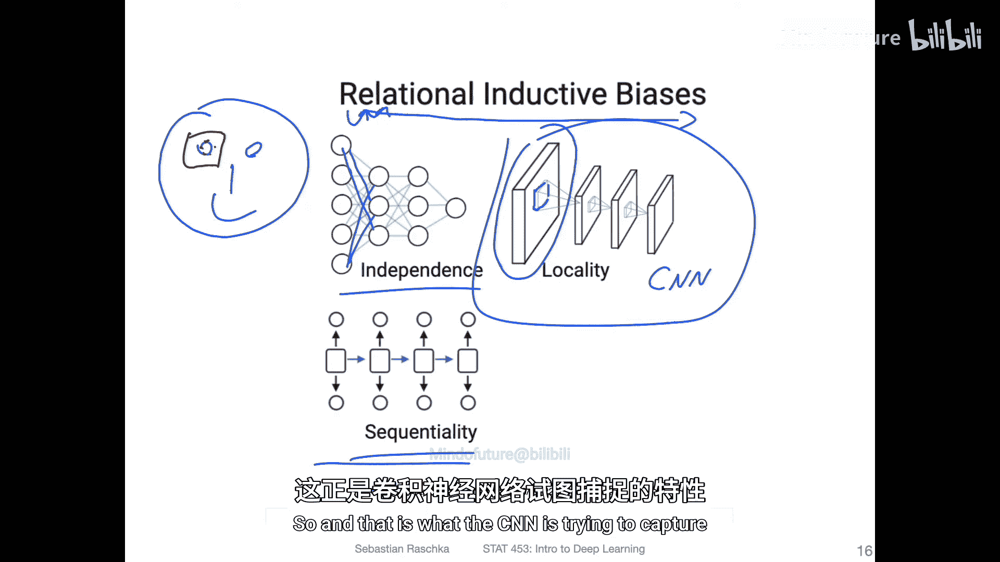
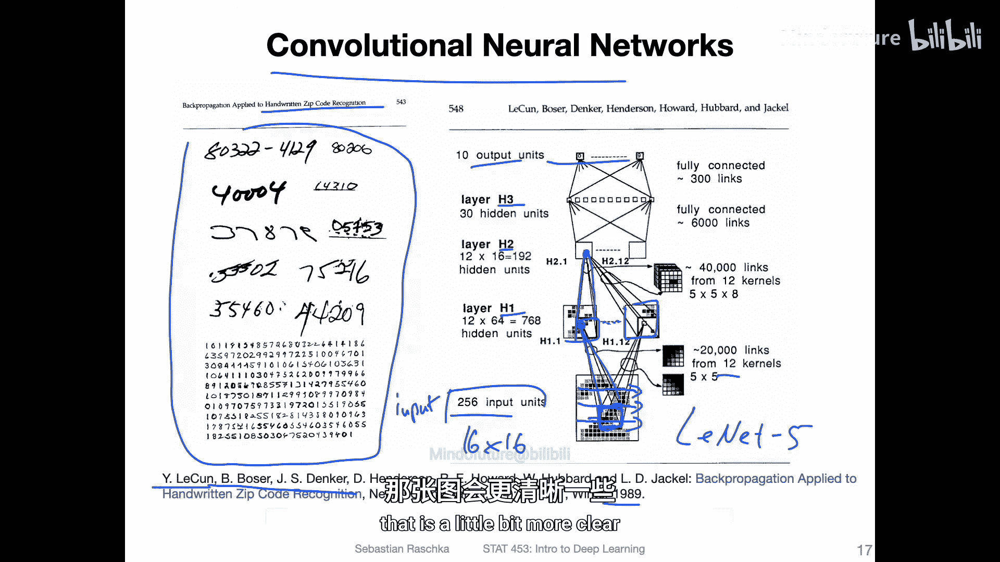
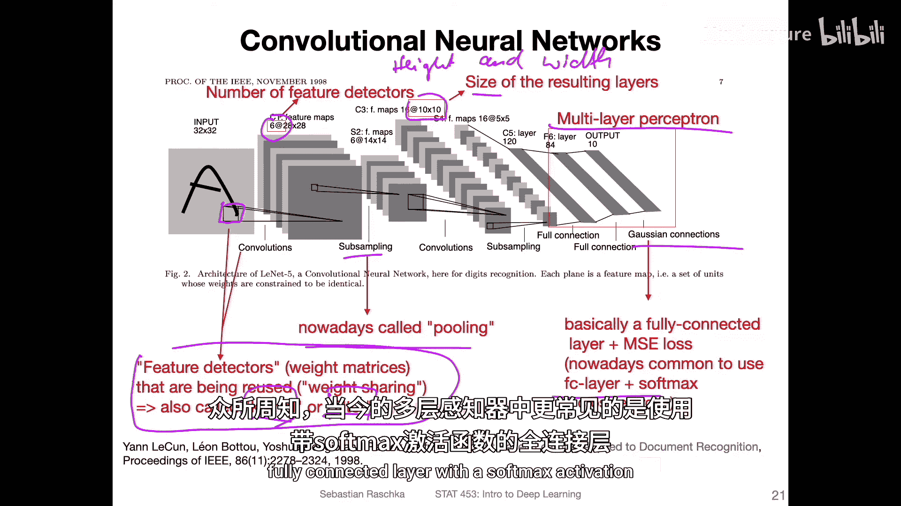
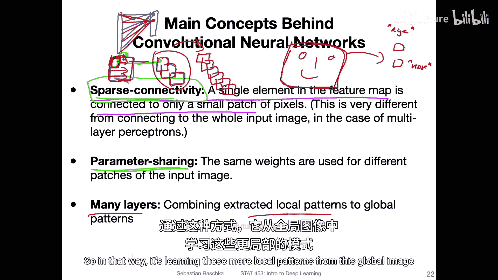
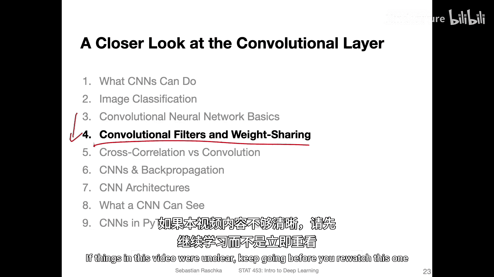

# 100：卷积神经网络基础 🧠

在本节课中，我们将要学习卷积神经网络（CNN）的基本概念。CNN是处理图像数据的主流架构，其核心思想与传统的多层感知机（MLP）有显著不同。我们将通过了解其历史背景、核心架构和工作原理来入门。

## 多层感知机与卷积神经网络的假设对比

上一节我们介绍了神经网络的基本概念，本节中我们来看看不同神经网络架构背后的核心假设。

*   **多层感知机（MLP）**：假设输入特征之间是**相互独立**的。其架构通常是全连接的。
*   **循环神经网络（RNN）**：假设数据中存在**时间或序列依赖**关系，例如分析文本或股票价格。
*   **卷积神经网络（CNN）**：假设数据中存在**局部相关性**。在图像分析中，这意味着相邻的像素（例如构成眼睛的所有像素）是相互关联的，而非独立的。CNN正是为了捕捉这种局部依赖关系而设计的。

## LeNet-5：早期卷积神经网络架构

现在，让我们来看一个具体的CNN实例。LeNet-5是由Yann LeCun等人于1989年提出的早期卷积神经网络，主要用于手写数字识别（如邮政编码识别），其核心思想至今仍是现代CNN的基础。

以下是LeNet-5架构的主要组成部分及其功能：

1.  **输入层**：接收图像（例如32x32像素的手写数字）。
2.  **卷积层**：使用多个**滤波器**（或称为**核**）在输入图像上滑动，提取局部特征，生成**特征图**。每个滤波器负责检测一种特定的特征（如边缘、角点）。
3.  **池化层（子采样层）**：对特征图进行**下采样**，减少其空间尺寸（高度和宽度），从而降低计算量并增强特征的不变性。常用操作是**最大池化**。
4.  **全连接层**：将经过多次卷积和池化后得到的特征图**展平**成一个长向量，然后像传统的多层感知机一样进行分类。
5.  **输出层**：输出最终的分类结果（例如数字0-9的概率）。

> **注**：在LeNet-5中，池化层不包含可学习的参数，因此通常只将卷积层和全连接层计为网络的“层”。LeNet-5共有5个这样的层：2个卷积层、2个全连接层和1个输出层。

## 卷积神经网络的三大核心思想

基于对LeNet-5的分析，我们可以总结出卷积神经网络的三个关键特性：

1.  **稀疏连接**：特征图中的每个神经元只与输入图像中一个**小的局部区域**（感受野）相连，而不是像全连接网络那样与所有输入相连。这大大减少了参数数量。
    *   **公式/代码示意**：`output[x, y] = activation( sum( input[x:x+k, y:y+k] * kernel ) + bias )`，其中`k`是核的大小。
2.  **参数共享**：**同一个滤波器**被滑动应用于整张输入图像的不同位置。这意味着检测同一特征（如垂直边缘）的权重在整个图像中是共享的，进一步显著减少了模型参数。
3.  **层级特征提取**：网络通过**多个连续的卷积层**自动学习从简单到复杂的特征。浅层可能检测边缘和纹理，深层则组合这些简单特征来识别更复杂的模式，如物体的部件（眼睛、鼻子）乃至整个物体。

## 总结与后续学习建议

本节课中我们一起学习了卷积神经网络的基础知识。我们了解了CNN基于数据的**局部相关性**假设，回顾了经典的**LeNet-5**架构，并总结了CNN的三大核心思想：**稀疏连接**、**参数共享**和**层级特征提取**。这些特性使得CNN能够高效、自动地从图像中学习有意义的特征表示。

如果本节课的内容让你感到有些抽象，请不要担心。建议你继续学习下一节课程，我们将深入探讨卷积运算的具体细节、滤波器的滑动方式以及参数共享的具体实现，这些内容将帮助你更清晰地理解CNN的工作原理。如果在学习后续内容后仍有疑问，再回来重温本节课会更有收获。