# 101：卷积滤波器与权重共享 🧠

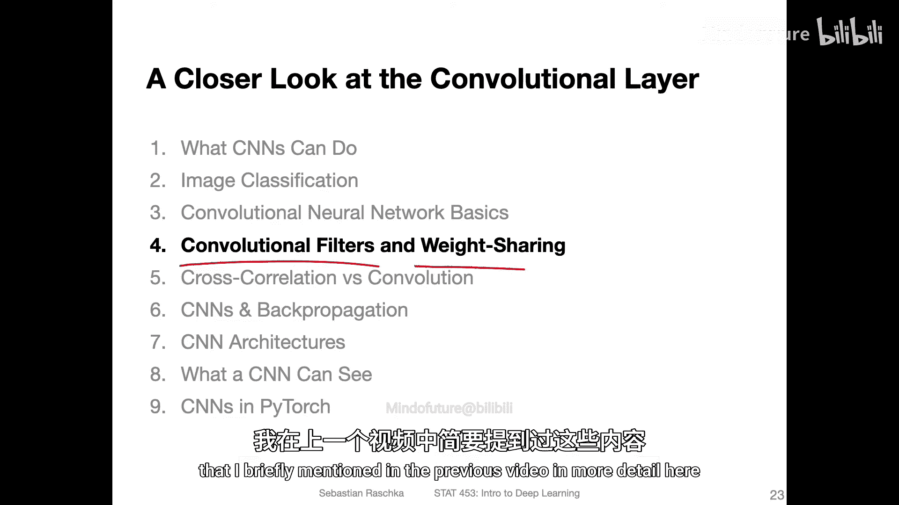

在本节课中，我们将详细探讨卷积神经网络中的核心概念：**卷积滤波器**和**权重共享**原理。我们将了解滤波器如何从图像中提取特征，以及权重共享如何使模型更高效。

---

## 卷积滤波器与特征图

上一节我们简要提到了卷积操作，本节中我们来看看其具体过程。卷积操作的核心是使用一个称为**滤波器**（或**卷积核**）的小矩阵在输入图像上滑动，以生成**特征图**。

下图展示了一个3x3的滤波器（也称为特征检测器）在一个手写数字“5”的图像上滑动的过程。滤波器覆盖的图像区域称为**感受野**。


特征图中的每个值是如何计算的呢？它通过计算感受野中像素值与滤波器权重矩阵的**加权和**得到。

假设我们的滤波器权重矩阵为：
```
W1, W2, W3
W4, W5, W6
W7, W8, W9
```
感受野中的像素值矩阵为：
```
X1, X2, X3
X4, X5, X6
X7, X8, X9
```
那么，特征图中对应位置的值计算公式为：
**值 = (W1*X1) + (W2*X2) + ... + (W9*X9)**

这个过程就是一次卷积计算。滤波器每次向右移动一个像素（步长为1），计算下一个值，直到覆盖整行，然后移动到下一行重复此过程。

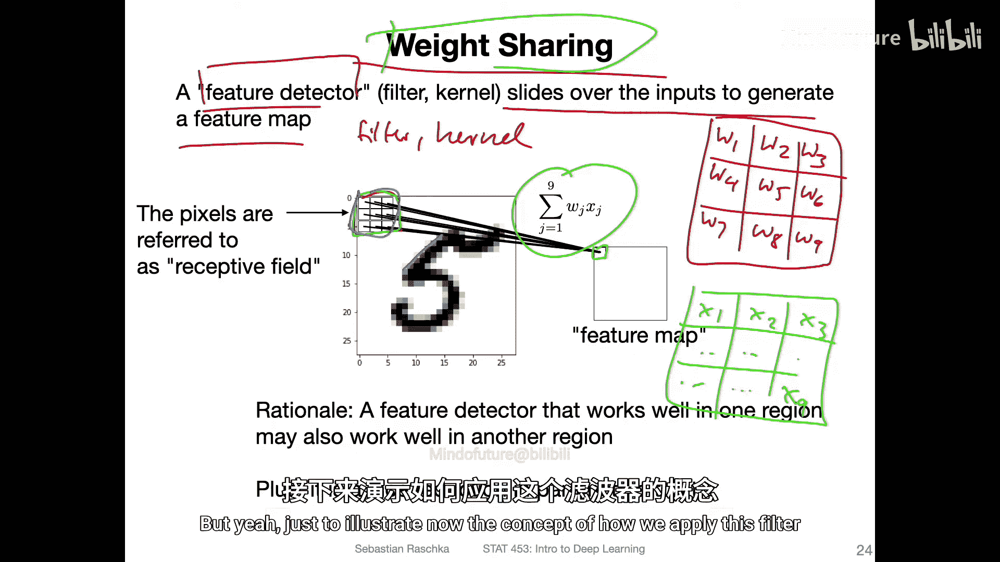


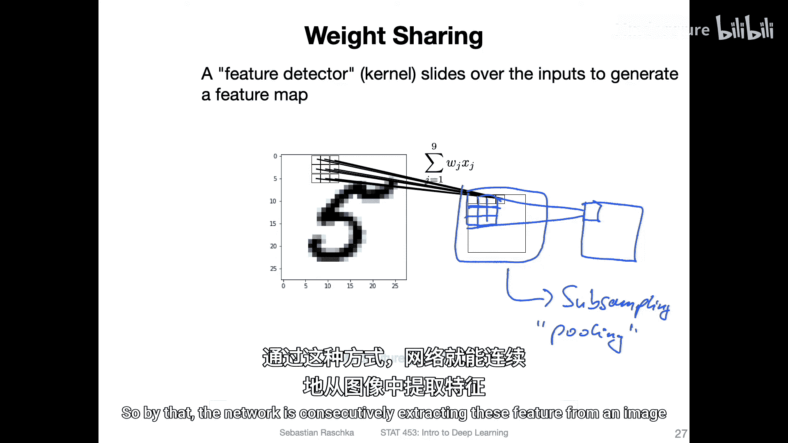
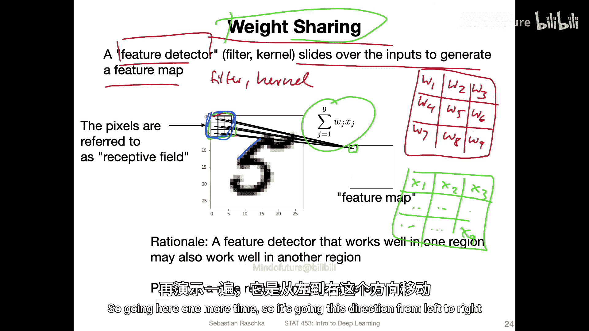


---


## 权重共享原理

现在我们来深入理解**权重共享**。它的核心思想是：**同一个滤波器被用于整张图像的不同区域**。

以下是权重共享的两个主要优势：

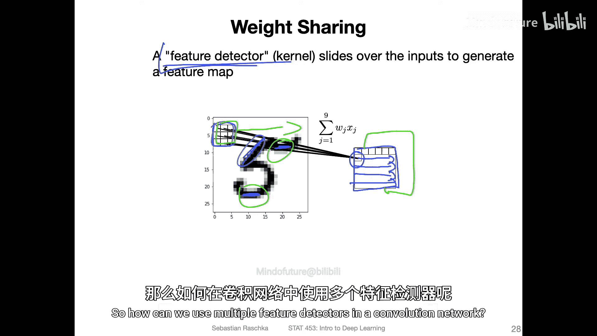

1.  **参数效率高**：如果为图像的每个区域都设计一个独立的滤波器，模型参数将极其庞大，计算成本高昂，几乎等同于一个全连接网络。权重共享极大地减少了需要学习的参数数量。
2.  **特征通用性**：如果一个滤波器学会了检测某种特征（例如垂直边缘），那么这个特征检测器在图像的任何位置都是有用的。没有必要为不同位置重新学习相同的边缘检测功能。

---

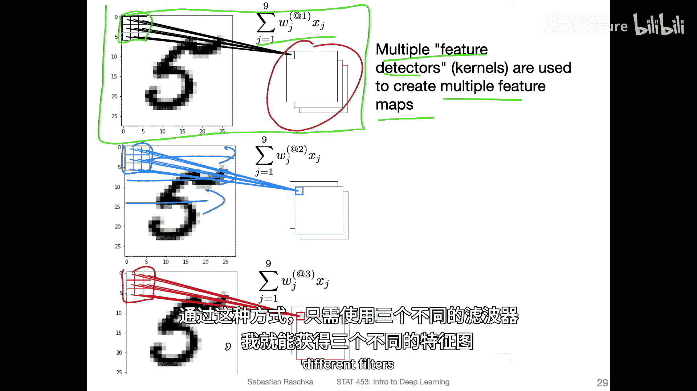

## 使用多个滤波器

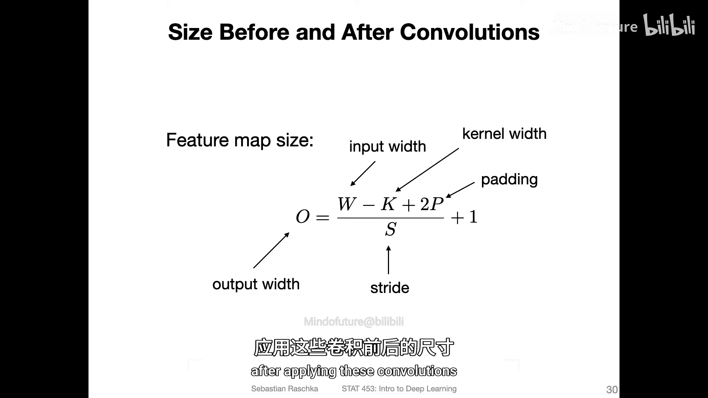

一个卷积层通常不止使用一个滤波器。为了从图像中提取多种不同类型的特征（如水平边缘、垂直边缘、曲线等），我们会并行使用多个不同的滤波器。

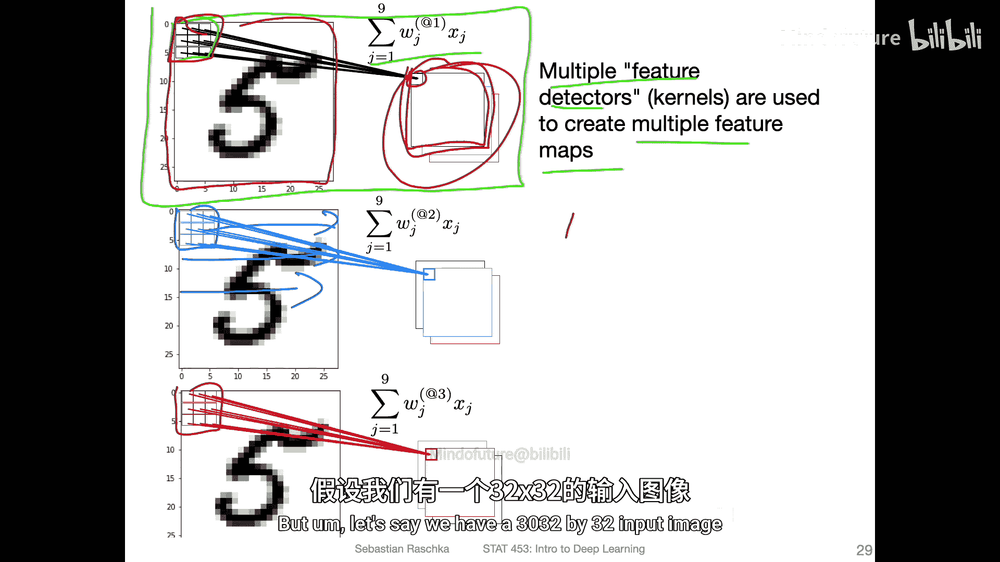

下图展示了使用三个不同滤波器（绿色、蓝色和另一个）的过程。每个滤波器都有自己独立的权重矩阵，它们各自在输入图像上滑动，分别生成三个独立的特征图。


---

## 卷积输出尺寸计算

应用卷积后，输出特征图的尺寸会发生变化。有一个公式可以计算输出尺寸：

**输出宽度 = (输入宽度 - 卷积核宽度 + 2*填充) / 步长 + 1**

*   **输入宽度 (W)**：输入图像的宽度（或高度）。
*   **卷积核宽度 (K)**：滤波器的大小（如5）。
*   **填充 (P)**：在输入图像边缘添加的零值像素圈数。本节课暂不讨论，默认P=0。
*   **步长 (S)**：滤波器每次移动的像素数。

例如，一个32x32的输入图像，使用5x5的卷积核，步长为1，无填充，则输出尺寸为：
`(32 - 5) / 1 + 1 = 28`
因此，输出是一个28x28的特征图。

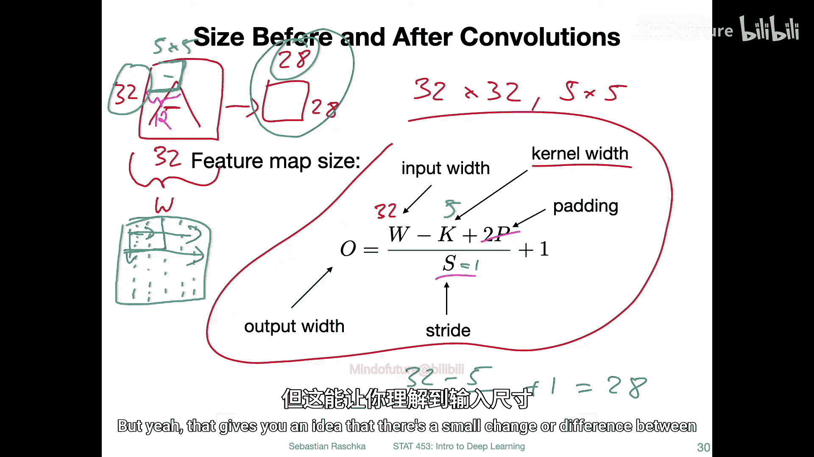


---

## 卷积层的参数量

卷积层的参数量远少于全连接层，这是其高效性的体现。考虑以下PyTorch代码示例：

```python
# 初始化一个卷积层：输入通道1（灰度图），输出8个特征图，卷积核5x5，步长1
conv_layer = nn.Conv2d(in_channels=1, out_channels=8, kernel_size=5, stride=1)
```

该层的可训练参数量计算如下：
*   **权重参数**：每个5x5的卷积核有25个权重。我们有8个这样的核，所以权重总数为 `8 * 5 * 5 = 200`。
*   **偏置参数**：每个输出特征图有一个偏置值，共8个。
*   **总参数量**：`200 + 8 = 208`。

相比之下，一个连接784个输入像素（28x28）到10个神经元的全连接层，参数量为 `784 * 10 = 7840`。卷积层在参数效率上的优势非常明显。


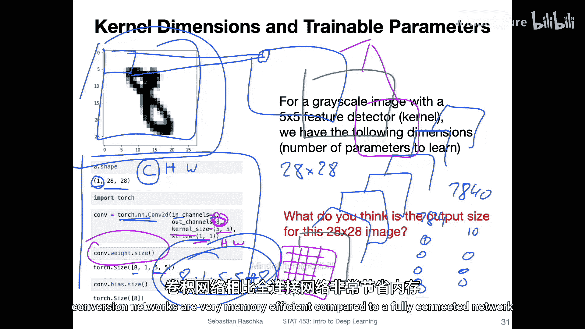


---

## 平移不变性与池化层

卷积神经网络具有一定程度的**平移、旋转和尺度不变性**，但这并非完全不变，更准确的说是**等变性**。滤波器在不同位置检测到相同特征时，会在特征图的对应位置产生响应。通过堆叠多个卷积层，网络可以逐渐获得更强的位置不变性。

**池化层**（尤其是最大池化）有助于增强这种局部不变性。最大池化在一个小区域（如2x2或3x3）内仅保留最大值。

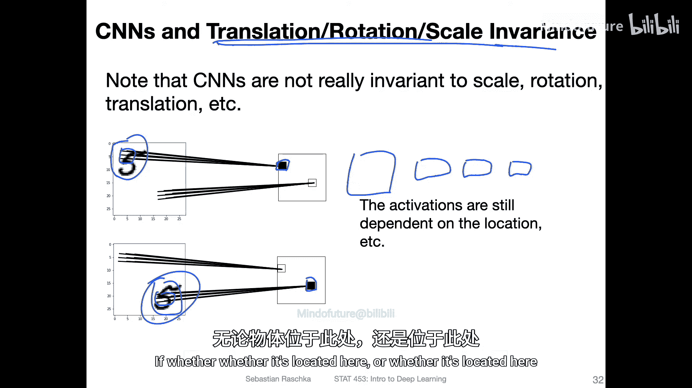

以下是最大池化（3x3池化窗口，步长3）的工作方式：
1.  在第一个感受野 `[8, 4, 2; 3, 1, 0; 2, 1, 3]` 中，最大值是8，输出8。
2.  向右移动3个像素，在区域 `[5, 2, 1; 0, 1, 4; 3, 2, 1]` 中，最大值是5，输出5。
3.  以此类推。


最大池化不关心特征在池化窗口内的精确位置，只关心其是否存在（通过最大值体现），这提供了轻微的平移不变性。需要注意的是，**标准的池化层没有可训练的参数**。

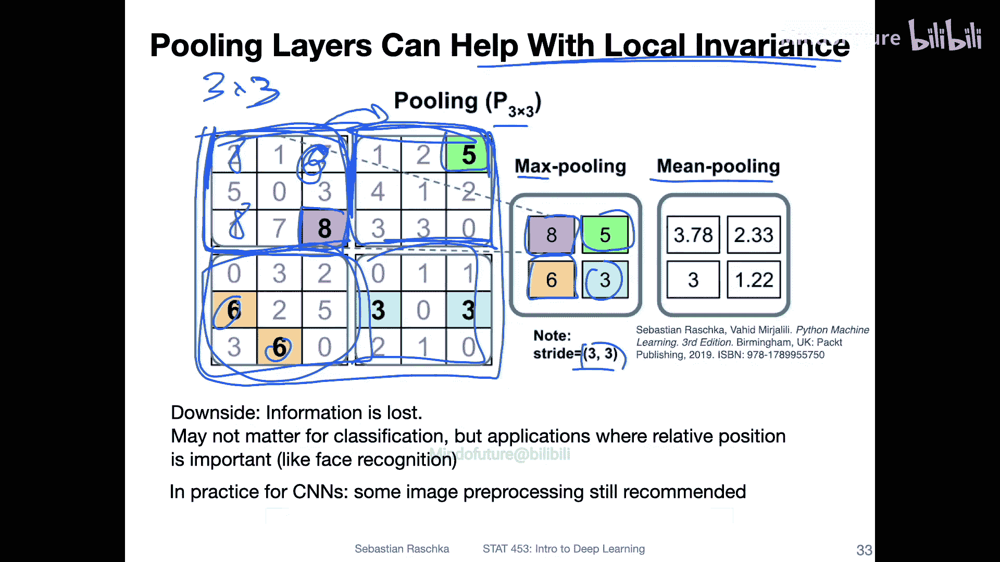


---

## 总结

本节课中我们一起学习了卷积神经网络的两个基石：
1.  **卷积滤波器**：作为特征检测器，通过在输入上滑动来生成特征图，提取局部特征。
2.  **权重共享**：同一滤波器应用于整个图像，大幅提升参数效率，并使网络能够学习通用的特征检测器。


我们还了解了如何计算卷积输出的尺寸、估算卷积层的参数量，并介绍了池化层在增强模型局部不变性方面的作用。这些概念共同构成了高效、强大的卷积神经网络的基础。

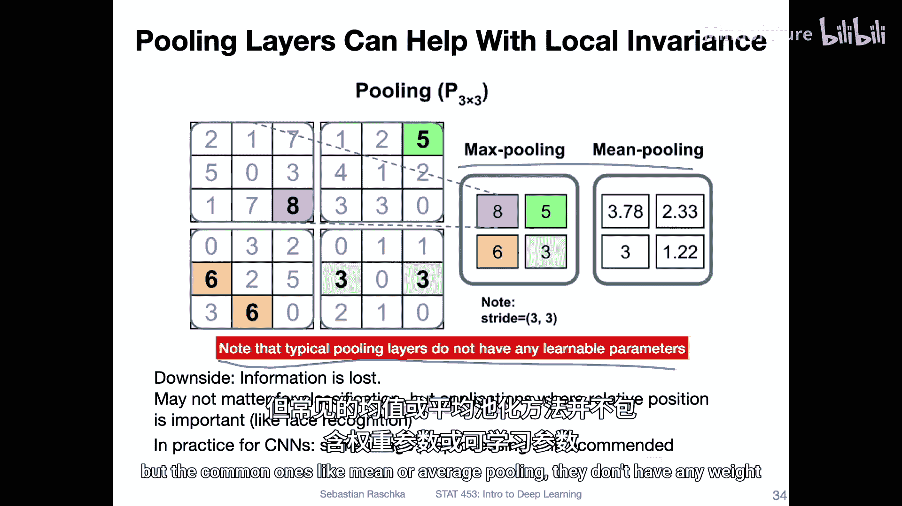

在接下来的课程中，我们将进一步探讨卷积与互相关的细微差别，并深入了解卷积网络中的前向与反向传播过程。

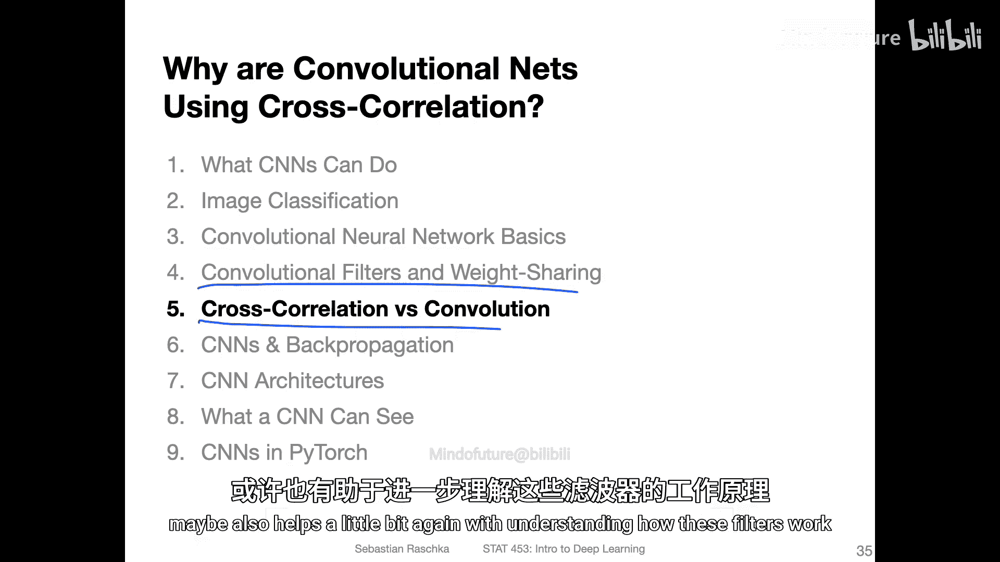

