# 102：互相关 vs. 卷积 🔄

在本节课中，我们将探讨卷积神经网络中一个细微但重要的概念区别：互相关与卷积。虽然在实际应用中，深度学习领域通常将两者混用，但理解它们的数学差异有助于我们更准确地理解网络的工作原理。

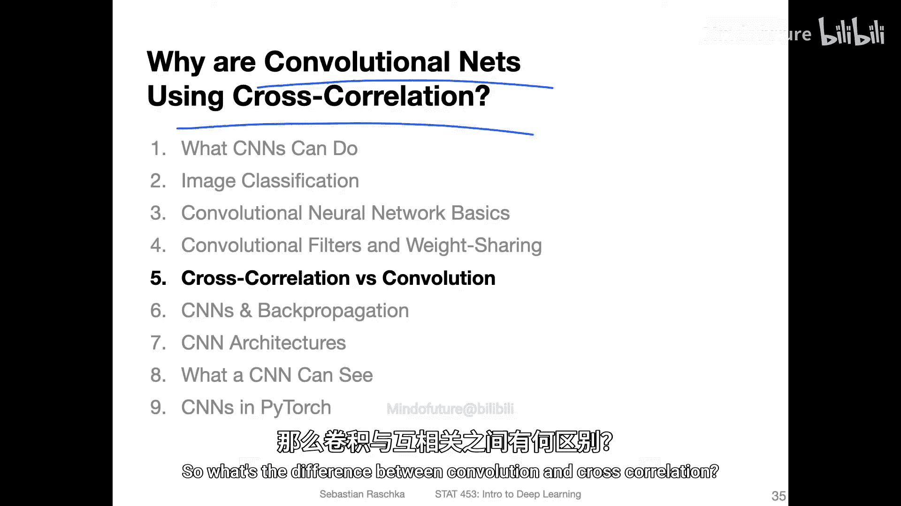

## 概述 📋

在之前的章节中，我们学习了卷积神经网络如何通过滑动滤波器（或卷积核）在图像上提取特征。本节我们将深入探讨这个滑动点积运算的数学本质。实际上，深度学习中的“卷积”操作，在信号处理等领域更准确地被称为“互相关”。我们将通过公式、图示和代码来阐明两者的区别。

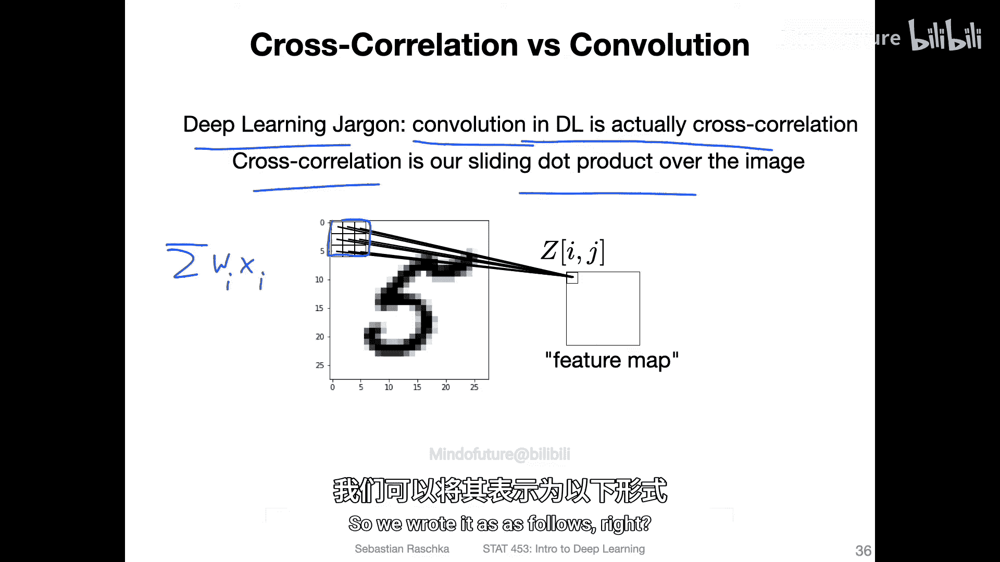

## 互相关与卷积的数学定义 📐

上一节我们介绍了卷积层的基本操作，本节中我们来看看其背后的数学形式。

互相关运算可以定义为对输入图像和滤波器进行滑动点积。具体来说，对于一个二维输入 **X** 和一个二维滤波器 **W**，在位置 `(i, j)` 的输出 `(Y_{i, j})` 计算如下：

**公式：**
`Y_{i, j} = \sum_{a=-k}^{k} \sum_{b=-k}^{k} W_{a, b} \cdot X_{i+a, j+b}`

这里，`k` 定义了滤波器的大小（例如，对于3x3的滤波器，`k=1`）。这个公式描述了我们之前视频中演示的操作：将滤波器中心对准输入图像的某个位置，逐元素相乘后求和。

而数学上严格的卷积运算，其定义与互相关略有不同：

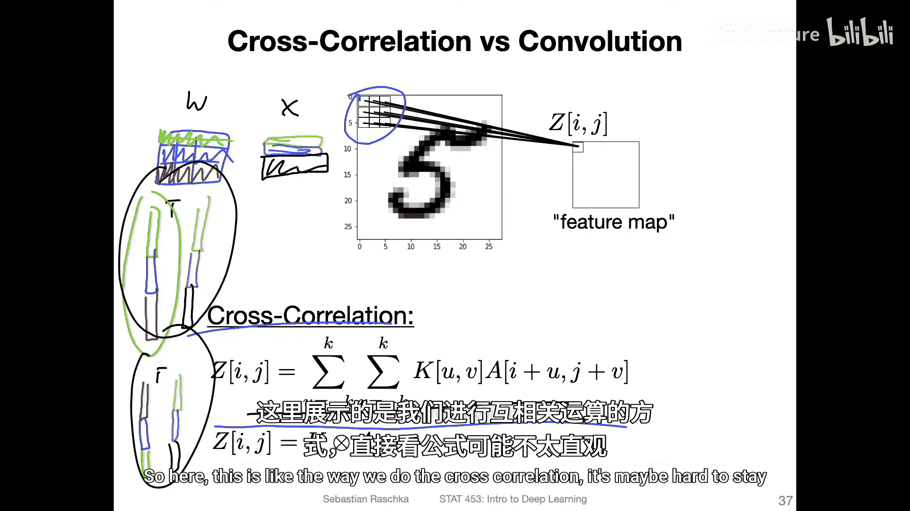

**公式：**
`Y_{i, j} = \sum_{a=-k}^{k} \sum_{b=-k}^{k} W_{a, b} \cdot X_{i-a, j-b}`

请注意公式中索引符号的变化。在卷积中，滤波器在相乘前会先进行**翻转**（即绕水平和垂直轴旋转180度）。

## 核心区别的可视化说明 🖼️

以下是理解两者区别的关键图示说明。

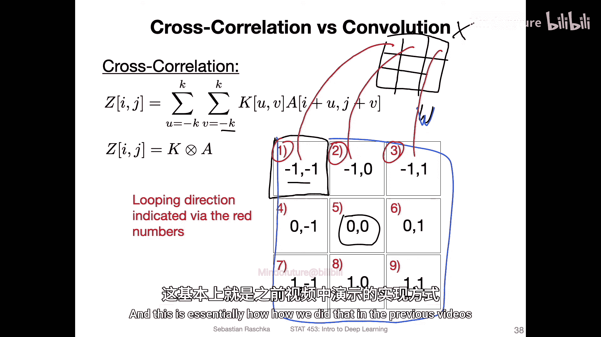

**互相关操作流程：**
想象一个3x3的滤波器 **W**，其中心索引为 `(0,0)`。当它与输入 **X** 对齐时，`W_{-1,-1}`（左上角）与 `X_{i-1, j-1}` 相乘，`W_{1,1}`（右下角）与 `X_{i+1, j+1}` 相乘。运算方向与滤波器的自然方向一致。

**卷积操作流程：**
在卷积中，滤波器 **W** 被翻转。这意味着 `W_{-1,-1}`（翻转前的左上角）实际上会与 `X_{i+1, j+1}`（输入中对应的右下角区域）相乘。你可以将其理解为将滤波器旋转180度后再进行与互相关相同的滑动点积操作。

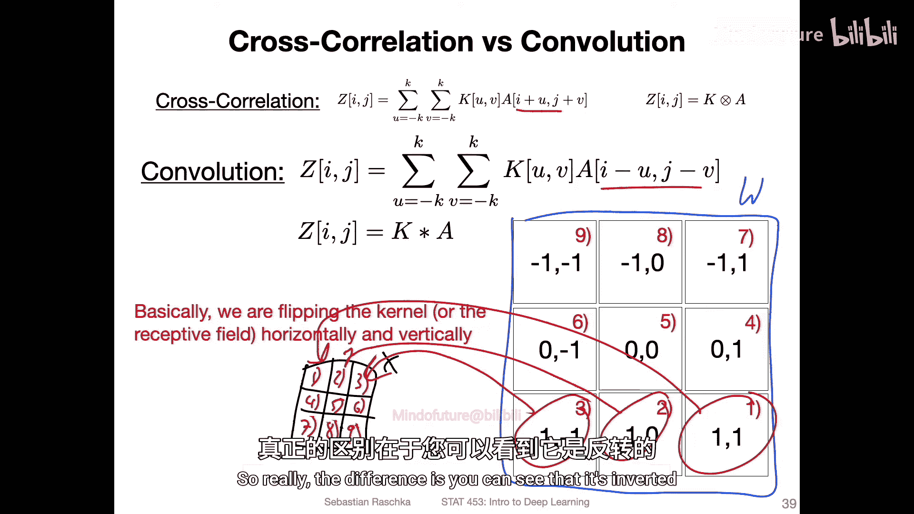

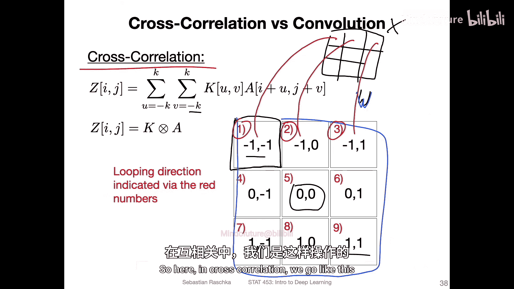

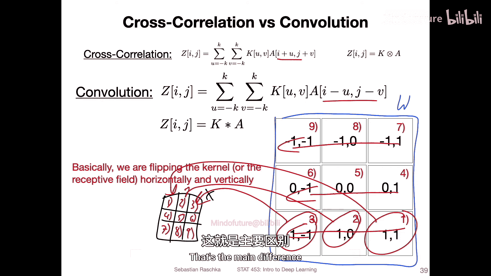

简而言之，互相关是滤波器的直接滑动点积，而卷积是先将滤波器翻转，再进行滑动点积。

## 代码验证 🔍

理论可能有些抽象，让我们通过代码来实际验证这一区别。我们将使用 PyTorch 和 SciPy 库进行演示。

**代码示例：**
```python
import torch
import numpy as np
from scipy import signal

# 1. 定义输入和滤波器（权重）
input_tensor = torch.tensor([[[[1., 2., 3.],
                               [4., 5., 6.],
                               [7., 8., 9.]]]])
weights = torch.tensor([[[[0.1, 0.2, 0.3],
                          [0.4, 0.5, 0.6],
                          [0.7, 0.8, 0.9]]]])

# 2. 使用 PyTorch 的卷积层（实际上执行互相关）
conv_layer = torch.nn.Conv2d(1, 1, kernel_size=3, bias=False)
conv_layer.weight.data = weights  # 手动设置权重

output_pytorch = conv_layer(input_tensor)
print(f"PyTorch Conv2d output: {output_pytorch.item()}")

# 3. 使用 SciPy 的互相关函数验证
input_np = input_tensor.numpy().squeeze()
weights_np = weights.detach().numpy().squeeze()
output_corr = signal.correlate2d(input_np, weights_np, mode='valid')
print(f"SciPy correlate2d output: {output_corr.item()}")

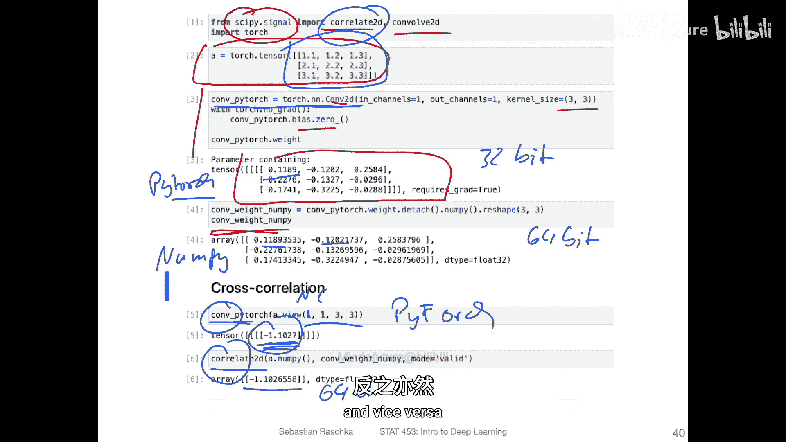

# 4. 使用 SciPy 的卷积函数（真正的卷积）进行对比
output_conv = signal.convolve2d(input_np, weights_np, mode='valid')
print(f"SciPy convolve2d output: {output_conv.item()}")

# 5. 为了在 PyTorch 中得到真正卷积的结果，需要翻转滤波器
weights_flipped = torch.flip(weights, dims=[2, 3])  # 翻转高度和宽度维度
conv_layer.weight.data = weights_flipped
output_pytorch_conv = conv_layer(input_tensor)
print(f"PyTorch Conv2d with flipped weights: {output_pytorch_conv.item()}")
```

运行上述代码，你会发现：
*   `PyTorch Conv2d` 的输出与 `SciPy correlate2d` 的输出**完全相同**。这证实了 PyTorch（以及大多数深度学习框架）中的“卷积”层实际上执行的是**互相关**。
*   `SciPy convolve2d` 的输出则是一个不同的值。
*   只有当我们将滤波器权重翻转后，`PyTorch Conv2d` 的输出才会与 `SciPy convolve2d` 的结果匹配。

## 为什么在深度学习中这并不重要？ 🤔

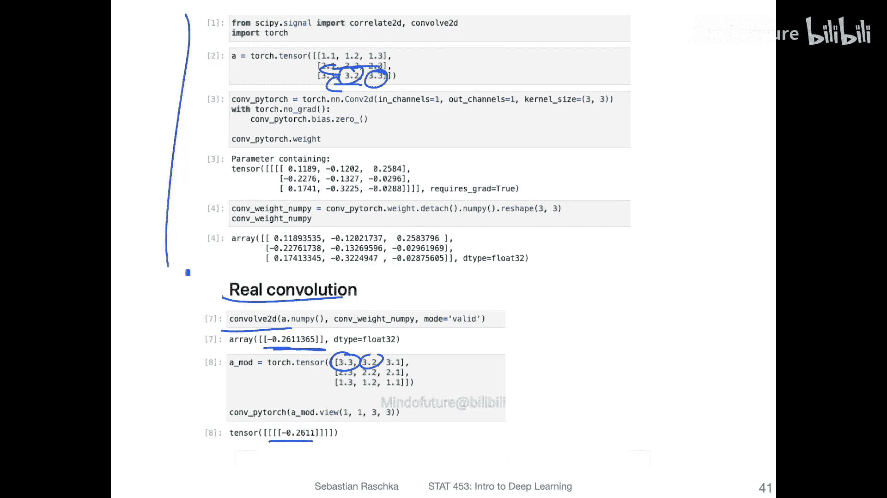

既然存在区别，为什么深度学习社区仍然普遍使用“卷积”一词，并且这种混用不会带来问题呢？

以下是几个关键原因：
1.  **参数的可学习性**：在CNN中，滤波器 **W** 的权重是通过训练学习得到的，而不是预先设定的固定算子。网络会自动学习到适应其运算规则（互相关）的最佳滤波器。无论你称这个操作为卷积还是互相关，网络最终都能学习到有效的特征。
2.  **不依赖数学性质**：在传统信号处理中，严格卷积的某些数学性质（如结合律）很重要。然而，在深度学习的上下文里，这些性质并非构建和训练网络所必需。
3.  **实现简便**：互相关的实现（尤其是反向传播过程）更为直接和高效。
4.  **术语惯例**：“卷积神经网络”听起来比“互相关神经网络”更顺口，也更早被学术界和工业界广泛接受，因此成为了标准术语。

## 总结 🎯

本节课中我们一起学习了互相关与卷积在数学定义上的核心区别：
*   **互相关**是滤波器与输入图像的**直接滑动点积**。
*   **（严格）卷积**是先将滤波器**旋转180度**，再进行滑动点积。
*   在**深度学习实践**中，框架所实现的“卷积”操作实质上是**互相关**。
*   这种术语上的混用对CNN的功能和性能**没有实质影响**，因为网络通过训练可以自适应地学习到所需的滤波器参数。

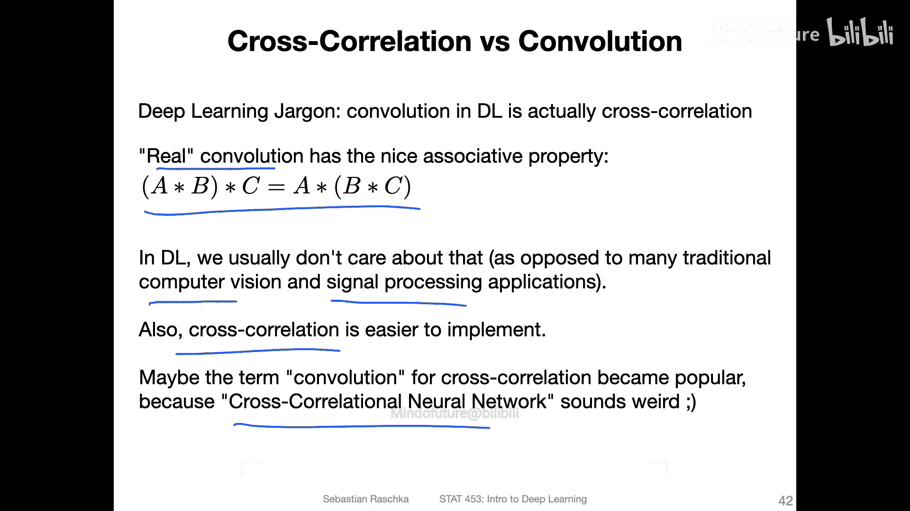

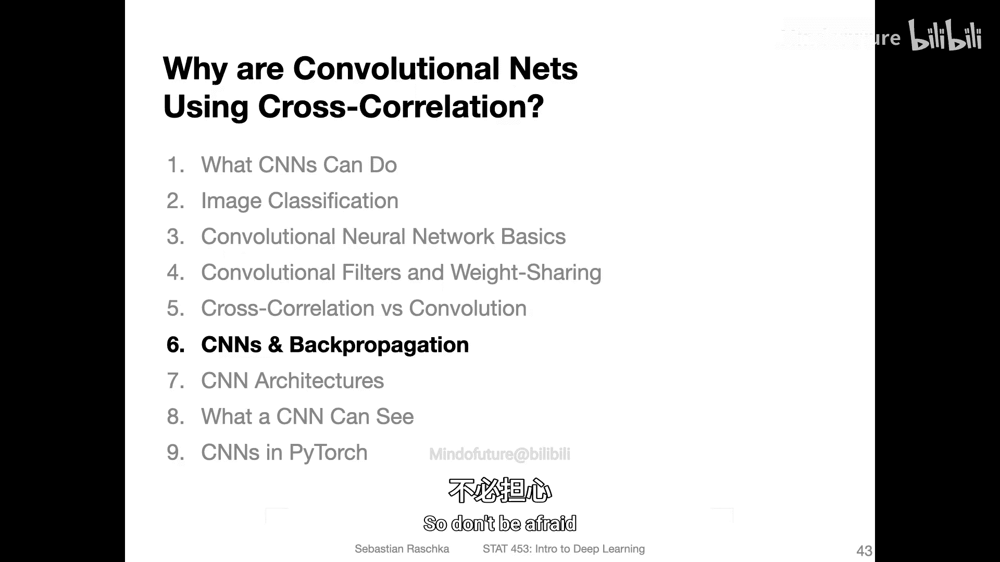

理解这一细微差别，有助于我们更精确地阅读文献和沟通思想，但无需在构建和训练自己的卷积神经网络时为此担心。在下一节，我们将简要探讨CNN中的反向传播机制。